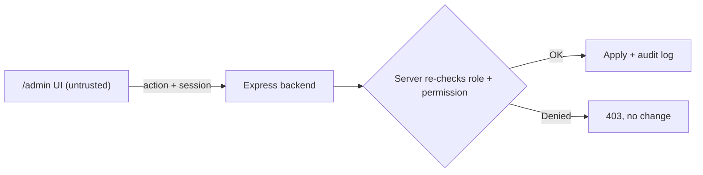
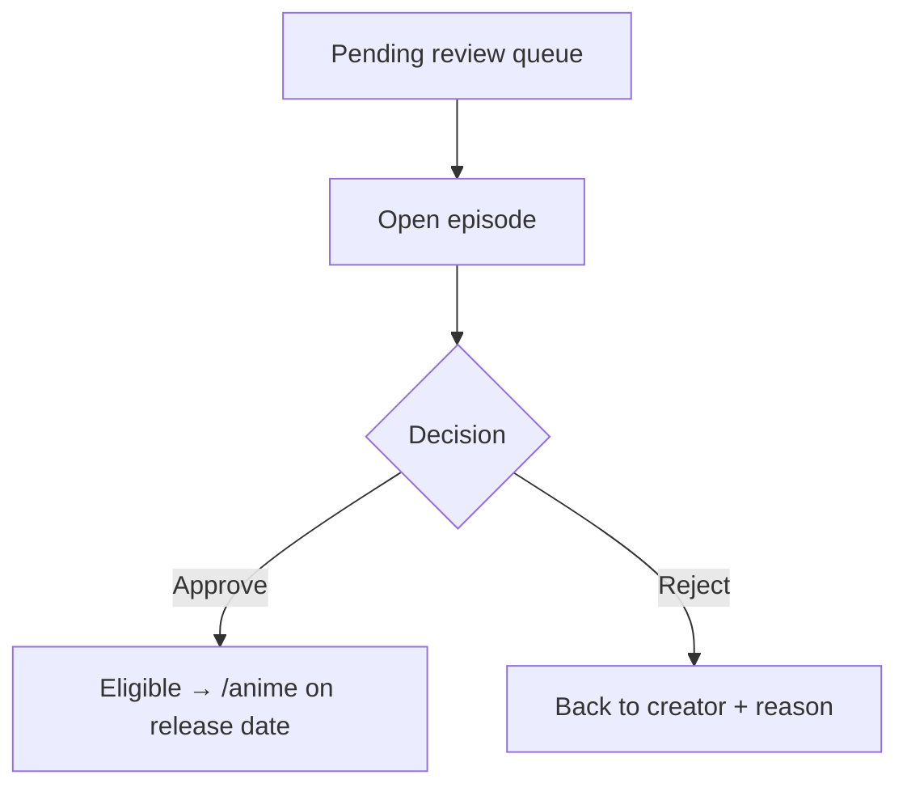

# Admin / Staff Console — Structure

Planning doc for the Qatoto staff-facing admin surface — where company staff review
content, moderate users, and manage the platform. Tweak / delete anything; we build
only what survives.

> **Phase note:** UI + mock data only. No real auth, no backend, no fetch. Mock
> pending-queue arrays, mock user rows. All role checks + decisions are **display
> only** in this phase — the real gate is server-side, added later.

---

## 1. Big decision — separate website or same app?

**Recommendation: same repo & same Next app, separate `(admin)` route group,
role-gated server-side. NOT a separate website — yet.**

### How the big players do it

ByteDance/Douyin, YouTube, etc. run **separate internal consoles** — content
moderation, creator ops, and rights management are different services, different
auth domains, often different repos. Reasons: massive scale, security isolation
(moderation tooling must never ship in the consumer bundle), and different teams own
each surface.

That's a **post-scale** shape. Pre-launch, splitting now = premature cost.

### Options

| Option                                       | When to pick                                                                                        |
| -------------------------------------------- | --------------------------------------------------------------------------------------------------- |
| **`(admin)` route group, this app** ✅ (now) | Fast, shared components, one deploy. `/admin/*` blocked unless server says role=admin/moderator.    |
| Separate repo + deploy (own domain/app)      | Later — when moderation is heavy, staff ≫ users, and you want zero admin code in the public bundle. |

### Migration path

Start as `(admin)` group → if it grows, lift into its own deploy. Because the admin
UI is a **thin render layer** (all decisions server-authorized), moving it later is
cheap — no business logic to untangle.

---

## 2. Trust boundary (NON-NEGOTIABLE, per CLAUDE.md)

The admin frontend is **still an untrusted client**. Being "admin UI" grants it
nothing.

- Client-side role check = UX only (hide/show buttons). **Server re-authorizes every
  admin action** (approve, reject, ban, refund…).
- Never trust a client-claimed `role: admin`. Server derives role from the session.
- No moderation secrets, internal thresholds, or user PII beyond what the action
  needs, in the client bundle.
- Every approve/reject/ban: server validates actor's role + permission + logs an
  audit trail before acting.



---

## 3. Access & routing

- New route group: `src/app/(admin)/admin/**`
- Its own minimal layout — **not** the creator `(studio)` chrome, **not** the
  consumer `(home)` chrome.
- Gate: server-side role check on every `/admin/*` request. Client redirect for
  non-staff is UX sugar only.
- Roles (start simple, expand later):
  | Role | Can do |
  | ----------- | --------------------------------------------------- |
  | `moderator` | review content queue, approve/reject anime episodes |
  | `admin` | everything moderator + user management, settings |
  | (later) | `finance`, `support`, `rights` — scoped roles |

---

## 4. Admin surfaces (what to build)

Priority-ordered. Strike what you don't want.

### 4.1 Content review queue ⭐ (first — unblocks anime)

The reason this exists now. Anime episodes land here before showing in `/anime`.

| Piece           | Notes                                                         | Keep? |
| --------------- | ------------------------------------------------------------- | ----- |
| Pending list    | rows: thumbnail · series/season/ep · creator · submitted date |       |
| Filter / tabs   | Pending · Approved · Rejected                                 |       |
| Review detail   | play video, see metadata, series/season/episode, schedule     |       |
| Approve         | → episode becomes eligible for `/anime` on its release date   |       |
| Reject + reason | → sent back to creator with a note                            |       |
| Bulk actions    | approve/reject multiple (later)                               |       |



### 4.2 User management

| Piece         | Notes                                       | Keep? |
| ------------- | ------------------------------------------- | ----- |
| User list     | search, filter by role/status               |       |
| User detail   | profile, uploads, sales, flags              |       |
| Suspend / ban | with reason + duration                      |       |
| Role assign   | grant creator / anime-partner / staff roles |       |

### 4.3 Anime catalog management

| Piece            | Notes                                      | Keep? |
| ---------------- | ------------------------------------------ | ----- |
| Series list      | all anime series, owner, status            |       |
| Season / episode | manage ordering, release schedule          |       |
| Schedule board   | weekly calendar of what releases which day |       |
| Feature / hero   | pick `/anime` hero + featured rows         |       |

### 4.4 Reports & moderation

| Piece            | Notes                              | Keep? |
| ---------------- | ---------------------------------- | ----- |
| Reported content | user-flagged videos/comments queue |       |
| Takedown         | remove + notify                    |       |
| Copyright claims | ties to `/studio/copyright`        |       |

### 4.5 Store / orders oversight (B2B thesis)

| Piece             | Notes                                      | Keep? |
| ----------------- | ------------------------------------------ | ----- |
| Product review    | approve store listings before they go live |       |
| Orders / disputes | refunds, chargebacks (server-authorized)   |       |
| Funding / pitches | review raises, verify claims               |       |

### 4.6 Platform

| Piece     | Notes                               | Keep? |
| --------- | ----------------------------------- | ----- |
| Dashboard | pending counts, key metrics         |       |
| Audit log | who did what, when (read-only)      |       |
| Settings  | feature flags, categories, taxonomy |       |

---

## 5. Suggested route map

```
src/app/(admin)/admin/
  page.tsx                 # dashboard
  review/                  # 4.1 content review queue ⭐
  users/                   # 4.2
  anime/                   # 4.3 catalog + schedule
    schedule/
  reports/                 # 4.4
  store/                   # 4.5
    orders/
  audit/                   # 4.6
  settings/
```

---

## 6. Build order (my rec)

1. **`(admin)` route group + layout + mock role gate** — skeleton.
2. **Content review queue (4.1)** — the piece that unblocks anime. Mock pending list
   → detail → approve/reject (state only).
3. Wire anime upload's "Pending review" destination to feed this queue (mock).
4. User management (4.2) next.
5. Rest as needed.

Everything else waits until you say go.

---

## 7. Open decisions

1. **Route-group vs separate app** — confirm `(admin)` in this repo for now?
2. **Roles** — start with `moderator` + `admin` only, or add scoped roles now?
3. **Anime auto-release** — after approval, does the weekly schedule auto-publish
   each episode, or does a human release each one?
4. **What else needs approval besides anime?** store listings? funding pitches?
5. **Audit log** — build now (cheap, mock) or defer?
