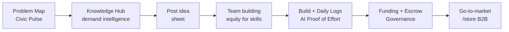
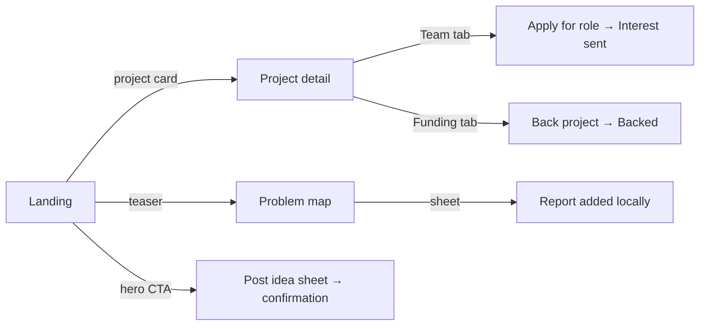

# Research & Development — Structure

Planning doc for the `/research-and-development` surface — the home of Qatoto's full
**concept-to-consumer pipeline**: market-demand research → problem mapping → team
building (equity for skills) → build with AI-analyzed daily logs → transparent
funding & escrow governance → go-to-market. The landing page tells the whole
pipeline story; deep features live on sub-routes. Tweak / delete anything; we build
only what survives.

> **Phase note:** UI + mock data only. No backend, no fetch, no Zod, no loading/error
> states, no new abstractions. Every number on this surface (funding, equity, escrow,
> AI analysis, opportunity scores, demand stats) is a **static mock**; every
> interaction mutates local client state only. Escrow, compensation math, AI log
> analysis, and verification are **backend-owned later** — the frontend only renders
> them (thin-client invariant, `CLAUDE.md` §Core principle).

---

## 1. What exists today

| Piece                 | Location                                                                                       | State                                                                                                                                      |
| --------------------- | ---------------------------------------------------------------------------------------------- | ------------------------------------------------------------------------------------------------------------------------------------------ |
| R&D route stub        | [page.tsx](<src/app/(home)/research-and-development/page.tsx>)                                 | ✅ **built** — thin shell renders `<ResearchAndDevelopmentPage />`, metadata title "R&D"                                                   |
| Component dir         | [src/components/home/research-and-development/](src/components/home/research-and-development/) | ✅ **built** — all 32 planned files present (pages/rails/cards/sections/sheets)                                                            |
| Sidebar nav item      | [sidebar.tsx:293](src/components/home/layout/sidebar.tsx#L293)                                 | ✅ wired — label "R&D", iconKey `science`; also in `COLLAPSED_NAV_CONFIG` (line 354)                                                       |
| Sidebar section title | [sidebar.tsx:298](src/components/home/layout/sidebar.tsx#L298)                                 | ✅ **built** — typo fixed (single space), section now holds Problem Map, Knowledge Hub, PROJECT IMMORTAL                                   |
| Mobile bottom nav     | [mobile-bottom-nav.tsx:36](src/components/home/layout/mobile-bottom-nav.tsx#L36)               | ✅ wired — R&D tab, sub-path matching already works                                                                                        |
| Navbar breadcrumb     | [navbar.tsx:28-40](src/components/home/layout/navbar.tsx#L28-L40)                              | ✅ **built** — `RESEARCH_AND_DEVELOPMENT_SUBPAGES` map + `getSubHeader` branch, fallthrough prettifies `/project/[id]`, parent label "R&D" |
| Project Immortal stub | [page.tsx](<src/app/(home)/project-immortal/page.tsx>)                                         | ✅ exists — `<h1>` stub; **mention-only in this doc**, gets its own structure doc later                                                    |
| This doc              | `R_AND_D_STRUCTURE.md`                                                                         | plan fully implemented — see checked-off sections below                                                                                    |

Pattern donors elsewhere in the repo:

- **Component decomposition**: [src/components/home/store/](src/components/home/store/) — `pages/ rails/ cards/ sections/ sheets/`; landing composes rails like [store-page.tsx](src/components/home/store/pages/store-page.tsx).
- **Dynamic route under `cacheComponents: true`**: [store/product/[id]/page.tsx](<src/app/(home)/store/product/[id]/page.tsx>) — `generateStaticParams` is **required** or the build breaks.
- **Mock data shape**: [src/types/store.ts](src/types/store.ts) + [src/lib/store-mocks.ts](src/lib/store-mocks.ts) — but R&D takes **mocks only, no fetch/getter layer** (phase rule).

---

## 2. The pipeline in one picture

The founder's eight pillars, and which surface carries each:

| #   | Pillar                                              | Carried by                                                                           |
| --- | --------------------------------------------------- | ------------------------------------------------------------------------------------ |
| 1   | Market-demand research & feasibility                | `/research-and-development/knowledge-hub` + demand chips on project Overview         |
| 2   | Problem Mapping / "Civic Pulse"                     | `/research-and-development/problem-map`                                              |
| 3   | Knowledge Hub (market intelligence)                 | `/research-and-development/knowledge-hub`                                            |
| 4   | Talent matching / Virtual Workshop                  | Open-roles rail + Team tab now; `/talent` + `/workshop` later (§11)                  |
| 5   | Funding (crowd / VC, transparency)                  | Funding tab on project detail; investor `/funding` view later (§11)                  |
| 6   | Daily Update Protocol (AI logs, Proof of Effort)    | Daily Logs tab on project detail                                                     |
| 7   | Financial governance (escrow, anti-corruption)      | Governance tab on project detail                                                     |
| 8   | Go-to-market (suppliers, ODM, shipping, storefront) | Pipeline-stage card pointing at the existing **`/store`** B2B surface — no new route |

Related surfaces that are **not** part of this doc:

- **Anime** (`/anime`) — the creative-inspiration R&D feed. Already built; the landing may reference it in copy only.
- **Project Immortal** (`/project-immortal`) — moonshot research. Featured banner on the landing links to the existing stub; full structure in its own future doc.



---

## 3. Route map

```text
/research-and-development                        ✅ built — pipeline hub landing
/research-and-development/project/[id]           ✅ built — project detail (5 tabs)
/research-and-development/problem-map            ✅ built — Civic Pulse map + reports
/research-and-development/knowledge-hub          ✅ built — market intelligence
--- later (specced in §11, teased by rails/sheets now) ---
/research-and-development/talent                 ➕ later — browse people trading skills for equity
/research-and-development/funding                ➕ later — investor deal-flow view
/research-and-development/project/[id]/workshop  ➕ later — Virtual Workshop collab space
/research-and-development/new                    ➕ later — multi-step idea wizard (sheet for now)
```

| Route                                      | Purpose                                                                       | Phase    |
| ------------------------------------------ | ----------------------------------------------------------------------------- | -------- |
| `/research-and-development`                | Landing: whole pipeline story + rails into every sub-surface                  | ✅ built |
| `/research-and-development/project/[id]`   | One project's full lifecycle: overview, daily logs, team, funding, governance | ✅ built |
| `/research-and-development/problem-map`    | World map of reported infrastructure gaps → opportunity heat map              | ✅ built |
| `/research-and-development/knowledge-hub`  | Where demand is highest: insights, demand leaderboard, trends                 | ✅ built |
| `/talent`, `/funding`, `/workshop`, `/new` | See §11                                                                       | ➕ later |

Route decisions baked in:

- **Project detail is one route with client-state tabs**, not nested tab segments — nested
  segments under `[id]` each need `generateStaticParams` plumbing and buy nothing in a
  mock phase (revisit in §12 Q4).
- **Detail nests under `/project/`** so the dynamic segment cannot collide with the
  static `problem-map` / `knowledge-hub` segments (mirrors `/store/product/[id]`).
- **Idea submission is a sheet, not a route** — the store surface already leans on
  sheets; promote to `/new` when it grows into a wizard (§12 Q3).
- **`[id]` must export `generateStaticParams`** (cacheComponents constraint). No getter
  layer this phase, so the route imports the mock array directly:

```typescript
import { MOCK_RESEARCH_PROJECTS } from "@/lib/research-and-development-mocks";

export function generateStaticParams() {
    return MOCK_RESEARCH_PROJECTS.map((project) => ({ id: project.id }));
}
```

---

## 4. Landing — `/research-and-development`

Top-to-bottom composition (server component, mirrors [store-page.tsx](src/components/home/store/pages/store-page.tsx)):

| #   | Section                                                 | Purpose / content                                                                                                                                                                                                                                                       | Mock needs                                                                | Keep? |
| --- | ------------------------------------------------------- | ----------------------------------------------------------------------------------------------------------------------------------------------------------------------------------------------------------------------------------------------------------------------- | ------------------------------------------------------------------------- | ----- |
| 4.1 | **Hero band** (`pipeline-hero`)                         | "From concept to consumer." One-paragraph pitch + two CTAs: **Post your idea** (opens sheet §8.1) and **Explore projects** (anchor to 4.3)                                                                                                                              | Static copy, one `/public/dummy/*.avif` background                        |       |
| 4.2 | **Pipeline stages strip** (`pipeline-stages-strip`)     | Horizontal scroll of **6 stage cards** condensing the 8 pillars: Market Research → Problem Mapping → Team Building → Build & Daily Logs → Funding & Governance → Go-to-Market. Each: icon, one-line blurb, link (knowledge-hub / problem-map / project tabs / `/store`) | Static `PIPELINE_STAGES` array inline in the component                    |       |
| 4.3 | **Featured projects rail** (`projects-rail`)            | The main event. `ProjectCard`s: cover, name, tagline, stage badge, funding progress bar, team avatar stack, open-roles count → `/project/[id]`                                                                                                                          | `MOCK_RESEARCH_PROJECTS` (~6, spanning all stages so every badge appears) |       |
| 4.4 | **Problem map teaser** (`problem-map-preview`)          | Split: left, stylized map thumbnail with 3–4 pins; right, "Top reported gaps" list (location, category, report count, opportunity score). CTA → `/problem-map`                                                                                                          | Top slice of `MOCK_PROBLEM_REPORTS`                                       |       |
| 4.5 | **Market insights rail** (`market-insights-rail`)       | `MarketInsightCard`s: headline stat ("Demand for off-grid cold storage up 34% in East Africa"), trend arrow, region + category chips. CTA → `/knowledge-hub`                                                                                                            | `MOCK_MARKET_INSIGHTS`                                                    |       |
| 4.6 | **Open roles rail** (`open-roles-rail`)                 | "Join a team for equity": role title, project name, skill chips, equity range, commitment tag, **Express interest** button (client toggle → "Interest sent"). Carries pillar 4 until `/talent` exists                                                                   | `MOCK_OPEN_ROLES` joined to projects                                      |       |
| 4.7 | **Project Immortal banner** (`project-immortal-banner`) | Single full-width featured card, distinct moonshot styling → links `/project-immortal`. **Mention-only**                                                                                                                                                                | Static copy + one image                                                   |       |
| 4.8 | **Bottom CTA band**                                     | "Have an idea the world needs? Post it." → same post-idea sheet                                                                                                                                                                                                         | none                                                                      |       |

---

## 5. Project detail — `/research-and-development/project/[id]`

**Header (always visible above tabs):** cover image band; name + tagline; stage badge +
category chips; founder avatar + name; stats row (raised % of goal, team size,
daily-log streak days, watchers); action buttons **Request to join** and **Back this
project** (client toggles — see §9).

**Tab bar** — 5 tabs, client state, rendered via exhaustive `switch` over a
`ProjectDetailTab` union with a `never` default (`CLAUDE.md` Pattern 1). The tab
switcher (`project-tabs.tsx`) is a small `"use client"` island that receives each
**server-rendered panel as a `ReactNode` prop** — panels stay server components.

### 5.1 Overview

- Problem statement + solution summary.
- **Market-demand evidence chips** — 2–3 `MarketInsight`s cross-referenced from the
  knowledge-hub mocks (shows the surfaces interlock).
- "Born from Civic Pulse report" link chip when `originProblemReportId` is set →
  `/problem-map`.
- **Milestone timeline** (`milestone-timeline`) — vertical, done / current / upcoming
  states, with escrow-release amounts per milestone (governance tie-in). Lives here
  rather than a sixth tab to keep the bar tight.

### 5.2 Daily Logs (pillar 6)

Feed of `DailyLogCard`s, date-grouped:

- date, author avatar, **video-thumbnail placeholder** with play glyph,
- transcript excerpt (2 lines, clamped), expandable via native `<details>/<summary>`
  (zero JS),
- **AI summary chips**, kind-colored: `blocker` / `progress` / `velocity` / `suggestion`,
- "Proof of Effort verified" badge,
- member filter chips (client-side filter of the mock array).

> AI analysis and effort verification are **display-only mocks** — the real analysis
> pipeline is backend-later.

### 5.3 Team (pillar 4)

- **Equity split summary bar** — stacked horizontal, one segment per member +
  unallocated.
- Roster cards: name, role, skills, equity %, effort-hours logged, joined date,
  founder marker.
- **Open roles** cards with Express-interest buttons (same interaction as landing 4.6),
  apply via sheet §8.4.

### 5.4 Funding (pillar 5)

- Current round card: type badge (`equity` / `crowdfunding` / `venture`), goal vs
  raised, progress bar, backer count, closes-on date.
- Backer avatar list; past rounds table.
- **Investor confidence meter** — visual-only gauge; annotated in-UI copy: derived from
  log streak + verified milestones. **Display-only mock; backend computes later.**
- **Back this project** → sheet §8.3.

### 5.5 Governance (pillar 7)

- **Escrow ledger table**: date, event description, in/out, amount, linked
  milestone/log, verified/pending status.
- Fund-allocation summary cards: allocated vs released vs held.
- **Per-member compensation table** — "calculated from logged effort" framing
  (anti-corruption story). Mock numbers only.

> Trust note (non-negotiable): every escrow, equity, and compensation figure here is a
> static mock. The platform-as-neutral-auditor logic is entirely server-owned when the
> backend phase starts. The frontend never computes or enforces any of it.

---

## 6. Problem map — `/research-and-development/problem-map` (Civic Pulse)

- Header + **Report a problem** button (opens sheet §8.2).
- **Map canvas** (`problem-map-canvas`, client island): a `relative` container with a
  static world-map image (`next/image`) and `MOCK_PROBLEM_REPORTS` mapped to `<button>`
  pins positioned via `style={{ left: "62%", top: "38%" }}` from
  `mapPosition: { leftPercent, topPercent }` — **no map library**. Pins sized/colored by
  `opportunityScore`. Clicking a pin sets `selectedReportId` and highlights the matching
  card (and vice versa).
- **Report list** (`problem-report-list`) beside/below the canvas — also the
  mobile-first view: title, location, category chip, report count, opportunity score.
- Category filter chips (client-side filter).
- Report sheet appends to a page-local list (lost on refresh — §12 Q5).

✅ **Asset ready**: `public/dummy/world_map.svg` is committed — the map canvas renders
it via `next/image` and overlays the pins.

---

## 7. Knowledge hub — `/research-and-development/knowledge-hub`

- Header framing: "where demand is highest."
- **Insight card grid** — same `MarketInsightCard` as landing 4.5, full set.
- **Demand leaderboard table**: rank, category, region, demand score, trend,
  related-projects count.
- **Rising categories** trend chips row.

All static mock. No chart library — cells use plain numbers + arrow glyphs (▲ ▼ —).
Real charting is a later phase.

---

## 8. Sheets

All four are self-contained `"use client"` components exporting their own trigger
button + bottom sheet (mirrors the store sheets pattern, e.g.
[deliver-to.tsx](src/components/home/store/sections/deliver-to.tsx) → `address-sheet`).

| #   | Sheet                  | Trigger                                  | Fields                                                                              | On submit (mock)                                                                                           |
| --- | ---------------------- | ---------------------------------------- | ----------------------------------------------------------------------------------- | ---------------------------------------------------------------------------------------------------------- |
| 8.1 | `post-idea-sheet`      | Landing hero + bottom CTA                | idea name, one-line pitch, category select, problem it solves, roles needed (chips) | Confirmation state ("Idea posted — team matching begins"); whether it appends a card to rail 4.3 is §12 Q6 |
| 8.2 | `report-problem-sheet` | Problem-map header + landing teaser      | title, category select, location text, description                                  | Appends to page-local report list                                                                          |
| 8.3 | `back-project-sheet`   | Project header + Funding tab             | pledge amount picker, escrow explainer copy, confirm                                | Button flips to "Backed"; progress bar does **not** move (§12 Q6)                                          |
| 8.4 | `apply-role-sheet`     | Open-role cards (landing 4.6 + Team tab) | short pitch, skills (chips), commitment select, equity expectation                  | Button flips to "Interest sent"                                                                            |

---

## 9. User journeys

| Journey                                                                        | Phase-1 behavior                | Real or visual?                         |
| ------------------------------------------------------------------------------ | ------------------------------- | --------------------------------------- |
| Browse → open project → read all 5 tabs                                        | Full navigation + tab switching | ✅ Real (mock data)                     |
| Express interest in a role                                                     | Button → "Interest sent" toggle | ✅ Real, client state only              |
| Back a project                                                                 | Sheet → confirm → "Backed"      | ✅ Real, client state; bar doesn't move |
| Report a problem                                                               | Sheet → appends to local list   | ✅ Real, lost on refresh                |
| Founder posts idea                                                             | CTA → sheet → confirmation      | ✅ Real; rail append is §12 Q6          |
| AI chips, Proof of Effort, escrow ledger, confidence meter, opportunity scores | Static render                   | 👁️ Visual-only, backend later           |



---

## 10. Mock data

Lives in two new files — shared across the landing, `generateStaticParams`, and all
sub-pages, so inline-in-component (the anime pattern) doesn't work here:

- `src/types/research-and-development.ts` — plain TS types (no Zod this phase).
- `src/lib/research-and-development-mocks.ts` — exported `MOCK_*` consts. **No
  fetch, no `"use cache"` getters** — that layer slots in on top when the backend
  phase starts, without moving the mocks.

Money / percentages are **display-formatted strings** (matches
`StoreProduct.price: string` in [src/types/store.ts](src/types/store.ts)); only
values that drive CSS (progress-bar width, pin position) are numbers.

| Entity              | Key fields                                                                                                                                                                                                                                                                                       |
| ------------------- | ------------------------------------------------------------------------------------------------------------------------------------------------------------------------------------------------------------------------------------------------------------------------------------------------ |
| `ResearchProject`   | `id` (slug, used in URL), `name`, `tagline`, `description`, `category`, `stage` (union below), `coverImageSrc`, `founderId`, `teamMembers[]`, `openRoles[]`, `milestones[]`, `dailyLogs[]`, `fundingRounds[]`, `escrowLedger[]`, `watchersCount`, `dailyLogStreakDays`, `originProblemReportId?` |
| `TeamMember`        | `id`, `name`, `avatarImageSrc`, `role`, `skills[]`, `equityShare` ("4.5%"), `effortHoursLogged`, `joinedDate`, `isFounder?`                                                                                                                                                                      |
| `OpenRole`          | `id`, `projectId`, `projectName`, `roleTitle`, `skills[]`, `equityRange` ("2–4%"), `commitment` (`"full-time" \| "part-time" \| "hobby"`)                                                                                                                                                        |
| `DailyLog`          | `id`, `authorId`, `date`, `videoThumbnailSrc`, `transcriptExcerpt`, `detail`, `aiSummaryChips[]` (`{ kind: "blocker" \| "progress" \| "velocity" \| "suggestion"; label }`), `isEffortVerified`                                                                                                  |
| `Milestone`         | `id`, `title`, `description`, `targetDate`, `status` (`"done" \| "current" \| "upcoming"`), `escrowReleaseAmount?`                                                                                                                                                                               |
| `FundingRound`      | `id`, `type` (`"equity" \| "crowdfunding" \| "venture"`), `goalAmount`, `raisedAmount`, `percentageFunded` (number 0–100, drives bar width), `backersCount`, `closesOnDate`, `status` (`"open" \| "closed"`)                                                                                     |
| `EscrowLedgerEntry` | `id`, `date`, `description`, `direction` (`"in" \| "out"`), `amount`, `linkedMilestoneId?`, `verificationStatus` (`"verified" \| "pending"`)                                                                                                                                                     |
| `ProblemReport`     | `id`, `title`, `category`, `locationLabel`, `countryCode`, `mapPosition` (`{ leftPercent, topPercent }` numbers), `reportCount`, `opportunityScore`, `description`, `reportedDate`                                                                                                               |
| `MarketInsight`     | `id`, `headline`, `statValue`, `trendDirection` (`"up" \| "down" \| "flat"`), `region`, `category`, `sourceNote`                                                                                                                                                                                 |

```typescript
export type ProjectStage =
    | "market-research"
    | "problem-validation"
    | "team-building"
    | "building-mvp"
    | "raising-funding"
    | "go-to-market";
```

Exports: `MOCK_RESEARCH_PROJECTS` (~6, each with embedded team/logs/funding/
milestones/ledger so one by-id lookup serves the whole detail page; stages spread so
every badge appears), `MOCK_OPEN_ROLES`, `MOCK_MARKET_INSIGHTS`,
`MOCK_PROBLEM_REPORTS`, `MOCK_TRENDING_SIGNALS`.

**Reusable assets (verified in repo):**

- Covers / hero art: `/dummy/category_01..12.avif`, `machinery.avif`,
  `spotlight_image01-03.avif`, `pathways_1-5.avif`
- Avatars: `/dummy/profile_image_01..12.avif`, `profile_photo_girl.avif`
- Log attachments / insight art: `/dummy/thumbnail_image01-12.avif`,
  `trending01-06.avif`, `review_image01-03.avif`
- Icons already in `/public/icons` (FILL0/FILL1 pairs): `science` (in use), `flag`,
  `school`, `group`, `paid`, `fact_check`, `analytics`, `factory`, `local_shipping`,
  `forum`, `diamond`, `lock`
- Map canvas: `/dummy/world_map.svg` (§6) ✅

---

## 11. Deferred surfaces (specced, not built)

| Surface                                              | One-liner                                                                                                                                                                | Teased now by                       |
| ---------------------------------------------------- | ------------------------------------------------------------------------------------------------------------------------------------------------------------------------ | ----------------------------------- |
| `/research-and-development/talent` ➕                | Browse-people marketplace: person cards, skills, equity asks, availability                                                                                               | Open-roles rail (4.6) + Team tab    |
| `/research-and-development/funding` ➕               | Investor deal-flow: filterable list of raising projects, confidence signals. ⚠️ Overlaps existing creator-side `/studio/pitches` + `/studio/funding` — resolve in §12 Q7 | Funding tab                         |
| `/research-and-development/project/[id]/workshop` ➕ | Virtual Workshop: collab space for MVP building (heavy — boards, files, chat)                                                                                            | "Virtual Workshop" copy on Overview |
| `/research-and-development/new` ➕                   | Multi-step idea wizard (mirrors the upload-modal pattern)                                                                                                                | Post-idea sheet (8.1)               |

---

## 12. Decisions for you

1. **Stage taxonomy** — ✅ resolved: the 6-stage taxonomy shipped as specced
   (`market-research`, `problem-validation`, `team-building`, `building-mvp`,
   `raising-funding`, `go-to-market`) — `ProjectStage` in
   `src/types/research-and-development.ts` matches exactly.
2. **Map rendering** — ✅ resolved: static `public/dummy/world_map.svg` (committed) +
   percent-positioned pins. Zero dependencies, matches phase. Real map library stays a
   backend-phase question.
3. **Post-idea** — ✅ resolved: shipped as a sheet (`post-idea-sheet.tsx`), not a
   dedicated route. `/new` wizard stays deferred (§11).
4. **Tabs** — ✅ resolved: client-state only. `project-tabs.tsx` is the 🏝️ client
   island; no `?tab=` / nested-segment addressing was added.
5. **Local-mutation storage** — ⚠️ unresolved — not verified by this pass. Check
   whether sheets/toggles use page-local state or a context provider before relying on
   in-session persistence.
6. **Honest mock interactions** — ⚠️ unresolved — not verified by this pass. Check
   whether "Back this project" moves the progress bar and whether posted ideas append
   to the featured rail.
7. **Relationship to `/studio/pitches` + `/studio/funding`** — ⚠️ unresolved — not
   verified by this pass. Check whether the Funding tab cross-links those surfaces.
8. **Sidebar sub-links** — ✅ resolved: Problem Map (`flag`) + Knowledge Hub (`school`)
   added under the section; double-space typo fixed.
9. **Project Immortal** — ✅ resolved: stayed a standalone `/project-immortal` route
   (mention-only banner links out, not folded into `MOCK_RESEARCH_PROJECTS`).
10. **Placeholder imagery** — ⚠️ unresolved — not verified by this pass. Check whether
    reused furniture/anime dummies or new R&D-themed assets were added.
11. **Breadcrumb parent label** — ✅ resolved: `"R&D"` (short form), per
    `navbar.tsx`'s `getSubHeader` branch.

---

## 13. Files to touch (when we build)

### Routes (`src/app/(home)/research-and-development/`)

| File                     | Change                                                                                                                                                                | Status  |
| ------------------------ | --------------------------------------------------------------------------------------------------------------------------------------------------------------------- | ------- |
| `page.tsx`               | Replace `<h1>` stub with thin shell rendering `<ResearchAndDevelopmentPage />`; keep metadata                                                                         | ✅ done |
| `project/[id]/page.tsx`  | New dynamic route: `generateStaticParams` over `MOCK_RESEARCH_PROJECTS` ids (§3 snippet), `generateMetadata` → `` `${project.name} · R&D` ``, renders `ProjectDetail` | ✅ done |
| `problem-map/page.tsx`   | New shell, metadata "Problem Map · R&D", renders `ProblemMapPage`                                                                                                     | ✅ done |
| `knowledge-hub/page.tsx` | New shell, metadata "Knowledge Hub · R&D", renders `KnowledgeHubPage`                                                                                                 | ✅ done |

### Data

| File                                        | Change                                 | Status  |
| ------------------------------------------- | -------------------------------------- | ------- |
| `src/types/research-and-development.ts`     | Entity types (§10)                     | ✅ done |
| `src/lib/research-and-development-mocks.ts` | `MOCK_*` consts — no fetch, no getters | ✅ done |

### Components (`src/components/home/research-and-development/`)

All server components unless marked 🏝️ (client island — keep small per `CLAUDE.md`).

✅ **All 32 files below are built.** Two extras beyond this plan also exist:
`sections/request-to-join-button.tsx` (client island pulled out of `project-header.tsx`)
and `sections/daily-logs-feed.tsx` (feed logic split out of `daily-logs-tab.tsx`).

```text
pages/
├── research-and-development-page.tsx   landing composition — mirrors store-page.tsx
├── project-detail.tsx                  header + stats + tab shell; passes server panels into the tabs island
├── problem-map-page.tsx                map canvas + report list + report CTA
└── knowledge-hub-page.tsx              insight grid + leaderboard + trends
rails/
├── projects-rail.tsx                   horizontal scroll of ProjectCard (like product-rail.tsx)
├── open-roles-rail.tsx                 equity-for-skills teaser
└── market-insights-rail.tsx            shared by landing + knowledge hub
cards/
├── project-card.tsx                    cover, name, stage badge, funding bar, avatar stack, roles count
├── open-role-card.tsx                  role title, equity range, project name, skill chips
├── market-insight-card.tsx             headline stat, trend arrow, region/category chips
├── team-member-card.tsx                avatar, role, equity badge, founder marker
├── problem-report-card.tsx             title, location, category, report count, opportunity score
└── daily-log-card.tsx                  video thumb, excerpt, AI chips, verified badge
sections/
├── section-header.tsx                  title + see-all chevron (duplicated from store, not cross-imported)
├── pipeline-hero.tsx                   static hero — deliberately not a carousel (no client state)
├── pipeline-stages-strip.tsx           6 stage cards (§4.2)
├── problem-map-preview.tsx             landing teaser (§4.4)
├── project-immortal-banner.tsx         moonshot banner → /project-immortal
├── project-header.tsx                  cover band, badges, stats row, join/back buttons
├── project-tabs.tsx               🏝️  tab state only; panels arrive as ReactNode props (~40 lines)
├── overview-tab.tsx                    problem/solution, demand chips, origin-report link
├── milestone-timeline.tsx              vertical timeline + escrow releases
├── daily-logs-tab.tsx                  date-grouped feed; native <details> expansion (zero JS)
├── team-tab.tsx                        equity split bar, roster, open roles
├── funding-tab.tsx                     round card, backers, confidence meter (display-only)
├── governance-tab.tsx                  escrow ledger, allocation cards, compensation table
├── problem-map-canvas.tsx         🏝️  selectedReportId state, percent-positioned pins
├── problem-report-list.tsx             stacked report cards (mobile-first view)
└── trending-demand-signals.tsx         knowledge hub stat tiles / leaderboard
sheets/                            🏝️  each self-contained: own trigger + sheet
├── post-idea-sheet.tsx                 §8.1
├── report-problem-sheet.tsx            §8.2
├── back-project-sheet.tsx              §8.3
└── apply-role-sheet.tsx                §8.4
```

### Layout + assets

| File                                                                      | Change                                                                                                                                                                                                                       | Status    |
| ------------------------------------------------------------------------- | ---------------------------------------------------------------------------------------------------------------------------------------------------------------------------------------------------------------------------- | --------- |
| [sidebar.tsx](src/components/home/layout/sidebar.tsx)                     | Per §12 Q8: +2 `ICON_PATHS` entries (`flag`, `school` — SVGs exist), +2 `ROUTES`, +2 items in the R&D section; fix double-space typo                                                                                         | ✅ done   |
| [navbar.tsx](src/components/home/layout/navbar.tsx)                       | `RESEARCH_AND_DEVELOPMENT_SUBPAGES` map (mirrors `ANIME_SUBPAGES`) + `getSubHeader` branch; `startsWith("/research-and-development/")` fallthrough prettifies the last segment for `/project/[id]`, parent label per §12 Q11 | ✅ done   |
| [mobile-bottom-nav.tsx](src/components/home/layout/mobile-bottom-nav.tsx) | None — R&D tab + sub-path matching already work                                                                                                                                                                              | ✅ exists |
| `public/dummy/world_map.svg`                                              | World outline for the map canvas (§6)                                                                                                                                                                                        | ✅ exists |

### Build order

1. **Foundations + landing + nav** — types, mocks, landing page with its
   sections/rails/cards, sidebar + navbar edits, thin-shell rewrite of the stub.
   Mocks fix the entity vocabulary; the landing exercises the cards phases 2–3 reuse;
   nav ships with the first visible surface so nothing links to a stub.
2. **Project detail** — `[id]` route + `generateStaticParams`, header, tabs island,
   five tab sections, back-project + apply-role sheets. Deepest page; pure consumer of
   phase 1's `ResearchProject` shape.
3. **Problem map + knowledge hub** — independent of each other and of phase 2; all
   assets already in place (`world_map.svg` committed), so ordering is purely
   scope-driven.
