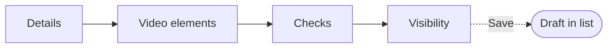
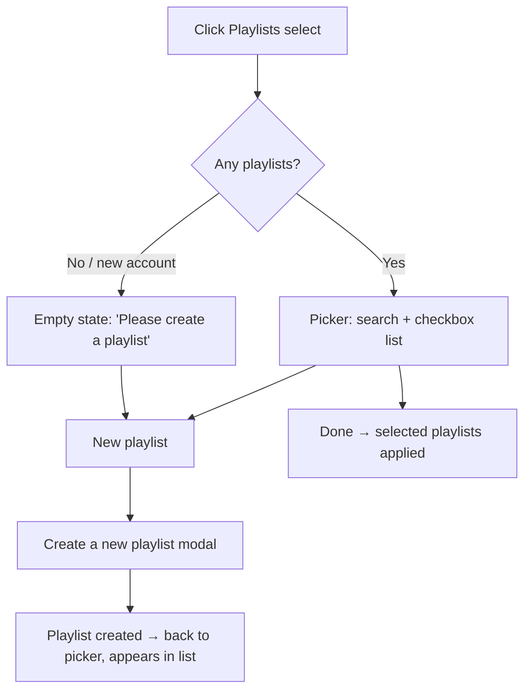
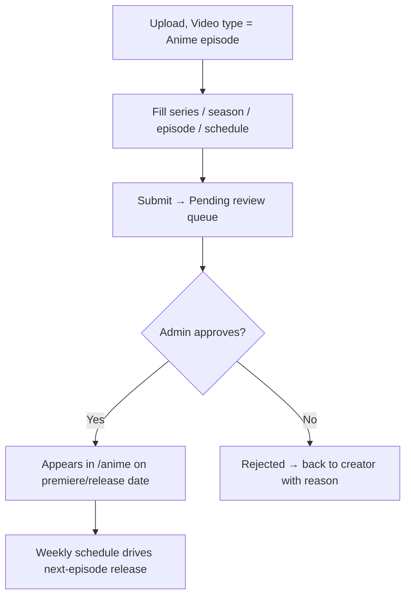
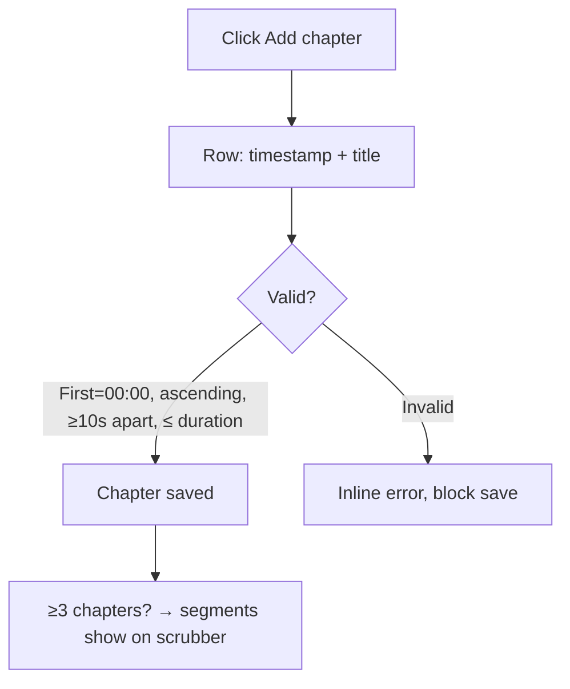
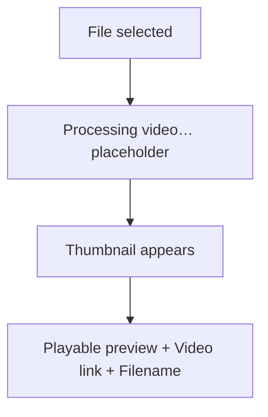
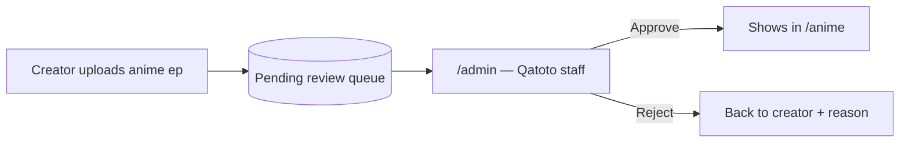

# Upload Video — Flow & Structure

Spec for the video upload flow in Creator Studio (`/studio`). This is a **planning
doc** — tweak / delete any step you don't want, then we build only what's left.

> **Phase note:** UI + mock data only. No real upload, no backend, no fetch. Files
> live in React state; the "video list" is an in-memory / mock array. Backend wiring
> comes later.

---

## 1. What exists today

| Piece                | Location                                                                     | State                                                                   |
| -------------------- | ---------------------------------------------------------------------------- | ----------------------------------------------------------------------- |
| Dropzone card        | [create-studio-page.tsx](src/components/studio/pages/create-studio-page.tsx) | ✅ built — drag/drop + file picker, lists files locally, has **Remove** |
| Studio landing route | [studio/page.tsx](<src/app/(studio)/studio/page.tsx>)                        | ✅ renders dropzone                                                     |
| My Videos route      | [studio/videos/page.tsx](<src/app/(studio)/studio/videos/page.tsx>)          | ⛔ stub — just `<h1>My Videos</h1>`                                     |
| Upload details modal | —                                                                            | ❌ not built (the screenshots)                                          |

**Gap:** picking a file just adds it to a list. The YouTube-style modal
(Details → Video elements → Checks → Visibility) and the populated videos list
don't exist yet.

---

## 2. Target flow (high level)

```mermaid
flowchart TD
    A([User on /studio]) --> B{How to add?}
    B -->|Drag & drop / Select files| C[File chosen]
    B -->|Go Live Stream| Z1[Live stream flow - separate, out of scope here]
    B -->|Create Store Listing| Z2[/studio/products - separate flow]

    C --> D[Open Upload Modal]
    D --> E[Step 1: Details]
    E --> F[Step 2: Video elements]
    F --> G[Step 3: Checks]
    G --> H[Step 4: Visibility]
    H --> I{Save}
    I -->|Save| J[Video added to My Videos list]
    J --> K([/studio/videos shows the video])

    I -->|Close X| L[Saved as private draft]
    L --> K
```

---

## 3. The Upload Modal — 4 steps

Modal opens as soon as a file is selected. Top has a **stepper** (Details ·
Video elements · Checks · Visibility). Left = form. Right = video preview card
(thumbnail, "Processing video…" then player, video link, filename). Bottom bar =
processing status + **Back / Next / Save**.



### Step 1 — Details

| Field                                | Notes                                                                | Keep? |
| ------------------------------------ | -------------------------------------------------------------------- | ----- |
| Title (required)                     | 0/100 counter                                                        |       |
| Description                          | @-mention hint                                                       |       |
| Video type                           | pitch / demo / update / AMA — shapes watch-page layout               |       |
| Sector / industry tags               | B2B discovery (AI, fintech, health…) — replaces YouTube Category     |       |
| Stage badge                          | idea / MVP / scaling / shipped — signals pipeline stage              |       |
| Thumbnail                            | screenshot shows "change in mobile app" — decide own behavior        |       |
| Website URL                          | separate clickable CTA on watch page, not in description (see below) |       |
| Call-to-action button (custom)       | generic CTA — book demo, join waitlist, etc.                         |       |
| Social / contact links               | LinkedIn, X, email — structured fields, not in description           |       |
| Playlists                            | picker → see **Playlists picker** below                              |       |
| Audience — made for kids? (required) | Yes / No radio                                                       |       |
| Age restriction (advanced)           | collapsible                                                          |       |
| Show more                            | Paid promotion, AI use, etc. (below)                                 |       |

#### Website URL & social links (Qatoto-specific)

Structured fields, **not** links dumped in the description. Each renders as its own
clickable element on the watch page.

- **Website URL** → "Visit website" CTA button. Show domain (not raw href).
- **Social / contact** → LinkedIn, X, email rows.
- Trust note (CLAUDE.md): validate/normalize URL **server-side**, render
  `rel="nofollow noopener"`, don't trust client-claimed verified status.

#### Playlists picker

Clicking the **Playlists** select opens a picker popover (not a plain dropdown):

- **Search** box — "Search for a playlist"
- **Checkbox list** of existing playlists (multi-select), e.g. Car music, jav 001,
  Medatation, Ai and Maths, maths, health and fitness, Health, Watch today…
- **New playlist** button (bottom-left) → opens **Create a new playlist** modal
- **Done** button (bottom-right) closes the picker

**New / empty account:** playlist list is blank — show placeholder copy
_"Please create a playlist"_ with the **New playlist** button as the only action.



##### Create a new playlist modal

| Field                          | Notes                       | Keep? |
| ------------------------------ | --------------------------- | ----- |
| Title (required)               | "Add title"                 |       |
| Description                    | "Add description"           |       |
| Visibility                     | Public / Unlisted / Private |       |
| Default video order            | Date published (newest) / … |       |
| Language (title & description) | select                      |       |
| **Create** button              | disabled until Title filled |       |

### Step 1 (expanded) — "Show more"

| Field                            | Notes                                     | Keep? |
| -------------------------------- | ----------------------------------------- | ----- |
| Paid promotion                   | checkbox                                  |       |
| AI use disclosure                | Yes / No                                  |       |
| Tags                             | 0/500, comma-separated                    |       |
| Language + caption certification | two dropdowns                             |       |
| Recording date + location        |                                           |       |
| License                          | Standard / Creative Commons               |       |
| Allow embedding                  | checkbox                                  |       |
| Shorts remixing                  | video+audio / audio only                  |       |
| Category                         | dropdown                                  |       |
| Comments & ratings               | on/off, moderation, who-can-comment, sort |       |
| Show likes count                 | checkbox                                  |       |

### Step 1 (conditional) — Anime episode mode

Shown **only when `Video type = Anime episode`** (the field in Details). Anime is
curated content, so this branch adds series structure + a release schedule and
routes the upload into an **admin approval queue** instead of publishing straight to
the creator's channel. See `ADMIN_STRUCTURE.md` for the review side.

| Field                     | Notes                                        | Keep? |
| ------------------------- | -------------------------------------------- | ----- |
| Series                    | pick existing series or create new           |       |
| Season                    | number / name (e.g. Season 3)                |       |
| Episode number            | ordering within the season                   |       |
| Episode title             | per-episode title (separate from series)     |       |
| Release schedule          | weekly day + time — "new ep every Fri 18:00" |       |
| Premiere / simulcast date | when it goes live in `/anime`                |       |
| Sub / dub + language      | subbed / dubbed, language list               |       |
| Age rating                | anime rating (not the YouTube kids toggle)   |       |
| Genre tags                | reuse `/anime/genre` taxonomy                |       |

**Destination differs from normal videos:**

- Normal creator video → publishes to the creator's channel directly.
- **Anime episode → "Pending review" queue.** Shows in `/anime` **only after a
  Qatoto admin manually approves.** Approval decision is **server-side only** —
  client never self-approves (thin-client rule, CLAUDE.md).



Open decisions:

- **Who can upload anime?** any creator, or a gated "anime partner" role only?
- **Series ownership** — one series owned by one creator/studio, or shared?
- **Schedule engine** — does the weekly day auto-release queued episodes, or does
  admin release each manually? (Crunchyroll = scheduled auto-release after licensing.)

### Step 2 — Video elements

| Field                               | Notes                                                    | Keep? |
| ----------------------------------- | -------------------------------------------------------- | ----- |
| Add related video                   |                                                          |       |
| Attach store products               | shoppable — see **Store products picker** below          |       |
| Attach pitch / project              | link to a `/studio/pitches` project seeking funding/team |       |
| Funding / raise CTA                 | "Back this" / invest button → `/studio/funding`          |       |
| Recruit / open roles                | "Join team" — attach open roles, viewers apply           |       |
| Team members list                   | credit founders/team (idea → team step)                  |       |
| Collaborators / team credit         | extend Invite collaborator → show team on video          |       |
| Pitch deck / docs attach            | PDF deck, whitepaper — download under video              |       |
| Milestones / roadmap                | build → ship progress shown to viewers/backers           |       |
| Chapters (manual)                   | timestamp + label list — see **Chapters editor** below   |       |
| Add subtitles                       |                                                          |       |
| Collaboration / Invite collaborator | modal-in-modal                                           |       |

Qatoto-specific rows (pitch / funding / recruit / team) are the thesis
differentiators — idea → **team** → **fund** → build → ship. Prioritize these over
the YouTube-carryover rows below them.

Dropped from YouTube: ~~Automatic chapters~~, ~~Featured places~~,
~~Automatic concepts~~. Chapters kept but **manual only** (below).

#### Chapters editor (manual)

Creator defines chapters by hand — no AI auto-detect. Each chapter = a start
timestamp + a label. Renders as segments on the player scrubber; viewer clicks to
jump.

- **Add chapter** button → new row: `timestamp (mm:ss)` + `title` inputs
- List of chapter rows, reorderable / removable
- Rules (YouTube-compatible, enforce in UI + backend later):
    - First chapter **must** start at `00:00`
    - Minimum **3** chapters to show on player
    - Each chapter **≥ 10 seconds** long
    - Timestamps strictly ascending, none past video duration
- Empty state: "No chapters yet — add one to let viewers jump around"



| Field per chapter | Notes                      | Keep? |
| ----------------- | -------------------------- | ----- |
| Timestamp         | `mm:ss` / `hh:mm:ss` input |       |
| Title             | short label, e.g. "Demo"   |       |
| Reorder / remove  | drag handle + delete       |       |

#### Store products picker

Attach items from the Qatoto Store (`/store` · `/studio/products`) so viewers can
**buy the product shown in the video**. Products render as shoppable cards / a
"Shop" tab on the watch page.

- **Attach products** button → opens picker popover
- **Search** box — "Search your store products"
- **Checkbox list** of the creator's own store listings (thumbnail · title · price)
- Selected products show as removable chips under the video
- **New / empty store:** blank list, placeholder _"No products yet"_ +
  **Create store listing** link → `/studio/products/create`
- Optional (decide): pin a product to a timestamp so its card pops at that moment

```mermaid
flowchart TD
    A[Click Attach store products] --> B{Any store listings?}
    B -->|Yes| C[Picker: search + checkbox list of own products]
    B -->|No| D["Empty: 'No products yet' + Create store listing"]
    C --> E[Select products → chips on video]
    D --> F[/studio/products/create]
    E --> G[Saved → shoppable cards on watch page]
```

Trust note (per CLAUDE.md): client only picks product ids for display. Backend
re-validates ownership, price, and inventory — never trust client-sent price/qty.

### Step 3 — Checks

| Field           | Notes                     | Keep? |
| --------------- | ------------------------- | ----- |
| Copyright check | mock "No issues found" ✅ |       |

### Step 4 — Visibility

| Field                  | Notes                                                        | Keep? |
| ---------------------- | ------------------------------------------------------------ | ----- |
| Save or publish        | Private / Unlisted / Public radio                            |       |
| Investor-only audience | 4th visibility tier beyond private/unlisted/public           |       |
| NDA / gated visibility | private pitch to selected investors only — gate before watch |       |
| Schedule               | collapsible date picker                                      |       |
| Pre-publish reminders  | static copy                                                  |       |
| **Save** button        | commits video to list                                        |       |

**Visibility tiers (Qatoto):** Private · Unlisted · Public · **Investor-only**.
NDA gating optional on Investor-only — viewer accepts NDA before playback. Trust
note: NDA acceptance + investor identity enforced **server-side**, never client.

---

## 4. Video preview / "processing" behavior

Right-side card in the screenshots:



- Phase note: real processing is backend. For UI phase, **fake it** — timeout that
  swaps "Processing video…" → thumbnail → player. Or skip and show static preview.
- Decide: keep the fake processing animation, or go straight to preview?

---

## 5. After Save → My Videos list

`/studio/videos` should render a list/table of saved videos.

```mermaid
flowchart TD
    A[Save in modal] --> B[Append to videos state / mock array]
    B --> C[/studio/videos reads it]
    C --> D[Row per video: thumbnail, title, visibility, date, filename]
```

Open questions:

- Where does the list live? Options:
    - **A)** Local React state (lost on refresh) — simplest for UI phase.
    - **B)** Mock array in a shared module — survives navigation, seeded rows.
    - **C)** Context/provider so `/studio` and `/studio/videos` share it.
- List item shape (columns): thumbnail · title · visibility badge · date · ⋯ menu?

---

## 6. Decisions for you to make

Strike / edit anything here, then we build to match:

1. **Modal scope** — full 4-step wizard, or trim to Details + Visibility only?
2. **Which Step-1 "show more" fields survive?** (long list above — most are
   YouTube cruft you may not want for Qatoto's B2B thesis)
3. **Fake processing animation** — keep or skip?
4. **Videos list storage** — A / B / C above?
5. **Multi-file** — dropzone accepts many files. One modal per file, or batch?
6. **Go Live** + **Create Store Listing** — confirmed out of scope for this doc.
7. **Anime approval** — anime episodes route to admin review, not instant publish.
   See §6.5 + `ADMIN_STRUCTURE.md`.

---

## 6.5 Admin approval boundary

Anime episodes (and possibly flagged content later) don't publish on save — they
enter a **Pending review** queue and appear in `/anime` only after a Qatoto admin
approves. The admin side lives in a **separate `(admin)` route group in this same
app**, role-gated **server-side** — not a separate website (see `ADMIN_STRUCTURE.md`
for the full reasoning and structure).



---

## 7. Files to touch (when we build)

| File                                                                         | Change                     |
| ---------------------------------------------------------------------------- | -------------------------- |
| `src/components/studio/upload/upload-modal.tsx`                              | ➕ new — the 4-step wizard |
| `src/components/studio/upload/steps/*.tsx`                                   | ➕ new — one per step      |
| [create-studio-page.tsx](src/components/studio/pages/create-studio-page.tsx) | open modal on file select  |
| [studio/videos/page.tsx](<src/app/(studio)/studio/videos/page.tsx>)          | render list, replace stub  |
| `src/components/studio/videos/videos-list.tsx`                               | ➕ new — the list UI       |
| `src/state/studio-videos-context.tsx`                                        | ➕ new (only if option C)  |
