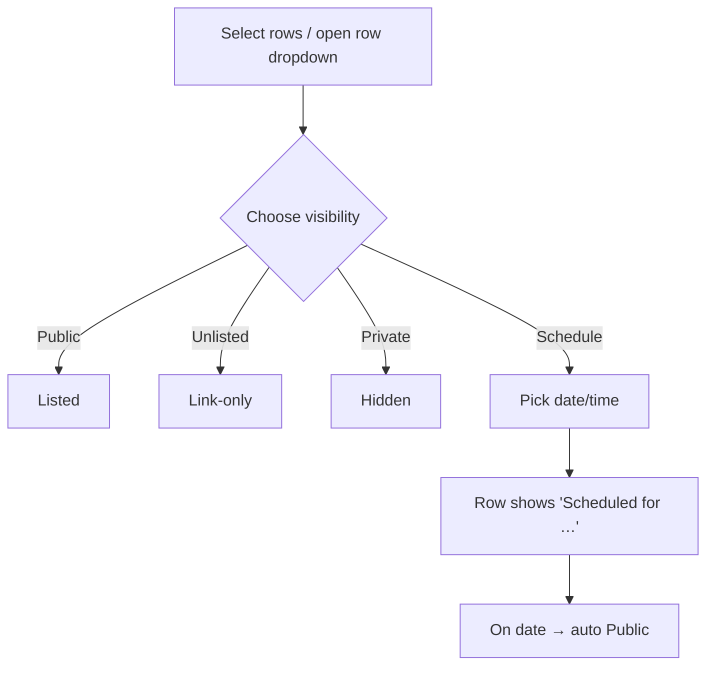

# My Videos List — `/studio/videos` Structure

Planning doc for the creator's video list — the "Channel content" table where a
creator sees all their uploads and changes visibility (list / unlist / schedule).
Tweak / delete anything; we build only what survives.

> **Phase note:** UI + mock data only. No backend, no fetch. List is a mock array
> (seeded rows + whatever the upload modal adds). Visibility changes mutate local
> state only — real persistence + auth come later.

Related: uploads land here after Save (see `UPLOAD_VIDEO_STRUCTURE.md` §5). Anime
episodes land here **too** — shown inline with a `Pending` review badge until a Qatoto
admin approves them (see that doc + `ADMIN_STRUCTURE.md`). There is **no separate
`/studio/queue`** creator page; it was merged into this list.

---

## 1. What exists today

`/studio/videos` renders `VideosList`
([videos-list.tsx](src/components/studio/videos/videos-list.tsx)) — a **minimal list
is built**: per-row thumbnail · title · filename (or series/season/ep for anime) ·
visibility badge · status badge · date · **Edit** button. The richer "Channel
content" table specced below (tabs, filter, bulk actions, ⋯ menu) is **not built
yet**.

---

## 2. Layout (reference: YouTube Studio "Channel content")

```
Channel content
[ Videos ] [ Live ] [ Playlists ]            ← tabs (trim YouTube's set, below)
⌕ Filter

☐ | Video                    | Status/Notices | Visibility | Date | Views | Comments | ⋯
☐ | [thumb] Title            | Comments off   | 🔗 Unlisted | Sep 5| 1     | 0        | ⋯
  |         Add description   |                |            |Uploaded
                                              Rows per page: 30 ▾   1–1 of 1  |< < >
```

- **Header:** "Channel content" (or "My videos")
- **Tabs** — trim YouTube's (no Shorts/Podcasts/Posts for now):
  | Tab | Keep? |
  |-----|-------|
  | Videos | ✅ default — anime episodes appear here too, tagged by a review-status badge |
  | Live | later |
  | Playlists | later |

    No separate "Anime episodes" tab — anime rows are interleaved into the main list;
    their `Pending` / `Approved` / `Rejected` badge tells them apart.

- **Filter bar** — search + filter chips (visibility, date). Search is client-side
  for UI phase; heavy filtering → backend later (CLAUDE.md: don't sort/filter big
  lists on client).

---

## 3. Table columns

| Column           | Content                                                                      | Keep? |
| ---------------- | ---------------------------------------------------------------------------- | ----- |
| Checkbox         | select row for bulk actions                                                  |       |
| Video            | thumbnail + title + "Add description" / description snippet + duration badge |       |
| Status / Notices | e.g. "Comments disabled", copyright, processing                              |       |
| Visibility       | badge + **inline dropdown** → Public / Unlisted / Private / Scheduled        |       |
| Date             | published/uploaded date + state ("Uploaded", "Scheduled for…")               |       |
| Views            | number (mock)                                                                |       |
| Comments         | count (mock)                                                                 |       |
| ⋯ menu           | per-row actions (below)                                                      |       |

Hover a row → quick action icons (Edit, Analytics, Comments, ⋯) like YouTube.

---

## 4. The core ask — change visibility (list / unlist / schedule)

Two ways, both drive the same state:

### 4.1 Per-row — Visibility dropdown

Click the Visibility cell → popover:

| Option    | Meaning                                |
| --------- | -------------------------------------- |
| Public    | listed — everyone can watch            |
| Unlisted  | link-only                              |
| Private   | only creator                           |
| Schedule… | pick date/time → auto-goes Public then |

### 4.2 Bulk — select rows → action bar

Selecting one+ checkboxes shows a bar above the table:

```
[ 3 selected ]   Set visibility ▾   Schedule…   Delete   ✕
```

| Bulk action                        | Notes                                               |
| ---------------------------------- | --------------------------------------------------- |
| Set visibility                     | Public / Unlisted / Private applied to all selected |
| Schedule                           | one date/time for all selected → Public then        |
| Delete                             | confirm modal                                       |
| (later) add to playlist, edit tags |                                                     |



Trust note (CLAUDE.md): client toggling visibility is UX only. Backend re-checks
ownership + enforces the actual access rule. Never trust client-set visibility as
the source of truth.

---

## 5. Per-row ⋯ menu

**Built now:** a visible **Edit** button on every row reopens the upload modal in edit
mode, pre-filled (see `UPLOAD_VIDEO_STRUCTURE.md` §3). The remaining actions below stay
specced for the future ⋯ menu.

| Action             | Notes                                 | Keep? |
| ------------------ | ------------------------------------- | ----- |
| Edit details       | reopen the upload modal on this video |       |
| Change visibility  | same as 4.1                           |       |
| Get shareable link | copy watch URL                        |       |
| Analytics          | → `/studio/analytics` for this video  |       |
| Comments           | → `/studio/comments`                  |       |
| Download           | original file (later)                 |       |
| Delete             | confirm modal                         |       |

---

## 6. Row states (discriminated — no loose flags)

Model each row's status as one union, render exhaustively (CLAUDE.md Pattern 1):

| State            | Shows                                                     |
| ---------------- | --------------------------------------------------------- |
| `processing`     | "Processing…" placeholder, actions limited                |
| `draft`          | saved private, not published                              |
| `scheduled`      | "Scheduled for {date}"                                    |
| `published`      | live, with visibility badge                               |
| `pending-review` | anime ep awaiting admin approval — `Pending` badge inline |
| `approved`       | anime ep admin-approved — `Approved` badge                |
| `rejected`       | anime ep admin-rejected — `Rejected` badge + reason line  |

These match the `StudioVideoStatus` union in `studio-videos-context.tsx`; the list's
`StatusBadge` renders them with an exhaustive `switch` (CLAUDE.md Pattern 1).

---

## 7. Empty state

No videos yet → centered card: "No videos yet" + **Upload video** button → `/studio`.

---

## 8. Storage (shared with upload flow)

Same open question as `UPLOAD_VIDEO_STRUCTURE.md` §5 — where the list lives:

- **A)** local state (lost on refresh) — simplest
- **B)** mock array in a shared module — seeded rows, survives nav
- **C)** context/provider so `/studio` (upload) and `/studio/videos` (list) share it — ✅ **chosen & built** (`studio-videos-context.tsx`; `addVideo` on upload, `updateVideo` on edit)

Pick once; both docs use the same choice.

---

## 9. Decisions for you

1. **Tabs** — just Videos now, or add Anime episodes / Live / Playlists?
2. **Columns** — drop Views/Comments for UI phase (no real data), or show mock?
3. **Bulk actions** — visibility + schedule + delete enough, or more?
4. **Schedule UI** — inline date picker or modal?
5. **Storage** — A / B / C above (should match upload doc)?

---

## 10. Files to touch (when we build)

| File                                                                | Change                                                                                                                   |
| ------------------------------------------------------------------- | ------------------------------------------------------------------------------------------------------------------------ |
| [studio/videos/page.tsx](<src/app/(studio)/studio/videos/page.tsx>) | ✅ renders `VideosList`                                                                                                  |
| `src/components/studio/videos/videos-list.tsx`                      | ✅ minimal list + anime status badges + per-row **Edit** (row/badge markup inline for now; table/tabs/filter still todo) |
| `src/components/studio/videos/video-row.tsx`                        | ➕ later — split-out row + visibility dropdown + ⋯ menu                                                                  |
| `src/components/studio/videos/bulk-action-bar.tsx`                  | ➕ later — selection bar                                                                                                 |
| `src/state/studio-videos-context.tsx`                               | ✅ shared store (option C) — `addVideo` / `updateVideo`                                                                  |
