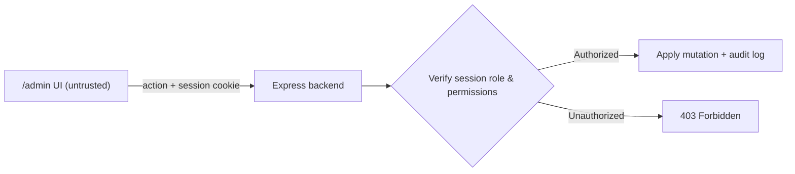

# Admin & Staff Console — Architecture & Reference Guide

> **Status: Wired & Live.** The admin console lives at `/admin` under `src/app/(admin)/admin/**` and is fully wired to the Express backend.

This document outlines the staff console architecture, security model, and available surfaces.

---

## 0. Build vs Buy & Direct Database Ops

Startups avoid building redundant custom CRUD for every database table. Standard user/settings administration is performed via **Drizzle Studio** or direct database inspection.

Custom admin consoles are built only for workflows requiring rich media interaction, sequential validation, or front-page editorial control:
- Image / video inspection (hero slides, blueprints moderation).
- Reordering and sequence permutations (promotional carousels, spotlight rails).
- Multiphase domain validation (freight rate cards, customs dwell windows).

---

## 1. Security & Trust Boundary (NON-NEGOTIABLE)

The admin frontend is a **thin, untrusted presentation layer**. Being an "admin page" grants it zero implicit trust:
1. **Server-Derives Roles:** The client never passes role flags. The server derives the user's role from the authenticated session cookie via `requireRole` / `requirePermission`.
2. **Server-Enforces Permissions:** Client-side role checks exist only to show/hide navigation controls. The backend independently validates permissions and logs an audit trail on every mutation.
3. **No Secrets in Bundle:** No internal API keys, moderation secrets, or unredacted PII are exposed to the client.



---

## 2. Route Structure & Chrome

- **Route Group:** `src/app/(admin)/admin/**` with its own dedicated layout (`src/app/(admin)/layout.tsx`) and sidebar navigation (`src/components/admin/admin-sidebar.tsx`).
- **Navigation:** Grouped by operational domains with clear separation from the consumer `(home)` and creator `(studio)` shells.

---

## 3. Shipped Admin Consoles

| Domain | Routes | Purpose & Backend Authority |
| :--- | :--- | :--- |
| **Editorial & Promotions** | `/admin/promotions`<br/>`/admin/spotlight`<br/>`/admin/blueprints-hero` | **Homepage & Hub Hero:** Multipart Cloudinary slide upload, atomic whole-set position reordering, and slot assignment. Gated by `manage_promotions`. |
| **Freight & Logistics** | `/admin/freight` | **Lanes & Rates:** Eight routes for freight rate cards and customs dwell estimates. Enforces future `validFrom` dates and nested weight break ladders. |
| **Content Moderation** | `/admin/reports`<br/>`/admin/blueprint-reports`<br/>`/admin/commerce-reports`<br/>`/admin/profile-reports` | **Review Queues:** Flagged videos, comments, blueprint builds, commerce listings, and profile violations. Supports takedowns and warnings. |
| **Engineering Hub** | `/admin/teardowns`<br/>`/admin/case-studies`<br/>`/admin/showcase-launches` | **Clean-Room Moderation:** Verification of clean-room teardowns, hardware case studies, and engineering showcase publications. |
| **Store & Catalog** | `/admin/store-categories`<br/>`/admin/categories`<br/>`/admin/product-relations` | **Taxonomy & Merchandising:** Category tree management, category attributes, and product recommendation relationships. |
| **Platform & Staff** | `/admin/staff`<br/>`/admin/audit`<br/>`/admin/metrics`<br/>`/admin/feedback`<br/>`/admin/support` | **Operations:** RBAC staff role assignment, read-only immutable audit trail logs, telemetry metrics, and customer support tickets. |

---

## 4. Verification

Run standard repository audits to ensure admin consistency:
```bash
pnpm lint && pnpm build
```
