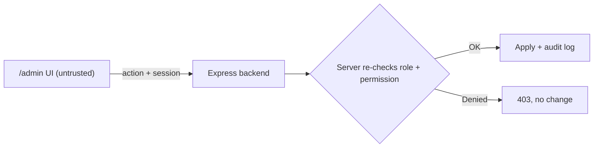
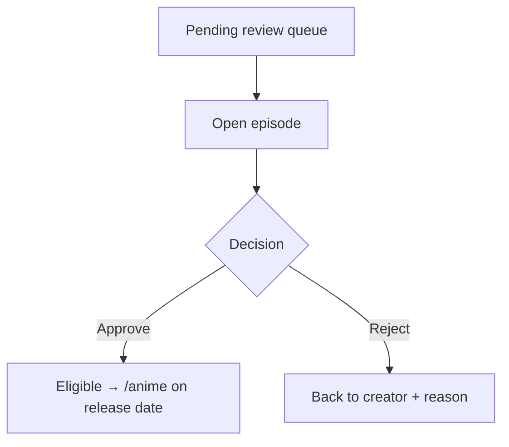

# Admin / Staff Console — Structure

Planning doc for the Qatoto staff-facing admin surface — where company staff review
content, moderate users, and manage the platform. Tweak / delete anything; we build
only what survives.

> **Phase note:** UI + mock data only. No real auth, no backend, no fetch. Mock
> pending-queue arrays, mock user rows. All role checks + decisions are **display
> only** in this phase — the real gate is server-side, added later.

---

## 0. Reality check — build vs buy (READ FIRST)

Startups don't hand-build a full admin console pre-launch. They run ops from the
**database directly** (Drizzle Studio, since backend is Postgres + Drizzle) or an
off-the-shelf panel (Retool / Forest). Building custom admin UI = time not spent on
product.

**Decision for now:**

| Admin flow                                       | Tool                                              |
| ------------------------------------------------ | ------------------------------------------------- |
| **Anime review — watch + approve/reject**        | ✅ **hand-build `/admin/review`** (§4.1)          |
| **Home-page promotional carousel**               | ✅ **built — `/admin/promotions`** (§4.7)         |
| Users, catalog, schedule, store, audit, settings | **Drizzle Studio** — no build (§4.2–4.6 deferred) |

> **§4.7 was added after this table was first written**, so the "only §4.1 gets built"
> line below is now stale twice over — `/admin/categories` and `/admin/staff` also shipped.

**Why the carousel is the second exception**, on the same reasoning as anime review: the
job is _look at the picture, then decide where it links and what order it sits in_. Drizzle
Studio shows the Cloudinary URL as a text cell, and reordering means hand-editing an integer
`position` column on every row without ever seeing the slides. It also cannot upload an
image at all — the bytes have to go through sharp and Cloudinary, which only the API does.

**Why anime review is the one exception:** the job is _watch the video, then decide_.
Drizzle Studio only shows the video URL as a text cell — no player. You'd copy the
URL, open a tab, watch, return, edit the `status` column by hand. Fine for you
reviewing a handful solo; unusable for a hired reviewer or any volume. A player
next to an Approve button is the whole point, so that page is worth building.

Everything else (users, catalog CRUD, settings) is plain table editing → Drizzle
Studio handles it free. **Only §4.1 gets built now.** §4.2–4.6 stay specced for
later but are **not** in the current build.

---

## 1. Big decision — separate website or same app?

**Recommendation: same repo & same Next app, separate `(admin)` route group,
role-gated server-side. NOT a separate website — yet.**

### How the big players do it

ByteDance/Douyin, YouTube, etc. run **separate internal consoles** — content
moderation, creator ops, and rights management are different services, different
auth domains, often different repos. Reasons: massive scale, security isolation
(moderation tooling must never ship in the consumer bundle), and different teams own
each surface.

That's a **post-scale** shape. Pre-launch, splitting now = premature cost.

### Options

| Option                                       | When to pick                                                                                        |
| -------------------------------------------- | --------------------------------------------------------------------------------------------------- |
| **`(admin)` route group, this app** ✅ (now) | Fast, shared components, one deploy. `/admin/*` blocked unless server says role=admin/moderator.    |
| Separate repo + deploy (own domain/app)      | Later — when moderation is heavy, staff ≫ users, and you want zero admin code in the public bundle. |

### Migration path

Start as `(admin)` group → if it grows, lift into its own deploy. Because the admin
UI is a **thin render layer** (all decisions server-authorized), moving it later is
cheap — no business logic to untangle.

---

## 2. Trust boundary (NON-NEGOTIABLE, per CLAUDE.md)

The admin frontend is **still an untrusted client**. Being "admin UI" grants it
nothing.

- Client-side role check = UX only (hide/show buttons). **Server re-authorizes every
  admin action** (approve, reject, ban, refund…).
- Never trust a client-claimed `role: admin`. Server derives role from the session.
- No moderation secrets, internal thresholds, or user PII beyond what the action
  needs, in the client bundle.
- Every approve/reject/ban: server validates actor's role + permission + logs an
  audit trail before acting.



---

## 3. Access & routing

- New route group: `src/app/(admin)/admin/**`
- Its own minimal layout — **not** the creator `(studio)` chrome, **not** the
  consumer `(home)` chrome.
- Gate: server-side role check on every `/admin/*` request. Client redirect for
  non-staff is UX sugar only.
- Roles (start simple, expand later):

    | Role        | Can do                                              |
    | ----------- | --------------------------------------------------- |
    | `moderator` | review content queue, approve/reject anime episodes |
    | `admin`     | everything moderator + user management, settings    |
    | (later)     | `finance`, `support`, `rights` — scoped roles       |

---

## 4. Admin surfaces (what to build)

Priority-ordered. Strike what you don't want.

### 4.1 Content review queue ⭐ (first — unblocks anime)

The reason this exists now. Anime episodes land here before showing in `/anime`.

> **Two surfaces, don't conflate:**
>
> - **My Videos (`/studio/videos`)** — the _creator's_ side. Anime episodes show
>   inline in the creator's normal video list with a read-only status badge
>   (Pending / Approved / Rejected + reason). No approve buttons. **There is no
>   separate `/studio/queue` page** — it was merged into My Videos so anime doesn't
>   get its own endpoint.
> - **`/admin/review`** (this section) — the _staff_ side. Where approve/reject
>   actions actually happen. Same underlying items, different surface + permissions.

| Piece           | Notes                                                         | Keep? |
| --------------- | ------------------------------------------------------------- | ----- |
| Pending list    | rows: thumbnail · series/season/ep · creator · submitted date |       |
| Filter / tabs   | Pending · Approved · Rejected                                 |       |
| Review detail   | play video, see metadata, series/season/episode, schedule     |       |
| Approve         | → episode becomes eligible for `/anime` on its release date   |       |
| Reject + reason | → sent back to creator with a note                            |       |
| Bulk actions    | approve/reject multiple (later)                               |       |



### 4.2 User management — 🗄️ Drizzle Studio for now (not built)

| Piece         | Notes                                       | Keep? |
| ------------- | ------------------------------------------- | ----- |
| User list     | search, filter by role/status               |       |
| User detail   | profile, uploads, sales, flags              |       |
| Suspend / ban | with reason + duration                      |       |
| Role assign   | grant creator / anime-partner / staff roles |       |

### 4.3 Anime catalog management — 🗄️ Drizzle Studio for now (not built)

| Piece            | Notes                                      | Keep? |
| ---------------- | ------------------------------------------ | ----- |
| Series list      | all anime series, owner, status            |       |
| Season / episode | manage ordering, release schedule          |       |
| Schedule board   | weekly calendar of what releases which day |       |
| Feature / hero   | pick `/anime` hero + featured rows         |       |

### 4.4 Reports & moderation — 🗄️ Drizzle Studio for now (not built)

| Piece            | Notes                              | Keep? |
| ---------------- | ---------------------------------- | ----- |
| Reported content | user-flagged videos/comments queue |       |
| Takedown         | remove + notify                    |       |
| Copyright claims | ties to `/studio/copyright`        |       |

### 4.5 Store / orders oversight (B2B thesis) — 🗄️ Drizzle Studio for now (not built)

| Piece             | Notes                                      | Keep? |
| ----------------- | ------------------------------------------ | ----- |
| Product review    | approve store listings before they go live |       |
| Orders / disputes | refunds, chargebacks (server-authorized)   |       |
| Funding / pitches | review raises, verify claims               |       |

### 4.5a Freight lanes — ✅ built (`/admin/freight`)

Rate cards price a lane; customs dwell estimates give it an arrival window. A lane needs both, and
until it has both the buyer's delivery sheet reports an absence. Eight backend routes under
`/commerce/admin/{freight-rate-cards,customs-dwell-estimates}`, all `moderate_commerce`, all six
writes idempotent. Body in `src/components/admin/freight/`.

**The rate tables ship EMPTY by design (A36)**, so an empty console is the correct state, not a
failed load — the copy says so, because a console that looks broken when it is merely unloaded
sends someone debugging a working system.

Three rules this console exists to enforce, each a way the backend silently produces a useless
record if you build the obvious form:

| Rule                                   | Why it is not a UI preference                                                                                                                                                                                                                                                                                                        |
| -------------------------------------- | ------------------------------------------------------------------------------------------------------------------------------------------------------------------------------------------------------------------------------------------------------------------------------------------------------------------------------------ |
| `validFrom` must be in the FUTURE      | It is optional on the wire and defaults to now. Bands are editable only while a card is staged (`active` **and** `validFrom > now`), and `validFrom` is in no PATCH schema — so a card authored with a blank start is frozen at the instant it exists, permanently, and the only remedy is withdraw-and-rewrite.                     |
| `bandsEditable` is READ, never derived | The server computes it with the same predicate its 409 uses, against one `now` per request. Deriving it in the browser puts the deciding rule in two codebases and lets clock skew disagree.                                                                                                                                         |
| Creating a card SUPERSEDES silently    | There is no `supersedesRateCardId` anywhere in the product. An active card on the same `(provider, origin, destination, mode, currency)` is closed in the same transaction, reported once as `supersededRateCardId` on the create response. The composer runs a pre-flight and makes the operator acknowledge the incumbent by name. |

Plus one derived signal the server does not offer: a card with **no band at
`minBillableWeightGrams: 0`** answers `below_smallest_break` for every small consignment, which
reaches the buyer as an EMPTY options list — indistinguishable from a lane with no card at all. The
console computes that from the nested `breaks[]` and labels it as derived.

**What the backend cannot answer, and the console says so rather than faking:** no single-card read
(so no deep links — one page, expandable rows), cursor pagination with no total and no previous
cursor (load-more, and it never claims a count), no server-side "which cards are still editable"
filter (that view filters within loaded rows and admits it), and no band delete (removal is a
whole-ladder `PATCH`, and the set can never reach zero).

### 4.6 Platform — 🗄️ Drizzle Studio for now (not built)

| Piece     | Notes                               | Keep? |
| --------- | ----------------------------------- | ----- |
| Dashboard | pending counts, key metrics         |       |
| Audit log | who did what, when (read-only)      |       |
| Settings  | feature flags, categories, taxonomy |       |

### 4.7 Promotions — ✅ built (`/admin/promotions`)

The home-page carousel. Backed by `promotional_slide` and the `/promotions` router; the
public read is `GET /promotions/slides` and every write is `/promotions/admin/slides/*`.

| Piece         | Notes                                                                                         |
| ------------- | --------------------------------------------------------------------------------------------- |
| Add a slide   | multipart — image + alt text + destination, in ONE call. A slide with no image is not a slide |
| Set the order | ▲/▼ **and** a "Show as 1st/2nd/3rd" select. Both send the WHOLE permutation atomically        |
| Delete        | two-step inline confirm; destroys the Cloudinary asset first, then re-packs positions         |
| Hide / show   | `isActive` — the row survives, the visitor stops seeing it                                    |
| Schedule      | `startsAt` / `endsAt`, NULL = unbounded. Out-of-window slides stay in the admin list          |

**Three things that are not negotiable on this surface:**

- **`manage_promotions` is ADMIN-ONLY**, deliberately narrower than `moderate_content`. A
  slide is a front-page placement that may point at an arbitrary external https URL — a
  phishing lure wearing our own branding. That blast radius sits next to role management,
  not next to a review queue.
- **A destination is parsed, never trusted.** `src/lib/promotional-destination.ts` (backend)
  refuses `//evil.tld`, `/\evil.tld`, `javascript:` and credentialed URLs, and the
  `promotional_slide_destination_ck` CHECK makes those rows unrepresentable even if a future
  code path skips the service. `pnpm db:verify-promotional-slide-constraints` exercises it.
- **The order is set as a whole permutation**, never per-row. A partial list is a 422, not a
  partial apply — a client working from a stale list would otherwise silently drop the slide
  it had not seen to the end.

Verified by `pnpm db:smoke-promotional-slides` (14 behaviours, cleans up after itself).

### 4.8 Spotlight — ✅ built (`/admin/spotlight`)

The three-video rail below the category tiles on the home page. Backed by
`feed_spotlight_slot` and the `/spotlight` router; the public read is `GET /spotlight/videos`
and the only write is `PUT /spotlight/admin/slots` (whole-set replace).

| Piece        | Notes                                                                                          |
| ------------ | ---------------------------------------------------------------------------------------------- |
| Pick videos  | Search the catalogue (`GET /feed/search`); assign Left / Center / Right                        |
| Save         | Sends the ordered `videoIds` array (0..3). Empty clears the rail and hides it on the home page |
| Clear a slot | Local draft until Save; gaps close on save (sparse positions are not on the wire)              |

**Not negotiable:**

- **`manage_promotions` is the gate** — same front-page placement blast radius as the carousel.
  No second capability for the same staff act.
- **Only feed-eligible videos** — unpublished / unverified / non-ready ids are a 422, not a
  silent store-then-drop.
- **Nothing is optimistic** — the draft re-seeds from the server after Save.

---

## 5. Suggested route map

```text
src/app/(admin)/admin/
  page.tsx                 # dashboard
  review/                  # 4.1 content review queue ⭐
  users/                   # 4.2
  anime/                   # 4.3 catalog + schedule
    schedule/
  reports/                 # 4.4
  store/                   # 4.5
    orders/
  freight/                 # 4.5a ✅ built — rate cards + customs dwell estimates
  audit/                   # 4.6
  settings/
```

---

## 6. Build order (my rec)

**In scope now — only the anime review path:**

1. **`(admin)` route group + layout + mock role gate** — skeleton.
2. **`/admin/review` (4.1)** — the ⭐ custom page: **video player** + metadata beside
   it + Approve / Reject+reason. Mock pending list → detail → decision (state only).
3. **Creator-side status in My Videos** — ✅ done. Anime episodes show inline in
   `/studio/videos` with a read-only status badge (Pending / Approved / Rejected +
   reason). No separate `/studio/queue` page — merged in to avoid an anime-only
   endpoint. Editing an episode resets it to Pending.
4. Wire anime upload's Save → feed the admin review queue (mock). The creator side
   already reads the shared `studio-videos-context` store.

**Deferred — use Drizzle Studio, don't build (§4.2–4.6):**
users, catalog, schedule, reports, store/orders, audit, settings. Revisit only when
Drizzle Studio stops being enough (volume, non-technical staff, or a flow that needs
video/rich context like review did).

Everything else waits until you say go.

---

## 7. Open decisions

1. **Route-group vs separate app** — confirm `(admin)` in this repo for now?
   Answer: In this repo probably accessible via /admin you decide route and also authorization.
2. **Roles** — start with `moderator` + `admin` only, or add scoped roles now?
   Answer: Role-Based Access Control (RBAC) authorization. Start with 'user', 'moderator', 'admin'. Write a seed script that checks if an admin exists. If not, it creates one using credentials from environment variables (or prompts).
3. **Anime auto-release** — after approval, does the weekly schedule auto-publish
   each episode, or does a human release each one?
   Answer: Auto publish after approval
4. **What else needs approval besides anime?** store listings? funding pitches?
   Answer: keep anime and videos both for approval
5. **Audit log** — build now (cheap, mock) or defer?
   build mock for now

Typical startup admin panel checklist
Since your platform is R&D/product‑development heavy, your admin will likely include:

User management (roles, bans, verification)

Content moderation (flagged research articles, videos, product listings)

Analytics dashboards (protected React Query calls to summary endpoints)

Product/R&D submission review queue

System health & logs

Summary
Route: /admin/\* inside the same Next.js app.

Authorization: Roles stored in DB (user, moderator, admin). Backend middleware checks JWT; frontend guards render admin UI.

First admin: One‑time seed script using INITIAL_ADMIN_EMAIL + INITIAL_ADMIN_PASSWORD env vars. Immediately change password and create real admin accounts after deploy.

Ongoing management: Admin UI to promote/demote users. No .env involved in daily operations.

Recovery: Re‑run the seed or update the DB directly.
