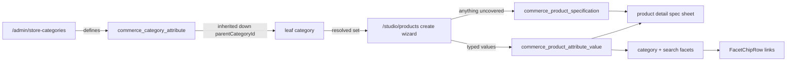

# Category attributes — the frontend half

Per-category specification fields, so a buyer can filter and compare listings instead of reading
prose. **Nothing here is built.** This is the frontend contract for
`STORE_BACKEND_STRUCTURE.md` §20 and §21 (backend repo — see [BACKEND_DOCS.md](BACKEND_DOCS.md)).

**Read alongside:**

- `STORE_BACKEND_STRUCTURE.md` §20 (attribute templates), §21 (model number, selling state,
  product documents), §12 Phases 24–25 — the tables, routes and query keys. The backend doc is
  the authority for every enum value and column on this page.
- [STORE_STRUCTURE.md](STORE_STRUCTURE.md) — the buyer surface this extends, especially §7.3
  (search and filters) and §8 (product detail).
- [STUDIO_PRODUCTS_STRUCTURE.md](STUDIO_PRODUCTS_STRUCTURE.md) — the shipped seller wizard this
  adds a step to.
- [CLAUDE.md](../CLAUDE.md) — thin-client, defensive parsing, view states, and the wire-casing
  table that governs `attributeKey`.

---

## 1. Why, in one screen

Every category needs different labels on the box. Electronics needs voltage. Furniture needs wood
type and load rating. Clothing needs size and fabric. Qatoto's box has one blank sticker anybody
can scribble on — and, as it turns out, nobody ever has.

| Claim                                                              | Where it is checkable                                                                                                                    |
| ------------------------------------------------------------------ | ---------------------------------------------------------------------------------------------------------------------------------------- |
| The backend accepts `specifications[]` on product create and PATCH | backend `products.schemas.ts:103-120` — 40 max, key 1–80 chars, value 1–500, case-insensitive key uniqueness                             |
| No frontend surface has ever sent one                              | `rg "specifications" src/lib/products/schemas.ts` returns **nothing**                                                                    |
| The seller wizard has no specification step                        | [create-listing-page.tsx:42-48](../src/components/studio/pages/create-listing-page.tsx) — identity, images, description, pricing, review |
| The buyer spec sheet renders `specifications[].group` as tabs      | [product-details-sheet.tsx](../src/components/home/store/sheets/product-details-sheet.tsx)                                               |
| The comparison table aligns rows on `specifications[].key`         | [compare-products-sheet.tsx:76-97](../src/components/home/store/sheets/compare-products-sheet.tsx)                                       |
| The buyer read already parses specs                                | [products.schemas.ts:270-280](../src/lib/store/products.schemas.ts)                                                                      |

So two shipped buyer surfaces are built on a field that is empty everywhere, and the one that
compares products aligns on a key that free text guarantees will not match across sellers.

**Filling the wizard without fixing the vocabulary would make it worse, not better** — it would
populate the compare table with rows that never line up, which reads as a bug rather than as an
absence. The vocabulary and the write surface are one change.

### What is NOT being added, and why

- **A bulk-quote / RFQ feature.** Already shipped and wired: multi-line product requests
  ([rfqs.schemas.ts](../src/lib/store/rfqs.schemas.ts) `RfqProductLineSchema`), line-by-line quote
  answers keyed on `rfqProductLineId` ([quotes.schemas.ts](../src/lib/store/quotes.schemas.ts)),
  the composer, both studio queues and `QuoteComparisonItemSchema`. The only gap is a link from
  the product page — [buy-action-buttons.tsx](../src/components/home/store/cards/buy-action-buttons.tsx)
  still says two of its three buttons are inert. That is a `todo.md` line, not a feature.
- **Per-product compliance tags.** `OrganizationCertificationSchema`
  ([organizations.schemas.ts:320](../src/lib/store/organizations.schemas.ts)) is a **moderated**
  claim: a Qatoto reviewer adjudicated an uploaded certificate, `approvedAt` says so, and the
  backend's closed `commerce_certification_standard_code` enum makes it filterable in the factory
  directory. A per-product copy would be unverified seller text rendered with the same
  affordance as an adjudicated one. Where a certificate really is per-model, §3 covers the fact
  (a `ce_marking` enum attribute) and §7 covers the paper.
- ⚠️ **`ComplianceCheck` does not exist.** It is an aspirational row in the backend's `CLAUDE.md`
  domain table and has never been built. Do not plan against it.

---

## 2. The rule that keeps the UI quiet

> **A category with no filterable attributes renders no new control.**

`attributeFacets` comes back as an empty array and the chip row does not mount. Books & Media
costs a buyer nothing. Electronics gets voltage, tolerance and package. There is no client-side
decision here and no feature flag — the backend publishes fewer facets, and the exhaustive
`switch` over the facet's `valueKind` has three arms of which `text` renders nothing filterable.

The corollary, which is the load-bearing half: **the frontend never invents a chip.** Counts and
buckets come from the backend facet response, the way `FacetChipRow`
([facet-chip-row.tsx](../src/components/home/shared/facet-chip-row.tsx)) already requires, and
never from distinct values observed in the fetched page.

---

## 3. The contract



### 3.1 New schemas — `src/lib/store/catalog.schemas.ts`

```ts
export const CATEGORY_ATTRIBUTE_VALUE_KINDS = ["enum", "number", "text"] as const;

CategoryAttributeChoiceSchema; // { choiceValue, label, position }
CategoryAttributeSchema; // { id, attributeKey, label, groupLabel|null, valueKind,
//   unitLabel|null, numericScale|null, isFilterable,
//   isRequiredForPublish, position, choices[] }
AttributeFacetSchema; // discriminated on valueKind:
//   enum   -> { attributeKey, label, groupLabel|null, buckets[] }
//   number -> { attributeKey, label, unitLabel|null,
//               numericScale, minScaled, maxScaled, count }
```

`.strip()` on all of them, per Pattern 2. `AttributeFacetSchema` is a `z.discriminatedUnion` on
`valueKind` and **not** a bag of optional fields — a facet that carried both `buckets` and
`minScaled` would be an impossible state the renderer would have to guess about (Pattern 1).

⚠️ **`attributeKey` and `choiceValue` are snake_case and are never re-cased.** They are wire
identities the query string names and a stored row points at, exactly like the `pgEnum` labels in
`shared.schemas.ts`. `label` and `groupLabel` are the display strings. CLAUDE.md's wire-casing
table is the authority; converting one into the other silently breaks every saved filter link.

### 3.2 Filters

`StoreSearchFilter` ([catalog.schemas.ts:259-280](../src/lib/store/catalog.schemas.ts)) gains two
repeatable keys, and **`CategoryDetailFilter` ([:284](../src/lib/store/catalog.schemas.ts)) gains
the whole search filter surface** — today it is `{ limit, cursor }`, which is why
[catalog-facet-summary.tsx:19-23](../src/components/home/store/filters/catalog-facet-summary.tsx)
carries a `TODO(backend)` and renders four facets a buyer cannot click.

```ts
readonly attribute?: readonly string[];       // "voltage_volts:5v", max 6
readonly attributeRange?: readonly string[];  // "capacitance_uf:100:470", max 4
```

- OR within one `attributeKey`, AND across different keys.
- Range bounds are **already scaled** by the attribute's `numericScale`. The client formats for
  display with `Intl.NumberFormat` and sends integers, the same discipline integer cents follow —
  no decimal ever crosses the wire.
- The backend's `SearchQuerySchema` is `.strict()`: a stray key is a **422 that kills the whole
  read**, not an ignored parameter. Build these keys with `buildFilterHref`
  ([src/lib/filter-href.ts](../src/lib/filter-href.ts)) and never by hand.
- Sending an attribute filter forces `documentKind=product`. The filter row must reflect that
  rather than leave a "Suppliers" tab looking available and returning nothing.

Filters stay **URL state rendered as links**. `filter-href.ts:1-11` states the rule and the reason;
a chip is an `<a>`, not `useState` plus `.filter()` over the fetched page.

---

## 4. The seller wizard gains a step

[create-listing-page.tsx](../src/components/studio/pages/create-listing-page.tsx) —
`LISTING_STEPS` at `:42` becomes six: identity, images, description, **specifications**, pricing,
review.

| Attribute `valueKind` | Control                                                                                    |
| --------------------- | ------------------------------------------------------------------------------------------ |
| `enum`                | `<select>` over `choices`, labelled `label`, valued `choiceValue`                          |
| `number`              | numeric input with `unitLabel` rendered as a suffix, scaled to `numericScale` on submit    |
| `text`                | text input — display-only downstream, and the step says so rather than implying it filters |

Below the resolved set, a free-text key/value repeater writes
`commerce_product_specification` as today. **40 entries total across both**, matching the backend
cap, so the form cannot compose a request the API refuses.

Three states the step must render honestly, as a discriminated union with an exhaustive `switch`:

- **no category chosen yet** — the attribute set is a function of the category, so the step says
  pick one and offers the free-text repeater only after one exists;
- **category chosen, no attributes defined** — repeater only, plus the "request a field" link;
- **resolved set present** — the controls above.

`isRequiredForPublish` attributes join `ListingCompleteness`: `LISTING_REQUIREMENT_KEYS`
([src/lib/products/schemas.ts:69-75](../src/lib/products/schemas.ts)) gains `specifications`,
`LISTING_REQUIREMENT_LABELS` gains its copy, and the review step's requirement→step map at
`create-listing-page.tsx:1455-1510` gains the row. **The backend re-derives completeness on
publish** — the checklist is UX, and `INCOMPLETE_FOR_PUBLISH` remains the authority.

The seller write contract itself has to grow first: `src/lib/products/schemas.ts` has **no**
`specifications` key at all today. `CreateProductInput` / `UpdateProductInput` gain
`specifications[]` and `attributeValues[]`.

**Requesting a missing field** reuses the category-request shape the wizard already ships —
[listing-category-picker.tsx](../src/components/studio/listing/listing-category-picker.tsx)
submits a category request and offers the seller's existing pending ones so five listings are one
ask. Do the same for attributes, for the same reason, and say the same thing: the request path is
**not** a failure path. The listing publishes now; the value parks as free text; approval promotes
the vocabulary.

---

## 5. The buyer surfaces

| Surface                                                                                          | Change                                                                                                                                                                                                                                                                                            |
| ------------------------------------------------------------------------------------------------ | ------------------------------------------------------------------------------------------------------------------------------------------------------------------------------------------------------------------------------------------------------------------------------------------------- |
| [product-details-sheet.tsx](../src/components/home/store/sheets/product-details-sheet.tsx)       | **One** spec sheet. Structured values first, grouped by `groupLabel` into the tabs it already builds; free-text rows after, under the existing `UNGROUPED_TAB_LABEL`. Never two sections named "Specifications" and "Other specifications" — that exposes an implementation detail as a taxonomy. |
| [compare-products-sheet.tsx](../src/components/home/store/sheets/compare-products-sheet.tsx)     | Align on `attributeKey` first, then fall back to the free-text `key` alignment it does today. This is the surface that starts working rather than the one that changes.                                                                                                                           |
| [product-details-section.tsx](../src/components/home/store/sections/product-details-section.tsx) | Its `specifications.length` gate becomes the sum of both sources.                                                                                                                                                                                                                                 |
| [catalog-category-page.tsx](../src/components/home/store/catalog-category-page.tsx)              | Facets become links. `CatalogFacetSummary` either grows chips or is replaced by `FacetChipRow`; either way the `TODO(backend)` comment goes, and its long explanation of why they could not be chips goes with it.                                                                                |
| [store-search-page.tsx](../src/components/home/store/store-search-page.tsx)                      | Attribute chips render **only** when a single category is selected.                                                                                                                                                                                                                               |

⚠️ **Zero is a count; absent is not a bucket at zero.** The provider directory already states this
rule; it applies unchanged to attribute buckets.

**While in `store-search-page.tsx`, fix its header banner** (`:12-24`). It claims condition,
verification state and lead time "do not exist as query keys"; lines `:226-253` render all three
today. Only price is genuinely still missing a control despite being declared at
`catalog.schemas.ts:268-269`.

---

## 6. The admin console

[store-category-admin-page.tsx](../src/components/admin/store-categories/store-category-admin-page.tsx)
already ships the tree, create/edit/reorder/image/retire and the category-request queue across
eight mutations in [src/hooks/store/admin-categories.ts](../src/hooks/store/admin-categories.ts).
Attributes are the same shapes again: a per-category attribute list with reorder, a choice editor
for `enum` attributes, and a second request queue beside the first.

Two refusals to surface rather than hide:

- **`isFilterable` is not offered on a `text` attribute.** The backend refuses it; the control
  should not present a checkbox that returns a 422.
- **Delete is refused while any product carries a value.** `isFilterable → false` is the
  reversible exit, exactly as `retire` is for a category. Render the backend's own code and
  message rather than a generic failure.

---

## 7. The three smaller pieces (backend §21)

| Piece                 | Frontend work                                                                                                                                                                                                                                                                                                                                                                                                               |
| --------------------- | --------------------------------------------------------------------------------------------------------------------------------------------------------------------------------------------------------------------------------------------------------------------------------------------------------------------------------------------------------------------------------------------------------------------------- |
| **`modelNumber`**     | It is already on `StoreProductDetailSchema` ([products.schemas.ts:254](../src/lib/store/products.schemas.ts)) and reaches the PDP. Add it to `CreateProductInput` and the wizard's identity step, labelled by category vocabulary — part number, model number, style code. Once it is in the backend's search document, exact-code lookup works for every category.                                                         |
| **`sellingState`**    | `selling \| paused \| discontinued`. A card badge, a facet bucket, and a PDP that **stays live**: the buy actions are suppressed, the state is named, and the `replaces` relations already carried by the companions read render as alternates. Do not 404 a discontinued listing — the inbound links and the "what do I buy instead" answer are the whole point.                                                           |
| **Product documents** | A picker on the wizard modelled on [trade-document-picker.tsx](../src/components/commerce/trade-document-picker.tsx) — same `sendForm` primitive ([src/lib/http.ts:270-288](../src/lib/http.ts)), same size guard. On the PDP, a download list that links to the gated route, never to a storage URL. **Whether the upload answers 202 or 201 depends on a backend decision that is not yet made — see the warning below.** |

> ⚠️ **THE 202 IN THAT ROW IS NOT FREE, AND AN EARLIER DRAFT OF THIS FILE WAS WRONG ABOUT IT.**
> It said a public product PDF could "reuse the shipped scan pipeline". Only the **adapter** is
> reusable: `DocumentScannerAdapter` takes a `Buffer` and returns a verdict, encryption-agnostic.
> Everything above it is welded to a different table — `scanEncryptedDocument`,
> `sweepPendingDocumentScans` and the `scan-encrypted-document` job all name
> `commerce_encrypted_document`, its `state` enum and its envelope columns
> (`encryptedDataKey`, `initializationVector`), and the job payload carries no field saying which
> table a `documentId` belongs to.
>
> Two further facts settle it. **`video_document` — the public-document precedent this design
> copies — has no scan at all**; `attachVideoDocument` validates the PDF bytes and stores them.
> And the only working scanner today is an EICAR-only fake (`clamav` is configured but
> unimplemented and returns `SCANNER_UNAVAILABLE`).
>
> So item 6 has a decision to make before it has code to write: add a second scan service, job and
> `state` column for unencrypted documents, or ship unscanned like `video_document` does and say
> so in the copy. **A frontend that renders "we are checking this file" over a pipeline that
> checks nothing is the worse of the two.**

---

## 8. Transport labels

Every new or edited component under `src/components/home/store/`,
`src/components/studio/` and `src/components/admin/` carries a `TRANSPORT:` banner on its first
line, per STORE_STRUCTURE.md §13.

| Component                                             | Banner                                                                                                         |
| ----------------------------------------------------- | -------------------------------------------------------------------------------------------------------------- |
| The wizard's specification step                       | `client-query` — reads the resolved attribute set through `@/hooks/store/categories`, submits with the listing |
| Attribute editor + request queue in the admin console | `client-query`                                                                                                 |
| Attribute chips on the category and search pages      | `props-only` — the pages are `server-fetch` and hand the facets down                                           |
| Spec sheet, compare sheet, PDP sections               | `props-only` — unchanged                                                                                       |
| Product document picker                               | `client-query`                                                                                                 |
| Document list on the PDP                              | `props-only`                                                                                                   |

`rg -rn "TRANSPORT: mock" src/` must not gain a hit from any of this. Nothing on this surface is
mock-backed: every route it needs is specified in the backend doc and none of it should be built
against a fixture.

---

## 9. Order of work

Backend Phase 24 → 25 (see `STORE_BACKEND_STRUCTURE.md` §12). On this side:

1. **`src/lib/products/schemas.ts` gains `specifications[]`** and the wizard gains the free-text
   repeater. This alone makes the two shipped buyer sheets stop rendering empty, and it is
   independent of every table in §20.
2. Attribute schemas, hooks and the admin editor — the vocabulary has to exist before a seller
   can pick from it.
3. The wizard's typed controls, `attributeValues[]` on the write contract, and the publish
   requirement.
4. The PDP merge — spec sheet, then compare.
5. Facets and filters, on the category page first (where a category is already chosen) and the
   search page second. **Facets and filters ship together**; a count nobody can click is what the
   existing `TODO(backend)` is already an apology for.
6. `modelNumber`, then `sellingState`, then documents — independent of each other and of 1–5.

Step 1 is worth doing on its own even if nothing after it is scheduled.
