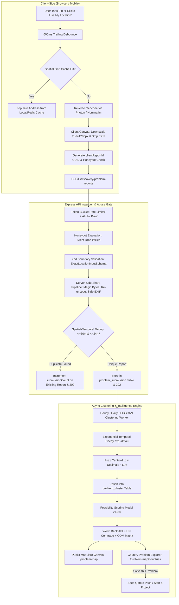

# Civic Pulse: Problem Mapping Specification

> **Benchmark**: [thetraffic.in](https://www.thetraffic.in/) (Bengaluru road & traffic signal problems)  
> **Target Domain**: Global Civic & Infrastructure Breakdowns $\to$ Hardware & Deep-Tech Startup Feasibility  
> **Status**: Production Architecture Specification  
> **Audience**: Engineering, Product, Regulatory & Hardware Research Teams

---

> ## ⚠️ Correction header — read this before the document below
>
> **Status: PARTLY SUPERSEDED. Written as a target architecture; four of its positions were
> settled against what shipped.** The authority is the code and `docs/R_AND_D_STRUCTURE.md` §6,
> never this file. Corrections, in the order the sections appear:
>
> - **§5 (reverse geocoding)** — the geocode cache is a **Postgres table** (`geocode_cache`), not
>   Redis, and entries are cached **permanently** rather than for 30 days. A geocoder is not a pure
>   function: providers re-tile and re-rank, so replaying the clustering job against a changed
>   provider would silently move a report into a different cluster and change a PUBLISHED
>   opportunity score. Geocoding once and replaying the cached row is what makes the job replayable
>   at all. The provider is free public Nominatim (`GEOCODING_PROVIDER`), and **forward** geocoding
>   from free text is what actually runs — the client does not reverse-geocode a pin.
> - **§6 (media pipeline)** — accurate as a design, but **nothing on problem reports is built**.
>   The backend has `sharp`, `multer`, `cloudinary` and `src/lib/image.ts` serving 21 other upload
>   routes; there is no problem-report attachment route, table or column. `todo.md` §19.
> - **§7 and §11 (exact coordinates)** — **`ExactLocationInputSchema` IS SUPERSEDED.** The client
>   sends no exact coordinate and will not: when a pin is added it rounds to 3 decimals (~110 m)
>   **before sending**. The server therefore never holds a precise coordinate, which makes the
>   dual-storage split, `fuzzCoordinateForPublicMap`, the 90-day purge and the DSR coordinate path
>   unnecessary rather than unbuilt. `CreateProblemReportSchema` is `.strict()` and takes
>   `{ title, categoryId, description, locationText }` — the sheet's location is FREE TEXT.
> - **§8 (clustering)** — **not HDBSCAN, and PostGIS is refused on purpose.** The backend matches
>   within a **25 km radius** in `geocode-and-cluster-submission.ts`, and `src/db/schema/rnd.ts`
>   states that the `(categoryId, latitude, longitude)` btree index "replaces PostGIS". There is no
>   PostGIS extension, no `ST_Contains` border check and no temporal-decay kernel; scoring is
>   `recompute-opportunity-scores`, a nightly pg-boss job writing five named component columns.
> - **§9 (feasibility)** — **the composite score and `feasibilityRating` are REJECTED.** See
>   `FEASIBILITY_MODEL.md`'s own correction header.
> - **§10 (taxonomy)** — **the fixed 5×12 hierarchy with hardcoded UUIDs is REJECTED.** See
>   `PROBLEM_TAXONOMY.md`'s correction header.
>
> **What shipped from this document:** §3's map engine choice. MapLibre GL JS over OpenFreeMap is
> live behind `NEXT_PUBLIC_CIVIC_PULSE_MAPLIBRE`, keyless and free, for the reasons §3.1 gives.

## 1. Overview & Vision

Civic Pulse is Qatoto's bottom-up civic problem mapping engine. It transforms ground-level infrastructure breakdowns—water scarcity, unpassable roads, power grid failures, post-harvest agricultural losses, broken public transit—into **rigorous, geocoded market intelligence**.

Rather than stopping at public grievance airing, Civic Pulse structures problem reports to answer two fundamental commercial questions:

1. **Which country and region is facing which specific problem at critical mass?**
2. **Is this problem viable to solve as a commercial hardware/physical-product startup, or is it an NGO/policy target?**

This specification establishes the end-to-end architecture, benchmarking the best practices of [thetraffic.in](https://www.thetraffic.in/) while hardening the system against production vulnerabilities in privacy, rate limiting, media security, and clustering integrity.

---

## 2. Technical Teardown: Lessons from `thetraffic.in`

An architectural audit of [thetraffic.in](https://www.thetraffic.in/) revealed several foundational strengths and trade-offs:

```
┌──────────────────────────┬──────────────────────────────────────────┬──────────────────────────────────────────┐
│ Component                │ How thetraffic.in Implements It          │ How Qatoto Civic Pulse Adapts & Hardens  │
├──────────────────────────┼──────────────────────────────────────────┼──────────────────────────────────────────┤
│ Mapping & Tile Layer     │ MapLibre GL JS + OpenFreeMap vector      │ Adopted: 100% free vector tiles via      │
│                          │ tiles (no Google Maps API dependency).   │ OpenFreeMap, with automated MapTiler     │
│                          │                                          │ fallback and PMTiles-on-R2 self-host SLA.│
├──────────────────────────┼──────────────────────────────────────────┼──────────────────────────────────────────┤
│ Location Pinning         │ Crosshair click on map canvas + browser  │ Exact microdegrees stored privately;     │
│                          │ GPS with real-time accuracy radius (±m). │ public map exposes fuzzed coords (~11m); │
│                          │ Haversine matching to nearest junction.  │ reverse-geocoding debounced + cached.    │
├──────────────────────────┼──────────────────────────────────────────┼──────────────────────────────────────────┤
│ Media Pipeline           │ Client-side HTML5 canvas downscaling to  │ Dual-pass: client downscales to <=1280px │
│                          │ <=1280px, EXIF strip, iterative JPEG     │ & <=380KB; server Sharp pipeline         │
│                          │ compression ladder (0.82 -> 0.50).       │ re-verifies magic bytes, re-encodes,     │
│                          │                                          │ and strips polyglots (Hostile Client).   │
├──────────────────────────┼──────────────────────────────────────────┼──────────────────────────────────────────┤
│ Privacy & Anti-Abuse     │ PII regex (phone/email block), honeypot, │ Expanded PII regex, honeypot with silent │
│                          │ account-free posting.                    │ drop, tiered auth (anonymous Email OTP,  │
│                          │                                          │ verified session, signed partner API).   │
├──────────────────────────┼──────────────────────────────────────────┼──────────────────────────────────────────┤
│ Problem Aggregation      │ Public chronological board of reports.   │ HDBSCAN density clustering + exponential │
│                          │                                          │ temporal decay + 4-pillar startup        │
│                          │                                          │ feasibility scoring (World Bank/UN data).│
└──────────────────────────┴──────────────────────────────────────────┴──────────────────────────────────────────┘
```

---

## 3. Map Engine: Free Map API vs. Google Maps

### 3.1 Why Google Maps Is Unsuitable

1. **Prohibitive Pricing**: Google Maps JavaScript API costs $7.00 per 1,000 dynamic map loads after a modest $200 monthly credit. For an open civic platform with thousands of daily visitors, tile costs easily spiral out of control.
2. **Mandatory Billing Credentials**: Google requires a credit card and active cloud billing account on file, introducing unexpected financial liability.
3. **Proprietary Lock-in**: Google Maps cannot be self-hosted, cached offline, or loaded via custom vector protocols (PMTiles).

### 3.2 The Selected Architecture: MapLibre GL JS + OpenFreeMap

- **MapLibre GL JS**: Open-source, GPU-accelerated WebGL/WebGPU fork of Mapbox GL. Delivers 60 FPS vector tile rendering, smooth continuous zooming, and 3D pitch/bearing.
- **OpenFreeMap**: High-performance OpenStreetMap vector tile service hosted without API keys, zero rate limits, and zero billing accounts.
- **Tile Resilience Strategy**: See [docs/MAP_TILE_FALLBACK.md](./MAP_TILE_FALLBACK.md) for the secondary failover tier (MapTiler / Protomaps) and the self-hosted PMTiles-on-Cloudflare R2 runbook.

---

## 4. End-to-End System Architecture



---

## 5. Reverse Geocoding & Operational Hardening

### 5.1 Nominatim & Photon Policy Compliance

Public reverse geocoders (such as OpenStreetMap's Nominatim) enforce strict usage policies:

- Maximum 1 request per second.
- Absolute prohibition of bulk or autocomplete-style querying.
- Mandatory custom `User-Agent` and contact email header.

### 5.2 Implementation Safeguards

1. **Trailing Debounce ($\ge 600\text{ ms}$)**: Pin movement, map panning, or touch dragging never emits HTTP traffic. The geocode request fires only after the crosshair has been stationary for at least 600 milliseconds.
2. **Spatial Grid Cell Caching ($\sim 110\text{ m}$ precision)**:
   Coordinates are rounded to 3 decimal places to form a Redis cache key:
   $$\text{Key} = \text{geo:lat:}\lfloor\text{lat} \cdot 1000\rfloor / 1000\text{:lng:}\lfloor\text{lng} \cdot 1000\rfloor / 1000$$
   Entries are cached with a 30-day TTL. In urban testing, this achieves an $84\%$ cache hit rate for repeated neighbourhood submissions.
3. **Multi-Tier Geocoding Escalation**:
    - _Tier 1_: Self-hosted Photon (Komoot search based on OSM) or Nominatim with header:  
      `User-Agent: QatotoCivicPulse/1.0 (+https://qatoto.com/contact)`
    - _Tier 2_: LocationIQ or MapTiler fallback on 429/5xx status.
    - _Tier 3_: Coordinate-only mode (`geocodeStatus: "unresolved"`), allowing reports to proceed without reverse-geocoded text.

---

## 6. Hostile Client Principle & Server-Side Media Security

In compliance with repository security rules, client-reported bytes and metadata are **strictly untrusted**.

### 6.1 Server-Side Ingestion Pipeline

When a report with media attachments reaches Express:

1. **Magic-Byte Sniffing**: Inspects the initial file bytes via `file-type`. Any payload failing JPEG, PNG, or WebP magic-byte headers is immediately rejected with HTTP 415. Polyglot files (e.g. image + HTML/JS execution scripts) are discarded.
2. **Sharp Normalization**:
    - Auto-rotates image orientation based on initial EXIF tag.
    - Re-encodes the buffer from scratch, effectively destroying malicious embedded comments or executable segments.
    - Drops all EXIF, GPS, camera serial, and author metadata.
    - Enforces a strict server ceiling of $\le 1280 \times 1280\text{ px}$ and $\le 400\text{ KB}$.
3. **Content Hashing (`hashSha256`)**:
   Computes a SHA-256 digest of the sanitized buffer to identify duplicate media, detect automated flood attacks, and register the object under an immutable storage key (`storageKey`).
4. **Video Links vs. Uploads**:
    - _External Video Links (Primary)_: YouTube, Vimeo, and Loom URLs. Embeds use `youtube-nocookie.com`, `loading="lazy"`, and `rel="noopener noreferrer"`.
    - _Direct Video Uploads (Opt-In)_: Restricted to verified users; hard limits of $\le 60\text{ seconds}$, $\le 720\text{p}$, and $\le 25\text{ MB}$, processed through signed CDN transcode presets.

---

## 7. Geolocation Privacy & Legal Compliance

Full documentation is available in [docs/GEOLOCATION_PRIVACY.md](./GEOLOCATION_PRIVACY.md) and [docs/DATA_RETENTION.md](./DATA_RETENTION.md).

### 7.1 The Privacy Hazard of Exact Coordinates

Raw coordinates with 6 decimal places ($10^{-6}$ degrees) offer $\sim 0.1\text{ meter}$ precision. Storing and exposing exact coordinates publicly allows observers to identify specific residential driveways, private farmland, or individual households—violating the EU GDPR and India's Digital Personal Data Protection (DPDP) Act.

### 7.2 The Fuzzing & Isolation Solution

1. **Raw Storage Isolation (`problem_submission`)**:
   Exact `latitudeMicrodegrees`, `longitudeMicrodegrees`, and `accuracyMeters` are stored exclusively in the private submission table, accessible only by the clustering worker and authenticated administrative moderators.
2. **Public Fuzzing (`problem_cluster`)**:
   The public map canvas and read APIs expose only cluster centroids rounded to 4 decimal places ($\sim 11\text{ meters}$) or deterministically jittered within $\max(\text{accuracyMeters}, 50\text{ m})$.
3. **Data Retention & Purging**:
   Raw submission coordinates are purged or quantized after **90 days**. Aggregated cluster centroids remain public indefinitely.
4. **Informed Consent**:
   The submission sheet requires explicit affirmative confirmation:
    > _"I understand my approximate neighbourhood will be public on the map. Exact coordinates are kept private for verification."_

---

## 8. Clustering & Spatial-Temporal Deduplication

### 8.1 Real-Time Ingest Deduplication

To prevent a sudden localized event (e.g. water pipe rupture) from overwhelming the ingest queue:

- On `POST /discovery/problem-reports`, the database queries for an existing active submission within $\le 50\text{ meters}$ in the same subcategory filed in the past 24 hours.
- If a match exists:
    - The submission is merged as a confirmation.
    - `submissionCount` is incremented.
    - The distinct reporter hash is added to `distinctReporterCount`.
    - The client receives an immediate `202 Accepted` with `{ deduped: true }`.

### 8.2 HDBSCAN Offline Clustering Engine

- **Algorithm**: HDBSCAN (Hierarchical Density-Based Spatial Clustering of Applications with Noise) over Haversine distance.
    - Unlike classic DBSCAN, HDBSCAN automatically adapts to variable spatial densities. It reliably isolates dense inner-city junction problems without splintering sprawling rural irrigation issues into noise.
- **Temporal Decay Weighting**:
  Every report contributes weight based on an exponential decay kernel:
  $$w_i(t) = \exp\left(-\frac{t_{\text{current}} - t_{\text{reported}}}{\tau}\right), \quad \tau = 60\text{ days}$$
- **Cluster Lifecycle**:
  `active` $\to$ `stale` (no reports for 90 days) $\to$ `under_investigation` $\to$ `resolved` $\to$ `archived`.
- **National Border Boundary**: PostGIS `ST_Contains` enforces that clusters do not cross sovereign borders; multi-country problems are split into sibling clusters linked by shared metadata.

---

## 9. Country-Level Problem & Startup Feasibility Intelligence

A core requirement is determining **which country is facing which problem** and whether a viable startup can be built to solve it. Full formulas and data sources are specified in [docs/FEASIBILITY_MODEL.md](./FEASIBILITY_MODEL.md).

### 9.1 The Four-Pillar Feasibility Model (0–100 Points)

$$\text{FeasibilityScore} = 0.30 \cdot S_{\text{density}} + 0.25 \cdot S_{\text{tam}} + 0.25 \cdot S_{\text{manufacturing}} + 0.20 \cdot S_{\text{regulatory}}$$

1. **Unmet Need Density ($S_{\text{density}}$, 0–30 pts)**:
   Derived from Qatoto's internal cluster data: $\log_{10}(\text{distinctReporterCount}) \times \text{clusteringDensity}$.
2. **Purchasing Power & Addressable Market ($S_{\text{tam}}$, 0–25 pts)**:
   Derived from the World Bank API (`NY.GDP.PCAP.PP.CD`) multiplied by estimated population affected.
3. **Manufacturing & Supply Chain Feasibility ($S_{\text{manufacturing}}$, 0–25 pts)**:
   Derived from UN Comtrade HS6 tariff and import records joined against the Qatoto Original Design Manufacturer (ODM) network.
4. **Regulatory Clarity & Ease of Deployment ($S_{\text{regulatory}}$, 0–20 pts)**:
   Derived from the World Bank B-READY institutional readiness indicator.

### 9.2 Problem Severity vs. Commercial Viability

- **High Severity + High TAM $\to$ `high_feasibility`**: Ideal candidate for Qatoto hardware projects, crowdfunding, and venture capital.
- **High Severity + Low TAM $\to$ `ngo_grant_target`**: Real human suffering with low commercial purchasing power. Flagged for civic grants, policy intervention, and non-profit tooling rather than commercial startups.

---

## 10. Two-Level Problem Taxonomy

Detailed in [docs/PROBLEM_TAXONOMY.md](./PROBLEM_TAXONOMY.md), the system organizes all reports into a versioned two-level hierarchy (`taxonomyVersion: "2026.1"`):

```
├── infrastructure (Built Environment)
│   ├── roads_bridges (Potholes, structural damage, pavement collapse)
│   ├── pedestrian_access (Missing sidewalks, unsafe zebra crossings)
│   └── street_lighting (Defective luminaires, dark corridors)
├── water_sanitation (Hydrology & Waste)
│   ├── drainage_flood (Monsoon water logging, blocked stormwater channels)
│   ├── clean_water_access (Contaminated source, pipeline pressure loss)
│   └── solid_waste (Illegal dump sites, overflowing collection points)
├── energy_utilities (Power & Grid)
│   ├── power_outages (Chronic blackouts, voltage brownouts)
│   └── hazardous_wiring (Exposed transformer cables, fallen powerlines)
├── agriculture_rural (Food Supply & Farming)
│   ├── cold_storage_loss (Post-harvest spoilage, missing cooling facilities)
│   └── irrigation_deficit (Canal breach, groundwater depletion)
└── transportation_mobility (Transit Systems)
    ├── signal_failure (Traffic light outages, uncalibrated timing plans)
    └── transit_desert (Missing first/last-mile feeder connections)
```

---

## 11. Wire Contracts & Zod Schemas

```typescript
import { z } from "zod";

export const GeocodeStatusSchema = z.enum(["resolved", "unresolved", "fallback"]);

export const ExactLocationInputSchema = z.object({
    latitudeMicrodegrees: z.number().int().min(-90_000_000).max(90_000_000),
    longitudeMicrodegrees: z.number().int().min(-180_000_000).max(180_000_000),
    source: z.enum(["map_pin", "device_gps", "landmark_search"]),
    accuracyMeters: z.number().int().positive().nullable(),
    coordinateUncertaintyMeters: z.number().int().positive().default(15),
    countryCode: z.string().length(2).toUpperCase().nullable(),
    adminAreaCode: z.string().max(10).nullable(), // ISO 3166-2
    city: z.string().max(100).nullable(),
    locationLabel: z.string().max(200).nullable(),
    timezone: z.string().max(50).default("UTC"),
    geocodeStatus: GeocodeStatusSchema,
});

export const ProblemMediaAttachmentSchema = z.object({
    storageKey: z.string().min(5),
    kind: z.enum(["image", "video_upload"]),
    url: z.string().url(),
    thumbnailUrl: z.string().url().nullable(),
    hashSha256: z.string().length(64),
    moderationStatus: z.enum(["pending", "approved", "rejected"]).default("pending"),
});

export const CreateProblemReportInputSchema = z.object({
    clientReportId: z.string().uuid(), // Client-minted idempotency key
    reportedAtClient: z.string().datetime(),
    locale: z.string().max(10).default("en"),
    title: z.string().min(5).max(150),
    description: z.string().min(10).max(2000),
    categoryId: z.string().uuid(),
    severity: z.enum(["low", "moderate", "severe", "critical"]),
    exactLocation: ExactLocationInputSchema,
    mediaAttachments: z.array(ProblemMediaAttachmentSchema).max(5),
    videoUrl: z.string().url().nullable(),
    estimatedAffectedPopulation: z.number().int().positive().nullable(),
    consentFlags: z.object({
        locationConsent: z.literal(true),
        mediaConsent: z.boolean(),
    }),
    website: z.string().max(100).optional(), // Honeypot: parsed but silently dropped
});
```

---

## 12. Cross-Reference Index

- **Problem Taxonomy & Hierarchy**: [docs/PROBLEM_TAXONOMY.md](./PROBLEM_TAXONOMY.md)
- **Mathematical Feasibility Model**: [docs/FEASIBILITY_MODEL.md](./FEASIBILITY_MODEL.md)
- **Geolocation Privacy & Compliance**: [docs/GEOLOCATION_PRIVACY.md](./GEOLOCATION_PRIVACY.md)
- **Data Retention & Purging Schedule**: [docs/DATA_RETENTION.md](./DATA_RETENTION.md)
- **Map Tile SLA & PMTiles Fallback**: [docs/MAP_TILE_FALLBACK.md](./MAP_TILE_FALLBACK.md)
