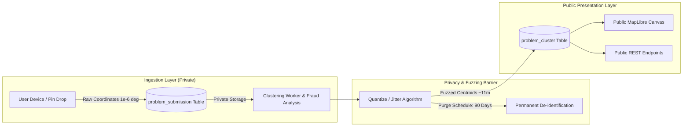

# Civic Pulse: Geolocation Privacy, Fuzzing & Compliance Specification

> **Specification**: `docs/GEOLOCATION_PRIVACY.md`  
> **Regulatory Frameworks**: EU General Data Protection Regulation (GDPR) & India Digital Personal Data Protection (DPDP) Act  
> **Schema Authority**: `ExactLocationInputSchema` in `src/lib/rnd/discovery.schemas.ts`  
> **Parent Document**: [docs/CIVIC_PULSE_PROBLEM_MAPPING.md](./CIVIC_PULSE_PROBLEM_MAPPING.md)

---

> ## ⚠️ Correction header — read this before the document below
>
> **Status: THE HAZARD IS REAL. THE MITIGATION IS NOT THE ONE BELOW — THE PROBLEM IS REMOVED
> INSTEAD OF MANAGED.**
>
> §1's analysis stands: a 6-decimal coordinate is ~0.11 m and is PII under GDPR and the DPDP Act.
> The answer here is not to collect it, rather than to collect it and defend it.
>
> - ⚠️ **§2's DUAL-STORAGE ARCHITECTURE IS NOT BUILT AND IS NOT PLANNED.** `problem_submission`
>   holds no client-supplied coordinate at all: `CreateProblemReportSchema` is `.strict()` and
>   takes free-text `locationText`, which the **server** forward-geocodes. There is no
>   `exactLatitudeMicrodegrees`, no `accuracyMeters` and no `reporterIpHash` column. When a map pin
>   is added, the client will round to 3 decimals (~110 m) **before sending**.
> - ⚠️ **§3's `fuzzCoordinateForPublicMap` IS SUPERSEDED**, and note it is also wrong as written:
>   it computes `latJitter` and applies it to latitude only, returning `fuzzedLng` unjittered —
>   the longitude line is missing. It is not a function to port.
> - ⚠️ **§6's `POST /api/privacy/data-request` IS NOT A ROUTE AND MUST NOT BECOME ONE AT THAT
>   PATH.** CLAUDE.md forbids Next.js API routes for business logic; privacy requests belong to the
>   Express backend, which already has a privacy module. A coordinate-erasure path is moot anyway:
>   there is no exact coordinate to erase.
> - ✅ **WHAT SURVIVES AND SHOULD BE BUILT:** §4's consent copy and media advisory (reworded — no
>   90-day promise to make), and §5's PII screen, as **UX feedback only**. CLAUDE.md is explicit
>   that a client-side check "exists only for fast UX feedback" and that the server must
>   re-validate; a regex in the browser is trivially bypassed by anyone who opens devtools.

## 1. Regulatory Context: Why Coordinates Are PII

Under both the European Union GDPR (Recital 26, Article 4(1)) and India's Digital Personal Data Protection (DPDP) Act, geolocation data that can be linked to an identifiable living individual constitutes **Personally Identifiable Information (PII)**.

### The Re-Identification Threat

- A high-accuracy GPS point recorded at 6 decimal places ($10^{-6}$ degrees) represents a spatial precision of approximately **$0.11\text{ meters}$ (11 centimeters)**.
- When a citizen reports a pothole, broken water pipe, or blacked-out transformer directly in front of their home, exposing that point publicly links their identity, residency, and personal habits directly to the open web.
- Combined with a timestamp and a photograph, an attacker can pinpoint a specific residence, property boundaries, or vehicle parking habits.

Therefore, **high-precision coordinates must never be published directly to public map layers, public feeds, or unauthenticated APIs.**

---

## 2. The Dual-Storage Architecture

Qatoto enforces a strict separation between **Ingest Verification Storage** and **Public Map Presentation**:



### 2.1 Private Ingestion Table (`problem_submission`)

- **Access Level**: Private, restricted to backend clustering jobs and security/anti-abuse engineers.
- **Stored Fields**:
    - `exactLatitudeMicrodegrees`: Integer degrees $\times 10^6$.
    - `exactLongitudeMicrodegrees`: Integer degrees $\times 10^6$.
    - `accuracyMeters`: Hardware-reported GPS uncertainty radius (e.g. $\pm 12\text{ m}$).
    - `reporterIpHash`: Salted SHA-256 hash for sybil detection.
- **Purpose**: Allows HDBSCAN density clustering and spatial-temporal deduplication to operate with mathematical accuracy without compromising reporter identity.

### 2.2 Public Presentation Table (`problem_cluster`)

- **Access Level**: Fully public, accessible by anonymous visitors, search indexers, and open-data researchers.
- **Stored Fields**:
    - `centroidLatitudeMicrodegrees`: Quantized to 4 decimal places ($\sim 11\text{ meters}$) or jittered.
    - `centroidLongitudeMicrodegrees`: Quantized to 4 decimal places.
    - `locationLabel`: Formatted neighbourhood/city label (e.g. _"Indiranagar, Bengaluru"_ or _"Kibera, Nairobi"_), never residential door numbers.

---

## 3. Coordinate Fuzzing & Jittering Algorithm

When calculating public cluster centroids from individual submissions, the backend applies deterministic spatial fuzzing:

```typescript
/**
 * Quantizes and jitters exact coordinates for public consumption.
 * Ensures the public pin cannot pinpoint an individual private driveway.
 */
export function fuzzCoordinateForPublicMap(
    latitude: number,
    longitude: number,
    accuracyMeters: number | null,
): { fuzzedLat: number; fuzzedLng: number } {
    // 1. Enforce minimum uncertainty radius (never publish tighter than 50 meters)
    const effectiveUncertaintyMeters = Math.max(accuracyMeters ?? 50, 50);

    // 2. Compute 4-decimal place quantization (11.1 meters precision at equator)
    const quantizedLat = Number(latitude.toFixed(4));
    const quantizedLng = Number(longitude.toFixed(4));

    // 3. Apply deterministic pseudo-random jitter seeded by cluster coordinates
    // (Prevents reverse-triangulation across multiple zoom re-renders)
    const seed = Math.sin(quantizedLat * 1000 + quantizedLng) * 10000;
    const jitterFactor = seed - Math.floor(seed) - 0.5; // [-0.5, +0.5]

    // Degrees offset approximately equal to effectiveUncertaintyMeters / 2
    const metersToDegreesLat = 1 / 111_320;
    const latJitter = jitterFactor * (effectiveUncertaintyMeters / 2) * metersToDegreesLat;

    return {
        fuzzedLat: Number((quantizedLat + latJitter).toFixed(4)),
        fuzzedLng: quantizedLng,
    };
}
```

---

## 4. Informed Consent Copy & UI Disclosures

Before submitting a report, the frontend modal enforces explicit informed consent via affirmative checkboxes:

### Mandatory Checkbox

```markdown
[x] I understand that my approximate neighbourhood (within ~50 meters) will be
visible on the public map. My exact GPS coordinates are stored privately
by Qatoto solely for verification and will be purged in 90 days.
```

### Media Advisory Banner

```markdown
> ⚠️ Privacy Notice: Before uploading, please ensure your photo does not contain
> visible faces, vehicle license plates, house door numbers, or private documents.
> Qatoto strips all EXIF and GPS metadata from the image file automatically,
> but visible pixels are not blurred.
```

---

## 5. Anti-Doxxing Regex Sanitizer

To prevent users from inadvertently posting personal identifying information in the public problem description, the client and server execute an automated PII screen:

```typescript
// Detects standard and formatted international phone numbers (10+ digits)
const PHONE_NUMBER_REGEX = /(?:\+?\d[\s\-.()]*){10,}/;

// Detects standard email addresses
const EMAIL_REGEX = /[A-Za-z0-9._%+-]+@[A-Za-z0-9-]+(?:\.[A-Za-z0-9-]+)*\.[A-Za-z]{2,}/;

// Detects obfuscated contact patterns (e.g. "name [at] domain [dot] com")
const OBFUSCATED_CONTACT_REGEX = /(?:\[at\]|\bat\b)\s*\w+\s*(?:\[dot\]|\bdot\b)/i;

export function validateTextForPII(text: string): { isSafe: boolean; reason?: string } {
    if (PHONE_NUMBER_REGEX.test(text)) {
        return {
            isSafe: false,
            reason: "Please remove phone numbers. Civic Pulse is a public board.",
        };
    }
    if (EMAIL_REGEX.test(text) || OBFUSCATED_CONTACT_REGEX.test(text)) {
        return { isSafe: false, reason: "Please remove email addresses to protect your privacy." };
    }
    return { isSafe: true };
}
```

---

## 6. Data Subject Requests (DSR) & Right to Erasure

In compliance with GDPR Article 17 and DPDP Section 12:

### The DSR Endpoint: `POST /api/privacy/data-request`

- **Supported Actions**:
    1. `export`: Provides a JSON dump of all submissions, timestamps, and upload hashes linked to the authenticated user.
    2. `delete`: Instantly deletes all private raw submission coordinates and associated media.
- **Cluster Continuity**:
  When a user exercises their right to erasure, their individual raw submission is deleted, but the aggregate mathematical cluster retains its count increment (`distinctReporterCount`) as anonymized historical telemetry, in accordance with GDPR Recital 26.
