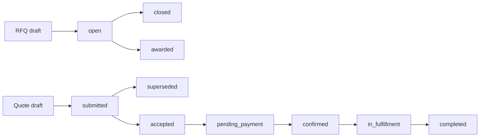

# STORE_BACKEND_STRUCTURE.md — B2B Store, Procurement, and Trade Services

> This document specifies the **buyer-facing store and commerce backend** for Qatoto:
> public catalog discovery, company storefronts, requests for quotation, quote negotiation,
> purchase orders, payment orchestration, fulfillment, and independently selectable trade-service
> providers.
>
> The backend repository is `/Users/vinitchuri/code/backend/qatoto-backend`.
>
> **Read alongside:**
>
> - [STORE_STRUCTURE.md](STORE_STRUCTURE.md) — the frontend route, component, and integration plan.
> - [STUDIO_PRODUCTS_BACKEND_STRUCTURE.md](STUDIO_PRODUCTS_BACKEND_STRUCTURE.md) — the shipped
>   seller-owned `/products/*` CRUD, images, B2B tiers, publish, and unpublish contract.
> - [STUDIO_PRODUCTS_STRUCTURE.md](STUDIO_PRODUCTS_STRUCTURE.md) — the shipped seller listing UI.
> - [R_AND_D_BACKEND_STRUCTURE.md](R_AND_D_BACKEND_STRUCTURE.md) — the separate R&D supplier
>   directory and project-engagement domain.
> - [ESCROW_LEDGER_STRUCTURE.md](ESCROW_LEDGER_STRUCTURE.md) — the existing project-funding ledger;
>   commerce may reuse its accounting patterns, not its project-scoped rows.
> - [CLAUDE.md](CLAUDE.md) — thin-client trust boundary and wire-casing rules.
>
> **Goal:** provide an Alibaba-style B2B market where an organization can discover and buy a
> product, request negotiated pricing, and separately engage freight forwarders, air/sea/land
> logistics operators, customs brokers, insurance providers, inspection agencies, testing and
> certification laboratories, marketing agencies, warehouse providers, and foreign-exchange
> facilitators.
>
> **Stack:** Express 5 + TypeScript strict + Drizzle ORM + PostgreSQL + Zod + Better Auth +
> Cloudinary/object storage + pg-boss + the existing provider-adapter and rate-limit patterns.
>
> **Status:** **planned.** Seller product CRUD is shipped. Buyer `/store`, commerce organizations,
> provider offerings, RFQs, orders, and trade-service workflows described here are not shipped
> unless a section explicitly says otherwise.

---

## 0. The rule that governs the store

**The frontend is hostile. The Express backend is the only authority.**

The client may display a price, quantity, verification badge, delivery estimate, insurance limit,
exchange rate, tax estimate, or order status. It may never establish any of them.

- Identity comes from the authenticated session. Organization membership and role are loaded on
  every protected action; `buyerOrganizationId`, `sellerOrganizationId`, and `providerOrganizationId`
  are never trusted merely because they appear in a body.
- Public catalog reads expose only active products whose owning organization is allowed to trade.
  A direct request for a draft, suspended, or deleted listing returns `404`.
- Price tiers, stock, quote totals, taxes, fees, payment amounts, exchange rates, and refunds are
  reloaded or recomputed in the same transaction that performs the state transition.
- Accepting a quote snapshots commercial terms. Later edits to a product, service offering, company
  profile, or tax rule cannot rewrite an accepted order.
- Provider verification is server-owned. Uploading a certificate creates evidence awaiting review;
  it never grants a badge.
- A browse-country preference is display-only. Compliance, tax, sanctions, export control, and
  availability decisions use server-derived and verified facts.
- Every mutation is authorized for the exact organization and resource. A valid account is not
  automatically a buyer, seller, provider, or moderator.
- Expensive or replayable writes use an idempotency key minted once per user attempt. Duplicate
  requests return the original result.
- Payment-provider, carrier, laboratory, insurer, and FX webhooks are authenticated, deduplicated,
  persisted before processing, and applied by workers.
- Expected failures are `Result<T, E>` values. Controllers exhaustively map them to HTTP responses.

If a rule must remain true after DevTools changes or request replay, it belongs in this backend.

---

## 1. Scope and bounded contexts

### 1.1 What this domain owns

| Context             | Owns                                                                           |
| ------------------- | ------------------------------------------------------------------------------ |
| Commerce identity   | Organizations, memberships, trade roles, addresses, verification evidence      |
| Public catalog      | Active product projections, categories, search, facets, storefronts            |
| Merchandising       | Hero slides, curated pathways, rails, placements                               |
| Service marketplace | Provider profiles, capabilities, service offerings, coverage, credentials      |
| Sourcing            | RFQs, invitations, requirement lines, quote revisions, negotiation             |
| Purchasing          | Carts, checkout groups, purchase orders, immutable commercial snapshots        |
| Payments            | Commerce payment intents, provider adapter references, refunds, reconciliation |
| Fulfillment         | Product shipments and connector engagements                                    |
| Trust               | Trade-assurance cases, disputes, reviews, Q&A, reports, moderation             |
| Communication       | Resource-scoped threads, participants, messages, attachment metadata           |

### 1.2 What this domain does not own

- Seller listing authoring remains under `/products/*`.
- The R&D `/suppliers/*` directory remains a project go-to-market domain. Its supplier quotes and
  engagements do not become store orders.
- R&D compensation records are attestations about payment elsewhere. They are not checkout.
- The project-funding ledger remains project-scoped. Commerce uses a separate journal namespace or
  separate commerce ledger tables, even if it reuses accounting code and provider adapters.
- Product research, proof of effort, equity, and programme contribution do not affect store price,
  provider verification, or order entitlement.

### 1.3 One organization may participate in several roles

One `commerce_organization` may be a buyer, product seller, and one or more provider kinds. Roles
do not imply one another. A freight forwarder can buy office equipment without becoming a verified
seller; a manufacturer can sell products without being approved to broker customs.

The existing R&D `supplier` row may optionally link to a commerce organization after moderator
review. The link avoids duplicate company identity but imports **no trust state, quote, price, or
project engagement**.

---

## 2. Core architecture decisions

### 2.1 Products and services are not one polymorphic listing

Products have inventory, images, variants, and quantity tiers. Services have coverage, eligibility,
capacity, evidence, and quote-specific requirements. A single nullable `listing` table would allow
invalid combinations such as stock on an insurance policy or warehouse capacity on a chair.

Therefore:

- Existing `product` tables remain product-specific.
- `commerce_service_offering` stores the common provider-facing contract.
- Exactly one typed extension row describes each service offering.
- RFQs, quote revisions, and orders have separate product-line and service-line tables.
- Explicit link tables connect a service engagement to an order or shipment when applicable.

### 2.2 An accepted quote is immutable

Negotiation creates append-only `commerce_quote_revision` rows. Editing means creating the next
revision, never updating the previous one. Acceptance locks one revision and creates an order from
that snapshot in one transaction.

### 2.3 A checkout group is not a multi-party order

A buyer action may involve several counterparties. The backend creates:

- one `commerce_checkout_group` for buyer-facing coordination; and
- one `commerce_order` per seller/provider organization.

This prevents one late warehouse provider from blocking a manufacturer’s shipment and keeps
authorization, invoicing, refunds, and disputes attributable to one counterparty.

### 2.4 Search and ranking are backend work

Catalog filtering, faceting, ranking, recommendation candidate selection, and pagination run in
PostgreSQL/services. The frontend never downloads a page and pretends it searched the catalog.
Personalization may rerank eligible candidates, but sponsored placement is always labelled and
never bypasses eligibility or moderation filters.

---

## 3. Backend folder plan

```text
qatoto-backend/src/
├── db/
│   └── schema.ts
├── routes/
│   ├── store.routes.ts                    # public catalog, categories, merchandising
│   ├── commerce-organizations.routes.ts   # organization + membership management
│   ├── commerce-providers.routes.ts       # provider profiles and offerings
│   ├── commerce-rfqs.routes.ts            # buyer RFQs, invitations, quote reads
│   ├── commerce-quotes.routes.ts          # provider revisions + buyer acceptance
│   ├── commerce-cart.routes.ts
│   ├── commerce-orders.routes.ts
│   ├── commerce-payments.routes.ts
│   ├── commerce-fulfillment.routes.ts
│   ├── commerce-messages.routes.ts
│   └── commerce-trust.routes.ts
├── controllers/
│   └── <matching files>.controller.ts     # params/query/body Zod parse + HTTP mapping
├── services/
│   ├── store-catalog.service.ts
│   ├── store-search.service.ts
│   ├── commerce-organizations.service.ts
│   ├── commerce-providers.service.ts
│   ├── commerce-rfqs.service.ts
│   ├── commerce-quotes.service.ts
│   ├── commerce-checkout.service.ts
│   ├── commerce-orders.service.ts
│   ├── commerce-payments.service.ts
│   ├── commerce-fulfillment.service.ts
│   ├── commerce-messages.service.ts
│   └── commerce-trust.service.ts
├── adapters/
│   ├── commerce-payment-provider.adapter.ts
│   ├── logistics-provider.adapter.ts
│   ├── insurance-provider.adapter.ts
│   ├── laboratory-provider.adapter.ts
│   └── foreign-exchange-provider.adapter.ts
├── jobs/
│   ├── expire-commerce-quotes.ts
│   ├── release-expired-inventory-reservations.ts
│   ├── reconcile-commerce-payments.ts
│   ├── refresh-store-search-document.ts
│   └── dispatch-commerce-webhook-event.ts
└── app.ts                                  # mount /store and /commerce routers
```

Controllers do not contain domain decisions. Services do not inspect raw Express requests.
Adapters translate external provider protocols into internal tagged results.

---

## 4. Data model

All table names are snake_case; Drizzle property names are camelCase. IDs are opaque text values
generated with `randomUUID()`. Timestamps are UTC. Public slugs are kebab-case and immutable after
publication; changing a display name does not change a URL identity.

### 4.1 Commerce organizations

`commerce_organization`

- `id`, immutable `slug`, `legalName`, `displayName`, `summary`
- `organizationType`: `company | sole_proprietor | cooperative | government | nonprofit`
- `tradeState`: `pending | active | suspended | closed`
- `countryCode`, `registrationNumberEncrypted`, `taxIdentifierEncrypted`
- `logoUrl`, `websiteUrl`, `createdByUserId`, timestamps
- unique slug; normalized legal-name/country lookup; encrypted identifiers never appear publicly

`commerce_organization_member`

- `organizationId`, `userId`
- `role`: `owner | administrator | buyer | seller | provider_operator | finance | support | viewer`
- `state`: `invited | active | suspended | left`
- `invitedByUserId`, `joinedAt`, `leftAt`
- unique `(organizationId, userId)` for an active membership

`commerce_organization_address`

- organization-owned billing, registered, warehouse, pickup, and return addresses
- normalized country/region/locality/postal fields plus encrypted contact details
- buyer delivery addresses are private; public storefront locations use an explicit public projection

`commerce_organization_verification`

- `verificationKind`, `state`, evidence object key, reviewer, decision reason, timestamps
- evidence upload never modifies `tradeState` or provider badges directly

### 4.2 Migrating shipped products to organization ownership

The shipped `product.sellerId` points to a Better Auth user. Migration must not break Studio.

1. Add nullable `sellerOrganizationId` and `createdByUserId`.
2. Create one private seller organization for each existing seller and backfill active products.
3. Update `/products/*` authorization to require an active seller membership and derive the
   organization from the session/context. During transition, preserve owner-only behavior.
4. Make `sellerOrganizationId` non-null after backfill verification.
5. Retain `createdByUserId` for attribution. Remove or rename legacy `sellerId` only in a later
   migration after all callers use organization ownership.

No request body chooses arbitrary ownership. Organization switching uses a server-issued active
organization context and rechecks membership.

### 4.3 Category migration

The shipped `product_category` enum has eight seller categories. Buyer browse needs a hierarchy.

`commerce_category`

- `id`, immutable `slug`, `name`, `parentCategoryId`, `siblingOrder`
- `state`: `draft | active | retired`
- `imageUrl`, `searchSynonyms`, timestamps
- unique slug; unique sibling order per parent; no cycles (service check plus constraint trigger)

Migration:

1. Seed roots corresponding to the eight legacy enum values.
2. Add nullable `product.categoryId`, backfill from the enum, and dual-write temporarily.
3. Change Studio to submit `categoryId`; backend verifies an active leaf category.
4. Make `categoryId` non-null.
5. Retain the old enum only until old clients and migrations are retired.

Product enum values remain snake_case. Public category slugs remain kebab-case. These are separate
wire concepts and must not be converted into each other implicitly.

### 4.4 Public product extensions

The public catalog reuses `product`, `product_image`, and `product_pricing_tier`, adding only fields
that a buyer contract needs:

- `product.publicSlug`
- optional `product.modelNumber`, `countryOfOriginCode`, `unitOfMeasure`
- `product.samplePolicy`: `unavailable | paid | refundable`
- optional server-owned `samplePriceInCents`
- `product.leadTimeMinDays`, `leadTimeMaxDays`
- `product.moderationState`: `pending | approved | rejected | suspended`
- optional structured specification schema/value tables

An active seller status alone is insufficient for public visibility: product status, moderation,
organization trade state, and category state must all be eligible.

### 4.5 Provider profiles and offerings

`commerce_provider_profile`

- `organizationId` primary key
- public summary, support policy, response-time statistics
- `verificationState`: `unverified | documents_pending | verified | rejected | suspended`
- `acceptingRequests`, service-region summary, timestamps

`commerce_provider_kind`

- seeded values:
    - `freight_forwarder`
    - `logistics_operator`
    - `customs_broker`
    - `insurance_provider`
    - `inspection_agency`
    - `testing_certification_lab`
    - `marketing_agency`
    - `warehouse_provider`
    - `foreign_exchange_facilitator`

`commerce_provider_kind_link` is many-to-many because one verified organization may operate, for
example, freight forwarding and warehousing. Verification is recorded per kind, not globally.

`commerce_service_offering`

- `id`, immutable `slug`, `providerOrganizationId`, `providerKind`
- `title`, `summary`, `state`: `draft | pending_review | active | suspended | retired`
- `pricingModel`: `quote_only | fixed_fee | per_unit | subscription`
- optional public indicative price range in integer cents plus server-owned currency
- `minimumLeadTimeDays`, `maximumLeadTimeDays`
- timestamps and moderation attribution

`commerce_service_coverage`

- offering, origin/destination country or seeded region, optional port/airport/location identifiers
- capability flags are filter inputs, not proof that a provider may legally serve a route

Typed one-to-one extension tables:

- `freight_offering_detail`: supported `air | sea | land | rail | multimodal`, consolidation,
  container and hazardous-goods capabilities
- `customs_brokerage_offering_detail`: jurisdictions, import/export direction, commodity coverage
- `insurance_offering_detail`: cargo coverage classes, limit ranges, exclusions-document reference
- `inspection_offering_detail`: pre-production, during-production, pre-shipment, loading supervision
- `testing_certification_offering_detail`: standards, accreditation bodies, laboratory locations
- `marketing_offering_detail`: channels, target regions, language capabilities, engagement model
- `warehouse_offering_detail`: storage types, temperature control, bonded status, capacity units
- `foreign_exchange_offering_detail`: currency pairs, settlement rails, minimum/maximum notional

The service verifies exactly one extension row matches `providerKind`. No generic JSON blob decides
eligibility or pricing.

### 4.6 RFQs and invitations

`commerce_rfq`

- buyer organization, creator, title, description
- `state`: `draft | open | closed | awarded | cancelled | expired`
- response deadline, desired delivery window, destination, settlement currency
- visibility: `invited_only | matched_providers`
- timestamps

`commerce_rfq_product_line`

- product reference nullable when sourcing an unlisted product
- immutable requested title/specification snapshot, quantity, unit, target category

`commerce_rfq_service_line`

- provider kind, service offering optional, common requirement summary
- typed requirement extension table matching the provider kind
- may link to a product line without becoming its child lifecycle

`commerce_rfq_invitation`

- RFQ + provider organization, state, sent/read/responded timestamps
- unique `(rfqId, providerOrganizationId)`

Opening an RFQ validates buyer organization state, deadline, at least one valid line, document
ownership, and all required service-specific fields.

### 4.7 Quote revisions

`commerce_quote`

- RFQ, provider organization, status: `draft | submitted | superseded | accepted | declined |
withdrawn | expired`
- latest revision number, timestamps
- unique provider per RFQ unless the buyer explicitly re-invites after closure

`commerce_quote_revision`

- quote, monotonic revision number, currency, validity deadline
- subtotal, tax, service fee, shipping, discount, and total in integer cents
- payment terms, Incoterm when relevant, notes, createdByMemberId
- immutable after submission

`commerce_quote_product_line` and `commerce_quote_service_line`

- reference the matching RFQ line
- quantity and unit price/fee components
- immutable title, scope, lead time, exclusions, and deliverable snapshots
- typed service quote extensions for route legs, insurance coverage, test standards, storage
  capacity, marketing deliverables, and FX rate details

For FX, rates are fixed-point integers plus an explicit scale or canonical decimal strings parsed
by a decimal library on the backend. JavaScript/Postgres floating point is forbidden for money or
exchange rates.

### 4.8 Cart, reservations, checkout, and orders

`commerce_cart` belongs to one buyer organization. `commerce_cart_product_line` stores product,
quantity, and selected variant/options only. It does not store an authoritative total.

`commerce_inventory_reservation`

- product/variant, organization/cart, quantity, expiration, state
- created during checkout preparation using row locks
- released by worker on expiry; consumed atomically by order creation

`commerce_checkout_group`

- buyer organization, state, server-computed aggregate display totals, idempotency key

`commerce_order`

- checkout group nullable for quote-originated orders
- buyer and one counterparty organization
- source: `direct_checkout | accepted_quote`
- `state`: `pending_payment | payment_processing | confirmed | in_fulfillment |
partially_completed | completed | cancelled | disputed`
- immutable legal names, addresses, currency, totals, terms, and accepted quote revision

`commerce_order_product_line` and `commerce_order_service_line`

- immutable commercial snapshots
- product line has ordered, reserved, fulfilled, cancelled, and refunded quantities
- service line points to a separately stateful connector engagement

### 4.9 Payments and journal

Commerce does not post into project-funding rows. It introduces:

- `commerce_payment_intent`
- `commerce_provider_transfer`
- `commerce_refund`
- `commerce_journal_account`
- `commerce_journal_entry`
- `commerce_journal_line`

The journal is double-entry and append-only. Provider calls are made only after the local transfer
row and idempotency key are committed. Webhook receipt is stored before state transition.

Payment state:

`created → requires_action | processing → authorized → settled`

Terminal alternatives: `failed | cancelled | partially_refunded | refunded | disputed`.

“Trade assurance” copy is not enabled until the legal custody model, eligible payment method,
dispute rules, and journal postings are implemented. Qatoto must never claim funds are escrowed
merely because an order row exists.

### 4.10 Fulfillment and loose connector engagements

`commerce_service_engagement`

- accepted service quote/order line, provider organization, buyer organization
- `state`: `awaiting_provider | scheduled | in_progress | awaiting_buyer | completed |
cancelled | disputed`
- independent timestamps and deliverable acceptance

`commerce_order_service_link`

- explicitly links an engagement to an order, product line, or shipment
- absence is valid: a company may buy lab testing or marketing without buying a product on Qatoto

`commerce_shipment`

- one seller order, origin/destination snapshots, state, package totals

`commerce_shipment_leg`

- ordered legs with mode `air | sea | land | rail`
- optional freight/logistics engagement
- carrier references and tracking events are append-only

Customs, insurance, inspection, laboratory, warehouse, marketing, and FX each receive typed
engagement detail/deliverable tables. Completion of one never directly marks another complete.
An order coordinator derives aggregate progress for display.

### 4.11 Communication, trust, and moderation

Threads are resource-scoped: RFQ, quote, order, service engagement, or dispute. Participants are
derived from organization memberships. Attachment object keys are private and served through
short-lived authorized URLs.

Reviews require a completed order/engagement and are unique per reviewer organization/resource.
Provider metrics are backend aggregates over eligible records, never client submissions.

Reports and disputes preserve snapshots, messages, evidence, moderator actions, and an append-only
audit event. A seller/provider cannot review or resolve its own case.

---

## 5. Public Store API

Public reads use `attachOptionalUser`, strict query parsing, bounded limits, deterministic ordering,
and buyer-safe projections.

| Method | Route                                    | Purpose                                                               |
| ------ | ---------------------------------------- | --------------------------------------------------------------------- |
| GET    | `/store/home`                            | Curated hero, categories, pathways, provider shortcuts, product rails |
| GET    | `/store/categories`                      | Root or parent-scoped active categories                               |
| GET    | `/store/categories/:slug`                | Category metadata, children, facets, first result page                |
| GET    | `/store/search`                          | Product/provider search with server-side filters and cursor           |
| GET    | `/store/products/:productSlug`           | Public product detail, tiers, seller/storefront projection            |
| GET    | `/store/organizations/:organizationSlug` | Public company storefront                                             |
| GET    | `/store/providers`                       | Filterable provider directory                                         |
| GET    | `/store/providers/:organizationSlug`     | Public provider profile and active offerings                          |
| GET    | `/store/services/:offeringSlug`          | One active service offering                                           |
| GET    | `/store/pathways`                        | Curated pathway page                                                  |
| GET    | `/store/pathways/:pathwaySlug`           | Pathway with eligible item projections                                |
| GET    | `/store/rails/:railSlug`                 | Paginated curated/ranked feed                                         |

`category-slugs` and `pathway-slugs` mock endpoints are not durable public API requirements.
Dynamic routes should render on demand; build-time static parameter generation may use a bounded
featured-slug endpoint only if the deployment model requires it.

Example search:

```text
GET /store/search?query=solar+freezer&category=industrial-cooling
  &minOrderQuantityMax=50&sellerCountryCode=IN
  &providerKind=freight_forwarder&sort=relevance&limit=24&cursor=...
```

Query keys are camelCase. Enum values are snake_case. Category and product slugs are kebab-case.

### 5.1 Buyer-safe product projection

Public product detail includes:

- immutable ID and public slug
- title, brand, description, key features, category trail, specifications
- ordered public image URLs
- current currency and pricing tiers in integer cents
- stock state (`in_stock | low_stock | made_to_order | unavailable`), not private stock counts
- sample policy, lead-time range, MOQ, origin, moderation-safe seller projection
- server-derived review and fulfillment metrics

It excludes seller SKU internals when private, exact inventory, private contacts, draft fields,
organization member IDs, moderation notes, and storage object keys.

---

## 6. Authenticated Commerce API

### 6.1 Organizations and providers

| Method | Route                                                       | Result                                  |
| ------ | ----------------------------------------------------------- | --------------------------------------- |
| POST   | `/commerce/organizations`                                   | Create pending organization; idempotent |
| GET    | `/commerce/organizations/mine`                              | Membership-scoped organizations         |
| PATCH  | `/commerce/organizations/:organizationId`                   | Authorized profile update               |
| POST   | `/commerce/organizations/:organizationId/members`           | Invite member                           |
| PATCH  | `/commerce/organizations/:organizationId/members/:memberId` | Role/state update                       |
| POST   | `/commerce/providers/:organizationId/profile`               | Create provider profile                 |
| POST   | `/commerce/providers/:organizationId/offerings`             | Create draft offering                   |
| PATCH  | `/commerce/service-offerings/:offeringId`                   | Update owned draft                      |
| POST   | `/commerce/service-offerings/:offeringId/submit`            | Submit for moderation                   |
| POST   | `/commerce/providers/:organizationId/evidence`              | Upload verification evidence            |

Moderation routes live under the existing platform capability model and are not granted by an
organization role.

### 6.2 RFQs and quotes

| Method | Route                                                  | Result                               |
| ------ | ------------------------------------------------------ | ------------------------------------ |
| POST   | `/commerce/rfqs`                                       | Create buyer draft                   |
| GET    | `/commerce/rfqs/mine`                                  | Buyer organization RFQs              |
| GET    | `/commerce/rfqs/:rfqId`                                | Authorized RFQ projection            |
| PATCH  | `/commerce/rfqs/:rfqId`                                | Update owned draft                   |
| POST   | `/commerce/rfqs/:rfqId/open`                           | Validate and open                    |
| POST   | `/commerce/rfqs/:rfqId/invitations`                    | Invite eligible providers            |
| POST   | `/commerce/rfqs/:rfqId/close`                          | Close responses                      |
| GET    | `/commerce/provider/rfqs`                              | Invited/matched provider work queue  |
| POST   | `/commerce/rfqs/:rfqId/quotes`                         | Provider creates quote shell         |
| POST   | `/commerce/quotes/:quoteId/revisions`                  | Append draft revision                |
| POST   | `/commerce/quotes/:quoteId/revisions/:revision/submit` | Submit immutable revision            |
| POST   | `/commerce/quotes/:quoteId/accept`                     | Buyer accepts latest valid revision  |
| POST   | `/commerce/quotes/:quoteId/decline`                    | Buyer declines                       |
| POST   | `/commerce/quotes/:quoteId/withdraw`                   | Provider withdraws before acceptance |

Quote acceptance uses `If-Match`/version or expected revision in a strict body, locks the quote and
RFQ, validates expiry and authority, then creates order snapshots atomically.

### 6.3 Cart, checkout, orders, and payments

| Method | Route                                       | Result                                                    |
| ------ | ------------------------------------------- | --------------------------------------------------------- |
| GET    | `/commerce/cart`                            | Active organization cart with server-priced projection    |
| PUT    | `/commerce/cart/items/:productId`           | Set desired quantity                                      |
| DELETE | `/commerce/cart/items/:productId`           | Remove line                                               |
| POST   | `/commerce/checkout/prepare`                | Validate cart, reserve stock, return authoritative totals |
| POST   | `/commerce/checkout/confirm`                | Create checkout group and counterparty orders             |
| GET    | `/commerce/orders`                          | Buyer orders, cursor paginated                            |
| GET    | `/commerce/orders/:orderId`                 | Authorized order detail                                   |
| GET    | `/commerce/provider/orders`                 | Seller/provider work queue                                |
| POST   | `/commerce/orders/:orderId/cancel`          | Policy-checked cancellation                               |
| POST   | `/commerce/orders/:orderId/payment-intents` | Create/reuse payment intent                               |
| GET    | `/commerce/payments/:paymentIntentId`       | Poll payment state                                        |
| POST   | `/commerce/orders/:orderId/refunds`         | Authorized refund request                                 |

All create/confirm/payment/refund calls require `Idempotency-Key`. A `202` means processing has
started, not that payment, booking, testing, or settlement succeeded.

### 6.4 Fulfillment, messages, and trust

| Method | Route                                                     | Result                               |
| ------ | --------------------------------------------------------- | ------------------------------------ |
| POST   | `/commerce/orders/:orderId/shipments`                     | Seller creates shipment plan         |
| POST   | `/commerce/shipments/:shipmentId/events`                  | Authorized append-only event         |
| GET    | `/commerce/service-engagements`                           | Buyer/provider engagement list       |
| POST   | `/commerce/service-engagements/:engagementId/transitions` | Valid state transition               |
| POST   | `/commerce/threads`                                       | Create or return scoped thread       |
| GET    | `/commerce/threads/:threadId/messages`                    | Cursor-paginated authorized messages |
| POST   | `/commerce/threads/:threadId/messages`                    | Append message                       |
| POST   | `/commerce/orders/:orderId/disputes`                      | Open dispute with idempotency        |
| POST   | `/commerce/completions/:completionId/reviews`             | Verified review                      |
| POST   | `/commerce/reports`                                       | Report product/provider/content      |

---

## 7. Boundary schemas and response rules

Controllers parse `params`, `query`, headers, and bodies with Zod `.strict()`. Unknown request keys
return `422`. Service input types are inferred from schemas.

Responses use canonical projections and stable tagged errors:

```ts
type CommerceResult<TValue, TError> =
    { success: true; value: TValue } | { success: false; error: TError };

type QuoteAcceptanceError =
    | { type: "NOT_FOUND" }
    | { type: "NOT_AUTHORIZED" }
    | { type: "QUOTE_EXPIRED"; expiredAt: Date }
    | { type: "REVISION_CHANGED"; currentRevision: number }
    | { type: "RFQ_NOT_OPEN" }
    | { type: "ORGANIZATION_NOT_ACTIVE" }
    | { type: "CONFLICTING_ACCEPTANCE"; orderId: string };
```

HTTP mapping:

- `400` malformed transport or unsupported multipart input
- `401` no session
- `403` authenticated but missing a non-probeable capability
- `404` missing or organization-scoped resource not visible to caller
- `409` valid request conflicts with current state/version/idempotency
- `422` schema or domain-field validation failure
- `429` rate limited
- `202` accepted asynchronous work, with a polling resource

List responses contain `{ items, page: { nextCursor, hasMore } }`. Every order ends with a unique
column, normally `id`, so cursor pagination cannot skip equal timestamps.

---

## 8. State transitions and concurrency

Every transition checks the current state in the write predicate or under a row lock.



- Two quote-acceptance requests cannot create two orders: unique accepted revision plus idempotency.
- Stock is reserved with row locking and bounded expiry.
- A provider cannot submit a revision after quote withdrawal/acceptance/expiry.
- Order totals are never recomputed from mutable listing data after creation.
- Shipment and service-engagement transitions append events; current state is a projection guarded
  by the transition service.

---

## 9. Search, merchandising, and caching

Search documents contain only public eligible fields. Product/category/provider mutations enqueue
refresh jobs after commit. Search may initially use PostgreSQL full-text/trigram indexes; an
external search engine is an adapter added only when measured scale requires it.

Home rails are server-defined:

- curated placements reference eligible entities and have start/end windows;
- algorithmic rails store a strategy key, not client-supplied item lists;
- personalized rails are private/no-store;
- public category/product pages may use bounded revalidation and tag invalidation;
- prices and stock shown during checkout are always fresh, regardless of browse cache.

Tailwind classes are never returned by the API. The API returns semantic presentation tokens such
as `accent: "amber"` from a closed enum; the frontend maps them to classes.

---

## 10. External providers and workers

External integrations follow an outbox/inbox model:

1. Validate and commit the local intent, idempotency key, and outbox event.
2. A worker calls the adapter.
3. Persist provider reference and normalized result.
4. Receive authenticated webhooks into an inbox table with unique provider event ID.
5. A worker applies the event exactly once and appends audit/journal records.

Adapters never return provider SDK objects to controllers. Secrets remain backend-only.

Scheduled jobs:

- expire quotes/RFQs and release inventory reservations;
- reconcile payment and transfer state;
- retry provider calls with bounded exponential backoff and dead-letter visibility;
- recompute public provider metrics and search documents;
- expire temporary document URLs, never source objects required for audit.

---

## 11. Security and abuse controls

- Rate-limit search, organization creation, RFQ broadcast, message send, evidence upload, checkout,
  payment intent, dispute, report, and review endpoints with route-appropriate keys.
- Scan and normalize image/document uploads; allowlist file types by decoded content, not extension.
- Store private objects outside public buckets and issue short-lived authorized URLs.
- Normalize and allowlist external URLs before storage.
- Encrypt registration, tax, banking, and private contact fields.
- Sanctions/export-control/tax decisions are explicit backend services with versioned evidence.
- Prevent participant enumeration by returning `404` for inaccessible resource IDs.
- Moderate organization/provider/product public copy and retain decision history.
- Disallow self-review, reciprocal review abuse, and review before verified completion.
- Audit role changes, quote acceptance, order/payment transitions, refunds, dispute actions, and
  provider verification decisions.

---

## 12. Phased delivery

### Phase 0 — foundations

- Commerce organizations, memberships, addresses, verification evidence.
- Product organization-ownership and category migrations.
- Shared error, idempotency, audit, and document primitives.

### Phase 1 — real public store

- Public active-product projections, category tree, product detail, storefronts.
- Server-side search/filter/facets and curated merchandising.
- Remove fallback behavior that masks backend contract failures.

### Phase 2 — provider connector directory

- Provider profiles, kinds, typed offerings, coverage, moderation, public search/detail.
- Link eligible R&D suppliers to organizations without importing trust or project records.

### Phase 3 — RFQ and quote negotiation

- Mixed product/service RFQs, invitations, threads, immutable quote revisions, comparison.
- Quote acceptance creates order snapshots.

### Phase 4 — direct purchase and order operations

- Cart, inventory reservation, checkout groups, buyer and provider order queues.
- Product fulfillment and standalone service engagements.

### Phase 5 — payments and trade assurance

- Commerce-specific payment/journal records, provider adapters, reconciliation, refunds.
- Enable assurance language only after legal and operational controls are complete.

### Phase 6 — connector execution

- Shipment legs and typed customs, insurance, inspection, lab, warehouse, marketing, and FX
  deliverables.
- Derived end-to-end progress without coupling connector state machines.

### Phase 7 — trust and optimization

- Verified reviews, Q&A, disputes, provider metrics, ranking, recommendations, abuse operations.

Each phase ships backend contracts before its frontend controls are presented as functional.

---

## 13. Verification and release gates

Before a phase is called wired:

- migrations apply to a production-like snapshot and rollback strategy is documented;
- backfill counts and orphan/constraint checks pass;
- TypeScript, formatting, lint, and build pass in the backend;
- public reads cannot expose draft/suspended/private fields;
- organization membership and cross-tenant probes fail correctly;
- duplicate idempotency calls return one business result;
- quote/order/payment state races preserve one legal transition;
- cursor pagination is deterministic;
- money remains integer cents and each amount has an explicit currency;
- webhook replay is harmless;
- audit/journal entries reconcile with domain transitions;
- frontend response schemas parse every documented response and reject malformed fixtures.

Tests are implemented only when separately requested; this document defines the acceptance
conditions and contract.

---

## 14. Explicitly deferred decisions

The following require legal, provider, or product decisions before implementation:

- countries and industries Qatoto may serve;
- merchant-of-record and custody model;
- supported payment methods and refund authority;
- Incoterms, tax, tariff, and sanctions providers;
- legally valid e-signature and purchase-order requirements;
- insurance solicitation/licensing boundaries;
- FX facilitator licensing and whether Qatoto ever touches funds;
- service-level guarantees and assurance coverage;
- retention periods for invoices, customs records, lab reports, and disputes.

Until decided, the backend stores no fabricated guarantee and the frontend displays no claim that
money, shipment, certification, insurance, or compliance is assured.
