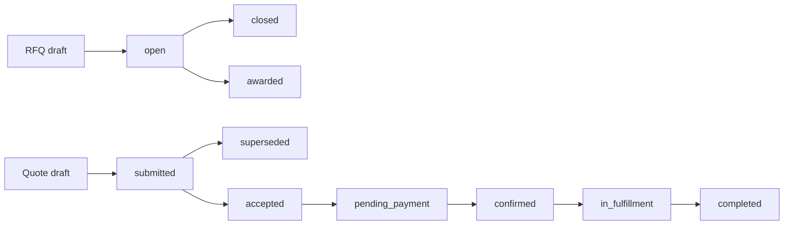

# STORE_BACKEND_STRUCTURE.md — B2B Store, Procurement, and Trade Services

> This document specifies the **buyer-facing store and commerce backend** for Qatoto:
> public catalog discovery, company storefronts, requests for quotation, quote negotiation,
> purchase orders, payment orchestration, fulfillment, and independently selectable trade-service
> providers.
>
> The backend repository is `/Users/vinitchuri/code/backend/qatoto-backend`.
>
> **Read alongside:**
>
> - [STORE_STRUCTURE.md](STORE_STRUCTURE.md) — the frontend route, component, and integration plan.
> - [STUDIO_PRODUCTS_BACKEND_STRUCTURE.md](STUDIO_PRODUCTS_BACKEND_STRUCTURE.md) — the shipped
>   seller-owned `/products/*` CRUD, images, B2B tiers, publish, and unpublish contract.
> - [STUDIO_PRODUCTS_STRUCTURE.md](STUDIO_PRODUCTS_STRUCTURE.md) — the shipped seller listing UI.
> - [R_AND_D_BACKEND_STRUCTURE.md](R_AND_D_BACKEND_STRUCTURE.md) — the separate R&D supplier
>   directory and project-engagement domain.
> - [ESCROW_LEDGER_STRUCTURE.md](ESCROW_LEDGER_STRUCTURE.md) — the existing project-funding ledger;
>   commerce may reuse its accounting patterns, not its project-scoped rows.
> - [CLAUDE.md](CLAUDE.md) — thin-client trust boundary and wire-casing rules.
>
> **Goal:** provide an Alibaba-style B2B market where an organization can discover and buy a
> product, request negotiated pricing, and separately engage freight forwarders, air/sea/land
> logistics operators, customs brokers, insurance providers, inspection agencies, testing and
> certification laboratories, marketing agencies, warehouse providers, and foreign-exchange
> facilitators.
>
> **Stack:** Express 5 + TypeScript strict + Drizzle ORM + PostgreSQL + Zod + Better Auth +
> Cloudinary/object storage + pg-boss + the existing provider-adapter and rate-limit patterns.
>
> **Status:** **Phases 0–7 trust MVP foundation shipped and hardened.** Seller `/products/*` CRUD, commerce
> organizations/memberships/addresses/verification, public `/store/*` catalog reads,
> merchandising, search documents, the provider connector directory, RFQs, quote negotiation,
> quote-originated order snapshots, RFQ/quote threads, buyer carts, server-priced checkout
> preparation and confirmation into direct-checkout orders, buyer/counterparty order queues and
> cancellation, product shipments, standalone service engagements, commerce payment intents,
> refunds, a double-entry commerce journal (fake provider adapter only), shipment-leg command
> execution, immutable typed engagement snapshots, contracted deliverable plans/results,
> derived fulfillment progress, server-issued completions, verified reviews, disputes, and
> privacy-safe review/completion metrics are implemented. See `docs/STORE_PHASE_5_ROLLOUT.md` for the
> payments/journal contract, `docs/STORE_PHASE_6_ROLLOUT.md` for connector execution, and
> `docs/STORE_PHASE_7_ROLLOUT.md` for the trust MVP.
> Trade-assurance language, real payment processors, external provider adapters/webhooks, Q&A,
> content reports, ranking, and recommendations remain planned unless a section explicitly says
> otherwise. Product organization-ownership and category columns remain in the documented
> expand/dual-write contract phase until non-null enforcement is separately released.
>
> **What is NOT built, and what the frontend is standing in for meanwhile:**
> [§15](#15-guided-pathways--the-buy-the-set-surface) specifies **guided pathways** — the buy-the-set
> surface whose tables exist as a flat list and whose feature does not — and
> [Appendix A](#appendix-a--what-the-frontend-needs-and-this-backend-does-not-have) is the register of
> every remaining store feature the frontend renders as mock UI, with the tables, columns and routes
> each one needs. Three entries there describe fields that already reach the wire and can never carry
> a real value: `onTimeShipmentRate` is hardcoded `null`, checkout `shippingInCents` is written
> literal `0`, and the `trending_placeholder` rail strategy returns an empty list unconditionally.

---

## 0. The rule that governs the store

**The frontend is hostile. The Express backend is the only authority.**

The client may display a price, quantity, verification badge, delivery estimate, insurance limit,
exchange rate, tax estimate, or order status. It may never establish any of them.

- Identity comes from the authenticated session. Organization membership and role are loaded on
  every protected action; `buyerOrganizationId`, `sellerOrganizationId`, and `providerOrganizationId`
  are never trusted merely because they appear in a body.
- Public catalog reads expose only active products whose owning organization is allowed to trade.
  A direct request for a draft, suspended, or deleted listing returns `404`.
- Price tiers, stock, quote totals, taxes, fees, payment amounts, exchange rates, and refunds are
  reloaded or recomputed in the same transaction that performs the state transition.
- Accepting a quote snapshots commercial terms. Later edits to a product, service offering, company
  profile, or tax rule cannot rewrite an accepted order.
- Provider verification is server-owned. Uploading a certificate creates evidence awaiting review;
  it never grants a badge.
- A browse-country preference is display-only. Compliance, tax, sanctions, export control, and
  availability decisions use server-derived and verified facts.
- Every mutation is authorized for the exact organization and resource. A valid account is not
  automatically a buyer, seller, provider, or moderator.
- Expensive or replayable writes use an idempotency key minted once per user attempt. Duplicate
  requests return the original result.
- Payment-provider, carrier, laboratory, insurer, and FX webhooks are authenticated, deduplicated,
  persisted before processing, and applied by workers.
- Expected failures are `Result<T, E>` values. Controllers exhaustively map them to HTTP responses.

If a rule must remain true after DevTools changes or request replay, it belongs in this backend.

---

## 1. Scope and bounded contexts

### 1.1 What this domain owns

| Context             | Owns                                                                             |
| ------------------- | -------------------------------------------------------------------------------- |
| Commerce identity   | Organizations, memberships, trade roles, addresses, verification evidence        |
| Public catalog      | Active product projections, categories, search, facets, storefronts              |
| Merchandising       | Hero slides, rails, placements, guided pathway sets and slots, product relations |
| Service marketplace | Provider profiles, capabilities, service offerings, coverage, credentials        |
| Sourcing            | RFQs, invitations, requirement lines, quote revisions, negotiation               |
| Purchasing          | Carts, checkout groups, purchase orders, immutable commercial snapshots          |
| Payments            | Commerce payment intents, provider adapter references, refunds, reconciliation   |
| Fulfillment         | Product shipments and connector engagements                                      |
| Trust               | Trade-assurance cases, disputes, reviews, Q&A, reports, moderation               |
| Communication       | Resource-scoped threads, participants, messages, attachment metadata             |

### 1.2 What this domain does not own

- Seller listing authoring remains under `/products/*`.
- The R&D `/suppliers/*` directory remains a project go-to-market domain. Its supplier quotes and
  engagements do not become store orders.
- R&D compensation records are attestations about payment elsewhere. They are not checkout.
- The project-funding ledger remains project-scoped. Commerce uses a separate journal namespace or
  separate commerce ledger tables, even if it reuses accounting code and provider adapters.
- Product research, proof of effort, equity, and programme contribution do not affect store price,
  provider verification, or order entitlement.

### 1.3 One organization may participate in several roles

One `commerce_organization` may be a buyer, product seller, and one or more provider kinds. Roles
do not imply one another. A freight forwarder can buy office equipment without becoming a verified
seller; a manufacturer can sell products without being approved to broker customs.

The existing R&D `supplier` row may optionally link to a commerce organization after moderator
review. The link avoids duplicate company identity but imports **no trust state, quote, price, or
project engagement**.

---

## 2. Core architecture decisions

### 2.1 Products and services are not one polymorphic listing

Products have inventory, images, variants, and quantity tiers. Services have coverage, eligibility,
capacity, evidence, and quote-specific requirements. A single nullable `listing` table would allow
invalid combinations such as stock on an insurance policy or warehouse capacity on a chair.

Therefore:

- Existing `product` tables remain product-specific.
- `commerce_service_offering` stores the common provider-facing contract.
- Exactly one typed extension row describes each service offering.
- RFQs, quote revisions, and orders have separate product-line and service-line tables.
- Explicit link tables connect a service engagement to an order or shipment when applicable.

### 2.2 An accepted quote is immutable

Negotiation creates append-only `commerce_quote_revision` rows. Editing means creating the next
revision, never updating the previous one. Acceptance locks one revision and creates an order from
that snapshot in one transaction.

### 2.3 A checkout group is not a multi-party order

A buyer action may involve several counterparties. The backend creates:

- one `commerce_checkout_group` for buyer-facing coordination; and
- one `commerce_order` per seller/provider organization.

This prevents one late warehouse provider from blocking a manufacturer’s shipment and keeps
authorization, invoicing, refunds, and disputes attributable to one counterparty.

### 2.4 Search and ranking are backend work

Catalog filtering, faceting, ranking, recommendation candidate selection, and pagination run in
PostgreSQL/services. The frontend never downloads a page and pretends it searched the catalog.
Personalization may rerank eligible candidates, but sponsored placement is always labelled and
never bypasses eligibility or moderation filters.

---

## 3. Backend folder plan

```text
qatoto-backend/src/
├── db/
│   └── schema.ts
├── routes/
│   ├── store.routes.ts                    # public catalog, categories, merchandising
│   ├── commerce-organizations.routes.ts   # organization + membership management
│   ├── commerce-providers.routes.ts       # provider profiles and offerings
│   ├── commerce-rfqs.routes.ts            # buyer RFQs, invitations, quote reads
│   ├── commerce-quotes.routes.ts          # provider revisions + buyer acceptance
│   ├── commerce-cart.routes.ts
│   ├── commerce-orders.routes.ts
│   ├── commerce-payments.routes.ts
│   ├── commerce-fulfillment.routes.ts
│   ├── commerce-messages.routes.ts
│   └── commerce-trust.routes.ts
├── controllers/
│   └── <matching files>.controller.ts     # params/query/body Zod parse + HTTP mapping
├── services/
│   ├── store-catalog.service.ts
│   ├── store-search.service.ts
│   ├── commerce-organizations.service.ts
│   ├── commerce-providers.service.ts
│   ├── commerce-rfqs.service.ts
│   ├── commerce-quotes.service.ts
│   ├── commerce-checkout.service.ts
│   ├── commerce-orders.service.ts
│   ├── commerce-payments.service.ts
│   ├── commerce-fulfillment.service.ts
│   ├── commerce-messages.service.ts
│   └── commerce-trust.service.ts
├── adapters/
│   ├── commerce-payment-provider.adapter.ts
│   ├── logistics-provider.adapter.ts
│   ├── insurance-provider.adapter.ts
│   ├── laboratory-provider.adapter.ts
│   └── foreign-exchange-provider.adapter.ts
├── jobs/
│   ├── expire-commerce-quotes.ts
│   ├── release-expired-inventory-reservations.ts
│   ├── reconcile-commerce-payments.ts
│   ├── refresh-store-search-document.ts
│   └── dispatch-commerce-webhook-event.ts
└── app.ts                                  # mount /store and /commerce routers
```

Controllers do not contain domain decisions. Services do not inspect raw Express requests.
Adapters translate external provider protocols into internal tagged results.

---

## 4. Data model

All table names are snake_case; Drizzle property names are camelCase. IDs are opaque text values
generated with `randomUUID()`. Timestamps are UTC. Public slugs are kebab-case and immutable after
publication; changing a display name does not change a URL identity.

### 4.1 Commerce organizations

`commerce_organization`

- `id`, immutable `slug`, `legalName`, `displayName`, `summary`
- `organizationType`: `company | sole_proprietor | cooperative | government | nonprofit`
- `tradeState`: `pending | active | suspended | closed`
- `countryCode`, `registrationNumberEncrypted`, `taxIdentifierEncrypted`
- `logoUrl`, `websiteUrl`, `createdByUserId`, timestamps
- unique slug; normalized legal-name/country lookup; encrypted identifiers never appear publicly

`commerce_organization_member`

- `organizationId`, `userId`
- `role`: `owner | administrator | buyer | seller | provider_operator | finance | support | viewer`
- `state`: `invited | active | suspended | left`
- `invitedByUserId`, `joinedAt`, `leftAt`
- unique `(organizationId, userId)` for an active membership

`commerce_organization_address`

- organization-owned billing, registered, warehouse, pickup, and return addresses
- normalized country/region/locality/postal fields plus encrypted contact details
- buyer delivery addresses are private; public storefront locations use an explicit public projection

`commerce_organization_verification`

- `verificationKind`, `state`, evidence object key, reviewer, decision reason, timestamps
- evidence upload never modifies `tradeState` or provider badges directly

### 4.2 Migrating shipped products to organization ownership

The shipped `product.sellerId` points to a Better Auth user. Migration must not break Studio.

1. Add nullable `sellerOrganizationId` and `createdByUserId`.
2. Create one private seller organization for each existing seller and backfill active products.
3. Update `/products/*` authorization to require an active seller membership and derive the
   organization from the session/context. During transition, preserve owner-only behavior.
4. Make `sellerOrganizationId` non-null after backfill verification.
5. Retain `createdByUserId` for attribution. Remove or rename legacy `sellerId` only in a later
   migration after all callers use organization ownership.

No request body chooses arbitrary ownership. Organization switching uses a server-issued active
organization context and rechecks membership.

### 4.3 Category migration

The shipped `product_category` enum has eight seller categories. Buyer browse needs a hierarchy.

`commerce_category`

- `id`, immutable `slug`, `name`, `parentCategoryId`, `siblingOrder`
- `state`: `draft | active | retired`
- `imageUrl`, `searchSynonyms`, timestamps
- unique slug; unique sibling order per parent; no cycles (service check plus constraint trigger)

Migration:

1. Seed roots corresponding to the eight legacy enum values.
2. Add nullable `product.categoryId`, backfill from the enum, and dual-write temporarily.
3. Change Studio to submit `categoryId`; backend verifies an active leaf category.
4. Make `categoryId` non-null.
5. Retain the old enum only until old clients and migrations are retired.

Product enum values remain snake_case. Public category slugs remain kebab-case. These are separate
wire concepts and must not be converted into each other implicitly.

### 4.4 Public product extensions

The public catalog reuses `product`, `product_image`, and `product_pricing_tier`, adding only fields
that a buyer contract needs:

- `product.publicSlug`
- optional `product.modelNumber`, `countryOfOriginCode`, `unitOfMeasure`
- `product.samplePolicy`: `unavailable | paid | refundable`
- optional server-owned `samplePriceInCents`
- `product.leadTimeMinDays`, `leadTimeMaxDays`
- `product.moderationState`: `pending | approved | rejected | suspended`
- optional structured specification schema/value tables

An active seller status alone is insufficient for public visibility: product status, moderation,
organization trade state, and category state must all be eligible.

### 4.5 Provider profiles and offerings

`commerce_provider_profile`

- `organizationId` primary key
- public summary, support policy, response-time statistics
- `verificationState`: `unverified | documents_pending | verified | rejected | suspended`
- `acceptingRequests`, service-region summary, timestamps

`commerce_provider_kind`

- seeded values:
    - `freight_forwarder`
    - `logistics_operator`
    - `customs_broker`
    - `insurance_provider`
    - `inspection_agency`
    - `testing_certification_lab`
    - `marketing_agency`
    - `warehouse_provider`
    - `foreign_exchange_facilitator`

`commerce_provider_kind_link` is many-to-many because one verified organization may operate, for
example, freight forwarding and warehousing. Verification is recorded per kind, not globally.

`commerce_service_offering`

- `id`, immutable `slug`, `providerOrganizationId`, `providerKind`
- `title`, `summary`, `state`: `draft | pending_review | active | suspended | retired`
- `pricingModel`: `quote_only | fixed_fee | per_unit | subscription`
- optional public indicative price range in integer cents plus server-owned currency
- `minimumLeadTimeDays`, `maximumLeadTimeDays`
- timestamps and moderation attribution

`commerce_service_coverage`

- offering, origin/destination country or seeded region, optional port/airport/location identifiers
- capability flags are filter inputs, not proof that a provider may legally serve a route

Typed one-to-one extension tables:

- `freight_offering_detail`: supported `air | sea | land | rail | multimodal`, consolidation,
  container and hazardous-goods capabilities
- `customs_brokerage_offering_detail`: jurisdictions, import/export direction, commodity coverage
- `insurance_offering_detail`: cargo coverage classes, limit ranges, exclusions-document reference
- `inspection_offering_detail`: pre-production, during-production, pre-shipment, loading supervision
- `testing_certification_offering_detail`: standards, accreditation bodies, laboratory locations
- `marketing_offering_detail`: channels, target regions, language capabilities, engagement model
- `warehouse_offering_detail`: storage types, temperature control, bonded status, capacity units
- `foreign_exchange_offering_detail`: currency pairs, settlement rails, minimum/maximum notional

The service verifies exactly one extension row matches `providerKind`. No generic JSON blob decides
eligibility or pricing.

### 4.6 RFQs and invitations

`commerce_rfq`

- buyer organization, creator, title, description
- `state`: `draft | open | closed | awarded | cancelled | expired`
- response deadline, desired delivery window, destination, settlement currency
- visibility: `invited_only | matched_providers`
- timestamps

`commerce_rfq_product_line`

- product reference nullable when sourcing an unlisted product
- immutable requested title/specification snapshot, quantity, unit, target category

`commerce_rfq_service_line`

- provider kind, service offering optional, common requirement summary
- typed requirement extension table matching the provider kind
- may link to a product line without becoming its child lifecycle

`commerce_rfq_invitation`

- RFQ + provider organization, state, sent/read/responded timestamps
- unique `(rfqId, providerOrganizationId)`

Opening an RFQ validates buyer organization state, deadline, at least one valid line, document
ownership, and all required service-specific fields.

### 4.7 Quote revisions

`commerce_quote`

- RFQ, provider organization, status: `draft | submitted | superseded | accepted | declined |
withdrawn | expired`
- latest revision number, timestamps
- unique provider per RFQ unless the buyer explicitly re-invites after closure

`commerce_quote_revision`

- quote, monotonic revision number, currency, validity deadline
- subtotal, tax, service fee, shipping, discount, and total in integer cents
- payment terms, Incoterm when relevant, notes, createdByMemberId
- immutable after submission

`commerce_quote_product_line` and `commerce_quote_service_line`

- reference the matching RFQ line
- quantity and unit price/fee components
- immutable title, scope, lead time, exclusions, and deliverable snapshots
- typed service quote extensions for route legs, insurance coverage, test standards, storage
  capacity, marketing deliverables, and FX rate details

For FX, rates are fixed-point integers plus an explicit scale or canonical decimal strings parsed
by a decimal library on the backend. JavaScript/Postgres floating point is forbidden for money or
exchange rates.

### 4.8 Cart, reservations, checkout, and orders

`commerce_cart` belongs to one buyer organization. `commerce_cart_product_line` stores product,
quantity, and selected variant/options only. It does not store an authoritative total.

`commerce_inventory_reservation`

- product/variant, organization/cart, quantity, expiration, state
- created during checkout preparation using row locks
- released by worker on expiry; consumed atomically by order creation

`commerce_checkout_group`

- buyer organization, state, server-computed aggregate display totals, idempotency key

`commerce_order`

- checkout group nullable for quote-originated orders
- buyer and one counterparty organization
- source: `direct_checkout | accepted_quote`
- `state`: `pending_payment | payment_processing | confirmed | in_fulfillment |
partially_completed | completed | cancelled | disputed`
- immutable legal names, addresses, currency, totals, terms, and accepted quote revision

`commerce_order_product_line` and `commerce_order_service_line`

- immutable commercial snapshots
- product line has ordered, reserved, fulfilled, cancelled, and refunded quantities
- service line points to a separately stateful connector engagement

### 4.9 Payments and journal

Commerce does not post into project-funding rows. It introduces:

- `commerce_payment_intent`
- `commerce_provider_transfer`
- `commerce_refund`
- `commerce_journal_account`
- `commerce_journal_entry`
- `commerce_journal_line`

The journal is double-entry and append-only. Provider calls are made only after the local transfer
row and idempotency key are committed. Webhook receipt is stored before state transition.

Payment state:

`created → requires_action | processing → authorized → settled`

Terminal alternatives: `failed | cancelled | partially_refunded | refunded | disputed`.

“Trade assurance” copy is not enabled until the legal custody model, eligible payment method,
dispute rules, and journal postings are implemented. Qatoto must never claim funds are escrowed
merely because an order row exists.

### 4.10 Fulfillment and loose connector engagements

`commerce_service_engagement`

- accepted service quote/order line, provider organization, buyer organization
- `state`: `awaiting_provider | scheduled | in_progress | awaiting_buyer | completed |
cancelled | disputed`
- independent timestamps and deliverable acceptance

`commerce_order_service_link`

- explicitly links an engagement to an order, product line, or shipment
- absence is valid: a company may buy lab testing or marketing without buying a product on Qatoto

`commerce_shipment`

- one seller order, origin/destination snapshots, state, package totals

`commerce_shipment_leg`

- ordered legs with mode `air | sea | land | rail`
- optional freight/logistics engagement
- carrier references and tracking events are append-only

Customs, insurance, inspection, laboratory, warehouse, marketing, and FX each receive typed
engagement detail/deliverable tables. Completion of one never directly marks another complete.
An order coordinator derives aggregate progress for display.

### 4.11 Communication, trust, and moderation

Threads are resource-scoped: RFQ, quote, order, service engagement, or dispute. Participants are
derived from organization memberships. Attachment object keys are private and served through
short-lived authorized URLs.

Reviews require a completed order/engagement and are unique per reviewer organization/resource.
Provider metrics are backend aggregates over eligible records, never client submissions.

Reports and disputes preserve snapshots, messages, evidence, moderator actions, and an append-only
audit event. A seller/provider cannot review or resolve its own case.

---

## 5. Public Store API

Public reads use `attachOptionalUser`, strict query parsing, bounded limits, deterministic ordering,
and buyer-safe projections.

| Method | Route                                     | Purpose                                                               |
| ------ | ----------------------------------------- | --------------------------------------------------------------------- |
| GET    | `/store/home`                             | Curated hero, categories, pathways, provider shortcuts, product rails |
| GET    | `/store/categories`                       | Root or parent-scoped active categories                               |
| GET    | `/store/categories/:slug`                 | Category metadata, children, facets, first result page                |
| GET    | `/store/search`                           | Product/provider search with server-side filters and cursor           |
| GET    | `/store/products/:productSlug`            | Public product detail, tiers, seller/storefront projection            |
| GET    | `/store/organizations/:organizationSlug`  | Public company storefront                                             |
| GET    | `/store/providers`                        | Filterable provider directory                                         |
| GET    | `/store/providers/:organizationSlug`      | Public provider profile and active offerings                          |
| GET    | `/store/services/:offeringSlug`           | One active service offering                                           |
| GET    | `/store/pathways`                         | Active guided sets — see §15                                          |
| GET    | `/store/pathways/:pathwaySlug`            | Pathway slots, ranked candidates, set totals, completeness (§15.7)    |
| GET    | `/store/products/:productSlug/companions` | Relation-graph companions for a product detail page (§15.7)           |
| GET    | `/store/rails/:railSlug`                  | Paginated curated/ranked feed                                         |

`category-slugs` and `pathway-slugs` mock endpoints are not durable public API requirements.
Dynamic routes should render on demand; build-time static parameter generation may use a bounded
featured-slug endpoint only if the deployment model requires it.

Example search:

```text
GET /store/search?query=solar+freezer&category=industrial-cooling
  &minOrderQuantityMax=50&sellerCountryCode=IN
  &providerKind=freight_forwarder&sort=relevance&limit=24&cursor=...
```

Query keys are camelCase. Enum values are snake_case. Category and product slugs are kebab-case.

### 5.1 Buyer-safe product projection

Public product detail includes:

- immutable ID and public slug
- title, brand, description, key features, category trail, specifications
- ordered public image URLs
- current currency and pricing tiers in integer cents
- stock state (`in_stock | low_stock | made_to_order | unavailable`), not private stock counts
- sample policy, lead-time range, MOQ, origin, moderation-safe seller projection
- server-derived review and fulfillment metrics

It excludes seller SKU internals when private, exact inventory, private contacts, draft fields,
organization member IDs, moderation notes, and storage object keys.

---

## 6. Authenticated Commerce API

### 6.1 Organizations and providers

| Method | Route                                                       | Result                                  |
| ------ | ----------------------------------------------------------- | --------------------------------------- |
| POST   | `/commerce/organizations`                                   | Create pending organization; idempotent |
| GET    | `/commerce/organizations/mine`                              | Membership-scoped organizations         |
| PATCH  | `/commerce/organizations/:organizationId`                   | Authorized profile update               |
| POST   | `/commerce/organizations/:organizationId/members`           | Invite member                           |
| PATCH  | `/commerce/organizations/:organizationId/members/:memberId` | Role/state update                       |
| POST   | `/commerce/providers/:organizationId/profile`               | Create provider profile                 |
| POST   | `/commerce/providers/:organizationId/offerings`             | Create draft offering                   |
| PATCH  | `/commerce/service-offerings/:offeringId`                   | Update owned draft                      |
| POST   | `/commerce/service-offerings/:offeringId/submit`            | Submit for moderation                   |
| POST   | `/commerce/providers/:organizationId/evidence`              | Upload verification evidence            |

Moderation routes live under the existing platform capability model and are not granted by an
organization role.

### 6.2 RFQs and quotes

| Method | Route                                                  | Result                               |
| ------ | ------------------------------------------------------ | ------------------------------------ |
| POST   | `/commerce/rfqs`                                       | Create buyer draft                   |
| GET    | `/commerce/rfqs/mine`                                  | Buyer organization RFQs              |
| GET    | `/commerce/rfqs/:rfqId`                                | Authorized RFQ projection            |
| PATCH  | `/commerce/rfqs/:rfqId`                                | Update owned draft                   |
| POST   | `/commerce/rfqs/:rfqId/open`                           | Validate and open                    |
| POST   | `/commerce/rfqs/:rfqId/invitations`                    | Invite eligible providers            |
| POST   | `/commerce/rfqs/:rfqId/close`                          | Close responses                      |
| GET    | `/commerce/provider/rfqs`                              | Invited/matched provider work queue  |
| POST   | `/commerce/rfqs/:rfqId/quotes`                         | Provider creates quote shell         |
| POST   | `/commerce/quotes/:quoteId/revisions`                  | Append draft revision                |
| POST   | `/commerce/quotes/:quoteId/revisions/:revision/submit` | Submit immutable revision            |
| POST   | `/commerce/quotes/:quoteId/accept`                     | Buyer accepts latest valid revision  |
| POST   | `/commerce/quotes/:quoteId/decline`                    | Buyer declines                       |
| POST   | `/commerce/quotes/:quoteId/withdraw`                   | Provider withdraws before acceptance |

Quote acceptance uses `If-Match`/version or expected revision in a strict body, locks the quote and
RFQ, validates expiry and authority, then creates order snapshots atomically.

### 6.3 Cart, checkout, orders, and payments

| Method | Route                                       | Result                                                    |
| ------ | ------------------------------------------- | --------------------------------------------------------- |
| GET    | `/commerce/cart`                            | Active organization cart with server-priced projection    |
| PUT    | `/commerce/cart/items/:productId`           | Set desired quantity                                      |
| DELETE | `/commerce/cart/items/:productId`           | Remove line                                               |
| POST   | `/commerce/checkout/prepare`                | Validate cart, reserve stock, return authoritative totals |
| POST   | `/commerce/checkout/confirm`                | Create checkout group and counterparty orders             |
| GET    | `/commerce/orders`                          | Buyer orders, cursor paginated                            |
| GET    | `/commerce/orders/:orderId`                 | Authorized order detail                                   |
| GET    | `/commerce/provider/orders`                 | Seller/provider work queue                                |
| POST   | `/commerce/orders/:orderId/cancel`          | Policy-checked cancellation                               |
| POST   | `/commerce/orders/:orderId/payment-intents` | Create/reuse payment intent                               |
| GET    | `/commerce/payments/:paymentIntentId`       | Poll payment state                                        |
| POST   | `/commerce/orders/:orderId/refunds`         | Authorized refund request                                 |

All create/confirm/payment/refund calls require `Idempotency-Key`. A `202` means processing has
started, not that payment, booking, testing, or settlement succeeded.

### 6.4 Fulfillment, messages, and trust

| Method | Route                                                     | Result                               |
| ------ | --------------------------------------------------------- | ------------------------------------ |
| POST   | `/commerce/orders/:orderId/shipments`                     | Seller creates shipment plan         |
| POST   | `/commerce/shipments/:shipmentId/events`                  | Authorized append-only event         |
| GET    | `/commerce/service-engagements`                           | Buyer/provider engagement list       |
| POST   | `/commerce/service-engagements/:engagementId/transitions` | Valid state transition               |
| POST   | `/commerce/threads`                                       | Create or return scoped thread       |
| GET    | `/commerce/threads/:threadId/messages`                    | Cursor-paginated authorized messages |
| POST   | `/commerce/threads/:threadId/messages`                    | Append message                       |
| POST   | `/commerce/orders/:orderId/disputes`                      | Open dispute with idempotency        |
| POST   | `/commerce/completions/:completionId/reviews`             | Verified review                      |
| POST   | `/commerce/reports`                                       | Report product/provider/content      |

---

## 7. Boundary schemas and response rules

Controllers parse `params`, `query`, headers, and bodies with Zod `.strict()`. Unknown request keys
return `422`. Service input types are inferred from schemas.

Responses use canonical projections and stable tagged errors:

```ts
type CommerceResult<TValue, TError> =
    { success: true; value: TValue } | { success: false; error: TError };

type QuoteAcceptanceError =
    | { type: "NOT_FOUND" }
    | { type: "NOT_AUTHORIZED" }
    | { type: "QUOTE_EXPIRED"; expiredAt: Date }
    | { type: "REVISION_CHANGED"; currentRevision: number }
    | { type: "RFQ_NOT_OPEN" }
    | { type: "ORGANIZATION_NOT_ACTIVE" }
    | { type: "CONFLICTING_ACCEPTANCE"; orderId: string };
```

HTTP mapping:

- `400` malformed transport or unsupported multipart input
- `401` no session
- `403` authenticated but missing a non-probeable capability
- `404` missing or organization-scoped resource not visible to caller
- `409` valid request conflicts with current state/version/idempotency
- `422` schema or domain-field validation failure
- `429` rate limited
- `202` accepted asynchronous work, with a polling resource

List responses contain `{ items, page: { nextCursor, hasMore } }`. Every order ends with a unique
column, normally `id`, so cursor pagination cannot skip equal timestamps.

---

## 8. State transitions and concurrency

Every transition checks the current state in the write predicate or under a row lock.



- Two quote-acceptance requests cannot create two orders: unique accepted revision plus idempotency.
- Stock is reserved with row locking and bounded expiry.
- A provider cannot submit a revision after quote withdrawal/acceptance/expiry.
- Order totals are never recomputed from mutable listing data after creation.
- Shipment and service-engagement transitions append events; current state is a projection guarded
  by the transition service.

---

## 9. Search, merchandising, and caching

Search documents contain only public eligible fields. Product/category/provider mutations enqueue
refresh jobs after commit. Search may initially use PostgreSQL full-text/trigram indexes; an
external search engine is an adapter added only when measured scale requires it.

Home rails are server-defined:

- curated placements reference eligible entities and have start/end windows;
- algorithmic rails store a strategy key, not client-supplied item lists;
- personalized rails are private/no-store;
- public category/product pages may use bounded revalidation and tag invalidation;
- prices and stock shown during checkout are always fresh, regardless of browse cache.

Tailwind classes are never returned by the API. The API returns semantic presentation tokens such
as `accent: "amber"` from a closed enum; the frontend maps them to classes.

---

## 10. External providers and workers

External integrations follow an outbox/inbox model:

1. Validate and commit the local intent, idempotency key, and outbox event.
2. A worker calls the adapter.
3. Persist provider reference and normalized result.
4. Receive authenticated webhooks into an inbox table with unique provider event ID.
5. A worker applies the event exactly once and appends audit/journal records.

Adapters never return provider SDK objects to controllers. Secrets remain backend-only.

Scheduled jobs:

- expire quotes/RFQs and release inventory reservations;
- reconcile payment and transfer state;
- retry provider calls with bounded exponential backoff and dead-letter visibility;
- recompute public provider metrics and search documents;
- expire temporary document URLs, never source objects required for audit.

---

## 11. Security and abuse controls

- Rate-limit search, organization creation, RFQ broadcast, message send, evidence upload, checkout,
  payment intent, dispute, report, and review endpoints with route-appropriate keys.
- Scan and normalize image/document uploads; allowlist file types by decoded content, not extension.
- Store private objects outside public buckets and issue short-lived authorized URLs.
- Normalize and allowlist external URLs before storage.
- Encrypt registration, tax, banking, and private contact fields.
- Sanctions/export-control/tax decisions are explicit backend services with versioned evidence.
- Prevent participant enumeration by returning `404` for inaccessible resource IDs.
- Moderate organization/provider/product public copy and retain decision history.
- Disallow self-review, reciprocal review abuse, and review before verified completion.
- Audit role changes, quote acceptance, order/payment transitions, refunds, dispute actions, and
  provider verification decisions.

---

## 12. Phased delivery

### Phase 0 — foundations

- Commerce organizations, memberships, addresses, verification evidence.
- Product organization-ownership and category migrations.
- Shared error, idempotency, audit, and document primitives.
- **Shipped** (expand/dual-write). Contract migration that makes ownership/category
  columns non-null remains gated by `docs/STORE_PHASE_0_ROLLOUT.md`.

### Phase 1 — real public store

- Public active-product projections, category tree, product detail, storefronts.
- Server-side search/filter/facets and curated merchandising.
- Remove fallback behavior that masks backend contract failures.
- **Shipped and hardened.** Moderator trade-state transitions, organization write
  rate limits, product specifications, category-subtree browse/search, and explicit
  home provider-directory failure mapping are included.

### Phase 2 — provider connector directory

- Provider profiles, kinds, typed offerings, coverage, moderation, public search/detail.
- Link eligible R&D suppliers to organizations without importing trust or project records.
- **Shipped** alongside Phase 1 in the Phase 1/2 rollout.

### Phase 3 — RFQ and quote negotiation

- Mixed product/service RFQs, invitations, threads, immutable quote revisions, comparison.
- Quote acceptance creates order snapshots.
- **Shipped.** See `docs/STORE_PHASE_3_ROLLOUT.md` for migrate, worker install, verification,
  and smoke tests. Cart/checkout remain Phase 4.

### Phase 4 — direct purchase and order operations

- Cart, inventory reservation, checkout groups, buyer and provider order queues.
- Product fulfillment and standalone service engagements.
- **Shipped.** See `docs/STORE_PHASE_4_ROLLOUT.md` for migrate, worker install, verification,
  and smoke tests. Payments and escrow remain Phase 5.

### Phase 5 — payments and trade assurance

- Commerce-specific payment/journal records, provider adapters, reconciliation, refunds.
- **Shipped (ledger + fake adapter).** See `docs/STORE_PHASE_5_ROLLOUT.md` for migrate,
  worker install, verification, and smoke tests. Trade-assurance language and real payment
  processors remain blocked on legal/provider decisions (§14).

### Phase 6 — connector execution

- Shipment legs and typed customs, insurance, inspection, lab, warehouse, marketing, and FX
  deliverables.
- Derived end-to-end progress without coupling connector state machines.
- **Shipped and hardened (command workflows + typed snapshots + contracted deliverable plans; no
  external provider adapters).** Migrations `0048`–`0051` close
  command idempotency, deterministic snapshot lineage, money/currency pairing, lifecycle
  reconciliation, payment-gated fulfillment, execution-contract provenance, and typed-read gaps.
  See `docs/STORE_PHASE_6_ROLLOUT.md` for migrate, verification, smoke flows, and rollback.
  Assurance language and live carrier/customs/insurance/lab/FX connectors remain blocked
  on legal/provider decisions (§14).

### Phase 7 — trust and optimization

- **Trust MVP shipped and hardened (`0052`–`0053`):** verified reviews, disputes,
  server-issued completions, privacy-safe provider/product metrics, database-bound trust
  relationships, and fulfillment freezes while an order is disputed. See
  `docs/STORE_PHASE_7_ROLLOUT.md`.
- Still deferred: Q&A, content reports, ranking, recommendations, abuse-operations automation,
  and trade-assurance financial remedies.

### Phase 8 — catalog depth and the relation graph

- Product variants (A1), media kinds (A2), specification grouping (A3), `condition` in the public
  projection (A4), packaging dimensions and weight (A5), highlights (A6).
- `commerce_product_relation` (§15.3), which unblocks similar / frequently-bought / compare (A7).
- The merchandising integrity fixes in A19.
- **Not started.** A4 is a one-line projection change and the cheapest entry in the whole appendix;
  A1 is the most expensive, because a variant reaches pricing, stock, the cart and the order
  snapshot.

### Phase 9 — guided pathways

- Slots, candidates, anchors and pathway images (§15.2), set pricing (§15.4), authoring and
  moderation (§15.5), degradation signals (§15.6), the derivation job (§15.9).
- **Not started.** Depends on Phase 8's relation graph for anchored sets; curated sets do not.

### Phase 10 — the public voice

- Review reads, media, sub-scores, helpful votes and seller replies (A8); Q&A (A9); content reports
  (A12); engagement counters (A11); product-scoped threads (A14).
- **Not started.** A8 first: a review that can be written and never read is the sharpest of these
  gaps, and the table already exists.

### Phase 11 — buyer logistics

- A `delivery` address kind and a shippable order address (A15) — the only entry in the appendix that
  is a correctness problem rather than a missing feature.
- Indicative delivery estimates from provider coverage (A16), sample ordering (A17), seller-declared
  customization options (A18).
- **Not started.** A15 does not depend on the others and should not wait for them.

Each phase ships backend contracts before its frontend controls are presented as functional.

---

## 13. Verification and release gates

Before a phase is called wired:

- migrations apply to a production-like snapshot and rollback strategy is documented;
- backfill counts and orphan/constraint checks pass;
- TypeScript, formatting, lint, and build pass in the backend;
- public reads cannot expose draft/suspended/private fields;
- organization membership and cross-tenant probes fail correctly;
- duplicate idempotency calls return one business result;
- quote/order/payment state races preserve one legal transition;
- cursor pagination is deterministic;
- money remains integer cents and each amount has an explicit currency;
- webhook replay is harmless;
- audit/journal entries reconcile with domain transitions;
- frontend response schemas parse every documented response and reject malformed fixtures.

Tests are implemented only when separately requested; this document defines the acceptance
conditions and contract.

---

## 14. Explicitly deferred decisions

The following require legal, provider, or product decisions before implementation:

- countries and industries Qatoto may serve;
- merchant-of-record and custody model;
- supported payment methods and refund authority;
- Incoterms, tax, tariff, and sanctions providers;
- legally valid e-signature and purchase-order requirements;
- insurance solicitation/licensing boundaries;
- FX facilitator licensing and whether Qatoto ever touches funds;
- service-level guarantees and assurance coverage;
- retention periods for invoices, customs records, lab reports, and disputes;
- **whether a supplier's trading volume or revenue may be published, and on what consent.** The
  frontend's company block renders "Online revenue US $2.4M+" (Appendix A13). Even once the figure is
  derivable from order data, publishing a seller's commercial performance is a disclosure decision,
  not an aggregation one.
- **how a seller obtains a buyer's full delivery address.** Street lines, recipient name and phone are
  encrypted, and the order snapshot today records only country, region, locality and postal code
  (Appendix A15). Either an authorized decrypt path or a seller-openable encrypted snapshot has to be
  chosen before fulfillment can be honest about what it knows.

Until decided, the backend stores no fabricated guarantee and the frontend displays no claim that
money, shipment, certification, insurance, or compliance is assured.

**One frontend surface already violates this and is knowingly held back.**
`sections/trade-protection.tsx` and `sheets/trade-protection-sheet.tsx` render four finished
guarantees — "funds are only released once the order is confirmed", "full refund — no back-and-forth
with the seller". That copy is mock and stays behind this decision (Appendix A20); it is not
scheduled work, and no backend entry exists to make it true.

---

## 15. Guided pathways — the buy-the-set surface

> **Status: the tables exist, the feature does not.** `store_pathway` and `store_pathway_item` model a
> flat ordered list of entity ids. Everything below is unbuilt.

### 15.1 A pathway is a composition, not a rail

A rail ranks products that happen to be good; the buyer picks one. A **pathway** is a set whose
members relate to each other, and the buyer's intent is the whole thing:

- pick an outfit and get the jewelry, trousers, shirt and boots that go together;
- pick a bicycle and get the matching jersey, gearset, lights and the bolts that actually fit it.

In this market that reads as **multi-SKU kit sourcing** — "everything to fit out a hotel room",
"everything to assemble 500 bicycles" — which is the thing single-SKU search is worst at. A buyer
who knows the kit but not the part numbers cannot express that as a query, and today has to run one
search per line.

Two shapes, one model, distinguished by a nullable `anchorProductId`:

| Shape            | `anchorProductId` | Slots come from               | Example                              |
| ---------------- | ----------------- | ----------------------------- | ------------------------------------ |
| **Curated set**  | `NULL`            | hand-picked by a merchandiser | "Autumn hotel-room refit"            |
| **Anchored set** | a product         | the relation graph (§15.3)    | "Everything for the Model-C bicycle" |

They share one route, one wire shape, and one renderer. An anchored set is not a second feature; it
is a pathway whose slots were resolved rather than typed.

### 15.2 Slots, not items

Today's `store_pathway_item` is `(pathwayId, entityKind, entityId, position)` with an **untyped,
un-FK'd `entityId`**. Three things follow, and all three are wrong for a set:

1. **A dead member vanishes silently.** `resolveEligibleMerchandisingItems` drops any id that is no
   longer publicly eligible, so a five-piece look renders as three pieces with nothing saying a
   piece is missing. For a rail that is correct — a shorter rail is still a rail. For a set it is a
   lie: the buyer believes they are seeing the whole kit.
2. **Pathway items are the only merchandising rows with no time window.** `store_rail_placement`
   carries `startsAt`/`endsAt`; `store_pathway_item` carries neither, so a seasonal member cannot be
   scheduled in or out.
3. **`getPathwayBySlug` returns every item, unbounded** — no limit, no cursor. A 200-piece kit is
   one response.

Replace it with two tables.

`store_pathway_slot` — a **role** in the set, not a product:

- `id`, `pathwayId`
- `roleLabel` — "Footwear", "Front light", "Chain bolts". Display copy, not an enum: the roles in a
  hotel refit and a bicycle build share nothing.
- `isRequired` — a required slot with no eligible candidate makes the set incomplete (§15.6)
- `quantity` — how many units of the chosen candidate the set needs. A bicycle takes one saddle and
  twelve bolts.
- `siblingOrder`, `startsAt`, `endsAt`, timestamps
- unique `(pathwayId, siblingOrder)`

`store_pathway_slot_candidate` — the products that can fill a slot:

- `id`, `slotId`, `productId` **with a real foreign key**
- `rank` — 0 is the default the set shows first
- `sourceKind` — `curated | derived` (§15.3), so a swap suggested by the graph is distinguishable
  from one a merchandiser chose
- unique `(slotId, productId)`

**Why candidates rather than one product per slot.** It is what makes a swap possible ("show me a
cheaper saddle"), and it is what turns today's silent shrink into a fall-through: when rank 0 is out
of stock the slot offers rank 1 instead of disappearing. A set is only as robust as its substitutes.

`store_pathway` gains `anchorProductId` (nullable FK), `heroImageUrl` and `cardImageUrl`. It has no
image column at all today, which is why the frontend renders a local placeholder banner
(`mockPathwayBannerForSlug`) — that function deletes itself the day these columns land.

### 15.3 The product relation graph

**No table in this schema has two foreign keys to `product`.** There is no similar-product edge, no
accessory edge, no spare-part edge, no compatibility edge. Every discovery feature the frontend
mocks — "Frequently bought together", "Other recommendations", "View similar", "Add to Compare" —
and every anchored pathway needs the same missing thing.

`commerce_product_relation`

- `id`, `fromProductId`, `toProductId` — both FK to `product`, both `restrict`
- `relationKind`:
  `accessory_of | spare_part_of | consumable_for | compatible_with | complements | replaces`
- `sourceKind`: `seller_declared | moderator_curated | derived_cooccurrence`
- `rank`, `createdByUserId`, timestamps
- unique `(fromProductId, toProductId, relationKind)`; CHECK `fromProductId <> toProductId`

Directional on purpose. "This bolt is a spare part of that bicycle" does not invert into "that
bicycle is a spare part of this bolt". Symmetric meanings (`complements`, `compatible_with`) are
stored as two rows so a single query direction serves every read.

> **The rule that governs this table.** A seller saying its bolt fits a given bicycle is a **claim**,
> not a fact — the same posture §0 takes on prices, badges and countries. A `seller_declared`
> relation may drive discovery; it may **never** be projected as verified compatibility. `sourceKind`
> rides the wire so no client can render a claim as a check mark, and only `moderator_curated`
> earns confirmatory language. Fitment is a safety claim in every category where it matters —
> brake parts, electrical, load-bearing hardware — and getting this wrong is not a merchandising bug.

One table, five surfaces: anchored pathway slots, similar products, frequently-bought-together,
compare candidates, and spare-part lookup from an order line.

### 15.4 Set pricing is computed, never stored

The set CTA reads "Buy complete set · N items", which implies a total. That total is **derived at
read time** from current pricing tiers, per currency, exactly as `/commerce/cart` already prices a
cart — §0's rule that the client may display a price but never establish one applies unchanged, and
a stored set total would be stale the moment a seller edits a tier.

A pathway spanning several sellers is not a new order type. It **seeds a cart**; the existing
cart → `checkout/prepare` → `checkout/confirm` path then produces one `commerce_order` per
counterparty (§2.3). Nothing about a pathway reaches an order — the order's line snapshots record
products, quantities and prices, and a set is a browsing construct, not a commercial one.

`POST /commerce/cart/from-pathway/:pathwaySlug` adds one chosen candidate per required slot at its
slot quantity, returns the authoritative cart, and reports any slot it could not fill rather than
quietly adding fewer lines.

### 15.5 Authorship and moderation

Platform merchandisers curate directly. A seller may **propose** a set through the same
`draft → pending_review → active` flow `commerce_service_offering` already uses, because a seller
knows its own compatibility better than a merchandiser does.

Moderation is not ceremony here: without it, a seller composes a set entirely from its own SKUs and
a curated look becomes an advertisement. A reviewer checks that slots are filled on merit and that
`seller_declared` compatibility claims in a safety-relevant category have evidence behind them.

### 15.6 Honest degradation

A set that cannot be completed must say so. The projection carries:

- per slot — `state`: `available | substituted | unavailable`, and which candidate was chosen;
- per pathway — `requiredSlotCount`, `filledRequiredSlotCount`, `isComplete`.

The frontend can then render "3 of 5 pieces available" and disable the whole-set CTA, instead of
showing a shorter set that looks complete. **Never omit an unfillable required slot from the
response** — an absent slot and a slot with nothing in it are different facts, and only the second
one is true.

### 15.7 Public API

| Method | Route                                     | Purpose                                                                                    |
| ------ | ----------------------------------------- | ------------------------------------------------------------------------------------------ |
| GET    | `/store/pathways`                         | Active pathways with `cardImageUrl`; cursor-paginated                                      |
| GET    | `/store/pathways/:pathwaySlug`            | Slots, ranked candidates, per-currency set totals, completeness; cursor over slots         |
| GET    | `/store/products/:productSlug/companions` | Relation-graph companions for a PDP, grouped by `relationKind`, each carrying `sourceKind` |

`GET /store/pathways/:pathwaySlug` replaces today's unbounded flat `items` array. Set totals are an
array keyed by currency — a kit sourced from three countries has three totals and no single number,
and inventing one would mean converting currencies without an FX quote.

### 15.8 Authoring API

| Method | Route                                                    | Result                                               |
| ------ | -------------------------------------------------------- | ---------------------------------------------------- |
| POST   | `/commerce/pathways`                                     | Create draft (merchandiser, or seller proposal)      |
| PATCH  | `/commerce/pathways/:pathwayId`                          | Update owned draft                                   |
| PUT    | `/commerce/pathways/:pathwayId/slots`                    | Replace the slot plan                                |
| PUT    | `/commerce/pathways/:pathwayId/slots/:slotId/candidates` | Replace ranked candidates                            |
| POST   | `/commerce/pathways/:pathwayId/submit`                   | Submit for moderation                                |
| POST   | `/commerce/admin/pathways/:pathwayId/moderate`           | Publish or reject                                    |
| PUT    | `/commerce/products/:productId/relations`                | Seller declares relations — always `seller_declared` |
| POST   | `/commerce/admin/product-relations/:relationId/verify`   | Promote to `moderator_curated`                       |

All writes take `Idempotency-Key` and are organization-scoped like every other commerce write.

### 15.9 Derivation job

`derive-product-relations` — nightly, in the pattern of `refresh-store-search-document`: mine
co-occurrence from completed order lines into `derived_cooccurrence` relations with a rank, never
overwriting a `moderator_curated` or `seller_declared` row.

This is also the honest replacement for the `trending_placeholder` rail strategy, which today returns
an empty list unconditionally and will keep doing so until something computes trending.

---

## Appendix A — What the frontend needs and this backend does not have

**Written from the other side.** §5 and §6 record what this backend serves. This records what the
store frontend tried to render and could not, found by reading all 33 `// TRANSPORT: mock` files in
`src/components/home/store/` against `src/db/schema.ts` and `src/routes/`.

**None of these blocked the frontend** — every one shipped as mock UI carrying a `TRANSPORT: mock`
banner, which is the point of writing them down. A stand-in nobody recorded becomes a bug report
later, and worse, becomes indistinguishable from an oversight.

Every absence below was confirmed by enumerating all 244 `pgTable` calls, not by spot-checking. The
sibling R&D appendix shipped one entry describing something already built; that is the failure mode
this list is written to avoid.

Each entry: **Needed by** · **What exists** · **What to build** · **Frontend today** · **Rule**.

---

### A1. Product variants — the colour picker cannot work

**Needed by:** `sections/product-color-picker.tsx`, a "Select Color" strip of four swatches.

**What exists:** nothing. No variant, option, swatch or SKU-child table. `product.sku` is a single
nullable text column; there is one `priceInCents`, one `stockQuantity`, and images have no variant
association.

**What to build:** `commerce_product_variant` (product, name, `publicSlug`, own price/stock/MOQ) plus
a `variantId` on `product_image`, on `commerce_cart_product_line` and on the order-line snapshot.
This is not a display feature — a variant changes price, stock, gallery and what gets shipped.

**Frontend today:** four hardcoded swatches rendered as `<div>`s. Not clickable at all, first one
hardcoded selected. Deliberately inert rather than a picker that appears to work and changes nothing.

**Rule:** a variant reaching an order line must be snapshotted like every other commercial fact —
`commerce_order_product_line` records what was bought, and "Sea blue" is part of that.

---

### A2. No media kind on `product_image` — no 360, no video

**Needed by:** `sections/view-in-360-banner.tsx`.

**What exists:** `product_image` is `{id, productId, url, position, createdAt}`. No discriminator, no
`altText`, no dimensions, and **no unique index on `(productId, position)`** even though position 0
is load-bearing as the main image.

**What to build:** a `mediaKind` enum (`photo | video | spin_360`) on `product_image`, or a sibling
`product_media` table; plus the unique index.

**Frontend today:** a non-interactive banner. There is no asset to open, so it is not a button.

---

### A3. `specification` has no grouping — the five-tab sheet cannot be real

**Needed by:** `sheets/product-details-sheet.tsx`, a tabbed spec sheet with five tabs and 28 rows.

**What exists:** `commerce_product_specification` is `{productId, specificationKey,
specificationValue, position}` — flat, unique on `(productId, specificationKey)`, no group, no unit.

**What to build:** a `specificationGroup` column (free text, like `roleLabel` in §15.2 — the useful
groupings for a chair and a transformer share nothing).

**Frontend today:** the real rows render ungrouped in `ProductSpecifications`; the grouped sheet
renders mock tabs beside it. Two components, one truth, until the column lands.

---

### A4. `condition` is not in the public projection

**Needed by:** the PDP meta line, which showed "New / Refurbished / Used".

**What exists:** `product.condition` (`productConditionEnum`, notNull, default `new`) **is stored** —
it is simply absent from `StoreProductDetailProjection`.

**What to build:** add it to the projection. One line.

**Frontend today:** the label is **gone**. This is the only mock-era feature not restored, because
there is no value on the wire to render and inventing one is not an option.

---

### A5. Packaging dimensions, gross weight, selling units, "in the box"

**Needed by:** `sections/packaging-and-delivery.tsx` (three spec rows plus three lead-time bands) and
the "In the box" line in `sections/product-details-section.tsx`.

**What exists:** `product.unitOfMeasure` (text, ≤40 chars) and the `leadTimeMinDays`/`leadTimeMaxDays`
pair. Weight and dimensions exist **only** on `commerce_shipment` (`packageCount`,
`totalWeightGrams`) — seller-entered at ship time, per shipment, not a product attribute.

**What to build:** `packageLengthMm`, `packageWidthMm`, `packageHeightMm`, `packageGrossWeightGrams`,
`unitsPerPackage` on `product`. "In the box" is best a specification row under a reserved group once
A3 lands, not its own column.

**Rule:** integers in named units — millimetres and grams — never a formatted string. The mock renders
"52 × 46 × 12 cm" and "4.8 kg" as prose, which cannot be filtered, compared, or freight-rated.

---

### A6. Product highlights

**Needed by:** `sections/product-highlights.tsx` — five collapsible cards, each `{title, body, image}`.

**What exists:** `product.keyFeatures: text[]`, documented in the schema as deliberately not a table:
short bullets with no image, no body, no identity.

**What to build:** `commerce_product_highlight` (product, title, body, `imageUrl`, `position`). The
schema comment already anticipates this — "promote to a table only if features ever grow attributes",
and an image is an attribute.

---

### A7. No product-to-product relations — similar, frequently-bought, compare

**Needed by:** `sheets/similar-products-sheet.tsx` (6 products), `sheets/compare-products-sheet.tsx`
(5 products, multi-select), and the two PDP recommendation rails.

**What exists:** nothing. **No table in the schema has two foreign keys to `product`.** The only
product-adjacent "compare" is `product.compareAtPriceInCents`, a strike-through reference price.

**What to build:** `commerce_product_relation` — specified in §15.3, because the same table serves
anchored pathways.

**Frontend today:** the similar sheet's tiles are `<button>`s with no handler and no route; compare's
"Compare" button closes the sheet because no comparison view exists. Mock rail tiles render unlinked.

---

### A8. Reviews are write-only

**Needed by:** `sections/ratings-and-reviews.tsx` — a rating summary, three sub-score bars (Service,
Shipping, Quality), a video strip, a photo strip, filter and sort chips, and review cards with
images, helpful counts and a seller reply.

**What exists:** `commerce_review` — `{completionId, reviewerOrganizationId, subjectOrganizationId,
productId, rating 1–5, body, visibility}`. `POST /commerce/completions/:completionId/reviews` is the
**only** review route in the codebase. There is no read endpoint anywhere, so a review can be written
and never seen. Aggregates (`averageRating`, `reviewCount`) are the only thing that surfaces.

**What to build, in order:** (1) a cursor-paginated read route with sort and a has-media filter;
(2) `commerce_review_media`; (3) `commerce_review_score` for the named sub-scores;
(4) `commerce_review_vote` for helpful counts; (5) `commerce_review_reply`, seller-side, one per
review.

**Rule:** the verified-purchase badge is already earned structurally — a review requires a
`completionId`, so it cannot exist without a completed order. Keep it that way; never add a
free-floating review.

---

### A9. Product Q&A does not exist

**Needed by:** `sections/questions-and-answers.tsx`.

**What exists:** nothing for products. The only threaded primitives are `video_comment` (video domain)
and `commerce_thread`/`commerce_message` (private, RFQ/quote-scoped). §12 Phase 7 already lists Q&A
as deferred.

**What to build:** `commerce_product_question` + `commerce_product_answer`, both moderated, answers
attributable to the seller organization or a verified buyer.

---

### A10. Product comments

**Needed by:** `sheets/comment-sheet.tsx` and `sheets/product-comment-thread.tsx`.

**What exists:** nothing. The sheet imports `Comment`, `Reply` and `Review` from
`src/types/video.ts` — the **video** domain's types, reused verbatim on a commerce surface.

**What to build:** a decision first. Public comments on a B2B listing may be the wrong primitive
where Q&A (A9) and private threads (A14) already exist. Nothing should be built here until that is
settled.

**Rule:** whatever ships, it does not reuse video comment types. Two domains sharing a row shape by
accident is how a change to one silently breaks the other.

---

### A11. Engagement counters

**Needed by:** `sections/engagement-bar.tsx` — comment 1.1k, favourite 3.7k, bookmark 414, share 3696.

**What exists:** nothing for products. Every counter in the codebase is video-domain (`video_stats`,
`video_save`, `video_share`, `video_like`).

**What to build:** `commerce_product_engagement` (per-user save/bookmark rows) plus a counter
projection, and per-viewer `hasSaved`/`hasBookmarked` on the product read.

**Frontend today:** favourite and bookmark toggle the icon locally; the count never moves and nothing
is sent.

**Rule:** counts are integers on the wire. The mock renders "3.7k" and "8.8m" as strings — the client
formats, the server counts.

---

### A12. No content reports

**Needed by:** the PDP's "Report abuse" row.

**What exists:** one report table, `research_program_content_report`, whose target CHECK admits only
R&D posts and papers. Nothing targets a product, review, organization or message. `moderationState`
on a product is moderator-set with no user-submitted row behind it.

**What to build:** `commerce_content_report` with a target discriminator, feeding the existing
`content_review_action` queue. §6.4 already lists `POST /commerce/reports`; it is unbuilt.

**Frontend today:** a `<span>` reading "Report abuse (coming later)" — deliberately not a link.

---

### A13. There is no seller profile table

**Needed by:** `sections/company-details-section.tsx` (six stats, rating, main categories, four
capabilities), `sheets/company-details-sheet.tsx` (founded, location, business type, four factory
photos, four freight-access rows, visit policy, two stakeholders) and
`sheets/verified-capabilities-sheet.tsx` (four capabilities, five certifications).

**What exists:** `commerce_organization` — **16 columns**, none of them profile depth.
`commerce_provider_profile` exists but is keyed to _service providers_; a manufacturer selling
products has no profile row at all. Of the six mock stats:

| Stat                                   | Reality                                                                                                                                                           |
| -------------------------------------- | ----------------------------------------------------------------------------------------------------------------------------------------------------------------- |
| On-time delivery rate                  | **projected but always `null`** — `commerce-trust-metrics.service.ts:98` says it "stays null until promised-delivery timestamps exist", and no such column exists |
| Completed orders                       | real, derived                                                                                                                                                     |
| Response time                          | exists for **providers only**, and is a manually-entered integer, not measured                                                                                    |
| Year founded · Collaborating factories | do not exist                                                                                                                                                      |
| Online revenue                         | does not exist — and see §14                                                                                                                                      |
| Reorder rate                           | does not exist                                                                                                                                                    |

**What to build:**

1. **A promised-delivery timestamp** on the shipment or order line. Until it exists,
   `onTimeShipmentRate` is a field the frontend renders that can never be non-null — the worst kind
   of gap, because it looks wired.
2. `commerce_seller_profile` mirroring the provider one, holding seller-declared `yearFounded`,
   `factoryCount`, `businessType`, and a visit policy.
3. `commerce_organization_media` for factory photos, and `commerce_organization_site_access` for the
   road/sea/air/rail rows with distance detail.
4. `commerce_organization_stakeholder` for ownership.
5. `commerce_organization_capability` for OEM / customization / inspection / R&D.
6. **Certifications**: `commerceDocumentKindEnum` has no certificate kind and
   `commerceVerificationKindEnum` covers only identity, registration, tax, address and bank. Add a
   `certification` kind plus a public projection of _approved_ certificates.
7. Derive **reorder rate** and **response time** from order and message data rather than declaring
   them.

**Rule, and it is the whole point of splitting this list:** a derived stat and a declared stat must
be visibly different on the wire. "98.6% on-time, measured across 412 completed orders" and "founded
2009, per the seller" are different kinds of claim, and a projection that flattens them into one
`stats: {label, value}[]` array — which is exactly the mock's shape — teaches the UI to present a
seller's assertion as a platform measurement.

---

### A14. Threads cannot be opened from a product

**Needed by:** `sections/store-and-chat-actions.tsx` — the PDP's "Chat now" button.

**What exists:** `commerce_thread_resource_kind` has five values, but
`POST /commerce/threads` accepts only `rfq | quote`. A buyer looking at a product has nothing to open.

**What to build:** widen the accepted kinds, or define a product-scoped pre-sales thread that
converts to an RFQ thread when one opens.

**Rule:** §4.11 derives participants from organization memberships. A pre-sales thread has a buyer
who may not yet have an organization — resolve that before widening, not after.

---

### A15. The buyer has no delivery address, and the order carries no deliverable one

**Needed by:** `sections/deliver-to.tsx` and `sheets/address-sheet.tsx` — select, add and edit a
delivery address, capped at five.

**What exists, and this is the most serious gap in the list:**

- `commerceOrganizationAddressKindEnum` is `billing | registered | warehouse | pickup | return`.
  **There is no `delivery` or `shipping` kind.**
- `assertOwnedDeliveryAddress` in `commerce-checkout.service.ts` filters on id + organization and
  **does not filter on `addressKind` at all** — any address of any kind can be a delivery address.
- The snapshot persisted onto the order is built from **plaintext columns only** — country, region,
  locality, postal code. Street lines, recipient name and phone are encrypted and never make it in.
  **A confirmed order therefore records a city and a postcode, not an address anything can ship to.**
- There is no user-scoped address table anywhere; addresses belong to organizations.

**What to build:** a `delivery` address kind; a kind filter in the checkout ownership check; and a
decision about how a fulfilling seller obtains the full address — a decrypt-on-authorized-read path,
or an encrypted snapshot the seller's key can open. Also a server-owned per-organization address cap
to replace the frontend's local `MAX_SAVED_ADDRESSES = 5`.

**Frontend today:** two hardcoded addresses in `useState` that evaporate on unmount.

---

### A16. Delivery cost is structurally zero

**Needed by:** `sections/delivery-cost.tsx` ("Free Delivery", "Sept 23 to Sept 27") and
`sheets/delivery-sheet.tsx` (per-leg mode picker with prices and durations, agent alternatives, a
running estimate).

**What exists:** `shippingInCents` is a real money column on four totals tables, each with a CHECK
that `total = subtotal + tax + serviceFee + shipping - discount`. In the checkout path it is written
as **literal `0`** — `commerce-checkout.service.ts:499` and `:788` — alongside `taxInCents: 0` and
`serviceFeeInCents: 0`. The only way a non-zero value enters is a seller typing one onto a quote.
There is no rate table, no carrier call, no distance or weight estimator, no delivery-date estimator.

**What to build:** an indicative estimate assembled from the **existing** provider connector
directory — `commerce_service_coverage` already models origin/destination, and
`commerce_service_offering` already carries an indicative price range. That gives a real,
attributable estimate without a carrier integration.

**Rule:** an estimate is not a quote and must never be rendered as a promise. §14 blocks assurance
language, and "Free Delivery" over a hardcoded date range is exactly the claim it blocks. A2 and A5
are prerequisites — you cannot rate freight without weight and dimensions.

---

### A17. Samples are advertised but cannot be ordered

**Needed by:** `sections/sample-price.tsx` — "Sample price: $1,410/set" and a "Get sample" button.

**What exists:** `product.samplePolicy` (`unavailable | paid | refundable`),
`product.samplePriceInCents`, a CHECK binding them, a facet, and both fields on the public
projection. It is fully modelled **as an advertisement**.

**What to build:** an `isSample` flag on the cart line, order line and their snapshots; sample
pricing bypassing the MOQ and the tier ladder; and, for `refundable`, a link from the sample order to
the credit applied to the later bulk order — otherwise the third enum value means nothing.

**Frontend today:** a hardcoded price string and a handler-less button. Note the PDP renders the
**real** `samplePolicy` and `samplePriceInCents` a few lines above it, so the mock row currently
contradicts the wire.

---

### A18. Customization options

**Needed by:** `sections/customization-options.tsx` and `sheets/customization-sheet.tsx` — four upload
slots, each with its own accepted file types and minimum order quantity, plus a packaging-material
choice with its own minimums.

**What exists:** nothing. The only "packaging" in the schema is a member of the R&D
`supplierCapabilityKindEnum`, unrelated to `product` or `commerce_organization`.

**What to build:** `commerce_product_customization_option` (seller-declared: slot key, label, accepted
MIME types, minimum order quantity) and `commerce_order_line_customization` holding the buyer's
uploaded asset references, snapshotted onto the order line.

**Rule:** the minimum order quantity per slot is a **commercial term** — a logo at 50 units and
packaging artwork at 200 change what the buyer may order. The server enforces it at cart and
checkout; the client's copy of the number is a hint. The mock enforces nothing.

---

### A19. Merchandising data-integrity gaps found while writing this

Small, cheap, and each one currently lets a bad row exist:

- **Hero slides have no CHECK tying `linkTargetKind` to `linkTargetId`/`linkTargetSlug`.** All three
  are nullable and independent, so a slide can carry a kind with no target. The frontend guards by
  requiring both before it builds an href.
- **`product_image` has no unique index on `(productId, position)`** despite position 0 being the
  main image by convention. Two rows can claim it.
- **`category` and `organization` merchandising placements are storable but silently discarded.**
  `storeMerchandisingEntityKindEnum` admits four kinds; `resolveEligibleMerchandisingItems` projects
  two and `break`s on the others. A merchandiser can place a category in a rail and see it vanish
  with no error.
- **`store_pathway_item` has no time window** while `store_rail_placement` does (§15.2).

---

### A20. Blocked, not backlogged

Two things the frontend mocks that must **not** become backend work until a decision exists — they
belong in §14:

- **Trade protection.** `sections/trade-protection.tsx` and its sheet already render four guarantees
  in finished copy — "funds are only released once the order is confirmed", "full refund — no
  back-and-forth". §4.9 and §14 both forbid claiming custody Qatoto does not have. The frontend keeps
  this mock **hidden behind a decision**, not scheduled.
- **Supplier revenue disclosure.** "Online revenue US $2.4M+" is a seller's commercial secret. Even
  once derivable from order data, publishing it needs explicit seller consent and a policy — see the
  new §14 entry.
