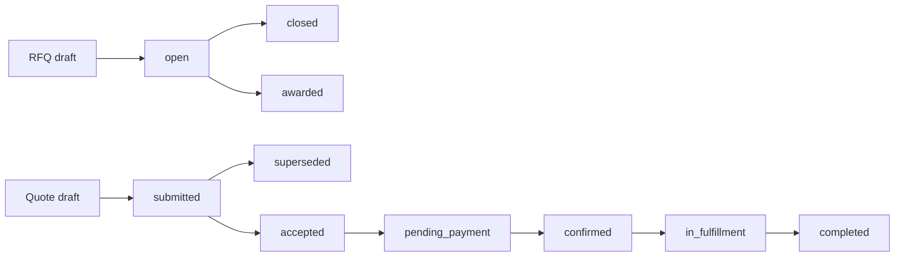

# STORE_BACKEND_STRUCTURE.md — B2B Store, Procurement, and Trade Services

> This document specifies the **buyer-facing store and commerce backend** for Qatoto:
> public catalog discovery, company storefronts, requests for quotation, quote negotiation,
> purchase orders, payment orchestration, fulfillment, and independently selectable trade-service
> providers.
>
> The backend repository is `/Users/vinitchuri/code/backend/qatoto-backend`.
>
> **Read alongside:**
>
> - [STORE_STRUCTURE.md](STORE_STRUCTURE.md) — the frontend route, component, and integration plan.
> - [STUDIO_PRODUCTS_BACKEND_STRUCTURE.md](STUDIO_PRODUCTS_BACKEND_STRUCTURE.md) — the shipped
>   seller-owned `/products/*` CRUD, images, B2B tiers, publish, and unpublish contract.
> - [STUDIO_PRODUCTS_STRUCTURE.md](STUDIO_PRODUCTS_STRUCTURE.md) — the shipped seller listing UI.
> - [R_AND_D_BACKEND_STRUCTURE.md](R_AND_D_BACKEND_STRUCTURE.md) — the separate R&D supplier
>   directory and project-engagement domain.
> - [ESCROW_LEDGER_STRUCTURE.md](ESCROW_LEDGER_STRUCTURE.md) — the existing project-funding ledger;
>   commerce may reuse its accounting patterns, not its project-scoped rows.
> - [CLAUDE.md](CLAUDE.md) — thin-client trust boundary and wire-casing rules.
>
> **Goal:** provide an Alibaba-style B2B market where an organization can discover and buy a
> product, request negotiated pricing, and separately engage freight forwarders, air/sea/land
> logistics operators, customs brokers, insurance providers, inspection agencies, testing and
> certification laboratories, marketing agencies, warehouse providers, and foreign-exchange
> facilitators.
>
> **Stack:** Express 5 + TypeScript strict + Drizzle ORM + PostgreSQL + Zod + Better Auth +
> Cloudinary/object storage + pg-boss + the existing provider-adapter and rate-limit patterns.
>
> **Status:** **Phases 0–19 shipped and hardened.** Seller `/products/*` CRUD, commerce
> organizations/memberships/addresses/verification, public `/store/*` catalog reads,
> merchandising, search documents, the provider connector directory, RFQs, quote negotiation,
> quote-originated order snapshots, RFQ/quote threads, buyer carts, server-priced checkout
> preparation and confirmation into direct-checkout orders, buyer/counterparty order queues and
> cancellation, product shipments, standalone service engagements, commerce payment intents,
> refunds, a double-entry commerce journal (fake provider adapter only), shipment-leg command
> execution, immutable typed engagement snapshots, contracted deliverable plans/results,
> derived fulfillment progress, server-issued completions, verified reviews, disputes, and
> privacy-safe review/completion metrics are implemented. Phase 8 adds **product variants,
> media kinds, specification groups, packaging geometry, product highlights, the product
> relation graph, and the merchandising integrity fixes**. Phase 9 adds **guided pathway slots
> and ranked candidates, anchored sets resolved from the relation graph, read-time per-currency
> set totals, honest degradation, authoring and moderation, cart seeding, and the nightly
> co-occurrence derivation job**. Phase 11 adds **the `delivery` address kind and its
> authorized decrypt route, indicative delivery estimates, orderable samples with
> refundable-sample credits, and seller-declared customization options**. See
> `docs/STORE_PHASE_5_ROLLOUT.md`
> for the payments/journal contract, `docs/STORE_PHASE_6_ROLLOUT.md` for connector execution,
> `docs/STORE_PHASE_7_ROLLOUT.md` for the trust MVP, `docs/STORE_PHASE_8_ROLLOUT.md` for
> catalog depth, `docs/STORE_PHASE_9_ROLLOUT.md` for guided pathways, and
> `docs/STORE_PHASE_11_ROLLOUT.md` for buyer logistics, and
> `docs/STORE_PHASE_10_ROLLOUT.md` for the public voice, and
> `docs/STORE_PHASE_12_ROLLOUT.md` for seller profile depth. Phase 10 adds **review reads with media,
> sub-scores, helpful votes and seller replies; product Q&A; user-scoped engagement counters;
> content reports with a commerce moderation queue; and pre-sales product inquiries**. Phase 12 adds
> **seller-declared company depth, moderated certifications, and the promised-delivery timestamp
> that makes `onTimeShipmentRate`, reorder rate and measured response time real** — projected as a
> `declaredProfile` object separate from `measuredMetrics`, because a seller's assertion and a
> platform measurement must not be renderable through one code path.
> **Phase 14 settled §14's custody question and built against it:** Qatoto provides no escrow
> and never holds funds, escrow is negotiated between the parties and held by a licensed third
> party reached through a connector, and the default rail is unprotected direct settlement.
> The connector substrate, the external escrow adapter, the four remaining adapter seams and
> the document scanner ship with it; see `docs/STORE_PHASE_14_ROLLOUT.md`.
> **Phase 15 closes Appendix A (`0093`–`0097`):** the customization-option read that made a
> required slot checkoutable at all, helpful votes on answers with per-viewer state on both
> public reads, a supplier directory and the filters matching the facets the platform already
> publishes, category ancestors, per-tier lead time, a participant dispute read, the cross-order
> logistics queue, and buyer-authored trade attachments with the authorized download that makes
> them openable. See `docs/STORE_PHASE_15_ROLLOUT.md`.
> **Phase 16 gave the browse taxonomy an author (`0098`):** `commerce_category` had shipped in
> Phase 0 with public reads and a seed script and no way for anybody to change it, so the
> hierarchy every buyer browses was editable only by hand in psql. Phase 16 adds the staff CRUD
> surface — create with an image, rename, re-parent, reorder a whole sibling set at once, retire
> reversibly — plus `commerce_category_request`, the queue through which a seller asks for a
> category that does not exist yet and a moderator either mints it or says why not. See §4.3 and
> §6.5. It is the first store phase whose frontend shipped **wired rather than mocked**.
> **Phases 17–19 closed the last three buildable Appendix A entries (`0099`–`0105`)** — the
> manufacturer directory, the business forum and the cofounder directory. See §16, §17, §18 and the
> per-phase notes in §12, plus `docs/STORE_PHASE_17_18_19_ROLLOUT.md`.
> Trade-assurance language and real payment processors remain blocked on §14, as do the cofounder
> directory's capital and equity figures — Phase 19 shipped the rest of that surface and stores
> neither. **A10 (public
> product comments) stays deliberately unbuilt** pending the product decision the appendix asks
> for. **Product organization-ownership and category columns are now NOT NULL** —
> migration `0063` closed Phase 0's contract phase, dropping the expand-phase fill trigger
> and making `seller_organization_id`, `created_by_user_id` and `category_id` mandatory.
> `product.seller_id` is gone — migration `0088` dropped it in Phase 14d. The legacy
> `category` column and its `product_category` enum survive and still have eight readers
> under `/products/*`; removing them needs the frontend decision `docs/STORE_PHASE_14_ROLLOUT.md`
> records under "Still open".
>
> **Migrations `0090`–`0091` close two integrity gaps found by auditing this document against
> the code rather than from the frontend side:** `product_image.media_kind` no longer offers a
> `video` value it could never store, and the five seller-writable image columns are
> platform-hosted rather than hotlinked — which is what makes moderating a pathway image mean
> anything (Appendix A21). Three verifier scripts that still asserted against the
> `store_pathway_item` table `0088` dropped were also repaired; the Phase 9 one had been
> throwing `42P01` and losing all twelve of its checks.
>
> **What is NOT built, and what the frontend is standing in for meanwhile:**
> [Appendix A](#appendix-a--what-the-frontend-needs-and-this-backend-does-not-have)
> is the register of every store feature the frontend rendered as mock UI, with the tables,
> columns and routes each one needed. **No entry there now describes a field that reaches the wire
> and can never carry a real value** — `onTimeShipmentRate` was the last one, and Phase 12 supplied
> the promised-delivery timestamp it needed (A13). It is `null` only below its sample threshold, and
> `onTimeSampleSize` rides alongside so "not enough data" is distinguishable from "not wired".
> **After Phase 19 the register's only unbuilt entries are the deliberate ones**: A10 closed pending
> a product decision, A20 blocked on §14, A26 deferred until a category actually sells on two
> dimensions, and the capital half of A34 held behind the same §14 answer A20 is waiting on.
>
> **Phases 17–19 closed the last three buildable entries in the register (`0099`–`0105`)** — A32,
> A33 and A34, specified as §16, §17 and §18. The store frontend had shipped a manufacturer
> directory (`/store/factories`), a business forum (`/store/forum`) and cofounder matching
> (`/store/find-cofounder`), each with a complete Zod wire contract in `src/lib/store/*.schemas.ts`
> and a mock-backed `*.api.ts` beside it, and none of the three had a table, route or service here.
> All three are now served.
>
> **Phase 17** built the manufacturer directory as a projection over Phase 12's seller profile and
> A25's organization search document, resolved §16.2's three conflicts (the capability enum widened
> additively; a nullable `standardCode` beside the free-text certification name; **`site_audited`
> given the audit record it had been asserting without**, never derived from a document review), and
> added the manufacturing inquiry with its own one-to-one thread. `exportMarkets` was decided
> **derived** rather than declared.
>
> **Phase 18** built the forum, and shipped the reply, accept-answer and helpful writes alongside
> the thread create rather than after it — a forum with only thread-create is a wall of unanswerable
> questions. `pending_review` on create is what keeps A10 closed while a public text surface exists.
>
> **Phase 19** built the cofounder directory **without any capital or equity column**, which is §14's
> deferral honoured literally rather than waited on: the surface and its whole lifecycle are live,
> and both wire fields serve `null` until a lawyer answers per market. A verifier asserts that
> absence so nobody adds the columns by accident.
>
> **Community is a sibling context, and Phase 18 introduced the `/community` mount to say so** (§1.1).
> Forum and cofounder READS live under `/store` because that is the prefix a signed-out visitor
> browses; their writes do not.
>
> **A31 and A35 are the other direction, and both matter more than they look.** A31 records a
> feature this document did not describe because it shipped after the last documentation pass, not
> because it is missing. A35 records **eighteen routes the backend serves that §5 and §6 never
> listed**, plus two places where a shipped response and the frontend's parser disagree. A document
> that undercounts what exists sends somebody to build it twice.
>
> **A23–A30 were added by auditing this document from the frontend side after Phase 14, and three
> of them described defects in shipped features rather than missing ones.** A23 was a commercial
> term the backend enforced at `checkout/prepare` and never projected, so a product carrying a
> required customization option could not be checked out by anybody. A30 was a request field no
> route could fill. A28 was a dispute with no reader but platform staff. **Phase 15 closed every
> buildable entry in the register (`0093`–`0097`)**; see `docs/STORE_PHASE_15_ROLLOUT.md`. What
> remains open there is recorded under "Still open" rather than left to be rediscovered — chiefly
> that `getCategoryFacets` and `/store/search` now compute from different tables and can drift.
>
> The `trending_placeholder` rail strategy still returns an empty list unconditionally and always
> will — **Phase 13 shipped `trending` and `recommended` alongside it**, and the placeholder is kept
> forever so that backing the ranking engine out stays a per-rail data edit rather than a deploy. Checkout
> `shippingInCents` is still written literal `0` (`commerce-checkout.service.ts:515-517` and
> `:807-809`) — Phase 8 supplies the weight and dimensions A16 needs to rate freight, but not the
> estimate itself, and A16 records that as the decision rather than the gap.

---

## 0. The rule that governs the store

**The frontend is hostile. The Express backend is the only authority.**

The client may display a price, quantity, verification badge, delivery estimate, insurance limit,
exchange rate, tax estimate, or order status. It may never establish any of them.

- Identity comes from the authenticated session. Organization membership and role are loaded on
  every protected action; `buyerOrganizationId`, `sellerOrganizationId`, and `providerOrganizationId`
  are never trusted merely because they appear in a body.
- Public catalog reads expose only active products whose owning organization is allowed to trade.
  A direct request for a draft, suspended, or deleted listing returns `404`.
- Price tiers, stock, quote totals, taxes, fees, payment amounts, exchange rates, and refunds are
  reloaded or recomputed in the same transaction that performs the state transition.
- Accepting a quote snapshots commercial terms. Later edits to a product, service offering, company
  profile, or tax rule cannot rewrite an accepted order.
- Provider verification is server-owned. Uploading a certificate creates evidence awaiting review;
  it never grants a badge.
- A browse-country preference is display-only. Compliance, tax, sanctions, export control, and
  availability decisions use server-derived and verified facts.
- Every mutation is authorized for the exact organization and resource. A valid account is not
  automatically a buyer, seller, provider, or moderator.
- Expensive or replayable writes use an idempotency key minted once per user attempt. Duplicate
  requests return the original result.
- Payment-provider, carrier, laboratory, insurer, and FX webhooks are authenticated, deduplicated,
  persisted before processing, and applied by workers.
- Expected failures are `Result<T, E>` values. Controllers exhaustively map them to HTTP responses.

If a rule must remain true after DevTools changes or request replay, it belongs in this backend.

---

## 1. Scope and bounded contexts

### 1.1 What this domain owns

| Context             | Owns                                                                             |
| ------------------- | -------------------------------------------------------------------------------- |
| Commerce identity   | Organizations, memberships, trade roles, addresses, verification evidence        |
| Public catalog      | Active product projections, categories, search, facets, storefronts              |
| Merchandising       | Hero slides, rails, placements, guided pathway sets and slots, product relations |
| Service marketplace | Provider profiles, capabilities, service offerings, coverage, credentials        |
| Sourcing            | RFQs, invitations, requirement lines, quote revisions, negotiation               |
| Purchasing          | Carts, checkout groups, purchase orders, immutable commercial snapshots          |
| Payments            | Commerce payment intents, provider adapter references, refunds, reconciliation   |
| Fulfillment         | Product shipments and connector engagements                                      |
| Trust               | Trade-assurance cases, disputes, reviews, Q&A, reports, moderation               |
| Communication       | Resource-scoped threads, participants, messages, attachment metadata             |
| Taxonomy            | The browse category tree, its ordering and imagery, and the seller request queue |

**Community is a sibling context, not a row in that table.** The business forum (§17) and cofounder
profiles (§18) are public text written by people, attached to a commerce platform's domain and
sharing none of commerce's nouns — no organization is required to post, nothing is priced, nothing is
ordered. They own `community_*` tables and mount their writes at `/community/*`.

**Their public reads still live under `/store/*`, and that is a mount point rather than a context
claim.** The precedent is already in the code: `commerceProductEngagementRouter` mounts at `/store`
(`src/app.ts:228`) while owning no store table. `/store` is the prefix a signed-out visitor browses;
`/commerce` and `/community` are where the two write surfaces live. Do not read
`GET /store/forum/threads` as evidence that a forum thread is a commerce object — the section it is
specified in is the authority, not the path.

### 1.2 What this domain does not own

- Seller listing authoring remains under `/products/*`.
- The R&D `/suppliers/*` directory remains a project go-to-market domain. Its supplier quotes and
  engagements do not become store orders.
- R&D compensation records are attestations about payment elsewhere. They are not checkout.
- The project-funding ledger remains project-scoped. Commerce uses a separate journal namespace or
  separate commerce ledger tables, even if it reuses accounting code and provider adapters.
- Product research, proof of effort, equity, and programme contribution do not affect store price,
  provider verification, or order entitlement.
- Forum threads and cofounder profiles are **community**, not commerce (§1.1). A forum reply confers
  no standing in a dispute, a cofounder profile is not an organization, and neither may be joined to
  a commerce row to imply either. The one hard rule underneath: **nothing on the community surface
  may be read as a commercial fact about a party**, because no order, payment or verification stands
  behind any of it.

### 1.3 One organization may participate in several roles

One `commerce_organization` may be a buyer, product seller, and one or more provider kinds. Roles
do not imply one another. A freight forwarder can buy office equipment without becoming a verified
seller; a manufacturer can sell products without being approved to broker customs.

The existing R&D `supplier` row may optionally link to a commerce organization after moderator
review. The link avoids duplicate company identity but imports **no trust state, quote, price, or
project engagement**.

---

## 2. Core architecture decisions

### 2.1 Products and services are not one polymorphic listing

Products have inventory, images, variants, and quantity tiers. Services have coverage, eligibility,
capacity, evidence, and quote-specific requirements. A single nullable `listing` table would allow
invalid combinations such as stock on an insurance policy or warehouse capacity on a chair.

Therefore:

- Existing `product` tables remain product-specific.
- `commerce_service_offering` stores the common provider-facing contract.
- Exactly one typed extension row describes each service offering.
- RFQs, quote revisions, and orders have separate product-line and service-line tables.
- Explicit link tables connect a service engagement to an order or shipment when applicable.

### 2.2 An accepted quote is immutable

Negotiation creates append-only `commerce_quote_revision` rows. Editing means creating the next
revision, never updating the previous one. Acceptance locks one revision and creates an order from
that snapshot in one transaction.

### 2.3 A checkout group is not a multi-party order

A buyer action may involve several counterparties. The backend creates:

- one `commerce_checkout_group` for buyer-facing coordination; and
- one `commerce_order` per seller/provider organization.

This prevents one late warehouse provider from blocking a manufacturer’s shipment and keeps
authorization, invoicing, refunds, and disputes attributable to one counterparty.

### 2.4 Search and ranking are backend work

Catalog filtering, faceting, ranking, recommendation candidate selection, and pagination run in
PostgreSQL/services. The frontend never downloads a page and pretends it searched the catalog.
Personalization may rerank eligible candidates, but sponsored placement is always labelled and
never bypasses eligibility or moderation filters.

---

## 3. Backend folder plan

```text
qatoto-backend/src/
├── db/
│   └── schema.ts
├── routes/
│   ├── store.routes.ts                    # public catalog, categories, merchandising
│   ├── commerce-organizations.routes.ts   # organization + membership management
│   ├── commerce-providers.routes.ts       # provider profiles and offerings
│   ├── commerce-rfqs.routes.ts            # buyer RFQs, invitations, quote reads
│   ├── commerce-quotes.routes.ts          # provider revisions + buyer acceptance
│   ├── commerce-cart.routes.ts
│   ├── commerce-orders.routes.ts
│   ├── commerce-payments.routes.ts
│   ├── commerce-fulfillment.routes.ts
│   ├── commerce-messages.routes.ts
│   └── commerce-trust.routes.ts
├── controllers/
│   └── <matching files>.controller.ts     # params/query/body Zod parse + HTTP mapping
├── services/
│   ├── store-catalog.service.ts
│   ├── store-search.service.ts
│   ├── commerce-organizations.service.ts
│   ├── commerce-providers.service.ts
│   ├── commerce-rfqs.service.ts
│   ├── commerce-quotes.service.ts
│   ├── commerce-checkout.service.ts
│   ├── commerce-orders.service.ts
│   ├── commerce-payments.service.ts
│   ├── commerce-fulfillment.service.ts
│   ├── commerce-messages.service.ts
│   └── commerce-trust.service.ts
├── adapters/
│   ├── commerce-payment-provider.adapter.ts
│   ├── logistics-provider.adapter.ts
│   ├── insurance-provider.adapter.ts
│   ├── laboratory-provider.adapter.ts
│   └── foreign-exchange-provider.adapter.ts
├── jobs/
│   ├── expire-commerce-quotes.ts
│   ├── release-expired-inventory-reservations.ts
│   ├── reconcile-commerce-payments.ts
│   ├── refresh-store-search-document.ts
│   └── dispatch-commerce-webhook-event.ts
└── app.ts                                  # mount /store and /commerce routers
```

Controllers do not contain domain decisions. Services do not inspect raw Express requests.
Adapters translate external provider protocols into internal tagged results.

---

## 4. Data model

All table names are snake_case; Drizzle property names are camelCase. IDs are opaque text values
generated with `randomUUID()`. Timestamps are UTC. Public slugs are kebab-case and immutable after
publication; changing a display name does not change a URL identity.

### 4.1 Commerce organizations

`commerce_organization`

- `id`, immutable `slug`, `legalName`, `displayName`, `summary`
- `organizationType`: `company | sole_proprietor | cooperative | government | nonprofit`
- `tradeState`: `pending | active | suspended | closed`
- `countryCode`, `registrationNumberEncrypted`, `taxIdentifierEncrypted`
- `logoUrl`, `websiteUrl`, `createdByUserId`, timestamps
- unique slug; normalized legal-name/country lookup; encrypted identifiers never appear publicly

`commerce_organization_member`

- `organizationId`, `userId`
- `role`: `owner | administrator | buyer | seller | provider_operator | finance | support | viewer`
- `state`: `invited | active | suspended | left`
- `invitedByUserId`, `joinedAt`, `leftAt`
- unique `(organizationId, userId)` for an active membership

`commerce_organization_address`

- organization-owned billing, registered, warehouse, pickup, and return addresses
- normalized country/region/locality/postal fields plus encrypted contact details
- buyer delivery addresses are private; public storefront locations use an explicit public projection

`commerce_organization_verification`

- `verificationKind`, `state`, evidence object key, reviewer, decision reason, timestamps
- evidence upload never modifies `tradeState` or provider badges directly

### 4.2 Migrating shipped products to organization ownership

The shipped `product.sellerId` points to a Better Auth user. Migration must not break Studio.

1. Add nullable `sellerOrganizationId` and `createdByUserId`.
2. Create one private seller organization for each existing seller and backfill active products.
3. Update `/products/*` authorization to require an active seller membership and derive the
   organization from the session/context. During transition, preserve owner-only behavior.
4. Make `sellerOrganizationId` non-null after backfill verification.
5. Retain `createdByUserId` for attribution. Remove or rename legacy `sellerId` only in a later
   migration after all callers use organization ownership.

No request body chooses arbitrary ownership. Organization switching uses a server-issued active
organization context and rechecks membership.

### 4.3 Category migration

The shipped `product_category` enum has eight seller categories. Buyer browse needs a hierarchy.

`commerce_category`

- `id`, immutable `slug`, `name`, `parentCategoryId`, `siblingOrder`
- `state`: `draft | active | retired`
- `imageUrl`, `searchSynonyms`, timestamps
- unique slug; unique sibling order per parent; no cycles (service check plus constraint trigger)

Migration:

1. Seed roots corresponding to the eight legacy enum values.
2. Add nullable `product.categoryId`, backfill from the enum, and dual-write temporarily.
3. Change Studio to submit `categoryId`; backend verifies an active leaf category.
4. Make `categoryId` non-null.
5. Retain the old enum only until old clients and migrations are retired.

Product enum values remain snake_case. Public category slugs remain kebab-case. These are separate
wire concepts and must not be converted into each other implicitly.

#### 4.3a Who edits the tree — **SHIPPED (Phase 16, `0098`)**

The block above shipped in Phase 0 with public reads and a seed script and **no way for anybody to
change it**. The hierarchy every buyer browses was editable only by hand in psql, and a seller whose
product fitted no existing category had nowhere to say so. Phase 16 closes both.

`commerce_category_request`

- `id`, `requestedByUserId`, `requestedOrganizationId` — both `ON DELETE SET NULL`, because a
  deleted account must not pin a decided request and the verdict stays a fact about the taxonomy
  after its author is gone
- `proposedName` — what the seller typed, **not a slug**
- `proposedParentCategoryId` — where the seller thinks it belongs; `null` means "a new root"
- `justification`
- `state`: `pending | approved | rejected`
- `reviewedByUserId`, `reviewedAt`, `reviewNote`, `resultingCategoryId`, timestamps
- queue index `(state, createdAt, id)` — the same shape as `store_pathway_moderation_queue_idx`
- `CHECK (reviewed_at IS NULL) = (state = 'pending')`, a `resultingCategoryId` only on the approve
  arm, and `review_note NOT NULL` on the reject arm

**Why it is its own table and not a `pending` state on `commerce_category`.** A request is a
different thing from a category: it has an author, a justification and a verdict, and it has no place
in the tree — no `siblingOrder`, no children, no products. Proposals living in `commerce_category`
would mean either excluding a state from every browse query forever, where one forgotten `WHERE` puts
unapproved user text on the storefront, or minting a fake `siblingOrder` to satisfy an index that
exists to order things users can actually see.

**A pending request does not block the listing.** The seller publishes immediately, the product parks
in `misc`, and `product.pendingCategoryRequestId` points back at the request. That column is the
**only** link, and it is what makes approval surgical: the verdict rehomes the products belonging to
_this_ request and leaves genuine `misc` listings alone. Repointing by `WHERE category_id = misc`
would sweep up unrelated sellers' products, so no code path may do it.

Five rules the shipped surface enforces, each of which a future edit will be tempted to relax:

- **`childCount` and `productCount` are DERIVED and appear in no request body.** They are what the
  retire guard reads. A client able to set them could talk that guard into hiding a category that
  still has listings under it.
- **There is no DELETE, deliberately.** `product.categoryId` is `ON DELETE RESTRICT` and the demand
  snapshots cascade, so removal would either fail or take history with it. `retire` is reversible
  removal from browse and is the only exit.
- **`slug` is absent from the PATCH body**, and the body is `.strict()` so sending it is a 422. A
  slug is a public URL identity — linked and indexed the moment the category is published — and a
  category that needs a different one is a new category.
- **The moderator chooses the slug, not the requester.** It exists only on the approve arm of the
  verdict, which is a discriminated union: a rejection _requires_ a note, an approval does not.
- **Route order is load-bearing.** Express matches in declaration order, so the literal
  `/admin/categories/reorder` must precede `/admin/categories/:categoryId` or every reorder 404s with
  `"reorder"` captured as a category id.

The `moderate_commerce` check runs **inside the service, not as route middleware** — so it returns a
`Result` that takes part in the controller's exhaustive error switch, and so it can be proven to run
before any id is read. This is the §11 rule about id oracles, applied.

Eleven `platform_audit_event_kind` members ship with it: `commerce_category_created`,
`commerce_category_updated`, `commerce_category_reordered`, `commerce_category_image_replaced`,
`commerce_category_retired`, `commerce_category_request_approved`,
`commerce_category_request_rejected`, alongside the four `commerce_content_*` members Phase 10 added.

### 4.4 Public product extensions

The public catalog reuses `product`, `product_image`, and `product_pricing_tier`, adding only fields
that a buyer contract needs:

- `product.publicSlug`
- optional `product.modelNumber`, `countryOfOriginCode`, `unitOfMeasure`
- `product.samplePolicy`: `unavailable | paid | refundable`
- optional server-owned `samplePriceInCents`
- `product.leadTimeMinDays`, `leadTimeMaxDays`
- `product.moderationState`: `pending | approved | rejected | suspended`
- optional structured specification schema/value tables

An active seller status alone is insufficient for public visibility: product status, moderation,
organization trade state, and category state must all be eligible.

### 4.5 Provider profiles and offerings

`commerce_provider_profile`

- `organizationId` primary key
- public summary, support policy, response-time statistics
- `verificationState`: `unverified | documents_pending | verified | rejected | suspended`
- `acceptingRequests`, service-region summary, timestamps

`commerce_provider_kind`

- seeded values:
  - `freight_forwarder`
  - `logistics_operator`
  - `customs_broker`
  - `insurance_provider`
  - `inspection_agency`
  - `testing_certification_lab`
  - `marketing_agency`
  - `warehouse_provider`
  - `foreign_exchange_facilitator`

`commerce_provider_kind_link` is many-to-many because one verified organization may operate, for
example, freight forwarding and warehousing. Verification is recorded per kind, not globally.

`commerce_service_offering`

- `id`, immutable `slug`, `providerOrganizationId`, `providerKind`
- `title`, `summary`, `state`: `draft | pending_review | active | suspended | retired`
- `pricingModel`: `quote_only | fixed_fee | per_unit | subscription`
- optional public indicative price range in integer cents plus server-owned currency
- `minimumLeadTimeDays`, `maximumLeadTimeDays`
- timestamps and moderation attribution

`commerce_service_coverage`

- offering, origin/destination country or seeded region, optional port/airport/location identifiers
- capability flags are filter inputs, not proof that a provider may legally serve a route

Typed one-to-one extension tables:

- `freight_offering_detail`: supported `air | sea | land | rail | multimodal`, consolidation,
  container and hazardous-goods capabilities
- `customs_brokerage_offering_detail`: jurisdictions, import/export direction, commodity coverage
- `insurance_offering_detail`: cargo coverage classes, limit ranges, exclusions-document reference
- `inspection_offering_detail`: pre-production, during-production, pre-shipment, loading supervision
- `testing_certification_offering_detail`: standards, accreditation bodies, laboratory locations
- `marketing_offering_detail`: channels, target regions, language capabilities, engagement model
- `warehouse_offering_detail`: storage types, temperature control, bonded status, capacity units
- `foreign_exchange_offering_detail`: currency pairs, settlement rails, minimum/maximum notional

The service verifies exactly one extension row matches `providerKind`. No generic JSON blob decides
eligibility or pricing.

### 4.6 RFQs and invitations

`commerce_rfq`

- buyer organization, creator, title, description
- `state`: `draft | open | closed | awarded | cancelled | expired`
- response deadline, desired delivery window, destination, settlement currency
- visibility: `invited_only | matched_providers`
- timestamps

`commerce_rfq_product_line`

- product reference nullable when sourcing an unlisted product
- immutable requested title/specification snapshot, quantity, unit, target category

`commerce_rfq_service_line`

- provider kind, service offering optional, common requirement summary
- typed requirement extension table matching the provider kind
- may link to a product line without becoming its child lifecycle

`commerce_rfq_invitation`

- RFQ + provider organization, state, sent/read/responded timestamps
- unique `(rfqId, providerOrganizationId)`

Opening an RFQ validates buyer organization state, deadline, at least one valid line, document
ownership, and all required service-specific fields.

### 4.7 Quote revisions

`commerce_quote`

- RFQ, provider organization, status: `draft | submitted | superseded | accepted | declined |
withdrawn | expired`
- latest revision number, timestamps
- unique provider per RFQ unless the buyer explicitly re-invites after closure

`commerce_quote_revision`

- quote, monotonic revision number, currency, validity deadline
- subtotal, tax, service fee, shipping, discount, and total in integer cents
- payment terms, Incoterm when relevant, notes, createdByMemberId
- immutable after submission

`commerce_quote_product_line` and `commerce_quote_service_line`

- reference the matching RFQ line
- quantity and unit price/fee components
- immutable title, scope, lead time, exclusions, and deliverable snapshots
- typed service quote extensions for route legs, insurance coverage, test standards, storage
  capacity, marketing deliverables, and FX rate details

For FX, rates are fixed-point integers plus an explicit scale or canonical decimal strings parsed
by a decimal library on the backend. JavaScript/Postgres floating point is forbidden for money or
exchange rates.

### 4.8 Cart, reservations, checkout, and orders

`commerce_cart` belongs to one buyer organization. `commerce_cart_product_line` stores product,
quantity, and selected variant/options only. It does not store an authoritative total.

`commerce_inventory_reservation`

- product/variant, organization/cart, quantity, expiration, state
- created during checkout preparation using row locks
- released by worker on expiry; consumed atomically by order creation

`commerce_checkout_group`

- buyer organization, state, server-computed aggregate display totals, idempotency key

`commerce_order`

- checkout group nullable for quote-originated orders
- buyer and one counterparty organization
- source: `direct_checkout | accepted_quote`
- `state`: `pending_payment | payment_processing | confirmed | in_fulfillment |
partially_completed | completed | cancelled | disputed`
- immutable legal names, addresses, currency, totals, terms, and accepted quote revision

`commerce_order_product_line` and `commerce_order_service_line`

- immutable commercial snapshots
- product line has ordered, reserved, fulfilled, cancelled, and refunded quantities
- service line points to a separately stateful connector engagement

### 4.9 Payments and journal

Commerce does not post into project-funding rows. It introduces:

- `commerce_payment_intent`
- `commerce_provider_transfer`
- `commerce_refund`
- `commerce_journal_account`
- `commerce_journal_entry`
- `commerce_journal_line`

The journal is double-entry and append-only. Provider calls are made only after the local transfer
row and idempotency key are committed. Webhook receipt is stored before state transition.

Payment state:

`created → requires_action | processing → authorized → settled`

Terminal alternatives: `failed | cancelled | partially_refunded | refunded | disputed`.

“Trade assurance” copy is not enabled until the legal custody model, eligible payment method,
dispute rules, and journal postings are implemented. Qatoto must never claim funds are escrowed
merely because an order row exists.

### 4.10 Fulfillment and loose connector engagements

`commerce_service_engagement`

- accepted service quote/order line, provider organization, buyer organization
- `state`: `awaiting_provider | scheduled | in_progress | awaiting_buyer | completed |
cancelled | disputed`
- independent timestamps and deliverable acceptance

`commerce_order_service_link`

- explicitly links an engagement to an order, product line, or shipment
- absence is valid: a company may buy lab testing or marketing without buying a product on Qatoto

`commerce_shipment`

- one seller order, origin/destination snapshots, state, package totals

`commerce_shipment_leg`

- ordered legs with mode `air | sea | land | rail`
- optional freight/logistics engagement
- carrier references and tracking events are append-only

Customs, insurance, inspection, laboratory, warehouse, marketing, and FX each receive typed
engagement detail/deliverable tables. Completion of one never directly marks another complete.
An order coordinator derives aggregate progress for display.

### 4.11 Communication, trust, and moderation

Threads are resource-scoped: RFQ, quote, order, service engagement, or dispute. Participants are
derived from organization memberships. Attachment object keys are private and served through
short-lived authorized URLs.

Reviews require a completed order/engagement and are unique per reviewer organization/resource.
Provider metrics are backend aggregates over eligible records, never client submissions.

Reports and disputes preserve snapshots, messages, evidence, moderator actions, and an append-only
audit event. A seller/provider cannot review or resolve its own case.

---

## 5. Public Store API

Public reads use `attachOptionalUser`, strict query parsing, bounded limits, deterministic ordering,
and buyer-safe projections.

| Method | Route                                            | Purpose                                                               |
| ------ | ------------------------------------------------ | --------------------------------------------------------------------- |
| GET    | `/store/home`                                    | Curated hero, categories, pathways, provider shortcuts, product rails |
| GET    | `/store/categories`                              | Root or parent-scoped active categories                               |
| GET    | `/store/categories/:slug`                        | Category metadata, children, facets, first result page                |
| GET    | `/store/search`                                  | Product/provider search with server-side filters and cursor           |
| GET    | `/store/products/:productSlug`                   | Public product detail, tiers, seller/storefront projection            |
| GET    | `/store/organizations/:organizationSlug`         | Public company storefront                                             |
| GET    | `/store/providers`                               | Filterable provider directory                                         |
| GET    | `/store/providers/:organizationSlug`             | Public provider profile and active offerings                          |
| GET    | `/store/services/:offeringSlug`                  | One active service offering                                           |
| GET    | `/store/pathways`                                | Active guided sets — see §15                                          |
| GET    | `/store/pathways/:pathwaySlug`                   | Pathway slots, ranked candidates, set totals, completeness (§15.7)    |
| GET    | `/store/products/:productSlug/companions`        | Relation-graph companions for a product detail page (§15.7)           |
| GET    | `/store/rails/:railSlug`                         | Paginated curated/ranked feed                                         |
| GET    | `/store/products/:productSlug/reviews`           | Reviews with summary, histogram and sub-scores — A8                   |
| GET    | `/store/organizations/:organizationSlug/reviews` | Reviews of a seller or provider, incl. product-less ones — A8         |
| GET    | `/store/products/:productSlug/questions`         | Public Q&A with a seller-first answer preview — A9                    |
| GET    | `/store/factories`                               | Manufacturer directory — §16 (Phase 17)                               |
| GET    | `/store/factories/:factorySlug`                  | One factory: lines, certifications, sites, audit — §16 (Phase 17)     |
| GET    | `/store/forum/threads`                           | Board-filtered thread list — §17 (Phase 18)                           |
| GET    | `/store/forum/threads/:threadSlug`               | One thread and a cursor page of replies — §17 (Phase 18)              |
| GET    | `/store/cofounder-profiles`                      | Cofounder directory, `published` only — §18 (Phase 19)                |
| GET    | `/store/cofounder-profiles/:profileSlug`         | One cofounder profile — §18 (Phase 19)                                |

**Every row in this table resolves today.** The last six were marked NOT BUILT until Phases 17–19
shipped them; the marking is kept in the git history rather than in the table, because a table that
carries stale warnings is one nobody reads.

The two forum rows and the two cofounder rows are **community, not commerce** (§1.1). `/store` is
where they are mounted because it is the prefix a signed-out visitor browses; their WRITES are at
`/community` (§6.6). Do not read `GET /store/forum/threads` as evidence that a forum thread is a
commerce object.

`/store/search` also accepts `documentKind=organization` — the supplier directory — and the facet
filters `priceMinInCents`, `priceMaxInCents`, `stockState`, `samplePolicy`, `condition`,
`verificationState` and `leadTimeMaxDays` (A25). `/store/categories/:slug` carries `ancestors[]`.

Reads that admit an optional session project a `viewer` member when one resolves and `null`
otherwise — never a defaulted `false` (A11, A24). Public product detail carries
`customizationOptions[]` (A23) and `leadTimeDays` on each pricing tier (A27).

`category-slugs` and `pathway-slugs` mock endpoints are not durable public API requirements.
Dynamic routes should render on demand; build-time static parameter generation may use a bounded
featured-slug endpoint only if the deployment model requires it.

Example search:

```text
GET /store/search?query=solar+freezer&category=industrial-cooling
  &minOrderQuantityMax=50&sellerCountryCode=IN
  &providerKind=freight_forwarder&sort=relevance&limit=24&cursor=...
```

Query keys are camelCase. Enum values are snake_case. Category and product slugs are kebab-case.

### 5.1 Buyer-safe product projection

Public product detail includes:

- immutable ID and public slug
- title, brand, description, key features, category trail, specifications
- ordered public image URLs
- current currency and pricing tiers in integer cents
- stock state (`in_stock | low_stock | made_to_order | unavailable`), not private stock counts
- sample policy, lead-time range, MOQ, origin, moderation-safe seller projection
- server-derived review and fulfillment metrics

It excludes seller SKU internals when private, exact inventory, private contacts, draft fields,
organization member IDs, moderation notes, and storage object keys.

---

## 6. Authenticated Commerce API

### 6.1 Organizations and providers

| Method | Route                                                       | Result                                  |
| ------ | ----------------------------------------------------------- | --------------------------------------- |
| POST   | `/commerce/organizations`                                   | Create pending organization; idempotent |
| GET    | `/commerce/organizations/mine`                              | Membership-scoped organizations         |
| PATCH  | `/commerce/organizations/:organizationId`                   | Authorized profile update               |
| POST   | `/commerce/organizations/:organizationId/members`           | Invite member                           |
| PATCH  | `/commerce/organizations/:organizationId/members/:memberId` | Role/state update                       |
| POST   | `/commerce/providers/:organizationId/profile`               | Create provider profile                 |
| POST   | `/commerce/providers/:organizationId/offerings`             | Create draft offering                   |
| PATCH  | `/commerce/service-offerings/:offeringId`                   | Update owned draft                      |
| POST   | `/commerce/service-offerings/:offeringId/submit`            | Submit for moderation                   |
| POST   | `/commerce/providers/:organizationId/evidence`              | Upload verification evidence            |

Moderation routes live under the existing platform capability model and are not granted by an
organization role.

### 6.2 RFQs and quotes

| Method | Route                                                  | Result                               |
| ------ | ------------------------------------------------------ | ------------------------------------ |
| POST   | `/commerce/rfqs`                                       | Create buyer draft                   |
| GET    | `/commerce/rfqs/mine`                                  | Buyer organization RFQs              |
| GET    | `/commerce/rfqs/:rfqId`                                | Authorized RFQ projection            |
| PATCH  | `/commerce/rfqs/:rfqId`                                | Update owned draft                   |
| POST   | `/commerce/rfqs/:rfqId/open`                           | Validate and open                    |
| POST   | `/commerce/rfqs/:rfqId/invitations`                    | Invite eligible providers            |
| POST   | `/commerce/rfqs/:rfqId/close`                          | Close responses                      |
| GET    | `/commerce/provider/rfqs`                              | Invited/matched provider work queue  |
| POST   | `/commerce/rfqs/:rfqId/quotes`                         | Provider creates quote shell         |
| POST   | `/commerce/quotes/:quoteId/revisions`                  | Append draft revision                |
| POST   | `/commerce/quotes/:quoteId/revisions/:revision/submit` | Submit immutable revision            |
| POST   | `/commerce/quotes/:quoteId/accept`                     | Buyer accepts latest valid revision  |
| POST   | `/commerce/quotes/:quoteId/decline`                    | Buyer declines                       |
| POST   | `/commerce/quotes/:quoteId/withdraw`                   | Provider withdraws before acceptance |

Quote acceptance uses `If-Match`/version or expected revision in a strict body, locks the quote and
RFQ, validates expiry and authority, then creates order snapshots atomically.

### 6.3 Cart, checkout, orders, and payments

| Method | Route                                       | Result                                                    |
| ------ | ------------------------------------------- | --------------------------------------------------------- |
| GET    | `/commerce/cart`                            | Active organization cart with server-priced projection    |
| PUT    | `/commerce/cart/items/:productId`           | Set desired quantity                                      |
| DELETE | `/commerce/cart/items/:productId`           | Remove line                                               |
| POST   | `/commerce/checkout/prepare`                | Validate cart, reserve stock, return authoritative totals |
| POST   | `/commerce/checkout/confirm`                | Create checkout group and counterparty orders             |
| GET    | `/commerce/orders`                          | Buyer orders, cursor paginated                            |
| GET    | `/commerce/orders/:orderId`                 | Authorized order detail                                   |
| GET    | `/commerce/provider/orders`                 | Seller/provider work queue                                |
| POST   | `/commerce/orders/:orderId/cancel`          | Policy-checked cancellation                               |
| POST   | `/commerce/orders/:orderId/payment-intents` | Create/reuse payment intent                               |
| GET    | `/commerce/payments/:paymentIntentId`       | Poll payment state                                        |
| POST   | `/commerce/orders/:orderId/refunds`         | Authorized refund request                                 |

All create/confirm/payment/refund calls require `Idempotency-Key`. A `202` means processing has
started, not that payment, booking, testing, or settlement succeeded.

### 6.4 Fulfillment, messages, and trust

| Method | Route                                                     | Result                                                   |
| ------ | --------------------------------------------------------- | -------------------------------------------------------- |
| POST   | `/commerce/orders/:orderId/shipments`                     | Seller creates shipment plan                             |
| POST   | `/commerce/shipments/:shipmentId/events`                  | Authorized append-only event                             |
| GET    | `/commerce/service-engagements`                           | Buyer/provider engagement list                           |
| POST   | `/commerce/service-engagements/:engagementId/transitions` | Valid state transition                                   |
| POST   | `/commerce/threads`                                       | Create or return scoped thread                           |
| GET    | `/commerce/threads/:threadId/messages`                    | Cursor-paginated authorized messages                     |
| POST   | `/commerce/threads/:threadId/messages`                    | Append message                                           |
| POST   | `/commerce/orders/:orderId/disputes`                      | Open dispute with idempotency                            |
| POST   | `/commerce/completions/:completionId/reviews`             | Verified review                                          |
| POST   | `/commerce/reports`                                       | Report product/review/question/answer/organization — A12 |
| GET    | `/commerce/admin/content-reports`                         | Moderation queue — A12                                   |
| POST   | `/commerce/admin/content-reports/:reportId/decisions`     | Action or dismiss a report — A12                         |
| POST   | `/commerce/admin/content/restore`                         | Un-hide content — A12                                    |
| POST   | `/commerce/products/:productId/inquiries`                 | Open or return a pre-sales inquiry — A14                 |
| GET    | `/commerce/inquiries`                                     | Buyer/seller inquiry inbox — A14                         |
| GET    | `/commerce/completions`                                   | Buyer completions + `hasReview` — A22                    |
| PUT    | `/commerce/answers/:answerId/helpful`                     | Endorse an answer — A24                                  |
| DELETE | `/commerce/answers/:answerId/helpful`                     | Withdraw the endorsement — A24                           |
| GET    | `/commerce/disputes`                                      | Participant-scoped dispute list — A28                    |
| GET    | `/commerce/disputes/:disputeId`                           | One dispute, with its timeline; 404 to a non-party — A28 |
| GET    | `/commerce/provider/shipments`                            | Cross-order logistics queue — A29                        |
| POST   | `/commerce/documents`                                     | Upload a trade attachment; 202, `pending_scan` — A30     |
| GET    | `/commerce/documents/:documentId`                         | Decrypt and stream an authorized attachment — A30        |

### 6.5 Category taxonomy administration — **SHIPPED (Phase 16, `0098`)**

| Method | Route                                                 | Result                                           |
| ------ | ----------------------------------------------------- | ------------------------------------------------ |
| POST   | `/commerce/category-requests`                         | A seller asks for a category that does not exist |
| GET    | `/commerce/category-requests/mine`                    | The seller's own requests and their verdicts     |
| GET    | `/commerce/admin/categories`                          | The whole tree, draft and retired included       |
| POST   | `/commerce/admin/categories`                          | Create; multipart, optional `image` field        |
| PATCH  | `/commerce/admin/categories/reorder`                  | Sets one parent's WHOLE sibling order at once    |
| PATCH  | `/commerce/admin/categories/:categoryId`              | Name, parent, synonyms, state — never `slug`     |
| PATCH  | `/commerce/admin/categories/:categoryId/image`        | Replace the image in place; multipart            |
| POST   | `/commerce/admin/categories/:categoryId/retire`       | Out of browse, reversibly. There is no DELETE    |
| GET    | `/commerce/admin/category-requests`                   | The moderation queue, `?state=` filtered         |
| POST   | `/commerce/admin/category-requests/:requestId/decide` | The terminal verdict                             |

The eight `/admin/*` routes are gated by the `moderate_commerce` platform capability, checked
in-service (§4.3a). The two seller routes are the only non-staff writes here and they touch a
different table: a request mints nothing, and only a moderator's verdict creates a category. The
`POST` additionally carries `requireIdentifiedUser`, because `src/lib/auth.ts` registers the
`anonymous()` plugin and a session therefore proves nothing about identity on its own — **a request
nobody can be traced to is a request nobody can act on**. The `/mine` read does not need it: a caller
who cannot be identified has no requests to return.

**Reorder takes the whole set, not one move.** The body is `{ parentCategoryId, categoryIds[] }` and
must be an exact permutation of that parent's children. A per-row "move up" would have to write
intermediate orders that violate `commerce_category_siblingOrder_uidx` mid-transaction; taking the
final arrangement in one call means the unique index never sees an illegal state.

**The verdict body is a discriminated union, mirroring the decision rather than flattening it:**

- `{ decision: "approve", slug, name?, parentCategoryId?, note?, productAssignments? }`
- `{ decision: "reject", note, productAssignments? }`

`note` is required on the reject arm and optional on the approve arm, and `slug` exists only on
approve. **Both arms accept `productAssignments[]`** — `{ productId, categoryId }` pairs that override
the verdict's default target — because a rejection still has to put the waiting listings somewhere,
and a moderator reading the request often finds one of them belongs in a category that already
exists. That is also why the queue projects `waitingProducts` as **named titles rather than a
count**: a number tells a moderator how much work there is, a title tells them the request was
unnecessary.

### 6.6 Manufacturer directory writes — **SHIPPED (Phase 17, `0099`–`0101`)**

| Method | Route                                                       | Result                                              |
| ------ | ----------------------------------------------------------- | --------------------------------------------------- |
| POST   | `/commerce/factories/:factorySlug/inquiries`                | Create; answers `draft`. **Idempotency-Key**        |
| GET    | `/commerce/factories/inquiries/mine`                        | The buyer's own inquiries, any state                |
| GET    | `/commerce/factories/inquiries/received`                    | The factory's queue; drafts are never in it         |
| GET    | `/commerce/factories/inquiries/:inquiryId`                  | One inquiry, for either party                       |
| POST   | `/commerce/factories/inquiries/:inquiryId/send`             | `draft` → `sent`; opens the one-to-one thread       |
| POST   | `/commerce/factories/inquiries/:inquiryId/answer`           | The factory marks it answered                       |
| POST   | `/commerce/factories/inquiries/:inquiryId/close`            | Either party, from any state but `closed`           |
| PUT    | `/commerce/organizations/:organizationId/production-lines`  | Replace the whole named-line list                   |
| PUT    | `/commerce/organizations/:organizationId/sites`             | Replace the whole per-site list                     |
| PUT    | `/commerce/organizations/:organizationId/factory-terms`     | Sample policy, MOQ, lead times, inbox switch        |
| GET    | `/commerce/admin/organizations/:organizationId/site-audits` | Every audit on one organization                     |
| POST   | `/commerce/admin/organizations/:organizationId/site-audits` | Record one. **Idempotency-Key**                     |
| POST   | `/commerce/admin/site-audits/:auditId/withdraw`             | Retract it, with a required reason                  |

Literal `/factories/inquiries/*` paths are declared **before** `/factories/:factorySlug/inquiries`,
which is the same depth; `commerce-factories.routes.order.test.ts` asserts it.

**`factory-terms` is a whole-object PUT and not part of the seller-profile PATCH**, because both its
invariants are cross-field: a sample fee is only meaningful when samples are offered, and a MOQ is
only readable beside its unit. A partial patch could not validate either without first reading the
stored row and merging.

The two audit routes are gated by `moderate_commerce`, checked in-service. **A site audit is never
derived from a document review** (§16.2), and the public detail read projects only `lastAuditedAt` —
publishing an auditor's name and scope on a browse page is a disclosure about a third party nobody
consented to.

### 6.7 Community writes — **SHIPPED (Phases 18–19, `0102`–`0105`)**

**Mounted at `/community`, not `/commerce`** (§1.1). Their public reads are in §5.

| Method      | Route                                                     | Result                                            |
| ----------- | --------------------------------------------------------- | ------------------------------------------------- |
| POST        | `/community/forum/threads`                                | Create; answers `pending_review`. Idempotency-Key |
| POST        | `/community/forum/threads/:threadId/replies`              | Append a reply. Idempotency-Key                   |
| POST        | `/community/forum/threads/:threadId/accepted-reply`       | The thread author marks the answer                |
| DELETE      | `/community/forum/threads/:threadId/accepted-reply`       | Unmark it                                         |
| PUT\|DELETE | `/community/forum/replies/:replyId/helpful`               | Endorse / withdraw. **No Idempotency-Key** (A24)  |
| GET         | `/community/forum/threads/mine`                           | The author's own, `pending_review` included       |
| POST        | `/community/reports`                                      | Report a thread or a reply                        |
| GET         | `/community/admin/forum/threads`                          | The moderation queue                              |
| POST        | `/community/admin/forum/threads/:threadId/moderate`       | `publish` / `reject` / `lock` / `unlock`          |
| POST        | `/community/admin/forum/replies/:replyId/moderate`        | `hidden` / `restored`                             |
| GET         | `/community/admin/content-reports`                        | The community report queue                        |
| POST        | `/community/admin/content-reports/:reportId/decisions`    | Dismiss a report                                  |
| POST        | `/community/cofounder-profiles`                           | Create your own; answers `draft`. Idempotency-Key |
| GET         | `/community/cofounder-profiles/mine`                      | The viewer's own profile in any state             |
| PATCH       | `/community/cofounder-profiles/mine`                      | Edit while `draft` or `withdrawn`                 |
| POST        | `/community/cofounder-profiles/mine/submit`               | `draft` → `pending_review`                        |
| POST        | `/community/cofounder-profiles/mine/withdraw`             | Out of the directory, reversibly                  |
| PATCH       | `/community/cofounder-profiles/mine/engagement-state`     | The one edit a `published` profile may make       |
| GET         | `/community/admin/cofounder-profiles`                     | The moderation queue                              |
| POST        | `/community/admin/cofounder-profiles/:profileId/moderate` | `publish` / `reject`                              |

Every authoring route carries `requireIdentifiedUser`; the moderation routes do not, because their
gate is `moderate_content` checked in-service. **A rejected thread stays `pending_review` with its
reason**, which is what keeps it out of every public read while remaining readable on `/mine` — and
the queue predicate is therefore `state = 'pending_review' AND moderated_at IS NULL`, or every
rejection would return to the queue forever.

**No cofounder route takes a `:userId`.** The viewer posts about themselves and `/mine` is the only
addressing an owner gets.

---

## 7. Boundary schemas and response rules

Controllers parse `params`, `query`, headers, and bodies with Zod `.strict()`. Unknown request keys
return `422`. Service input types are inferred from schemas.

Responses use canonical projections and stable tagged errors:

```ts
type CommerceResult<TValue, TError> =
    { success: true; value: TValue } | { success: false; error: TError };

type QuoteAcceptanceError =
    | { type: "NOT_FOUND" }
    | { type: "NOT_AUTHORIZED" }
    | { type: "QUOTE_EXPIRED"; expiredAt: Date }
    | { type: "REVISION_CHANGED"; currentRevision: number }
    | { type: "RFQ_NOT_OPEN" }
    | { type: "ORGANIZATION_NOT_ACTIVE" }
    | { type: "CONFLICTING_ACCEPTANCE"; orderId: string };
```

HTTP mapping:

- `400` malformed transport or unsupported multipart input
- `401` no session
- `403` authenticated but missing a non-probeable capability
- `404` missing or organization-scoped resource not visible to caller
- `409` valid request conflicts with current state/version/idempotency
- `422` schema or domain-field validation failure
- `429` rate limited
- `202` accepted asynchronous work, with a polling resource

List responses contain `{ items, page: { nextCursor, hasMore } }`. Every order ends with a unique
column, normally `id`, so cursor pagination cannot skip equal timestamps.

---

## 8. State transitions and concurrency

Every transition checks the current state in the write predicate or under a row lock.



- Two quote-acceptance requests cannot create two orders: unique accepted revision plus idempotency.
- Stock is reserved with row locking and bounded expiry.
- A provider cannot submit a revision after quote withdrawal/acceptance/expiry.
- Order totals are never recomputed from mutable listing data after creation.
- Shipment and service-engagement transitions append events; current state is a projection guarded
  by the transition service.

---

## 9. Search, merchandising, and caching

Search documents contain only public eligible fields. Product/category/provider mutations enqueue
refresh jobs after commit. Search may initially use PostgreSQL full-text/trigram indexes; an
external search engine is an adapter added only when measured scale requires it.

Home rails are server-defined:

- curated placements reference eligible entities and have start/end windows;
- algorithmic rails store a strategy key, not client-supplied item lists;
- personalized rails are private/no-store;
- public category/product pages may use bounded revalidation and tag invalidation;
- prices and stock shown during checkout are always fresh, regardless of browse cache.

Tailwind classes are never returned by the API. The API returns semantic presentation tokens such
as `accent: "amber"` from a closed enum; the frontend maps them to classes.

---

## 10. External providers and workers

External integrations follow an outbox/inbox model:

1. Validate and commit the local intent, idempotency key, and outbox event.
2. A worker calls the adapter.
3. Persist provider reference and normalized result.
4. Receive authenticated webhooks into an inbox table with unique provider event ID.
5. A worker applies the event exactly once and appends audit/journal records.

Adapters never return provider SDK objects to controllers. Secrets remain backend-only.

Scheduled jobs:

- expire quotes/RFQs and release inventory reservations;
- reconcile payment and transfer state;
- retry provider calls with bounded exponential backoff and dead-letter visibility;
- recompute public provider metrics and search documents;
- expire temporary document URLs, never source objects required for audit.

---

## 11. Security and abuse controls

- Rate-limit search, organization creation, RFQ broadcast, message send, evidence upload, checkout,
  payment intent, dispute, report, and review endpoints with route-appropriate keys.
- Scan and normalize image/document uploads; allowlist file types by decoded content, not extension.
- Store private objects outside public buckets and issue short-lived authorized URLs.
- Normalize and allowlist external URLs before storage.
- Encrypt registration, tax, banking, and private contact fields.
- Sanctions/export-control/tax decisions are explicit backend services with versioned evidence.
- Prevent participant enumeration by returning `404` for inaccessible resource IDs.
- Moderate organization/provider/product public copy and retain decision history.
- Disallow self-review, reciprocal review abuse, and review before verified completion.
- Audit role changes, quote acceptance, order/payment transitions, refunds, dispute actions, and
  provider verification decisions.

---

## 12. Phased delivery

### Phase 0 — foundations

- Commerce organizations, memberships, addresses, verification evidence.
- Product organization-ownership and category migrations.
- Shared error, idempotency, audit, and document primitives.
- **Shipped** (expand/dual-write). Contract migration that makes ownership/category
  columns non-null remains gated by `docs/STORE_PHASE_0_ROLLOUT.md`.

### Phase 1 — real public store

- Public active-product projections, category tree, product detail, storefronts.
- Server-side search/filter/facets and curated merchandising.
- Remove fallback behavior that masks backend contract failures.
- **Shipped and hardened.** Moderator trade-state transitions, organization write
  rate limits, product specifications, category-subtree browse/search, and explicit
  home provider-directory failure mapping are included.

### Phase 2 — provider connector directory

- Provider profiles, kinds, typed offerings, coverage, moderation, public search/detail.
- Link eligible R&D suppliers to organizations without importing trust or project records.
- **Shipped** alongside Phase 1 in the Phase 1/2 rollout.

### Phase 3 — RFQ and quote negotiation

- Mixed product/service RFQs, invitations, threads, immutable quote revisions, comparison.
- Quote acceptance creates order snapshots.
- **Shipped.** See `docs/STORE_PHASE_3_ROLLOUT.md` for migrate, worker install, verification,
  and smoke tests. Cart/checkout remain Phase 4.

### Phase 4 — direct purchase and order operations

- Cart, inventory reservation, checkout groups, buyer and provider order queues.
- Product fulfillment and standalone service engagements.
- **Shipped.** See `docs/STORE_PHASE_4_ROLLOUT.md` for migrate, worker install, verification,
  and smoke tests. Payments and escrow remain Phase 5.

### Phase 5 — payments and trade assurance

- Commerce-specific payment/journal records, provider adapters, reconciliation, refunds.
- **Shipped (ledger + fake adapter).** See `docs/STORE_PHASE_5_ROLLOUT.md` for migrate,
  worker install, verification, and smoke tests. Trade-assurance language and real payment
  processors remain blocked on legal/provider decisions (§14).

### Phase 6 — connector execution

- Shipment legs and typed customs, insurance, inspection, lab, warehouse, marketing, and FX
  deliverables.
- Derived end-to-end progress without coupling connector state machines.
- **Shipped and hardened (command workflows + typed snapshots + contracted deliverable plans; no
  external provider adapters).** Migrations `0048`–`0051` close
  command idempotency, deterministic snapshot lineage, money/currency pairing, lifecycle
  reconciliation, payment-gated fulfillment, execution-contract provenance, and typed-read gaps.
  See `docs/STORE_PHASE_6_ROLLOUT.md` for migrate, verification, smoke flows, and rollback.
  Assurance language and live carrier/customs/insurance/lab/FX connectors remain blocked
  on legal/provider decisions (§14).

### Phase 7 — trust and optimization

- **Trust MVP shipped and hardened (`0052`–`0053`):** verified reviews, disputes,
  server-issued completions, privacy-safe provider/product metrics, database-bound trust
  relationships, and fulfillment freezes while an order is disputed. See
  `docs/STORE_PHASE_7_ROLLOUT.md`.
- Still deferred: Q&A, content reports, ranking, recommendations, abuse-operations automation,
  and trade-assurance financial remedies.

### Phase 8 — catalog depth and the relation graph

- Product variants (A1), media kinds (A2), specification grouping (A3), `condition` in the public
  projection (A4), packaging dimensions and weight (A5), highlights (A6).
- `commerce_product_relation` (§15.3), which unblocks similar / frequently-bought / compare (A7).
- The merchandising integrity fixes in A19.
- **Shipped and hardened (`0054`–`0056`).** See `docs/STORE_PHASE_8_ROLLOUT.md`. A1 was indeed the
  expensive one: a variant reaches the tier ladder, the gallery, the cart, the inventory
  reservation, the checkout prepare snapshot and the order line, and the rule that makes it safe —
  a product with active variants refuses a line that names none — is enforced in
  `commerce-pricing.ts` and again by database triggers.

### Phase 9 — guided pathways

- Slots, candidates, anchors and pathway images (§15.2), set pricing (§15.4), authoring and
  moderation (§15.5), degradation signals (§15.6), the derivation job (§15.9).
- **Shipped and hardened (`0057`–`0058`).** See `docs/STORE_PHASE_9_ROLLOUT.md`. Three things
  the specification did not anticipate turned out to be load-bearing. A slot candidate carries a
  `variantId`, because A1's rule refuses a cart line naming no variant and a candidate without
  one would be a piece the set advertises and cannot sell. Derived candidates are computed at
  read time and never stored, because a stored copy is stale the moment a seller edits the graph.
  And the authoring surface serves two principals through one route set — a seller with an
  organization and a merchandiser with none — which is why idempotency there is user-scoped.

### Phase 10 — the public voice

- Review reads, media, sub-scores, helpful votes and seller replies (A8); Q&A (A9); content reports
  (A12); engagement counters (A11); product-scoped threads (A14).
- **Shipped (`0064`–`0068`).** See `docs/STORE_PHASE_10_ROLLOUT.md`. Four things the
  specification did not anticipate turned out to be load-bearing. **A12's premise was wrong** —
  commerce reports cannot feed `content_review_action`, whose `video_id` is NOT NULL, so a parallel
  `commerce_moderation_action` ships instead. **A14 could not key its thread on the product**:
  `commerce_thread_resource_uidx` would have collapsed every buyer into one thread per product, so
  a `commerce_product_inquiry` row became the resource the thread points at. **A11 is user-scoped,
  not organization-scoped**, because `tradeState` starts `pending` and an org-keyed bookmark would
  sit behind staff verification. And **an automatic moderation hide cannot enter the platform audit
  chain**, whose `actorUserId` is NOT NULL, which is why `commerce_moderation_action.actionSource`
  exists.
- A10 (product comments) remains deliberately out: the appendix requires a product decision first.

### Phase 11 — buyer logistics

- A `delivery` address kind and a shippable order address (A15) — the only entry in the appendix that
  was a correctness problem rather than a missing feature.
- Indicative delivery estimates from provider coverage (A16), sample ordering (A17), seller-declared
  customization options (A18).
- **Shipped and hardened (`0059`–`0062`).** See `docs/STORE_PHASE_11_ROLLOUT.md`. Three things
  worth carrying forward. The reveal route is the only place this backend hands one organization
  another's PII, and its audit entry is written to the BUYER's stream — if it cannot be written the
  read rolls back, because an unlogged reveal defeats the reason a decrypt path was chosen over an
  openable snapshot. The delivery estimate never reaches money: `shippingInCents` stays `0` and an
  uncovered route returns an empty list rather than a zero. And landing on this code uncovered a
  live bug — `createAddress`'s audit payload used the key `addressKind`, which the PII-name guard
  matched, so address creation had been failing at runtime for every caller.

### Phase 12 — seller profile depth

- `commerce_seller_profile`, organization media, site access, stakeholders and capabilities
  (A13 items 2–5).
- `commerce_organization_certification` with a moderated review lifecycle (A13 item 6) —
  **not** a `certification` kind on `commerce_organization_verification`, whose pending
  unique index allows one pending row per kind and which has no name, issuer or expiry
  column.
- The promised-delivery chain and the three derived metrics (A13 items 1 and 7), closing the
  last entry in Appendix A that reached the wire and could never carry a value.
- **Shipped and hardened (`0069`–`0072`).** See `docs/STORE_PHASE_12_ROLLOUT.md`. Four things
  worth carrying forward. **The promise must be fixed where the order is created** — a
  seller-typed date at ship time would let the metric grade itself, and re-reading the
  product at confirm would hold a seller to a lead time the buyer never saw; it therefore
  rides product → prepare line → order line, because `confirmCheckout` builds an order line
  verbatim from the prepare row. **Expiry is not a state**: lapsing is a `current_date`
  comparison at read time, where a stored `expired` value would need a job to flip it and
  would be wrong between ticks. **Every rate is `null` below its sample threshold and ships
  its sample size**, and the thresholds stay off the wire. And **reusing the
  verification-evidence upload middleware was wrong** — it caps multer at two text fields and
  a certification sends six, so every submission returned a flat 422 until it got its own
  parser. Only the HTTP smoke could have found that.

### Phase 13 — ranking, trending and recommendations

- The anti-fraud trending and ranking engine specified in
  [`STORE_TRENDING_SPEC_V2_2.md`](STORE_TRENDING_SPEC_V2_2.md): a product view beacon,
  qualified-order velocity, demand-anchored freshness, hierarchical category priors, subnet
  concentration, refund and cancellation penalties, an observe-only circuit breaker, and the
  `trending` / `recommended` rail strategies that replace `trending_placeholder`.
- **Shipped and hardened (`0073`-`0081`).** See `docs/STORE_PHASE_13_ROLLOUT.md`. Four things
  worth carrying forward. **The store observed no views at all** — saves, bookmarks and shares
  were counted and attention was not, so a conversion rate had no denominator and two of the
  specification's ten refinements had no input; the beacon is the largest new surface in the
  phase and everything else could have been built without it. **The share counter was a live
  hole**: anonymous callers incremented it with no dedup of any kind, harmless only while
  nothing read it, which is exactly what this phase changed — so it was fixed before the
  signal was wired, not after. **`commerce_order` had no durable lifecycle instant**: the
  audit stream never records the payment-settled transition and records nothing at all for
  the reconciliation-driven ones, so `confirmed_at` had to be added rather than derived, and
  nothing is backfilled because the only candidate source was a mutable `updated_at`. And
  **the subnet penalty carries a floor the specification did not ask for**, because one
  procurement team behind one office NAT is indistinguishable from a click farm on the
  evidence this schema holds — on the seeded fixtures they read 0.98 and 0.91.

### Phase 14 — external settlement, document scanning, and the legacy cleanup

- **§14's custody question, decided and built.** Qatoto provides no escrow and never holds
  funds. Escrow is a term the two parties negotiate in their own thread and opt into
  together, held by a licensed third party reached through a connector; the default rail is
  direct settlement with no protection at all, which is what most B2B trade at this size
  actually does.
- The shared external-connector substrate — provider registry, command outbox, event inbox,
  the first inbound webhook route in this backend and the raw-body mount it needs — plus the
  external escrow adapter, negotiated settlement agreements, and a rail-aware ledger whose
  gross value is off balance sheet.
- **14b** supplies the malware scanner A18 was missing, without which a product carrying a
  required upload slot could not be checked out by anybody. **14c** adds the four remaining
  §3 adapter seams. **14d** retires `product.seller_id` and the dead `store_pathway_item`.
- **Shipped and hardened (`0082`–`0089`).** See `docs/STORE_PHASE_14_ROLLOUT.md`. Five things
  the specification did not anticipate. **`ensureCommerceJournalAccounts` was a live
  blocker** — it created all six legacy accounts unconditionally, which the new rail guard
  rejects, so every escrow order would have failed at its first posting. **A successful
  checkout could return 500**, because the post-commit dispatch enqueue threw rather than
  returning a failed `Result`, telling a buyer to retry an order that had been placed.
  **`seller_payable` is now asserted to stay unposted**, so wiring it later fails the build
  and forces the conversation. **Migration `0088` created a duplicate index** that `0089`
  removes, `0088` being left as applied because drizzle hashes migrations. And **the commerce
  foundation verifier was silently wrong**, hidden behind the missing-column error the
  `seller_id` drop exposed — 14 of 17 products read as mismatched and all 14 were correct.

### Phase 15 — closing Appendix A

- **Every remaining buildable entry in the register**, and three of them were defects in
  shipped features rather than missing ones: a required customization option made a
  product uncheckoutable by anybody (A23), `documentIds` was a field no route could fill
  (A30), and a dispute had no reader but platform staff (A28).
- Also: helpful votes on answers and per-viewer vote state on both public reads (A24); a
  supplier directory plus the filters matching the facets the platform already publishes,
  and a category ancestor trail (A25); per-tier lead time and thread attachments (A27);
  and the cross-order logistics queue (A29).
- **Shipped and hardened (`0093`–`0097`).** See `docs/STORE_PHASE_15_ROLLOUT.md`. Five
  things the specification did not anticipate. **`updateOrganization` refreshed search
  only on a visibility change**, which was right while an organization was just an
  eligibility flag on its products and would have left the new supplier directory
  advertising a renamed company's old name indefinitely. **`assertOwnedDocuments` never
  checked document state**, harmless only while the ids were unfillable. **The search
  backfill covered products and offerings only**, and organizations have to run last
  because a supplier's search text is built from its own product documents. **A29's ETA
  is not on the shipment** — it is on the leg, which forced an `EXISTS` and a `max()`
  rollup. And **the smoke script's first run 403'd everywhere** because it never
  activated an organization, which the Phase 14 smoke already documents.

### Phase 16 — store taxonomy administration

- **The browse tree finally got an author.** `commerce_category` shipped in Phase 0 with public
  reads, a unique sibling-order index and a seed script, and no write surface of any kind — so
  the hierarchy every buyer navigates was editable only by hand in psql, and a seller whose
  product fitted no existing category had nowhere to say so. §6.5's ten routes and
  `commerce_category_request` close both halves.
- Create with an image, rename, re-parent, reorder a whole sibling set in one call, retire
  reversibly; plus the seller request queue and its terminal verdict. See §4.3a.
- **Shipped (`0098`).** Two things the specification did not anticipate, both of which changed
  the shape rather than the scope. **The `moderate_commerce` check moved into the service**, so a
  refusal returns a `Result` that joins the controller's exhaustive error switch and can be
  proven to run before any id is read — a middleware cannot do either, and a route that reads an
  id before authorizing is an id oracle (§11). And **`productAssignments[]` had to appear on both
  arms of the verdict, not just the approve arm**: a rejection still has to put the waiting
  listings somewhere, and a moderator reading the request frequently finds one of them belongs in
  a category that already exists. That is also what turned `waitingProducts` from a count into a
  list of titles.
- **The first store phase whose frontend shipped wired rather than mocked** — all ten calls in
  `src/lib/store/admin-categories.api.ts` use the real transport. Appendix A31 records it as
  shipped for exactly that reason.

### Phase 17 — manufacturer directory — **SHIPPED (`0099`–`0101`)**

- `/store/factories` and its detail read, built as a **projection over Phase 12's seller profile**
  and A25's organization search document rather than a parallel table set (§16). The directory
  substrate is `store_search_document` where `documentKind = 'organization' AND isEligible`, inner
  joined to `commerce_seller_profile` and narrowed to `businessType IN ('manufacturer',
  'manufacturer_trading')` — a trading company is not a factory.
- The three conflicts of §16.2 were resolved first, and all three decisions are recorded:
  **the capability enum widened additively** (`0099`), **a nullable `standardCode`** over a seeded
  eight-value enum beside the free-text certification name (`0100`), and **`site_audited` was given
  the record it had been asserting without** — `commerce_organization_site_audit`, staff-written,
  carrying a NOT NULL `audit_entry_id`. It is never derived from a document review.
- Genuinely new: `commerce_organization_production_line`, `commerce_organization_site`, the audit
  pair, and nine columns on `commerce_seller_profile` for sample policy, order bounds and the
  inbox switch. **`exportMarkets` is DERIVED**, not declared: distinct delivery-address country
  codes over completed orders where the factory is the counterparty. Empty is a fact.
- `commerce_manufacturing_inquiry` with the `sent`, `answered` and `closed` transitions, the
  `/mine` and `/received` reads without which a create is a write into a hole, and its own
  one-to-one thread through the `manufacturing_inquiry` resource kind (§16.5).
- **One wire addition beyond the frontend's contract:** the detail read carries
  `otherCertifications[]` for approved certificates whose standard is outside the closed eight.
  `certificationRecords[]` cannot hold them — its `certification` field is a closed enum — and
  dropping them would mean the platform silently refusing to show a valid certificate.

### Phase 18 — business forum — **SHIPPED (`0102`–`0103`)**

- `community_forum_thread`, its replies and their helpful votes, modelled on
  `research_program_post` (§17.2).
- **The reply, accept-answer and helpful writes shipped with the thread create, not after it.** A
  forum with only thread-create is a wall of unanswerable questions (§17.3).
- `pending_review` on create, the moderation queue behind it, and `community_content_report` on
  the existing `moderate_content` capability — which is what keeps A10 closed while a public text
  surface exists at all (§17.1, §17.4).
- **The vote is keyed on the USER, not an organization**, which is the one place it departs from
  `commerce_product_answer_vote`: a forum has no members, only authors, and keying on the
  organization would exclude every individual poster.
- **The queue predicate is `state = 'pending_review' AND moderated_at IS NULL`.** A rejected thread
  stays `pending_review` — that is what keeps it out of every public read while leaving it
  readable on `/mine` with its reason — so filtering on state alone would return every rejection
  to the queue forever.

### Phase 19 — cofounder directory — **SHIPPED (`0104`–`0105`), without the capital figures**

- **§14 is still open, and the build respects it literally rather than waiting on it.** The full
  surface ships — the directory, the detail read, and the seven lifecycle routes the frontend
  contract omitted — and **no capital or equity column exists**. `capitalRange` and
  `equityExpectationBasisPoints` are already `.nullable()` on the wire and serve `null`.
  A stored figure withheld by a projection is one careless edit from being published; an absent
  column cannot be. `verify-store-phase-19-constraints` asserts that absence as its first check.
- `community_cofounder_profile`, prior ventures, and the three tag tables in
  `talent_profile_skill`'s shape — **`talent_profile` itself is deliberately not extended**, since
  the R&D talent directory reads it and a cofounder row there is a different claim about a
  different person's intent.
- The four rules in §18.1 are enforced server-side. No `sort` parameter exists on the directory
  read, `not_looking` profiles stay in the list, and `identityState` derives from
  `isIdentifiedUser` — the predicate `requireIdentifiedUser` already enforces, extracted rather
  than duplicated, so there is one definition of "identified" on this platform (§18.4).
- **The write schema refuses a capital field with 422 rather than discarding it.** Silently
  dropping a number somebody typed about themselves would let them believe it was recorded.

Each phase ships backend contracts before its frontend controls are presented as functional.

---

## 13. Verification and release gates

Before a phase is called wired:

- migrations apply to a production-like snapshot and rollback strategy is documented;
- backfill counts and orphan/constraint checks pass;
- TypeScript, formatting, lint, and build pass in the backend;
- public reads cannot expose draft/suspended/private fields;
- organization membership and cross-tenant probes fail correctly;
- duplicate idempotency calls return one business result;
- quote/order/payment state races preserve one legal transition;
- cursor pagination is deterministic;
- money remains integer cents and each amount has an explicit currency;
- webhook replay is harmless;
- audit/journal entries reconcile with domain transitions;
- frontend response schemas parse every documented response and reject malformed fixtures.

Tests are implemented only when separately requested; this document defines the acceptance
conditions and contract.

---

## 14. Explicitly deferred decisions

The following require legal, provider, or product decisions before implementation:

- countries and industries Qatoto may serve;
- **whether Qatoto may publish self-declared capital ranges and equity expectations, and in which
  jurisdictions.** §18's directory lists people looking for a cofounder, and the frontend's proposed
  card carries both a stated capital range and an `equityExpectationBasisPoints`. A platform that
  publishes "this person has $2–5M and wants 15%" beside a contact affordance is close to
  facilitating a securities solicitation, and "close to" is decided by a lawyer per market, not by a
  schema. §18.1's four rules are the shape the surface takes **if** it ships — self-reported and
  labelled as such, no ranking that reads as a recommendation, an ask rather than an allocation, and
  an identity check that is explicitly not a claims check. Whether it may ship at all is separate.
  **Until decided, the backend stores no capital figure it would then have to publish.** Note this is
  a stricter posture than the revenue-disclosure decision below, and deliberately: a seller consenting
  to publish its own trading volume is disclosing a fact about a business, while a person publishing
  what they will invest is advertising an intent to deploy capital.
  **Phase 19 shipped the rest of §18 against this rule rather than waiting on it.** The directory,
  the detail read and the full lifecycle are live; `community_cofounder_profile` has **no
  `capital_range_*`, no `currency` and no `equity_expectation_basis_points` column**, both wire
  fields serve `null`, and the create schema answers **422** for either rather than accepting and
  discarding it. `scripts/verify-store-phase-19-constraints.ts` asserts the absence as its first
  check, so adding one of those columns before this decision lands fails a verifier by name.
  **What landing it costs:** one additive migration, the four columns, a `CHECK` that the capital
  triple is all-null or all-set, and replacing the `UNDECIDED_CAPITAL_DISCLOSURE` constant in
  `community-cofounder.service.ts` with a column read. Nothing else on the surface changes;

- ~~merchant-of-record and custody model;~~ **DECIDED: Qatoto is not a custodian.** It never
  holds funds. Buyer and seller either settle directly and carry the counterparty risk, or
  they agree between themselves on a licensed third-party escrow provider reached through a
  connector. The alternative — first-party custody, which is what Alibaba's Trade Assurance
  does — was not chosen: it puts Qatoto inside money-transmitter and escrow licensing in
  every jurisdiction it operates in, and the ledger would then have to assert a custody that
  §0's own posture makes it answerable for. **Built in Phase 14.** Note that the merchant of
  record on the `direct_processor` rail is the SELLER, which is why that rail settles to the
  seller's account with an application fee rather than through Qatoto.
- supported payment methods and refund authority;
- Incoterms, tax, tariff, and sanctions providers;
- legally valid e-signature and purchase-order requirements;
- insurance solicitation/licensing boundaries;
- FX facilitator licensing and whether Qatoto ever touches funds;
- service-level guarantees and assurance coverage;
- retention periods for invoices, customs records, lab reports, and disputes;
- ~~**whether a supplier's trading volume or revenue may be published, and on what consent.**~~
  **DECIDED: publishable, but only on explicit seller consent and only as a gated tier.** The figure
  is derivable from settled order data; the aggregation was never the hard part. What was missing is
  a consent record, so a seller elects the disclosure and may withdraw it. This is Alibaba's shape —
  it publishes "Online revenue" and "Transactions in the last 6 months" as a benefit of paid Gold
  Supplier membership, so the seller both consents to and pays for the exposure. Amazon publishes
  nothing about seller revenue at all. The alternative — deriving and publishing it because the data
  exists — was not chosen: a competitor reading a supplier's revenue off its own storefront is a
  disclosure the platform made on the seller's behalf.
  **The open design question this creates, and it is real.** A13's rule is that a derived stat and a
  declared stat must be visibly different on the wire, which is why the storefront carries
  `declaredProfile` and `measuredMetrics` and nothing else. A consented revenue figure is
  **platform-measured AND seller-gated**, which is neither of those two shapes: putting it under
  `measuredMetrics` hides the consent, and putting it under `declaredProfile` calls a platform
  aggregate a seller's assertion. It therefore needs its own member — `consentedDisclosures`, absent
  entirely rather than `null` when consent has not been given — plus a
  `commerce_seller_profile.revenue_disclosure_consented_at` and the withdrawal path that makes
  consent meaningful. Not built.
- **DECIDED: a buyer organization is auto-provisioned, not waited for.** A15's address cap and
  `delivery` kind assume an organization exists, and §4.11 derives thread participants and order
  parties from memberships, so addresses and carts cannot go user-scoped the way A11's engagement
  counters did. But `commerce_organization.tradeState` starts `pending` and only a staff decision
  makes it `active`, which put a buyer's first saved address behind human verification. Decision: on
  a buyer's first action that needs one, create a pending `commerce_organization` with the caller as
  `owner`, and let address CRUD and cart operate inside it. Trust gates stay exactly where they
  earn something — `checkout/confirm`, RFQ broadcast, seller listing, provider offerings — rather
  than in front of a single tap. This is what Alibaba does at signup. **Consequence for A14:**
  `contactAffordance` keeps all three values, but `ask_question` stops being the common case for a
  signed-in visitor, because a signed-in visitor now has an organization.
- **DECIDED: lane rate cards are funded, and they are an input, not a booking.** A16 chose a
  coverage-derived estimate with no date and no money and recorded `shippingInCents: 0` as the
  decision rather than the gap; that stands. What is funded is the missing input —
  origin/destination lane, mode, weight and volume breaks, validity window and source forwarder —
  so `sheets/delivery-sheet.tsx`'s per-leg mode picker has prices behind it instead of the
  hardcoded floats it sums today. Alibaba computes browse-time freight this way, from cards it buys
  from forwarders. Amazon can promise a delivery DATE only because it owns the network, and Qatoto
  owns neither, so A16's two rules carry across unchanged: **a rate card produces a range with its
  provenance and never a date**, and an uncovered lane returns an empty array, never a zero.
  Rating from a card still never writes `shippingInCents` — nothing is charged for freight until
  something is booked.
- ~~**how a seller obtains a buyer's full delivery address.**~~ **DECIDED: an authorized decrypt
  path.** A seller organization with an active order fetches the buyer's decrypted street lines,
  recipient name and phone through a server route that authorizes the caller against that specific
  order, rate-limits, and writes an audit entry per read. The alternative — a seller-openable
  encrypted snapshot — was not chosen: it would put ciphertext a seller can decrypt at rest
  indefinitely, with no record of when it was opened, whereas a decrypt path makes every access an
  auditable event and revocable by closing the order. The order snapshot keeps its redacted
  plaintext columns for display; the decrypt path is the only route to the rest. **Built in
  Phase 11** as `GET /commerce/orders/:orderId/delivery-address` (Appendix A15).

Until decided, the backend stores no fabricated guarantee and the frontend displays no claim that
money, shipment, certification, insurance, or compliance is assured.

**One frontend surface already violates this and is knowingly held back.**
`sections/trade-protection.tsx` and `sheets/trade-protection-sheet.tsx` render four finished
guarantees — "funds are only released once the order is confirmed", "full refund — no back-and-forth
with the seller". That copy is mock and stays behind this decision (Appendix A20); it is not
scheduled work, and no backend entry exists to make it true.

---

## 15. Guided pathways — the buy-the-set surface

> **Status: built (Phase 9, migrations `0057`–`0058`).** §15.3's `commerce_product_relation`
> shipped in Phase 8; `store_pathway_slot` and `store_pathway_slot_candidate` shipped in Phase 9,
> along with anchors, pathway images, read-time set pricing, degradation signals, authoring and
> moderation, cart seeding and the derivation job. `store_pathway_item` is backfilled, deprecated
> and no longer read; a later migration drops it. Where the implementation departs from the text
> below, the departure is noted inline and explained in `docs/STORE_PHASE_9_ROLLOUT.md`.

### 15.1 A pathway is a composition, not a rail

A rail ranks products that happen to be good; the buyer picks one. A **pathway** is a set whose
members relate to each other, and the buyer's intent is the whole thing:

- pick an outfit and get the jewelry, trousers, shirt and boots that go together;
- pick a bicycle and get the matching jersey, gearset, lights and the bolts that actually fit it.

In this market that reads as **multi-SKU kit sourcing** — "everything to fit out a hotel room",
"everything to assemble 500 bicycles" — which is the thing single-SKU search is worst at. A buyer
who knows the kit but not the part numbers cannot express that as a query, and today has to run one
search per line.

Two shapes, one model, distinguished by a nullable `anchorProductId`:

| Shape            | `anchorProductId` | Slots come from               | Example                              |
| ---------------- | ----------------- | ----------------------------- | ------------------------------------ |
| **Curated set**  | `NULL`            | hand-picked by a merchandiser | "Autumn hotel-room refit"            |
| **Anchored set** | a product         | the relation graph (§15.3)    | "Everything for the Model-C bicycle" |

They share one route, one wire shape, and one renderer. An anchored set is not a second feature; it
is a pathway whose slots were resolved rather than typed.

### 15.2 Slots, not items

Before Phase 9, `store_pathway_item` was `(pathwayId, entityKind, entityId, position)` with an **untyped,
un-FK'd `entityId`**. Three things followed from that, and all three were wrong for a set:

1. **A dead member vanished silently.** `resolveEligibleMerchandisingItems` drops any id that is no
   longer publicly eligible, so a five-piece look rendered as three pieces with nothing saying a
   piece was missing. For a rail that is correct — a shorter rail is still a rail. For a set it is a
   lie: the buyer believes they are seeing the whole kit.
2. **Pathway items were the only merchandising rows with no time window.** `store_rail_placement`
   has carried `startsAt`/`endsAt` since Phase 1; items carried neither until A19, so a seasonal
   member could not be scheduled in or out.
3. **`getPathwayBySlug` returned every item, unbounded** — no limit, no cursor. A 200-piece kit was
   one response.

It was replaced by two tables.

`store_pathway_slot` — a **role** in the set, not a product:

- `id`, `pathwayId`
- `roleLabel` — "Footwear", "Front light", "Chain bolts". Display copy, not an enum: the roles in a
  hotel refit and a bicycle build share nothing.
- `isRequired` — a required slot with no eligible candidate makes the set incomplete (§15.6)
- `quantity` — how many units of the chosen candidate the set needs. A bicycle takes one saddle and
  twelve bolts.
- `siblingOrder`, `startsAt`, `endsAt`, timestamps
- unique `(pathwayId, siblingOrder)`

`store_pathway_slot_candidate` — the products that can fill a slot:

- `id`, `slotId`, `productId` **with a real foreign key**
- `variantId` — **added in Phase 9, not in the original text.** A1's rule refuses a cart line
  naming no variant for a product that has active variants, so a candidate without one would be
  a piece the set advertises and cannot sell. A database trigger binds the variant to its own
  product and requires it to be active.
- `rank` — 0 is the default the set shows first
- `sourceKind` — `curated | derived` (§15.3), so a swap suggested by the graph is distinguishable
  from one a merchandiser chose. **Only `curated` rows are stored**: derived candidates are
  resolved from the relation graph at read time, because a stored copy would be stale the moment
  a seller edits the graph.
- unique `(slotId, productId, coalesce(variantId, ''))` — one product in two variants is two
  legitimate candidates for the same role, the expression-index shape `0054`/`0055` established

**Why candidates rather than one product per slot.** It is what makes a swap possible ("show me a
cheaper saddle"), and it is what turns today's silent shrink into a fall-through: when rank 0 is out
of stock the slot offers rank 1 instead of disappearing. A set is only as robust as its substitutes.

`store_pathway` gains `anchorProductId` (nullable FK), `heroImageUrl` and `cardImageUrl`. It has no
image column at all today, which is why the frontend renders a local placeholder banner
(`mockPathwayBannerForSlug`) — that function deletes itself the day these columns land.

### 15.3 The product relation graph

**Built in Phase 8 (Appendix A7).** Before it, no table in this schema had two foreign keys to
`product` — no similar-product edge, no accessory edge, no spare-part edge, no compatibility edge —
and every discovery feature the frontend mocks ("Frequently bought together", "Other
recommendations", "View similar", "Add to Compare") plus every anchored pathway was blocked on the
same missing thing. The shape as built:

`commerce_product_relation`

- `id`, `fromProductId`, `toProductId` — both FK to `product`, both `restrict`
- `relationKind`:
  `accessory_of | spare_part_of | consumable_for | compatible_with | complements | replaces`
- `sourceKind`: `seller_declared | moderator_curated | derived_cooccurrence`
- `rank`, `createdByUserId`, timestamps
- unique `(fromProductId, toProductId, relationKind)`; CHECK `fromProductId <> toProductId`

Directional on purpose. "This bolt is a spare part of that bicycle" does not invert into "that
bicycle is a spare part of this bolt". Symmetric meanings (`complements`, `compatible_with`) are
stored as two rows so a single query direction serves every read.

> **The rule that governs this table.** A seller saying its bolt fits a given bicycle is a **claim**,
> not a fact — the same posture §0 takes on prices, badges and countries. A `seller_declared`
> relation may drive discovery; it may **never** be projected as verified compatibility. `sourceKind`
> rides the wire so no client can render a claim as a check mark, and only `moderator_curated`
> earns confirmatory language. Fitment is a safety claim in every category where it matters —
> brake parts, electrical, load-bearing hardware — and getting this wrong is not a merchandising bug.

One table, five surfaces: anchored pathway slots, similar products, frequently-bought-together,
compare candidates, and spare-part lookup from an order line.

### 15.4 Set pricing is computed, never stored

The set CTA reads "Buy complete set · N items", which implies a total. That total is **derived at
read time** from current pricing tiers, per currency, exactly as `/commerce/cart` already prices a
cart — §0's rule that the client may display a price but never establish one applies unchanged, and
a stored set total would be stale the moment a seller edits a tier.

A pathway spanning several sellers is not a new order type. It **seeds a cart**; the existing
cart → `checkout/prepare` → `checkout/confirm` path then produces one `commerce_order` per
counterparty (§2.3). Nothing about a pathway reaches an order — the order's line snapshots record
products, quantities and prices, and a set is a browsing construct, not a commercial one.

`POST /commerce/cart/from-pathway/:pathwaySlug` adds one chosen candidate per required slot at its
slot quantity, returns the authoritative cart, and reports any slot it could not fill rather than
quietly adding fewer lines.

### 15.5 Authorship and moderation

Platform merchandisers curate directly. A seller may **propose** a set through the same
`draft → pending_review → active` flow `commerce_service_offering` already uses, because a seller
knows its own compatibility better than a merchandiser does.

Moderation is not ceremony here: without it, a seller composes a set entirely from its own SKUs and
a curated look becomes an advertisement. A reviewer checks that slots are filled on merit and that
`seller_declared` compatibility claims in a safety-relevant category have evidence behind them.

### 15.6 Honest degradation

A set that cannot be completed must say so. The projection carries:

- per slot — `state`: `available | substituted | unavailable`, and which candidate was chosen;
- per pathway — `requiredSlotCount`, `filledRequiredSlotCount`, `isComplete`.

The frontend can then render "3 of 5 pieces available" and disable the whole-set CTA, instead of
showing a shorter set that looks complete. **Never omit an unfillable required slot from the
response** — an absent slot and a slot with nothing in it are different facts, and only the second
one is true.

### 15.7 Public API

| Method | Route                                     | Purpose                                                                                    |
| ------ | ----------------------------------------- | ------------------------------------------------------------------------------------------ |
| GET    | `/store/pathways`                         | Active pathways with `cardImageUrl`; cursor-paginated                                      |
| GET    | `/store/pathways/:pathwaySlug`            | Slots, ranked candidates, per-currency set totals, completeness; cursor over slots         |
| GET    | `/store/products/:productSlug/companions` | Relation-graph companions for a PDP, grouped by `relationKind`, each carrying `sourceKind` |

`GET /store/pathways/:pathwaySlug` replaced the unbounded flat `items` array. Set totals are an
array keyed by currency — a kit sourced from three countries has three totals and no single number,
and inventing one would mean converting currencies without an FX quote.

### 15.8 Authoring API

| Method | Route                                                    | Result                                               |
| ------ | -------------------------------------------------------- | ---------------------------------------------------- |
| POST   | `/commerce/pathways`                                     | Create draft (merchandiser, or seller proposal)      |
| PATCH  | `/commerce/pathways/:pathwayId`                          | Update owned draft                                   |
| PUT    | `/commerce/pathways/:pathwayId/slots`                    | Replace the slot plan                                |
| PUT    | `/commerce/pathways/:pathwayId/slots/:slotId/candidates` | Replace ranked candidates                            |
| POST   | `/commerce/pathways/:pathwayId/submit`                   | Submit for moderation                                |
| POST   | `/commerce/admin/pathways/:pathwayId/moderate`           | Publish or reject                                    |
| PUT    | `/commerce/products/:productId/relations`                | Seller declares relations — always `seller_declared` |
| POST   | `/commerce/admin/product-relations/:relationId/verify`   | Promote to `moderator_curated`                       |

All writes take `Idempotency-Key` and are organization-scoped like every other commerce write.

The last two rows shipped in Phase 8; everything above them shipped in Phase 9. The verify route is
scoped to the user rather than an organization, because a moderator acts for the platform and may
not belong to a commerce organization at all.

Two routes exist that this table does not list, and both exist because without them the ones it
does list are unreachable: `GET /commerce/pathways/mine` (an author cannot edit a draft it cannot
find) and `GET /commerce/admin/pathways` (a reviewer would have to be handed an id out of band,
which is how a review step quietly stops happening). The queue projection carries
`ownCandidateShare` — §15.5's self-dealing signal, surfaced for a reviewer rather than
auto-rejected, because a bicycle maker legitimately supplies most of a bicycle kit.

Every write here takes `Idempotency-Key`, scoped to the **user** rather than the active
organization: the organization scope refuses a caller who has none, which would lock out exactly
the platform merchandiser §15.5 grants this surface to.

### 15.9 Derivation job

`derive-product-relations` — **shipped in Phase 9.** Nightly at 02:40 UTC through a tick queue, in
the pattern of the other store jobs: mines co-occurrence from completed order lines into
`derived_cooccurrence` relations with a rank, never overwriting a `moderator_curated` or
`seller_declared` row. Because the unique index is `(from, to, relationKind)` and carries no source
kind, a pair that already has a human-authored edge of that kind is skipped entirely rather than
upserted — an upsert would silently rewrite a moderator's decision as a machine guess.

Edges are written as `complements` only. Co-occurrence is **not** evidence of fitment: it cannot
support `compatible_with` or `spare_part_of`, and claiming otherwise would turn a correlation into
the safety claim §15.3 reserves for `moderator_curated`.

This job was the raw material for a `trending` rail strategy, and **Phase 13 built it**. The
`trending` and `recommended` strategies now read `commerce_product_ranking_state`.
`trending_placeholder` survives, still returning an empty list, and is deliberately never
removed: while it exists, backing Phase 13 out is a per-rail data edit rather than a deploy.

---

## 16. Manufacturer directory — the factory browse surface

> **Status: SHIPPED (Phase 17, `0099`–`0101`).** All three surfaces are served. The sections below
> are kept in the present tense because they are the specification the code was built against and
> the argument it has to keep honouring — chiefly §16.1's rule that a factory is a projection, and
> §16.2's third conflict, which was resolved by BUILDING the audit record rather than dropping the
> state. The one addition beyond the frontend's contract is `otherCertifications[]` on the detail
> read; see Phase 17 in §12.

### 16.1 A factory is a projection, not a new entity

The temptation this section exists to defeat is building `commerce_factory_*` to match the
frontend's proposed schema field for field. Do not. **A manufacturer is a `commerce_organization`
that sells physical goods and has declared how it makes them**, and Phase 12 already built most of
what the directory renders. A parallel table set would give one organization two capability lists
that can disagree, and the disagreement is the bug — not the duplication.

The second temptation, already forbidden in `catalog.schemas.ts`, is synthesising the directory by
searching products and grouping by seller. That ranks a manufacturer by whichever of its listings
happened to match a keyword, which is not a claim about the manufacturer at all.

What the frontend renders, and what already answers it:

| Frontend field                               | Already exists                                                                                                                                                      |
| -------------------------------------------- | ------------------------------------------------------------------------------------------------------------------------------------------------------------------- |
| directory browse, filtering, cursor          | `store_search_document` with `documentKind = 'organization'` (A25)                                                                                                  |
| `displayName`, `countryCode`, `logoUrl`      | `commerce_organization`                                                                                                                                             |
| `publicSummary`                              | `commerce_seller_profile.publicSummary`                                                                                                                             |
| `capabilityKinds[]`                          | `commerce_organization_capability` — see the conflict in §16.2                                                                                                      |
| `certifications[]`, `certificationRecords[]` | `commerce_organization_certification` — standard, issuer, number, validity, state                                                                                   |
| `fulfillmentMetrics`                         | identical shape to `PublicProviderCard.fulfillmentMetrics`, already computed                                                                                        |
| factory scale                                | `commerce_seller_profile.factoryCount`, `productionLineCount`, `factoryAreaSquareMetres`, `totalStaffCount`, `businessType`, `visitPolicy`, `acceptingCustomOrders` |
| factory photography                          | `commerce_organization_media`, whose kinds are already `factory`, `production_line`, `warehouse`, `office`, `showcase`                                              |
| eligibility for the directory at all         | `refreshOrganizationSearchDocument`'s rule: `tradeState = 'active' AND visibility = 'public'`                                                                       |

`commerce_seller_profile` was built for a storefront page and reads as a factory profile because that
is what a Phase 12 seller is. `visitPolicy`'s own comment in the schema says "whether a buyer may
visit the **factory**". The directory is the browse surface that profile never got.

### 16.2 Three conflicts between the shipped model and the proposed contract

Each of these is a place where building the frontend's contract literally would be wrong, and where
building the backend's model literally would not serve the page.

**1. The capability vocabularies overlap by two values out of six.**

- Shipped `commerce_organization_capability_kind`: `oem`, `odm`, `customization`,
  `in_house_inspection`, `in_house_rnd`, `sample_production`.
- Proposed `FACTORY_CAPABILITY_KINDS`: `odm`, `oem`, `contract_manufacturing`, `private_label`,
  `tooling_and_moulds`, `assembly`.

Resolve by **`ALTER TYPE … ADD VALUE`** on the shipped enum — additive, no data migration, no rewrite
of the rows Phase 12 already collected — and widen the frontend tuple to the union. `oem` and `odm`
are already the two the tile advertises and they stay the two that matter: an ODM designs the product
and sells you the design, an OEM builds to a design you already own, and a buyer arriving with
drawings needs a different row from a buyer arriving with an idea.

`customization` and `private_label` are **not merged**, and the distinction is not pedantry:
customization is "we will change this product for you", private label is "we will put your name on
ours". A factory frequently does one and refuses the other.

**2. The certification vocabulary is closed on one side and open on the other.**

The frontend wants a closed 8-value set so the filter chips are buildable and two spellings of one
standard cannot sit side by side. `commerce_organization_certification.standardName` is free text,
deliberately — "the vocabulary is the world's", and a factory holds standards no enum will ever
enumerate.

Both are right. Resolve by adding a **nullable `standardCode`** column over a new seeded enum
(`iso_9001`, `iso_14001`, `bsci`, `sedex_smeta`, `gots`, `fsc`, `ce_marking`, `fda_registered`),
keeping `standardName` as the display string. The filter reads `standardCode`; anything outside the
set carries `standardCode IS NULL` and **still renders on the detail page**. This is exactly the split
the frontend's own header already asks for when it says anything outside the set "rides in
`issuingBody` as free text, where it is read rather than matched".

The read-time expiry rule carries over unchanged and is load-bearing: there is no `expired` state,
because lapsing is `valid_until < current_date` evaluated at read time. A nightly job to flip a state
would be wrong between ticks and would publish a lapsed certificate until the next run.

**3. `verificationState` and `lastAuditedAt` have nothing behind them at all.**

`FACTORY_VERIFICATION_STATES` is `unverified | documents_reviewed | site_audited`, and
`FactoryDetail.lastAuditedAt` is "the ISO date of the most recent site audit". **No site-audit record
exists anywhere in this schema.** `commerce_organization_verification` covers business registration,
tax registration, identity, address and bank account — paperwork, all of it. `site_audited` asserts
that somebody stood in the building.

Two ways forward, and only these two:

- Drop `site_audited` and `lastAuditedAt` from the wire until a record exists. The directory ships
  with two states and is honest.
- Add `commerce_organization_site_audit` — auditor identity, audit date, scope summary, the sites
  covered — and derive the third state from an approved row.

**Never derive `site_audited` from a document review.** That is the precise collapse the frontend's
own rule forbids, and it is the same mistake `FACTORY_VERIFICATION_LABELS` is written to prevent when
it says "documents"/"site" in every string. A verification state is about the **organization**, never
about a capability: `site_audited` does not mean this factory is approved to do injection moulding,
and there is no per-capability approval on the wire at all. Never render a bare tick.

### 16.3 What is genuinely new

Four additions, and they are small because §16.1 did most of the work.

`commerce_organization_production_line`

- `id`, `organizationId`, `name`, `processSummary`, `position`
- `monthlyCapacityUnits` (nullable), `unitLabel` (required beside it), timestamps
- unique `(organizationId, position)`

Today `commerce_seller_profile.productionLineCount` is a bare integer. **The unit is required beside
the capacity** for the same reason the MOQ pair is both-or-neither: a capacity with no unit cannot be
compared against an order.

`commerce_organization_site`

- `id`, `organizationId`, `label`, `countryCode`, `locality` (nullable)
- `floorAreaSquareMetres` (nullable), `productionStaffCount` (nullable), timestamps

Distinct from `commerce_organization_site_access`, which carries only transport modes
(`road | sea | air | rail`) and is about reaching a site rather than describing one. State the
relationship to the org-wide `commerce_seller_profile.factoryAreaSquareMetres` explicitly in the
projection: the org-wide figure is seller-declared and the per-site figures are seller-declared, and
if they disagree **the read publishes both rather than summing or reconciling them**. A platform that
silently prefers one is asserting something neither party said.

Org-level sample policy and order bounds, as columns on `commerce_seller_profile`:

- `offersSamples`, `sampleLeadTimeDays`, `sampleFeeInCents`, `currency`
- `minimumOrderQuantity`, `minimumOrderQuantityUnitLabel`
- `minimumLeadTimeDays`, `maximumLeadTimeDays`

**`sampleFeeInCents = null` means unstated and `0` means free.** Two different facts, and the one
thing this surface must not do is render an unstated fee as free — a buyer who orders a sample on that
basis finds out at invoice time. The MOQ pair is both-or-neither: a bare `500` is unreadable, because
500 pieces and 500 cartons are different businesses.

`exportMarkets[]` — **and this one needs a decision before a column.** "ISO country codes this factory
has actually shipped to" is a _derived_ claim, computable from settled order delivery addresses. If it
is instead seller-declared it must be labelled declared, per A13's rule that a derived stat and a
declared stat are visibly different on the wire — which is why the storefront carries `declaredProfile`
and `measuredMetrics` and nothing else. Pick one and put it in the matching member. An empty array is
a fact, not a gap.

### 16.4 Public API

| Method | Route                           | Purpose                                                         |
| ------ | ------------------------------- | --------------------------------------------------------------- |
| GET    | `/store/factories`              | Filterable manufacturer directory                               |
| GET    | `/store/factories/:factorySlug` | One factory: lines, certifications, sites, sample policy, audit |

Query keys, camelCase over a `.strict()` schema: `capabilityKind`, `countryCode`, `certification`,
`maxMinimumOrderQuantity`, `limit`, `cursor`. `maxMinimumOrderQuantity` is an upper bound on the
factory's own MOQ — "show me factories that will take an order this small" — and admits NULL, because
"no MOQ declared" satisfies it, which is the A25 rule about NULL facets applied here.

**Every key above ships with the endpoint or comes out of the frontend first.** A `.strict()` query
schema answers **422** for an unrecognized key rather than ignoring it, and `providers.schemas.ts`
documents at length what that costs: seven filters were specified there and one was built, and the
directory row still cannot say what the provider does. Repeating that in a contract written from
scratch would be choosing it — which is why `capabilityKinds[]` is projected on the **card**, not only
the detail.

`certifications[]` on the card carries names only; validity windows live on the detail read, because a
card that shows a certification cannot tell you whether it has lapsed and must not imply that it
has not.

### 16.5 The inquiry, and the one decision it still needs

`CreateFactoryInquiryInput` — `capabilityKind`, `productDescription`, `estimatedAnnualQuantity`,
`unitLabel`, `targetUnitPriceInCents`, `currency`, `requiredCertifications[]`,
`desiredFirstDeliveryAt`, `notes` — is **field for field a single-recipient RFQ**.

`commerce_product_inquiry` cannot carry it. That table requires a `productId` and is uniquely indexed
on `(productId, buyerOrganizationId)`; a manufacturing inquiry has no product, which is the whole
point of sending it. Two options:

- **Reuse `commerce_rfq`** with `visibility = 'invited_only'` and exactly one
  `commerce_rfq_invitation`. Free: the quote revision flow, the thread, trade attachments, expiry and
  the whole state machine. Costs: a manufacturing shape on a table built for service sourcing, and an
  RFQ list that now contains rows a buyer did not think of as RFQs.
- **A thin `commerce_manufacturing_inquiry`** with its own `draft | sent | answered | closed`, a
  human-quotable `reference`, and a `convertedToRfqId` the way `commerce_product_inquiry` already has
  one.

The second is recommended, for the reason A14 gives for keeping a pre-sales inquiry out of the RFQ
thread: an RFQ thread has every invited provider in it, so folding a one-to-one conversation into that
shape exposes one seller's chat to its competitors. A manufacturing inquiry is one-to-one by
definition.

Whichever ships, three rules hold:

- **`POST` answers `draft`, always.** Creating a draft notifies nobody, exactly as an RFQ does, so no
  success copy may say "sent". The response is the table's own columns, not a projection — the success
  screen has no factory object to read and must not pretend otherwise.
- **A `sent` transition route and a `/commerce/factories/inquiries/mine` read are both required**, and
  neither is specified today. `src/hooks/store/factories.ts` records the missing `/mine` as the reason
  its mutation invalidates nothing. A create with no transition and no list is a write into a hole.
- **`capabilityKind` is required**, because it is the one field that decides whether the inquiry is
  answerable at all. A buyer who needs tooling and writes to an assembly-only shop should find that out
  from the form, not from silence three weeks later.

`Idempotency-Key` is required on the create. A retry without one is a second inquiry in the factory's
queue.

---

## 17. Business forum — the public text surface

> **Status: SHIPPED (Phase 18, `0102`–`0103`).** Two public reads on `/store` and twelve writes at
> `/community`, including every one §17.3 says the frontend renders and cannot produce. The sections
> below are the specification the code was built against; §17.1's reasoning in particular is the
> thing to read before anybody "fixes" `pending_review` into an immediate publish.

### 17.1 Why a new thread is `pending_review` and not `open`

A10 closed public product comments, and the reasoning was never about listings. It was that a comment
would be **"the only public text surface with no purchase proof and no standing requirement behind
it"**. Reviews require a completed order, Q&A requires a seller relationship or a verified purchase,
private inquiries require an authenticated buyer organization. A free-floating text box requires
nothing.

A standalone forum is a different surface from a listing comment, and it inherits that problem
exactly: public text, written by anyone, attached to a commerce platform's domain.

**Moderation is what lets the forum exist without reopening A10.** It is the same shape the platform
already runs for research papers and for service offerings — `draft` → `pending_review` → a
moderator decides. So `POST` answers `pending_review`, the public reads filter that state out the way
the provider directory never returns a `draft` offering, and the composer says "queued for review" and
means it.

**Do not "fix" this into an immediate publish** because a forum usually publishes immediately. This
one has a documented reason not to, and the reason is the decision A10 already made.

### 17.2 Tables

Model these on `research_program_post` and its reaction/report/moderation siblings — the closest
already-built precedent in this codebase, a threaded board with a moderation queue in front of it.
Copying a shipped shape is worth more here than a clean-sheet design.

`community_forum_thread`

- `id`, immutable `slug`, `board`, `title`, `body`
- `authorUserId`, `authorOrganizationId` (nullable)
- `state`: `pending_review | open | answered | locked`
- `acceptedReplyId` (nullable), `replyCount`, `lastActivityAt`, timestamps
- `board`: `sourcing | logistics_and_customs | compliance_and_certification |
payments_and_trade_finance | manufacturing | selling_on_qatoto`
- queue index `(state, createdAt, id)`; browse index `(board, state, lastActivityAt, id)`

**Six boards, matching the work rather than the org chart**, each mapping to a thing a business gets
stuck on and to a surface this platform already has — sourcing to the catalogue, logistics and customs
to `/store/providers`, compliance to factory certifications, payments to quotes and orders. **A
"General" board is deliberately absent**: it is where every thread ends up when nobody can decide, and
a board nobody can characterise is a board nobody subscribes to.

`community_forum_reply`

- `id`, `threadId`, `authorUserId`, `authorOrganizationId` (nullable), `body`
- `helpfulCount`, visibility state, timestamps

`community_forum_reply_vote`

- `replyId`, `userId`, `createdAt`; primary key `(replyId, userId)`

Four rules the projection must hold:

- **`authorOrganizationName` is nullable and that is a real distinction, not a missing join.** Somebody
  posting as an individual has no organization behind them, and a reader weighing an answer about
  customs clearance wants to know whether it came from a broker or from a stranger. Rendering a
  placeholder organization erases exactly the signal the field exists to carry.
- **`answered` is derived from `acceptedReplyId`** and carried separately so a list row does not have
  to fetch replies to know. `acceptedReplyId = null` is **not** "nobody helped" — plenty of useful
  threads never get an accepted answer. It means only that nobody pressed the button.
- **`helpfulCount` is a count, not a score.** There is no downvote on the wire and there must never be
  one: a negative signal against a named organization on a commerce platform is a reputational act,
  and this surface has no appeal process to put behind it.
- **`excerpt` is server-truncated.** The card carries first lines; only the detail read carries the
  whole opening post.

The vote shape copies `commerce_product_answer_vote` exactly, **including that `PUT` and `DELETE` of a
boolean take no `Idempotency-Key`** — they are idempotent by verb (A24). Per-viewer vote state is
projected as a `viewer` member that is `null` for an anonymous reader and never a defaulted `false`,
which is the A11/A24 rule.

### 17.3 The writes the frontend renders and cannot produce

**This is the most important subsection here.** `ForumThreadDetail` renders a cursor page of replies,
a `helpfulCount` on each and an `acceptedReplyId` on the thread. There is **no endpoint for any of
them** — the frontend contract has exactly one write, thread creation. A forum that ships with only
thread-create is a wall of unanswerable questions.

Public reads (added to §5):

| Method | Route                              | Purpose                                                    |
| ------ | ---------------------------------- | ---------------------------------------------------------- |
| GET    | `/store/forum/threads`             | Board-filtered thread list; never returns `pending_review` |
| GET    | `/store/forum/threads/:threadSlug` | One thread, its body, and a cursor page of replies         |

Authenticated writes, mounted at `/community` (§1.1):

| Method | Route                                               | Result                                              |
| ------ | --------------------------------------------------- | --------------------------------------------------- |
| POST   | `/community/forum/threads`                          | Create; answers `pending_review`. Idempotency-Key   |
| POST   | `/community/forum/threads/:threadId/replies`        | Append a reply. Idempotency-Key                     |
| POST   | `/community/forum/threads/:threadId/accepted-reply` | The thread author marks the answer                  |
| DELETE | `/community/forum/threads/:threadId/accepted-reply` | Unmark it                                           |
| PUT    | `/community/forum/replies/:replyId/helpful`         | Endorse                                             |
| DELETE | `/community/forum/replies/:replyId/helpful`         | Withdraw the endorsement                            |
| GET    | `/community/forum/threads/mine`                     | The author's own threads, `pending_review` included |
| GET    | `/community/admin/forum/threads`                    | Moderation queue                                    |
| POST   | `/community/admin/forum/threads/:threadId/moderate` | Publish, reject, or lock                            |

`/mine` is not optional. Without it, an author who posts a thread has no way to learn what happened to
it — the create response is the last thing they ever see, and `pending_review` appears in no public
read by design.

Replies require a thread in `open` or `answered`; a `locked` thread refuses with a tagged error rather
than a silent no-op. Only the thread author may accept an answer, and accepting one on a `locked`
thread is allowed — locking stops new text, not bookkeeping.

### 17.4 Reporting and moderation

Use a new `community_content_report` rather than adding `forum_thread` and `forum_reply` members to
`commerce_content_target_kind`. The precedent is Phase 10, which built `commerce_content_report`
instead of generalizing the R&D `content_review_action` table, because the two queues are gated by
different capabilities and merging them creates **"the coupling capabilities exist to prevent"**. The
same call applies: a commerce moderator working a counterfeit-listing queue and a community moderator
working an off-topic-thread queue are not the same shift.

Gate on the existing `moderate_content` platform capability rather than minting a new one. There is no
community equivalent of an organization role here — a forum has no members, only authors.

---

## 18. Cofounder matching — the people directory

> **Status: SHIPPED (Phase 19, `0104`–`0105`) WITHOUT THE CAPITAL FIGURES.** §14's decision is still
> open, so the build respects it literally rather than waiting on it: the directory, the detail read
> and the full lifecycle are live, and `community_cofounder_profile` has no capital or equity column
> at all. Both wire fields serve `null` and the create schema answers 422 for either. §18.2's table
> listing is therefore aspirational in exactly one respect — the capital triple and
> `equityExpectationBasisPoints` are specified there and deliberately unbuilt. Everything else in
> §18 is code.

### 18.1 Four rules the backend enforces, because the client is untrusted

The frontend wrote three of these into its own schema file. **A rule that lives only on the frontend
is not a rule** — it is a comment on code an attacker can edit. Each one below is a sentence the
response body must be unable to support.

1. **A stated capital range is self-reported and unverified.** Nobody checked. No field, label,
   derived value or aggregate may imply "committed", "funded", "raised", "escrowed" or "available",
   and the projection labels the figure as declared _in the row_, not in a tooltip a renderer can drop.
   A number that looks audited is worse than no number.
2. **A profile is not an offer and Qatoto is not a broker.** Listing yourself is not soliciting
   investment; reading a profile is not receiving advice. There is no "invest" affordance, no "matched"
   language, and **no ranking that could read as a recommendation** — which is why the directory read
   takes no `sort` parameter at all. Ordering is deterministic and boring on purpose.
3. **This is not equity.** Nothing on this surface mints, holds, transfers or records a stake.
   `equityExpectationBasisPoints` is an **ask** — the number someone hopes to negotiate towards — and
   is projected as an expectation, never as an allocation or a holding. Basis points, not a float
   percentage, for the same reason money is integer cents: `0.075` and `7.5` are one careless division
   apart, and an equity figure wrong by two orders of magnitude is the worst thing this surface could
   render.
4. **`identity_verified` means only that this person is who they say they are.** It says nothing about
   their capital, their track record or their reach, none of which anybody checked. This is why the
   state tuple is two values and not a ladder — a third rung would be read as verifying the claims.

### 18.2 Tables

`community_cofounder_profile`

- `id`, immutable `slug`, `userId` (unique — one profile per person)
- `displayName`, `headline`, `bio`, `lookingFor`, `countryCode`, `avatarUrl` (nullable)
- `commitmentLevel`: `full_time | part_time | advisory`
- `engagementState`: `open_to_intros | in_conversation | not_looking`
- `identityState`: `unverified | identity_verified`
- `state`: `draft | pending_review | published | withdrawn`
- `capitalRangeMinInCents`, `capitalRangeMaxInCents`, `currency` — all three nullable together
- `equityExpectationBasisPoints` (nullable), `publishedAt` (nullable), timestamps
- `contributionKinds` and `sectors` as link tables, in `talent_profile_skill`'s shape
- `CHECK` that the capital triple is all-null or all-set

`community_cofounder_prior_venture`

- `id`, `profileId`, `name`, `roleLabel`, `yearsActiveLabel`, `outcomeSummary` (nullable), `position`

**The near-miss, and why it stays a near-miss.** `talent_profile` is already user-scoped with
availability, visibility, skills and a compensation ask, and it is genuinely close. **Do not extend
it.** The R&D talent directory reads that table, and a cofounder row landing in "people open to work
on your project" is a different claim about a different person's intent. Reuse its _shape_ — and
`talent_profile_skill`'s tag-table pattern for `sectors` — not its rows.

Three projection rules:

- **`capitalRange` is both-or-neither, and the whole object is nullable rather than its fields.** Half
  a range is not "a floor with no ceiling", it is an unanswerable question. `null` means they did not
  say; it is not zero, and a renderer must show an absence. A blank field is _omitted_ from the create
  body, never sent as `0` — `0` for a capital minimum publishes an offer of nothing, and `0` basis
  points publishes an expectation of no stake, which nobody means.
- **`not_looking` stays visible in the directory** rather than being filtered out. A profile is also a
  record, and hiding it makes a person who is mid-conversation look as though they had left. The row
  says so and offers no contact affordance. This is why the list filter accepts no `state` key.
- **`contributionKinds` are four and are not interchangeable**: `capital` is money, `expertise` is a
  domain somebody has already done, `influence` is reach, `operations` is the person who runs the
  thing day to day. Claiming all four is itself a signal, and the projection must not collapse them.

### 18.3 The lifecycle the contract is missing

As specified today, `POST` answers `draft`, public reads return only `published`, and **there is no
publish route, no `/mine` read and no withdraw**. A user creates a profile that nobody can ever see,
including themselves.

Public reads (added to §5):

| Method | Route                                    | Purpose                                       |
| ------ | ---------------------------------------- | --------------------------------------------- |
| GET    | `/store/cofounder-profiles`              | The directory; `published` only               |
| GET    | `/store/cofounder-profiles/:profileSlug` | One profile with prior ventures and languages |

Filter keys: `contributionKind`, `commitmentLevel`, `countryCode`, `limit`, `cursor`. No `sort`, and
no `state` — see rule 2 and the `not_looking` rule above.

Authenticated writes, mounted at `/community` (§1.1):

| Method | Route                                                     | Result                                            |
| ------ | --------------------------------------------------------- | ------------------------------------------------- |
| POST   | `/community/cofounder-profiles`                           | Create your own; answers `draft`. Idempotency-Key |
| GET    | `/community/cofounder-profiles/mine`                      | The viewer's own profile in any state             |
| PATCH  | `/community/cofounder-profiles/mine`                      | Edit while `draft` or `withdrawn`                 |
| POST   | `/community/cofounder-profiles/mine/submit`               | `draft` → `pending_review`                        |
| POST   | `/community/cofounder-profiles/mine/withdraw`             | Out of the directory, reversibly                  |
| PATCH  | `/community/cofounder-profiles/mine/engagement-state`     | Move between the three engagement states          |
| GET    | `/community/admin/cofounder-profiles`                     | Moderation queue                                  |
| POST   | `/community/admin/cofounder-profiles/:profileId/moderate` | Publish or reject                                 |

**The viewer posts about themselves, never about somebody else**, and there is deliberately no route
by which one person lists another: a directory of people who did not consent to being in it is a
different product with a different legal shape. `userId` is unique for the same reason.

`engagement-state` is its own route rather than a field on the `PATCH` because it is the one edit a
**published** profile may make without re-entering moderation. Everything else — headline, bio,
capital range — is content a moderator approved, and changing it after approval must go back through
`submit`.

### 18.4 Identity, and what not to invent

`identity_verified` needs a source, and there are already two candidates in the codebase. Pick one and
record which:

- `requireIdentifiedUser` is **user-scoped** and already runs in front of the category-request write
  (§6.5). It exists because `src/lib/auth.ts` registers the `anonymous()` plugin, so a session proves
  nothing about identity on its own.
- `commerce_verification_kind = 'identity'` is **organization-scoped** and is the wrong tool — a
  cofounder is a person, and requiring an organization to list yourself contradicts §18.2.

The first is the fit. **Do not add a third identity notion for this surface.** If the standard
`requireIdentifiedUser` enforces is not strong enough to carry the badge, raise that standard where it
lives rather than building a parallel one here — two definitions of "identified" is how one of them
silently becomes the weaker.

---

## Appendix A — What the frontend needs and this backend does not have

**Written from the other side.** §5 and §6 record what this backend serves. This records what the
store frontend tried to render and could not, found by reading all 33 `// TRANSPORT: mock` files in
`src/components/home/store/` against `src/db/schema.ts` and `src/routes/`.

**None of these blocked the frontend** — every one shipped as mock UI carrying a `TRANSPORT: mock`
banner, which is the point of writing them down. A stand-in nobody recorded becomes a bug report
later, and worse, becomes indistinguishable from an oversight.

Every absence below was confirmed by enumerating all 244 `pgTable` calls, not by spot-checking. The
sibling R&D appendix shipped one entry describing something already built; that is the failure mode
this list is written to avoid.

Each entry: **Needed by** · **What exists** · **What to build** · **Frontend today** · **Rule**.

---

### A1. Product variants — **SHIPPED (Phase 8)**

**Needed by:** `sections/product-color-picker.tsx`, a "Select Color" strip of four swatches.

**What exists now:** `commerce_product_variant` (product, name, `publicSlug`, `sku`, own price,
stock and MOQ, position, `active | retired`), plus `variantId` on `product_image`,
`product_pricing_tier`, `commerce_cart_product_line`, `commerce_inventory_reservation`,
`commerce_checkout_prepare_product_line` and `commerce_order_product_line` — the last two also
carrying `variantNameSnapshot`. Authored through `PUT /products/:id/variants`; projected on
`GET /store/products/:slug` as `variants[]`, with `hasVariants`/`variantCount` on the card.

**The rule that makes it safe:** a product has zero active variants (pre-Phase-8 behaviour,
unchanged) or one or more, and in the second case a cart line naming no variant is refused with
`VARIANT_REQUIRED`. Enforced in `commerce-pricing.ts` under the pricing row locks and again by
`commerce_cart_product_line_variant_guard`. A variant ladder replaces the product ladder rather
than merging with it, because tier prices are absolute unit prices.

**Rule, still binding:** a variant reaching an order line is snapshotted like every other
commercial fact — "Sea blue" is part of what was bought, so variants are retired, never deleted.

**Rule:** a variant reaching an order line must be snapshotted like every other commercial fact —
`commerce_order_product_line` records what was bought, and "Sea blue" is part of that.

---

### A2. Media kinds on `product_image` — **SHIPPED (Phase 8)**

**Needed by:** `sections/view-in-360-banner.tsx`.

**What exists now:** `mediaKind` (`photo | video | spin_360`, defaulting to `photo`, which is what
every pre-Phase-8 row is), `altText`, and `widthPx`/`heightPx` measured from the decoded bytes
rather than accepted from the client. Set through the multipart fields on
`POST /products/:id/images`.

**The unique index landed too**, as `(product_id, coalesce(variant_id, ''), position)` — an
expression index, because a per-variant gallery has its own position 0. Consequence worth knowing:
an expression index cannot be `DEFERRABLE`, so gallery re-packing parks every position beyond the
range before writing final ones. A per-row loop deadlocks against the index.

---

### A3. Specification grouping — **SHIPPED (Phase 8)**

**Needed by:** `sheets/product-details-sheet.tsx`, a tabbed spec sheet with five tabs and 28 rows.

**What exists:** `commerce_product_specification` is `{productId, specificationKey,
specificationValue, position}` — flat, unique on `(productId, specificationKey)`, no group, no unit.

**What exists now:** `specificationGroup`, free text like `roleLabel` in §15.2 — the useful
groupings for a chair and a transformer share nothing. The key stays unique per PRODUCT, not per
group: two groups claiming one key would make the sheet ambiguous about which value is current.
Authored through `PATCH /products/:id`, projected as `specifications[].group`.

---

### A4. `condition` in the public projection — **SHIPPED (Phase 8)**

**Needed by:** the PDP meta line, which showed "New / Refurbished / Used".

**What exists:** `product.condition` (`productConditionEnum`, notNull, default `new`) **is stored** —
it is simply absent from `StoreProductDetailProjection`.

**What exists now:** `condition` is on `StoreProductCardProjection`, so both the card and the
detail page carry it. It was the cheapest entry in the appendix and it was true — one select field
and one projection line.

---

### A5. Packaging dimensions and gross weight — **SHIPPED (Phase 8)**

**Needed by:** `sections/packaging-and-delivery.tsx` (three spec rows plus three lead-time bands) and
the "In the box" line in `sections/product-details-section.tsx`.

**What exists:** `product.unitOfMeasure` (text, ≤40 chars) and the `leadTimeMinDays`/`leadTimeMaxDays`
pair. Weight and dimensions exist **only** on `commerce_shipment` (`packageCount`,
`totalWeightGrams`) — seller-entered at ship time, per shipment, not a product attribute.

**What exists now:** `packageLengthMm`, `packageWidthMm`, `packageHeightMm`,
`packageGrossWeightGrams` and `unitsPerPackage` on `product`, projected as a `packaging` object.
Dimensions are all-or-nothing — two of three is not a box — enforced by a Zod refinement and by
`product_package_dimensions_ck`. "In the box" remains best as a specification row under a reserved
group now that A3 has landed, not its own column.

**Rule, honoured:** integers in named units — millimetres and grams — never a formatted string. The
mock rendered "52 × 46 × 12 cm" and "4.8 kg" as prose, which cannot be filtered, compared, or
freight-rated. These columns are what A16 will rate freight from; they are not themselves a quote.

---

### A6. Product highlights — **SHIPPED (Phase 8)**

**Needed by:** `sections/product-highlights.tsx` — five collapsible cards, each `{title, body, image}`.

**What exists:** `product.keyFeatures: text[]`, documented in the schema as deliberately not a table:
short bullets with no image, no body, no identity.

**What exists now:** `commerce_product_highlight` (product, title, `bodyText`, `imageUrl`,
`position`), authored through `PUT /products/:id/highlights` and projected as `highlights[]`.
`product.keyFeatures` stays exactly what it was — the schema comment anticipated this split:
"promote to a table only if features ever grow attributes", and an image is an attribute.

---

### A7. Product-to-product relations — **SHIPPED (Phase 8)**

**Needed by:** `sheets/similar-products-sheet.tsx` (6 products), `sheets/compare-products-sheet.tsx`
(5 products, multi-select), and the two PDP recommendation rails.

**What exists now:** `commerce_product_relation`, specified in §15.3 — the first table in this
schema with two foreign keys to `product`, and the one that serves all five surfaces: companions,
similar, frequently-bought, compare candidates, and spare-part lookup from an order line.

Read it at `GET /store/products/:productSlug/companions`, grouped by `relationKind`, each companion
carrying `sourceKind` and a full product card. Written by the seller at
`PUT /commerce/products/:productId/relations` and promoted by staff at
`POST /commerce/admin/product-relations/:relationId/verify`.

**The rule §15.3 asked for, enforced:** `sourceKind` is not an input. A seller write is always
`seller_declared` regardless of body content, and `.strict()` turns an attempt to send
`moderator_curated` into a loud 422 rather than a silently ignored field. Only the platform
`moderate_commerce` capability promotes a claim, and a `commerce_product_relation_verified_ck`
constraint keeps reviewer attribution and `moderator_curated` in lockstep in both directions.

**Shipped since:** the nightly `derive-product-relations` co-occurrence job (§15.9, Phase 9) now
writes `derived_cooccurrence` rows, which nothing produced when the source kind first shipped.

**Still absent:** ranking and recommendation _selection_ (Phase 10+).

---

### A8. Reviews are write-only — **SHIPPED (Phase 10)**

**Needed by:** `sections/ratings-and-reviews.tsx` — a rating summary, three sub-score bars (Service,
Shipping, Quality), a video strip, a photo strip, filter and sort chips, and review cards with
images, helpful counts and a seller reply.

**What exists:** `commerce_review` — `{completionId, reviewerOrganizationId, subjectOrganizationId,
productId, rating 1–5, body, visibility}`. `POST /commerce/completions/:completionId/reviews` is the
**only** review route in the codebase. There is no read endpoint anywhere, so a review can be written
and never seen. Aggregates (`averageRating`, `reviewCount`) are the only thing that surfaces.

**What exists now:** all five, in that order.
`GET /store/products/:productSlug/reviews` and `GET /store/organizations/:organizationSlug/reviews`
carry four sorts, a rating filter and a `hasMedia` filter over five partial keyset indexes; plus
`commerce_review_media`, `commerce_review_score`, `commerce_review_vote` and
`commerce_review_reply` (whose `reviewId` IS the primary key, so a second reply is
unrepresentable rather than merely rejected).

The organization route is not padding: `commerce_review.productId` is nullable because a
service-engagement completion has no product, so reviews of a freight forwarder were unreachable
from anywhere.

**Review video is a YouTube link, not an upload** — this codebase has no first-party video ingest,
and `mediaKind` discriminates the two supply shapes rather than making every column nullable.

**The summary is computed over every visible review in scope, never the filtered subset.** The
filter chips display those counts; a summary that narrowed with the filter would renumber the
chips as you click them.

**Rule:** the verified-purchase badge is already earned structurally — a review requires a
`completionId`, so it cannot exist without a completed order. Keep it that way; never add a
free-floating review.

---

### A9. Product Q&A — **SHIPPED (Phase 10)**

**Needed by:** `sections/questions-and-answers.tsx`.

**What exists:** nothing for products. The only threaded primitives are `video_comment` (video domain)
and `commerce_thread`/`commerce_message` (private, RFQ/quote-scoped). §12 Phase 7 already lists Q&A
as deferred.

**What exists now:** `commerce_product_question` and `commerce_product_answer`, post-moderated
through A12. A question carries **no organization column** — it is asked by a person, and
snapshotting the asker's employer publishes it, which is a §14-shaped disclosure Q&A does not need
to make.

**`authorKind` is derived, never sent.** A seller answer is bound by trigger to the organization
that owns the product; a verified-buyer answer must cite a `commerce_completion` for that product
and that organization, so the badge is earned structurally exactly as A8 demands of reviews.
Refusing a caller with neither standing is also what stops Q&A quietly becoming A10.

---

### A10. Product comments — **CLOSED, NOT BUILT (Phase 13)**

**Needed by:** `sheets/comment-sheet.tsx` and `sheets/product-comment-thread.tsx`.

**What exists:** nothing. The sheet imports `Comment`, `Reply` and `Review` from
`src/types/video.ts` — the **video** domain's types, reused verbatim on a commerce surface.

**DECIDED IN PHASE 13: NOT BUILT, AND THE ENTRY IS CLOSED.** Public comments on a B2B listing
are the wrong primitive where Q&A (A9), reviews (A8) and private inquiries (A14) already exist.
All three require standing — a review needs a `completionId`, an answer needs a seller
relationship or a verified purchase, an inquiry needs an authenticated buyer organization — and
a free-floating comment would be the only public text surface on a listing with no purchase
proof and no standing requirement behind it. That is precisely what A9 was shaped to avoid
becoming.

Neither reference market disagrees: Alibaba gives buyers reviews, Q&A and private chat and
nothing free-floating, and Amazon removed customer comments from product pages in 2020 because
they were unmoderatable and carried no purchase proof.

The mock sheets should be deleted rather than left implying scheduled work.

**Rule:** whatever ships, it does not reuse video comment types. Two domains sharing a row shape by
accident is how a change to one silently breaks the other.

---

### A11. Engagement counters — **SHIPPED (Phase 10)**

**Needed by:** `sections/engagement-bar.tsx` — comment 1.1k, favourite 3.7k, bookmark 414, share 3696.

**What exists:** nothing for products. Every counter in the codebase is video-domain (`video_stats`,
`video_save`, `video_share`, `video_like`).

**What exists now:** `commerce_product_engagement` (per-USER save/bookmark rows),
`commerce_product_share`, and `commerce_product_stats` for the counters, with
`engagement.viewer.hasSaved` / `hasBookmarked` on the product read.

**User-scoped, not organization-scoped**, and the reason is `commerce_organization.tradeState`: it
starts `pending` and only a staff decision makes it `active`, so an org-keyed bookmark would put a
single tap behind human verification, flicker for a user in several organizations, and let any
`viewer`-role colleague empty the team's list. The real B2B need — a named, owned, permissioned
sourcing shortlist — is its own object and is not delivered here.

**`viewer` is `null` for an anonymous caller**, not `{hasSaved: false}`: "not saved" and "we do not
know who you are" are different facts. And **`commentCount` is absent**, because A10 has no table
and a hardcoded zero is precisely the A13 failure this list exists to avoid.

**Frontend today:** favourite and bookmark toggle the icon locally; the count never moves and nothing
is sent.

**Rule:** counts are integers on the wire. The mock renders "3.7k" and "8.8m" as strings — the client
formats, the server counts.

---

### A12. Content reports — **SHIPPED (Phase 10)**

**Needed by:** the PDP's "Report abuse" row.

**What exists:** one report table, `research_program_content_report`, whose target CHECK admits only
R&D posts and papers. Nothing targets a product, review, organization or message. `moderationState`
on a product is moderator-set with no user-submitted row behind it.

**This entry's plan was wrong, and the correction shipped with it.** Commerce reports cannot feed
`content_review_action`: its `videoId` is NOT NULL with a cascade to `video`. Generalizing that
table would also merge two queues gated by DIFFERENT capabilities — `moderate_content` and
`moderate_commerce` — into one, the coupling capabilities exist to prevent. R&D already built its
own `research_program_moderation_action` rather than reuse it.

**What exists now:** `commerce_content_report` with five nullable foreign keys and an XOR check
(the wire still takes one `targetId`), and a parallel `commerce_moderation_action`.
`POST /commerce/reports` plus four `/commerce/admin/*` routes.

**Post-moderation needed a griefing answer.** Only user-authored content auto-hides, at three
distinct open reporters counted in the report's own transaction; a product or organization never
does, because delisting is a commercial action requiring a human. Dismissing restores an
auto-hide.

**`actionSource` exists because `platform_audit_entry.actorUserId` is NOT NULL.** An automatic hide
names nobody, so rather than weaken the hash chain it is recorded with no moderator and no audit
entry, bound by a check in both directions.

**Frontend today:** a `<span>` reading "Report abuse (coming later)" — deliberately not a link.

---

### A13. There is no seller profile table — **SHIPPED (Phase 12)**

**Needed by:** `sections/company-details-section.tsx` (six stats, rating, main categories, four
capabilities), `sheets/company-details-sheet.tsx` (founded, location, business type, four factory
photos, four freight-access rows, visit policy, two stakeholders) and
`sheets/verified-capabilities-sheet.tsx` (four capabilities, five certifications).

**What existed:** `commerce_organization` — **16 columns**, none of them profile depth.
`commerce_provider_profile` exists but is keyed to _service providers_; a manufacturer selling
products had no profile row at all. Of the six mock stats:

| Stat                                   | Before Phase 12                                                                                                                                                    |
| -------------------------------------- | ------------------------------------------------------------------------------------------------------------------------------------------------------------------ |
| On-time delivery rate                  | **projected but always `null`** — `commerce-trust-metrics.service.ts:98` said it "stays null until promised-delivery timestamps exist", and no such column existed |
| Completed orders                       | real, derived                                                                                                                                                      |
| Response time                          | existed for **providers only**, and was a manually-entered integer, not measured                                                                                   |
| Year founded · Collaborating factories | did not exist                                                                                                                                                      |
| Online revenue                         | does not exist — and see §14                                                                                                                                       |
| Reorder rate                           | did not exist                                                                                                                                                      |

**What exists now:** all of it except online revenue, which stays §14's decision.
`commerce_seller_profile`, `commerce_organization_media`, `commerce_organization_site_access`,
`commerce_organization_stakeholder`, `commerce_organization_capability` and
`commerce_organization_certification`, authored through ten routes on
`commerce-seller-profile.routes.ts`; plus `promised_delivery_at` on the order and its product lines,
`lead_time_max_days_snapshot` on the prepare line, and `reorderRate` /
`measuredResponseTimeHours` derived in `commerce-trust-metrics.service.ts`.

**Item 6's plan was wrong, and the correction shipped with it.** Certifications cannot ride
`commerce_organization_verification`: `commerce_organization_verification_pending_uidx` is unique on
`(organizationId, verificationKind)` where pending, so an organization could hold exactly ONE pending
certificate, and a supplier has ISO 9001 and CE and RoHS and BSCI. It has no name, issuer, standard
or expiry column either, so an approved row could not say what it certifies or when it lapses — and
the platform would publish lapsed certificates indefinitely. A parallel table ships instead, the same
call `commerce_content_report` made in Phase 10.

**Item 1 understated the chain.** "A promised-delivery timestamp on the shipment or order line" needs
THREE tables, because `confirmCheckout` builds each order line verbatim from the prepare row — the
constraint A18 had to route around. The seller's advertised lead time is snapshotted at preparation
and the promise derived at confirm, because a seller typing a date at ship time would set the bar
after knowing the outcome, and re-reading the product at confirm would hold it to a lead time the
buyer never saw.

**Expiry is deliberately not a certification state.** Lapsing is `validUntil < current_date` at read
time; a stored `expired` value would need a nightly job and would be wrong between ticks, which is
the exact failure this entry exists to prevent.

**Rule, and it is the whole point of splitting this list — now enforced structurally:** a derived
stat and a declared stat must be visibly different on the wire. "98.6% on-time, measured across 412
completed orders" and "founded 2009, per the seller" are different kinds of claim, and a projection
that flattens them into one `stats: {label, value}[]` array — which is exactly the mock's shape —
teaches the UI to present a seller's assertion as a platform measurement. The storefront and provider
reads therefore carry **two objects**, `declaredProfile` and `measuredMetrics`, and the flattening is
unavailable rather than merely discouraged.

**Found on the way in:** `PublicProviderCard` had been shipping `averageResponseTimeHours` — an
integer a provider types about itself — as a flat sibling of the platform-derived
`fulfillmentMetrics.onTimeShipmentRate` since Phase 2. That is this entry's own rule being violated
by live code. It is now `declaredResponseTimeHours`, and the measured median lives under
`measuredMetrics`.

**Every rate is `null` below its sample threshold and ships its sample size.** "100% on-time across
three orders" is not a performance claim, and a bare `1.0` is indistinguishable from an earned one.
The thresholds themselves stay off the wire.

---

### A14. Threads from a product — **SHIPPED (Phase 10)**

**Needed by:** `sections/store-and-chat-actions.tsx` — the PDP's "Chat now" button.

**What exists:** `commerce_thread_resource_kind` has five values, but
`POST /commerce/threads` accepts only `rfq | quote`. A buyer looking at a product has nothing to open.

**Widening to `product` would have been a cross-tenant leak.** `commerce_thread_resource_uidx` is
unique on `(resourceKind, resourceId)`, so a thread keyed on the product id is ONE THREAD PER
PRODUCT ACROSS ALL BUYERS — `assertThreadParticipant` would admit every buyer organization that
ever inquired and hand each of them every other buyer's negotiation.

**What exists now:** `commerce_product_inquiry` is the resource the thread points at, so the unique
index is correct unmodified — one thread per inquiry, one inquiry per (product, buyer
organization) — and `commerce_message` is untouched. `POST /commerce/products/:productId/inquiries`
and `GET /commerce/inquiries`, with `convertedToRfqId` recording a conversion as a POINTER: an RFQ
thread holds every invited provider, so merging a one-to-one pre-sales chat into it would show one
seller's conversation to its competitors.

**The rule, resolved rather than dodged:** the gate stays, and A9 shipped first so the buyer who
cannot clear it is not dead-ended. The product read states which control to offer through
`contactAffordance: "chat" | "ask_question" | "sign_in"` — a fact about the caller, which the
caller already knows.

---

### A15. Delivery addresses — **SHIPPED (Phase 11)**

**Needed by:** `sections/deliver-to.tsx` and `sheets/address-sheet.tsx` — select, add and edit a
delivery address, capped at five.

**What was wrong, and it was the most serious gap in the list:**

- `commerceOrganizationAddressKindEnum` is `billing | registered | warehouse | pickup | return`.
  **There is no `delivery` or `shipping` kind.**
- `assertOwnedDeliveryAddress` in `commerce-checkout.service.ts` filters on id + organization and
  **does not filter on `addressKind` at all** — any address of any kind can be a delivery address.
- The snapshot persisted onto the order is built from **plaintext columns only** — country, region,
  locality, postal code. Street lines, recipient name and phone are encrypted and never make it in.
  **A confirmed order therefore records a city and a postcode, not an address anything can ship to.**
- There is no user-scoped address table anywhere; addresses belong to organizations.

**What exists now:** a `delivery` address kind, a kind filter in `assertOwnedDeliveryAddress` with
its own `ADDRESS_KIND_INVALID` tag, a durable `commerce_order.delivery_address_id`, a server-owned
cap of ten addresses per kind, and the decrypt path §14 decided on —
`GET /commerce/orders/:orderId/delivery-address`, gated on order membership, a
counterparty-operating role and an order state at or past `confirmed`.

**The rule that makes it safe:** the audit entry is written to the BUYER's stream, and if it cannot
be written the read rolls back. `delivery_address_revealed` is the first READ event in an audit
enum whose other fifty values all record writes — which is the whole reason a decrypt path beats a
seller-openable snapshot. The order snapshot stays redacted; this route is the only way past it.

**Found on the way in:** `createAddress`'s audit payload used the key `addressKind`, which the
guard's PII-name regex matches on `address`, so the append failed, the transaction rolled back, and
`POST /commerce/organizations/:id/addresses` had been failing at runtime for every caller. The route
suite mocks the service, so nothing caught it.

**Frontend today:** two hardcoded addresses in `useState` that evaporate on unmount.

---

### A16. Indicative delivery estimates — **SHIPPED (Phase 11)**

**Needed by:** `sections/delivery-cost.tsx` ("Free Delivery", "Sept 23 to Sept 27") and
`sheets/delivery-sheet.tsx` (per-leg mode picker with prices and durations, agent alternatives, a
running estimate).

**What exists:** `shippingInCents` is a real money column on four totals tables, each with a CHECK
that `total = subtotal + tax + serviceFee + shipping - discount`. In the checkout path it is written
as **literal `0`** — `commerce-checkout.service.ts:499` and `:788` — alongside `taxInCents: 0` and
`serviceFeeInCents: 0`. The only way a non-zero value enters is a seller typing one onto a quote.
There is no rate table, no carrier call, no distance or weight estimator, no delivery-date estimator.

**What exists now:** `commerce-delivery-estimate.service.ts`, assembling a per-currency range from
`commerce_service_coverage` and `commerce_service_offering` against the Phase 8 package geometry —
the columns whose schema comment already said freight rating was the whole reason they exist, and
which nothing had read since. Surfaced on `checkout/prepare` as `deliveryEstimates` and at
`GET /store/products/:productSlug/delivery-estimate`.

**Rule, honoured:** an estimate is not a quote. No delivery DATE is returned at all, currencies are
never converted, every estimate carries the offerings it was derived from, and a seller who never
declared package geometry produces `hasIncompletePackageData: true` rather than a guessed weight.
An uncovered route returns an **empty array, not a zero** — "we do not know" and "it is free" are
different answers, and the mock rendered the second one.

**`shippingInCents` is still `0`, and that is now the decision rather than the gap.** Nothing is
charged for freight, so nothing appears in a total; billing from an advertised price range with no
booking behind it would put an invented number into an immutable order.

---

### A17. Sample ordering — **SHIPPED (Phase 11)**

**Needed by:** `sections/sample-price.tsx` — "Sample price: $1,410/set" and a "Get sample" button.

**What exists:** `product.samplePolicy` (`unavailable | paid | refundable`),
`product.samplePriceInCents`, a CHECK binding them, a facet, and both fields on the public
projection. It is fully modelled **as an advertisement**.

**What exists now:** `is_sample` on the cart line, prepare line, order line and inventory
reservation, with all three uniqueness indexes rewritten to carry it — a buyer holding a sample AND
a bulk line of one product is the entire pattern samples exist for. Sample pricing bypasses
**exactly two things**, the tier ladder and the minimum order quantity, because both express bulk
economics and a sample is the negation of bulk; purchasability, the variant rules and stock all
still apply.

`commerce_sample_credit` is what finally makes `refundable` mean something: minted once when a
refundable sample order completes, spent whole against the same seller in the same currency as
`discountInCents`, resolved under the confirm row lock rather than from what the prepare displayed.
It needs no journal change — the discount lands before a payment intent exists, so no cross-order
money movement is invented.

**Frontend today:** a hardcoded price string and a handler-less button. Note the PDP renders the
**real** `samplePolicy` and `samplePriceInCents` a few lines above it, so the mock row currently
contradicts the wire.

---

### A18. Customization options — **SHIPPED (Phase 11)**

**Needed by:** `sections/customization-options.tsx` and `sheets/customization-sheet.tsx` — four upload
slots, each with its own accepted file types and minimum order quantity, plus a packaging-material
choice with its own minimums.

**What exists:** nothing. The only "packaging" in the schema is a member of the R&D
`supplierCapabilityKindEnum`, unrelated to `product` or `commerce_organization`.

**What exists now:** `commerce_product_customization_option` (upload and choice kinds, accepted
media types, choice values, per-slot minimum order quantity, required flag), authored at
`PUT /products/:id/customization-options` and retired rather than deleted — an order line
references the option it was bought under. Selections ride **three** tables, cart to prepare to
order, because `confirmCheckout` builds an order line verbatim from the prepare row and never
re-reads the cart.

**Rule, enforced:** the per-slot minimum order quantity is a commercial term, checked at cart and
again at checkout preparation. Required slots are mandatory only at preparation — a buyer may build
a cart before uploading artwork, but may not confirm an order missing what the seller declared
required.

Artwork uploads at `POST /commerce/customization-assets` as a private encrypted document with the
verification-evidence middleware's magic-byte check, lands `pending_scan`, and **cannot be attached
until a scanner promotes it** — upload completion is not a malware verdict.

---

### A19. Merchandising data-integrity gaps — **SHIPPED (Phase 8)**

All four were small, cheap, and each one let a bad row exist. All four are closed:

- **Hero-slide link targets are all-or-nothing.** `store_hero_slide_link_target_ck` requires
  `linkTargetKind`, `linkTargetId` and `linkTargetSlug` together or not at all, so the frontend's
  defensive "require both before building an href" is now a guarantee rather than a guess.
  Migration `0054` preflights this and refuses to run against violating rows.
- **`product_image` position is unique**, as `(product_id, coalesce(variant_id, ''), position)` —
  see A2 for why it is an expression index and what that costs re-packing.
- **`category` and `organization` merchandising placements now resolve.**
  `MerchandisingItemProjection` gained both members and
  `resolveEligibleMerchandisingItems` resolves them through
  `resolveEligibleCategoriesByIds` / `resolveEligibleOrganizationCardsByIds`, using the same
  public-eligibility rules products and offerings already used. Placing something and seeing
  nothing rendered, with no error, was the worst of the four.
- **`store_pathway_item` carries `startsAt`/`endsAt`** and the pathway read filters on the window,
  matching `store_rail_placement` since Phase 1 (§15.2). Phase 9 carried the window onto
  `store_pathway_slot` and retired the item table from every read path.

---

### A20. Blocked, not backlogged

Two things the frontend mocks that must **not** become backend work until a decision exists — they
belong in §14:

- **Trade protection.** `sections/trade-protection.tsx` and its sheet already render four guarantees
  in finished copy — "funds are only released once the order is confirmed", "full refund — no
  back-and-forth". §4.9 and §14 both forbid claiming custody Qatoto does not have. The frontend keeps
  this mock **hidden behind a decision**, not scheduled.
- **Supplier revenue disclosure.** "Online revenue US $2.4M+" is a seller's commercial secret. Even
  once derivable from order data, publishing it needs explicit seller consent and a policy — see the
  new §14 entry.

---

### A21. Seller-supplied image URLs — **SHIPPED (`0090`–`0091`)**

**Not found from the frontend side.** This entry came from auditing §11 against the code: "Normalize
and allowlist external URLs before storage" was a rule nothing implemented.

**What was wrong.** Five columns took a bare client-supplied https string, validated only by
`startsWith('https://')` and a 2048 cap — `commerce_product_highlight.image_url`,
`commerce_organization_stakeholder.photo_url`, `commerce_organization.logo_url`, and
`store_pathway.hero_image_url` / `card_image_url`. The store rendered all five on public surfaces.

Three consequences, and the third is the one that decided it:

1. **EXIF is never stripped.** `commerce_organization_media` had already departed from this
   precedent for exactly that reason — and its schema comment names two of these columns as the
   precedent it was departing FROM. A stakeholder portrait is the stronger case than the factory
   photo that argument was written for: the coordinates belong to the person.
2. **The seller's origin sees every store visitor's IP and user agent** — a tracking channel the
   platform grants without knowing it.
3. **The bytes stay mutable after moderation.** §15.5 lets a seller PROPOSE a pathway; a moderator
   publishes it; `EDITABLE_PATHWAY_STATES` then freezes the row, so the store presents the art as
   reviewed. It reviewed a URL. Approving a pointer is not approving a picture.

**What exists now.** Each image carries the triple `commerce_organization_media` established — a
Cloudinary public id, plus width and height measured from the decoded bytes — behind four multipart
routes: `POST /products/:id/highlights/:highlightId/image`,
`POST /commerce/organizations/:id/stakeholders/:stakeholderId/photo`,
`POST /commerce/organizations/:id/logo`, and `POST /commerce/pathways/:id/images/:imageSlot`. Every
URL input was removed from its JSON body, so `.strict()` turns a client still sending one into a
loud 422 rather than a silently ignored field.

**Two things the plan for this did not anticipate.** **Highlights and stakeholders were wholesale
replace-lists** — delete-all-then-insert — so an image attached to a child id would have been
orphaned by the next edit to its own title. Both are now identity-preserving in the shape
`replaceProductVariants` already used, with positions parked beyond the incoming range because
`(parent, position)` is unique. A client-supplied id is a **hint, never a grant**: it is honoured
only when it already belongs to that parent, so naming another seller's row cannot move or read it.
And **legacy hotlinks are left in place**, rendering, with a NULL public id — nulling them would
blank live storefronts, and re-fetching them inside a DDL transaction would make the migration
itself an SSRF surface. The CHECKs keep the two shapes distinguishable rather than merged.

**Found on the way in, unrelated to images:** `product_image.media_kind` offered `video`, but
`addProductImage` re-encodes every upload to AVIF and the table has no video URL column, so a
`video` row was a still wearing a label it could not honour. Migration `0090` narrowed the enum to
`photo | spin_360`. Product video, if ever wanted, follows A8's shape — an external YouTube id under
a supply CHECK — because this codebase has no first-party video ingest.

**Still hotlinked, deliberately:** `store_hero_slide.image_url` and `commerce_category.image_url`
are staff-authored, so the platform chooses the host. `commerce_organization.website_url` is a link
a buyer chooses to follow, not bytes the store renders on the seller's behalf.

---

### A22. Reviews were unreachable — **SHIPPED (`0092`)**

**Not a missing feature — a missing door.** Everything A8 specified shipped in Phase 10: a 1–5
rating under `commerce_review_rating_ck`, sub-scores, Cloudinary review photos, YouTube review
video, helpful votes, seller replies, and a public read with a summary histogram.

**None of it could be reached.** `POST /commerce/completions/:completionId/reviews` is keyed on a
`completionId`, and `completionId` was projected on **no** read in this backend.
`commerce_completion` was queried only by `commerce-product-qa.service.ts` (a `LIMIT 1`
verified-buyer probe) and `commerce-trust-metrics.service.ts` (aggregates). No route listed
completions for any actor. A buyer could obtain the id only by guessing a UUID, so the entire
review surface was live, constrained, rate-limited — and dead.

**What exists now:** `GET /commerce/completions`, buyer-scoped and cursor-paginated, each row
carrying `hasReview`; plus `completionId` on every order product line and `completionIds` on the
order detail, so a buyer arriving from an order does not have to page a second endpoint.

Three things worth carrying forward.

**`hasReview` is a fact about the CALLER, not the completion.** It is derived from
`commerce_review_completion_reviewer_uidx` scoped to the caller's organization — another
organization's review must never make a completion look spent. That index carries no partial
predicate, so a `visibility = 'hidden'` review still blocks a second one, and `hasReview` counts
hidden reviews for exactly that reason: reporting `false` would offer the client a write
`createReview` refuses.

**`reviewable=true` filters in SQL, not over the fetched page.** A post-filter would return short
pages and compute the next cursor from rows it had just dropped, so the following page would start
past rows the caller never saw — a pagination bug that presents as missing data rather than as an
error. It is a correlated `NOT EXISTS` in the same `WHERE`.

**The order read is NOT scoped to the reader.** `getOrder` admits both the buyer and the
counterparty, and filtering completion ids by the reader would hand the seller an order whose lines
claim no completion exists. A completion id is not a capability — `evaluateReviewRelationship`
refuses anyone but the buyer — so both parties see the same honest projection.

Migration `0092` adds `(buyer_organization_id, completed_at DESC, id)`;
`commerce_completion_buyer_idx` stops at `completed_at` and cannot serve §7's tie-break. Correctness
never depended on it — that lives in the keyset predicate — and the old index is kept for the range
reads `commerce-trust-metrics` does.

**Corrected while here:** `attachReviewVideo`'s docblock credited "the shipped
`verify-youtube-video` oEmbed job" with checking whether a review's video exists. That job reads the
`video` table alone and has never touched `commerce_review_media`, so a well-formed id pointing at a
deleted or private video is stored and rendered indefinitely. The comment now says so. The decided
design for when it is built: **a dead video hides its media row and leaves the review standing**,
because a buyer's testimony must not be deleted when a third-party host removes a file — which needs
a state column on `commerce_review_media` and is not built.

---

### A23. Customization options had no buyer read — **SHIPPED (Phase 15)**

**Needed by:** `sections/customization-options.tsx` (four upload slots) and
`sheets/customization-sheet.tsx` (per-slot accepted file types and minimum order quantity, plus the
packaging-material choice).

**What was wrong.** All of A18's write side shipped and none of its read. The option list was
projected only on the SELLER's own `GET /products/:id` — and in fact not even there, because
`loadOrganizationProduct` never selected the table, so `PUT /products/:id/customization-options`
could not read back what it had just written.

**Which made it worse than a missing feature.** A18's rule is that required slots are mandatory at
preparation. A buyer was never told the slot existed, so a product carrying a required customization
option **could not be checked out by anybody** — `checkout/prepare` refused an order for a term the
buyer had no way to read.

**What exists now:** `customizationOptions[]` on `StoreProductDetailProjection`, carrying `slotKey`,
kind, accepted media types, choice values, `minimumOrderQuantity`, `isRequired` and position, active
options only; and `ProductCustomizationOptionView[]` on the seller's `PublicProduct`, which does
carry `state` so a retired slot does not look deleted. No migration — the data was always there.

**Rule, still binding:** a term checked at preparation must be readable before preparation. Any gate
the buyer cannot see is a defect, not a policy. The buyer wire carries no `state`, because the read
is active-only and a retired option is not a thing a buyer can choose.

---

### A24. Q&A answers could not be voted on, and review votes had no viewer state — **SHIPPED (`0093`)**

**Needed by:** `sections/questions-and-answers.tsx` (like/dislike per answer, plus a flag) and
`sections/ratings-and-reviews.tsx` (the helpful toggle on each review card).

**Two absences, both closed.** `commerce-product-qa.service.ts` had **no vote table and no vote
route at all** — A9 shipped questions, answers, derived `authorKind` and post-moderation, and
nothing that ranks or endorses an answer. And per-viewer vote state was missing from the public
review read, which A22 recorded as an absence without carrying it into a build item.

**Why the viewer state was a read gap rather than a nicety.** A toggle whose own state needs a
second authenticated call renders wrong on first paint and then corrects itself, which reads as a
bug and teaches a buyer that the count is not to be trusted. It is the same call A11 made with
`engagement.viewer` and A22 made with `hasReview`: a fact about the CALLER belongs on the read the
caller already made.

**What exists now:** `commerce_product_answer_vote` — `commerce_review_vote` byte for byte, keyed on
`(answerId, voterOrganizationId)` with row presence as the vote — plus `helpful_count` on the
answer, a partial helpful index, and `commerce_product_answer_vote_relationship_guard`, which
refuses an author's vote on its own answer and a member id borrowed from another organization.
`PUT`/`DELETE /commerce/answers/:answerId/helpful` take the review pair's shape exactly: no
idempotency and no `compactBody`, because PUT and DELETE of a boolean are idempotent by verb. Both
public reads gained `viewer`, and `loadTopAnswers` now breaks its tie on `helpfulCount` **behind**
the seller-first rank — the paginated answer read keeps its plain `createdAt` keyset, because a
cursor over a computed rank is how pagination starts skipping rows.

**Rule, still binding:** votes are integers on the wire and per-viewer state is a nullable object,
never a defaulted `false` for an anonymous caller. `null` here also means "you cannot vote", because
both vote tables are keyed on the organization rather than the user.

---

### A25. Search could not find an organization, and its filters were thinner than its own facets — **SHIPPED (`0095`)**

**Needed by:** the store's "Factories worldwide" tile, the `/store/providers` sibling a buyer
expects for manufacturers, and `STORE_STRUCTURE.md` §7.3's filter list.

**Three gaps, and the first two were the same mistake.** A seller organization was **not a search
document**, so there was no supplier directory: a buyer could reach one storefront by slug and could
not browse or filter sellers at all, while service providers had both a directory and a detail page.
The query schema omitted every facet the platform already computes — price range, `stockState`,
`samplePolicy` — plus lead-time range, `condition` and verification state. And `getCategoryBySlug`
returned `{category, children}` with **no ancestor trail**, so a breadcrumb over a nested category
needed one request per level.

**Why the second one mattered more than it looked.** A facet the backend computes and the search
cannot filter on is an invitation to filter the fetched page, which is precisely §2.4's prohibition.
The facet counts were already the honest denominator; only the `WHERE` clause was missing.

**What exists now:** an `organization` member on `storeSearchDocumentKindEnum`, written by
`refreshOrganizationSearchDocument` under the same public-eligibility rule products answer to
(`tradeState = 'active' AND visibility = 'public'`), carrying the legal name and the category names
it sells into so "cold chain" finds the manufacturer and not only the freezer. Five denormalized
columns — `stock_state` (its own enum, matching `deriveStockState`'s four values), `sample_policy`,
`condition`, `provider_verification_state`, `lead_time_max_days` — behind seven new
`.strict()` query keys. And `ancestors[]` on the category read, root first, from an upward recursive
CTE that STOPS at the first inactive ancestor rather than skipping it: a trail with a hole in it
renders as a path whose middle link goes nowhere.

**Two rules this settled.** A NULL facet is **excluded** by these filters, not admitted —
`minOrderQuantityMax` admits NULL because "no MOQ declared" satisfies "MOQ at most 50", but a
document with no stock state is not a document that is in stock. And the denormalized `stock_state`
is **variant-aware**, matching `mapProductCard`, because a card and a filter now read the same
column and disagreeing would be the worse bug.

**Rule, still binding:** a filter and its facet are one concept and ship together. Publishing a
count the caller cannot act on is worse than publishing neither. **Still open:**
`getCategoryFacets` aggregates over `product` while the filters read `store_search_document`, so the
two can drift — see `docs/STORE_PHASE_15_ROLLOUT.md`.

---

### A26. Variants are a flat list, not attribute axes — **DEFERRED, deliberately**

**Needed by:** the PDP's "Select Color" swatch strip only if it ever grows a second dimension.

**What exists:** A1's `commerce_product_variant` — `name`, `publicSlug`, `sku`, own price, stock and
MOQ, position, `active | retired` — reaching the tier ladder, gallery, cart, reservation, prepare
snapshot and order line, with `VARIANT_REQUIRED` enforced under the pricing row locks and again by
trigger.

**What is not expressible:** a matrix. There is no `optionName`/`optionValue` pair, so "Sea blue ×
Large" is one opaque variant name rather than two axes a buyer can pick independently. Both
reference markets are axis-based — Amazon's variation themes, Alibaba's multi-spec SKU grid, which
is the centre of its product page.

**Recorded as deferred rather than missing.** The flat list is the right shape until a category
actually sells on two dimensions, and A1's cart rule holds either way. Building axes early means a
migration of every row that reaches an order line snapshot, for a UI nothing has asked for.

**What it would take when asked:** `commerce_product_variant_option{variantId, optionName,
optionValue, position}` with a unique `(variantId, optionName)`, an optional swatch image per
option value, and a projection that groups axes for the picker while the variant stays the buyable
unit. The order-line snapshot keeps recording the variant name, because that is what was bought.

**Rule, unchanged from A1:** a variant reaching an order line is snapshotted like every other
commercial fact. Axes are a browse construct; the variant is the commercial one.

---

### A27. Two one-column absences — **SHIPPED (`0094`, `0097`)**

Neither was worth an entry of its own and both were load-bearing for a surface above.

- **Lead time was flat, not banded.** `product.leadTimeMinDays`/`leadTimeMaxDays` are per product,
  but `sections/packaging-and-delivery.tsx` renders three lead-time bands keyed to the same quantity
  bounds as the price tiers. `product_pricing_tier.leadTimeDays` is the home, and it is resolved
  inside `resolveUnitPriceInCents` so A13's promise chain reads it at preparation exactly where it
  already reads `lead_time_max_days_snapshot`. **The SELECTED tier's value, never an aggregate** —
  the `min()` both MOQ readers use ignores `variant_id` and conflates the product ladder with
  variant ladders, and a `min(leadTimeDays)` would report a band the buyer's quantity never touched.
  Nothing was backfilled: NULL means "the product's applies", which is what every existing row
  means, and copying the product value down would fake a declaration the seller never made.
- **A thread had no attachment upload.** Closed by A30's `POST /commerce/documents`, which is the
  single authorized-document creation route both surfaces needed. There is still **no first-party
  video ingest anywhere in this codebase**, so a message video follows A8's shape — an external id
  under a supply CHECK — or it does not ship.

**Still absent, and recorded rather than silently missing:** any author edit/delete of a review —
`deleteAllReviewMedia` having no caller is the trace of that absence. (Per-viewer vote state on the
public review read, also recorded here, shipped with A24.)

### A28. A participant could not read a dispute they raised — **SHIPPED (`0096`)**

`commerce-trust.routes.ts` exposed exactly three dispute routes — a buyer raises one, an admin lists
them, an admin decides — and **no participant-scoped read**. A buyer filed a dispute over a $200,000
order and had no route that answered "what is happening with it". The reference existed, the row
existed, `commerce_dispute_buyer_idx` and `_counterparty_idx` existed with no reader, and the only
parties who could see any of it were platform staff.

**What exists now:** `GET /commerce/disputes/:disputeId` and a cursor-paginated
`GET /commerce/disputes`, authorized against the disputed order's `buyerOrganizationId` **or**
`counterpartyOrganizationId` — `cancelOrder`'s predicate verbatim — answering `404` (not `403`) to
anyone else so the route cannot probe which dispute ids exist. The detail carries the
`commerce_dispute_event` timeline and `decisionNote`; the deciding moderator's identity is not
projected, because which member of staff decided is not a fact either trading party has a claim on.

**Deliberately NOT `evaluateDisputeOpeningRelationship`**, which splits party-but-not-buyer into a 403. Only a buyer may OPEN a dispute; both parties may READ one, and the counterparty being told a
dispute exists against them is the entire point of telling them.

**What it is still not wired to.** `dispute.service.ts` has a `DisputeView` with a tempting shape
and it belongs to the **R&D proof-of-effort** dispute domain — the `dispute` / `dispute_vote`
tables, scoped to a research project, about contribution claims. Wiring the commerce page to it
would show one organization another's equity dispute.

Migration `0096` adds `(buyer_organization_id, created_at DESC, id)` and its counterparty twin; the
shipped party indexes stop at `(org, state, id)` and cannot serve §7's ordering.

### A29. There was no cross-order shipment list — **SHIPPED (`0096`)**

Every shipment route was scoped to an id the caller already held, so a freight forwarder carrying
forty shipments across thirty-one orders had no route that listed them.

**Why the frontend must not work around it.** The available workaround was to list the provider's
orders and fetch each one's shipments: one request per order, fanned out from a browser,
re-implementing a server join in untrusted code. It also cannot be correct — the client holds one
page of orders, so a shipment on order-page two would be missing from a view claiming to list all
of them.

**What exists now:** `GET /commerce/provider/shipments`, scoped to the active organization as the
order counterparty, cursor-paged on `(createdAt DESC, id)`, filterable by shipment state and by an
`estimatedArrivalAt` window. Split as `listShipmentsBy(organizationFilter)` the way `listOrdersBy`
is, so a buyer-facing twin is one line whenever it is asked for.

**Two things the shape of the data forced.** `commerce_shipment` has **no organization column**, so
the scope is an inner join to `commerce_order` — that join is the whole point of the route. And it
has **no `estimatedArrivalAt`** either; the ETA lives on `commerce_shipment_leg`. So the window
filter is an `EXISTS` rather than a join — a join would duplicate a shipment with three legs in
range and make the page size a lie — and the projected value is `max()` across legs, because a
shipment arrives when its last leg does. `null` when no leg carries one, never a fabricated date:
A16's rule that an uncovered lane returns nothing rather than a zero applies to a date as much as to
a price.

The queue row is lighter than `ShipmentProjection` — no product lines, no event history — so a
forty-row page does not fan out into eighty child queries. `GET /commerce/shipments/:shipmentId`
remains the detail.

### A30. A buyer could not attach a file to anything — **SHIPPED (`0097`)**

`CreateDraftRfqSchema` accepted `documentIds` and `assertOwnedDocuments` required every id to name a
`commerce_encrypted_document` the buyer's organization already owned. **No route created one.** The
uploads in this backend were verification evidence, customization assets and A21's image multiparts,
none of which a buyer composing an RFQ can use — so `documentIds` was a field that existed and could
not be filled, and `/store/rfqs/new` shipped with no attachment step at all. On a sourcing request
that is a real loss: the drawing _is_ the requirement.

**Both halves shipped together, because either alone is useless.** The RFQ read projects
`encryptedDocumentId` and mints no URL, so an upload without a download would have left the composer
able to attach a file that nobody — including the buyer — could open.

**What exists now:** `POST /commerce/documents`, reusing the evidence multipart middleware and the
14b scanner path, landing `pending_scan` and answering **202** because both attachment paths refuse
anything that is not `available`; and `GET /commerce/documents/:documentId`, a decrypt-and-stream.
One `trade_attachment` document kind rather than an rfq/message pair, because which resource it
hangs off is a fact the LINK tables record and the same drawing legitimately rides both.

**Access is ownership, a thread the document was messaged into, or an RFQ the reader was INVITED
to** — an open RFQ is broadcast, its drawings are not. Every refusal is `404`, including
`pending_scan` and `quarantined`, so the route cannot enumerate document ids. Cross-organization
reads write a `document_downloaded` audit entry inside the read transaction, throwing if the append
fails; an owner reading its own file is not audited, which is exactly the line
`revealOrderDeliveryAddress` draws.

**Not a presigned URL.** `presignPrivateCommerceDocumentDownload` still has no caller: a signed URL
is a bearer capability that outlives the authorization decision, and thread participation and RFQ
invitation are exactly the revocable sort.

**Found on the way in:** `assertOwnedDocuments` checked ownership but **not**
`state = 'available'`, unlike the message path. Harmless only while nothing could create a buyer
document; the moment this route exists, an RFQ could carry an unscanned or already-quarantined file
and broadcast it to every invited provider. Both paths now check both.

---

### A31. The browse taxonomy had no author — **SHIPPED (Phase 16, `0098`)**

**Needed by:** `src/components/admin/store-categories/store-category-admin-page.tsx`, the staff
console, and `src/components/home/store/categories-index-page.tsx`, whose tree it edits.

**What was wrong.** `commerce_category` shipped in Phase 0 with public reads, a unique sibling-order
index, a cycle check and a seed script — and **no write surface at all**. The hierarchy every buyer
browses was editable only by hand in psql. A seller whose product fitted no existing category had
nowhere to say so, so the honest options were listing under something wrong or not listing.

**What exists now:** ten routes on `commerce-categories.routes.ts` (§6.5) and
`commerce_category_request` (§4.3a) — create with an image, rename, re-parent, reorder a whole
sibling set at once, retire reversibly, plus the seller request queue and its verdict. Eleven new
`platform_audit_event_kind` members record every one of them.

**Frontend today: WIRED, and this entry exists partly to say so.** All ten calls in
`src/lib/store/admin-categories.api.ts` use `getJson`/`sendJson`/`sendForm` against the real
backend — no `resolveMockRead` anywhere in the file. It is one of only two store api modules in that
state, the other being `catalog.api.ts`. **An appendix entry describing something already built is
the failure this register was written to avoid**, so read this one as a record, not as work.

**Rule:** the retire guard's two inputs — `childCount` and `productCount` — are **derived** and appear
in no request body. A client able to set them could talk the guard into hiding a category that still
has listings under it, and a category disappearing from browse while its products remain purchasable
by direct link is the exact inconsistency `ON DELETE RESTRICT` exists to prevent.

**Rule, second:** the moderator chooses the slug, never the requester, and the PATCH body has no
`slug` at all. A slug is a public URL identity from the moment the category is published.

---

### A32. There was no manufacturer directory — **SHIPPED (Phase 17, `0099`–`0101`)**

**Needed by:** `factory-directory-page.tsx`, `factory-detail-page.tsx` and
`composers/factory-inquiry-composer.tsx`, plus the store home's "Factories worldwide" tile that links
into all three.

**What exists:** far more than the frontend's own header assumes. A25 shipped the organization search
document, so a supplier directory is browsable and filterable already. Phase 12 shipped
`commerce_seller_profile` (`factoryCount`, `productionLineCount`, `factoryAreaSquareMetres`,
`totalStaffCount`, `businessType`, `visitPolicy`, `acceptingCustomOrders`),
`commerce_organization_capability` (`oem`, `odm`, …), `commerce_organization_certification` with a
full validity window, and `commerce_organization_media` whose kinds are already `factory` and
`production_line`. The card's `fulfillmentMetrics` is the same object the provider directory already
computes.

**What was built:** §16 in full, as a **projection** rather than a `commerce_factory_*` table set.
The new rows are five and small: named production lines, per-site descriptions, the site-audit pair,
the manufacturing inquiry, and nine columns on `commerce_seller_profile` for sample policy, order
bounds and the inbox switch. **`exportMarkets` was decided DERIVED** — distinct delivery-address
country codes over completed orders where the factory is the counterparty — so it needs no column
and no seller can edit it. Everything else is a read.

**Frontend today:** `factories.api.ts` still resolves fixtures through the real schemas. Its header
cites A25 for the claim that no backend exists; that claim is now stale in both directions — A25
shipped the substrate, and Phase 17 shipped the surface. The remaining work there is dropping the
mock transport, and optionally adopting `otherCertifications[]` on the detail read, which `.strip()`
discards until it does.

**Rule:** a verification state is about the **organization**, never about a capability. `site_audited`
means somebody stood in the building; it does not mean this factory is approved to do injection
moulding, and there is no per-capability approval on the wire at all.

**Rule, and this one blocked the build until it was answered:** `site_audited` and `lastAuditedAt`
had **no record behind them anywhere in this schema**. `commerce_organization_verification` covers
registration, tax, identity, address and bank account — paperwork, all of it. The resolution was to
**add `commerce_organization_site_audit`** rather than drop the third state: staff-written, carrying
a NOT NULL `audit_entry_id` so every row names an accountable human, and withdrawable with a
required reason. `deriveVerificationState` in `store-factories.service.ts` reads it FIRST and falls
through to `documents_reviewed` only when there is no audit — **it never derives one from the
other**, which is the precise collapse the three-state enum exists to prevent.

---

### A33. There was no business forum — **SHIPPED (Phase 18, `0102`–`0103`)**

**Needed by:** `forum-index-page.tsx`, `forum-thread-page.tsx`, `composers/forum-thread-composer.tsx`.

**What exists:** nothing under this name — `grep -ril 'forum' src/routes/` in the backend returns no
file. The nearest built thing is `research_program_post` and its reaction, report and moderation
siblings, which is a threaded board with a moderation queue and is the right shape to copy.
Commerce's own text surfaces are all standing-gated: `commerce_thread` is resource-scoped and 1:1,
Q&A requires a seller relationship or a verified purchase, reviews require a completed order.

**What was built:** §17 — five tables, two public reads, and **twelve writes rather than the one the
frontend contract has**. The extra three beyond §17.3's table are the reply-moderation route, the
community report create and its dismissal, without which the queue §17.4 asks for has nothing to
work on.

**Frontend today:** `forum.api.ts` still resolves fixtures and its composer still writes to
`/commerce/forum/threads`. **The write path moved to `/community/forum/threads`** (§1.1), so the
remaining work there is two path strings and dropping the mock transport — which
`forum.schemas.ts`'s own header anticipates as "the only edit is in `forum.api.ts`".

This entry's real finding stands as the reason the phase was scoped the way it was:
`ForumThreadDetail` renders replies, `helpfulCount` and `acceptedReplyId`, and the frontend contract
had thread-create and nothing else. Shipping the specified surface as specified would have produced
a forum where nobody can answer anything.

**Rule:** `pending_review` on create is the design, not a placeholder. A10 closed public product
comments because a comment would be the only public text surface with no standing requirement behind
it; a forum inherits that problem exactly, and moderation is what lets it exist without reopening the
decision. No copy may say "posted", "live" or "published" on the create response.

**Rule, second:** `helpfulCount` is a count and never a score. No downvote reaches the wire — a
negative signal against a named organization is a reputational act, and this surface has no appeal
process to put behind one.

---

### A34. There was no cofounder directory — **SHIPPED (Phase 19, `0104`–`0105`), capital figures still blocked on §14**

**Needed by:** `cofounder-directory-page.tsx`, `cofounder-profile-page.tsx`,
`composers/cofounder-profile-composer.tsx`.

**What exists:** nothing — `grep -ril 'cofounder' src/` in the backend returns no file at all. The
near-miss is `talent_profile`, user-scoped with availability, visibility, skills and a compensation
ask, which is close enough to be dangerous: extending it would put cofounder rows in the R&D talent
directory, which is a different claim about a different person's intent.

**What was built:** §18 — five tables and the **lifecycle the contract omitted**. As specified,
`POST` answered `draft`, public reads returned only `published`, and there was no submit route, no
`/mine` read and no withdraw: a user created a profile nobody could ever see, including themselves.
All seven missing routes ship (§6.7), plus the two-route moderation queue behind them.

**Frontend today:** `cofounders.api.ts` still resolves fixtures and writes to
`/commerce/cofounder-profiles`; the write path is now `/community/cofounder-profiles` (§1.1). Its
header carries three rules the frontend cannot enforce, which is why §18.1 restates them as backend
rules and adds a fourth — all four are now enforced in `community-cofounder.service.ts`. **The
composer additionally needs its capital and equity fields removed**, because the create schema is
`.strict()` and answers 422 for them.

**Rule:** a declared figure is never rendered as a verified one. `capitalRange` is what somebody typed
about themselves and nobody checked, so no field, label or aggregate may imply "committed", "funded",
"raised", "escrowed" or "available".

**Rule, second:** an equity expectation is an **ask**, never a holding. Nothing here mints, holds,
transfers or records a stake, and the figure is integer basis points for the same reason money is
integer cents — `0.075` and `7.5` are one careless division apart.

**Still blocked, and built around rather than waited on:** §14 carries the open decision. Publishing
what a person will invest, beside a contact affordance, is close to facilitating a securities
solicitation, and how close is a per-market legal answer. So Phase 19 shipped everything else and
**stores no capital figure it would then have to publish**: there is no `capital_range_*`, no
`currency` and no `equity_expectation_basis_points` column on `community_cofounder_profile`, both
wire fields serve `null`, and the create schema answers **422** for either rather than accepting and
discarding it — silently dropping a number somebody typed about themselves would let them believe it
had been recorded. `scripts/verify-store-phase-19-constraints.ts` asserts the absence as its FIRST
check, so adding one of those columns before the decision lands fails a verifier by name.

---

### A35. Routes this backend serves that §5 and §6 never listed — **DOC GAP, not a build request**

**Needed by:** nobody — that is the point. This entry exists because a specification that undercounts
what exists sends somebody to build a route twice, and because two of the drifts below will be a bug
on the day their surface is wired.

**What was wrong.** §5 and §6 were written phase by phase and several routes shipped without a row.
Verified against `src/routes/*.ts` and the mounts at `src/app.ts:171-341`:

- `GET /commerce/rfqs/:rfqId/quotes` — the quote comparison the buyer's compare page reads. Absent
  from §6.2 entirely, which lists every other quote route.
- `GET /commerce/orders/:orderId/fulfillment` — derived fulfillment progress; §6.4 lists the writes
  that feed it and not the read.
- `GET /commerce/shipments/:shipmentId`, `GET /commerce/shipment-legs/:legId/events`,
  `POST /commerce/shipment-legs/:legId/commands`, `GET /commerce/service-engagements/:engagementId`,
  `GET /commerce/service-engagements/:engagementId/events`,
  `POST /commerce/service-engagements/:engagementId/commands`.
- `POST /commerce/providers/offerings`, `GET /commerce/providers/offerings/mine`,
  `POST /commerce/providers/profile`, `POST /commerce/providers/kinds` — **id-free aliases**.
  `mountProviderWriteRoutes` registers each write at both `/providers` and `/providers/:organizationId`,
  aliases first so `/providers/profile` is not captured as `:organizationId = "profile"`. §6.1 lists
  only the id-bearing form; the frontend calls the alias.
- `POST /commerce/organizations/:organizationId/activate`,
  `POST /commerce/organizations/:organizationId/logo`, the addresses CRUD, the verifications pair, and
  `POST /commerce/organizations/:organizationId/documents/:documentId/scanner-verdict`.
- `GET /commerce/settlement/escrow-providers`, `GET|POST /commerce/threads/:threadId/settlement-agreements`,
  `POST /commerce/settlement-agreements/:agreementId/responses` — Phase 14 shipped these and §6 never
  grew a settlement subsection.
- `GET /commerce/admin/moderation-actions`, `PUT /commerce/service-offerings/:offeringId/coverage`,
  `POST /commerce/admin/products/:productId/moderate`,
  `POST /commerce/admin/suppliers/:supplierId/link-organization`,
  `GET /commerce/products/:productId/ranking-status`,
  `POST /commerce/admin/products/:productId/ranking-enforcement`.
- `PUT|DELETE /commerce/reviews/:reviewId/helpful`, `PUT|DELETE /commerce/reviews/:reviewId/reply`,
  `POST /commerce/reviews/:reviewId/media`, `POST /commerce/reviews/:reviewId/videos`,
  `DELETE /commerce/reviews/:reviewId/media/:mediaId`.
- `POST /commerce/products/:productId/questions`, `POST /commerce/questions/:questionId/answers`,
  and the two author deletes.
- `GET /store/products/:productSlug/questions/:questionId/answers`, and the four engagement writes
  `PUT|DELETE /store/products/:productSlug/save`, `.../bookmark`, `POST .../share`,
  `POST .../view-beacon` — which mount at `/store` while owning no store table (§1.1).

**Two contract drifts, and each is a wiring-day bug rather than a documentation nicety:**

- **`GET /commerce/organizations/mine` returns `{ organization, membership }[]`**, and the frontend
  parses `string[]` (`src/lib/store/orders.api.ts:56`, whose own comment admits the mismatch). The
  parse fails closed as a `PARSE` result rather than crashing, which means the failure presents as an
  empty organization list rather than as an error — the worst of both.
- **`GET /store/providers` accepts only `providerKind`, `limit` and `cursor`**
  (`src/routes/store.routes.ts:63`), while `src/lib/store/providers.schemas.ts` documents seven filters
  the frontend expects. A `.strict()` query schema answers **422** for an unrecognized key, not an
  ignored value, so sending one of the seven does not degrade — it fails the whole read.

**Rule:** a route that ships without a row in §5 or §6 is invisible to the next reader of this
document, and the next reader is usually the person deciding whether to build it. When a phase adds a
route, it adds the row in the same change.
