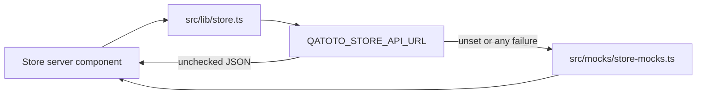

# Store — B2B Catalog, Procurement, and Trade Services

The frontend plan for Qatoto’s buyer-facing B2B commerce surface: public product and provider
discovery, RFQs and quote comparison, direct purchase, order tracking, and independently selectable
trade-service connectors.

**Read alongside:**

- [STORE_BACKEND_STRUCTURE.md](STORE_BACKEND_STRUCTURE.md) — the proposed Express data model,
  endpoint contract, state machines, and rollout order.
- [STUDIO_PRODUCTS_STRUCTURE.md](STUDIO_PRODUCTS_STRUCTURE.md) — the shipped seller product manager
  and listing wizard.
- [STUDIO_PRODUCTS_BACKEND_STRUCTURE.md](STUDIO_PRODUCTS_BACKEND_STRUCTURE.md) — the shipped
  seller-owned `/products/*` API.
- [R_AND_D_STRUCTURE.md](R_AND_D_STRUCTURE.md) — the separate R&D go-to-market supplier directory.
- [ESCROW_LEDGER_STRUCTURE.md](ESCROW_LEDGER_STRUCTURE.md) — project-funding ledger context; not a
  claim that store checkout is escrowed.
- [CLAUDE.md](CLAUDE.md) — thin-client, defensive parsing, UI state, and naming rules.

> **Scope:** `/store` is the buyer/public marketplace. `/studio/products` remains the seller
> authoring surface. Authenticated buyer procurement remains in the `(home)` shell; seller and
> service-provider work queues belong in `(studio)`.
>
> **Status:** the store is a high-fidelity **mock prototype with one wired slice**. It has seven
> app-route files, **67** store components, 37 mock category slugs, five pathways, and one static
> product detail page. Cart, orders, logistics, inquiry, chat, reviews, delivery and trade protection
> are mock or placeholder UI.
>
> **The one exception, and it is the reference implementation for everything else:** the organization
> storefront (`/store/organizations/[organizationSlug]`) is server-fetched and **safely parsed** —
> `src/lib/store/organizations.schemas.ts` takes `unknown` through `.strip()` schemas with the wire
> enums verbatim, and `organization-storefront.tsx` plus its fourteen `sections/organization/*`
> children carry real `TRANSPORT:` banners. Copy that file's shape when wiring the catalog; do not
> invent a second discipline.
>
> **What still stands between the store and the backend, measured rather than assumed:**
>
> - `src/lib/store.ts` reads `QATOTO_STORE_API_URL`, which is **unset**, so all nine of its getters
>   fall through to mocks on every request. The seller surface reads a _different_ variable,
>   `NEXT_PUBLIC_API_URL` (`src/lib/api.ts:2`). §5.1's instruction to retire the former is the
>   first task, because until it is done no wiring can be observed at all.
> - Eight of nine getters go through `storeFetch<T>`, which annotates `res.json()` as `T` — a type
>   assertion in disguise, and a Pattern 2 violation. Only `getOrganizationStorefront` uses
>   `storeFetchUnknown` + Zod.
> - The backend it should be talking to is **fully built**: `docs/STORE_BACKEND_STRUCTURE.md` Phases
>   0–14 ship 18 public `/store/*` reads, ~110 `/commerce/*` routes and 14 `/products/*` routes,
>   verified against the backend source. The store is not blocked on the backend; it is unwired.
>   Appendix A23–A27 there records the only five real gaps found from this side.

---

## 1. What exists today

| Piece                | Location                                                                                                             | State                                       |
| -------------------- | -------------------------------------------------------------------------------------------------------------------- | ------------------------------------------- |
| Store home           | [store/page.tsx](<src/app/(home)/store/page.tsx>)                                                                    | 🧪 cached getter with mock fallback         |
| Category catch-all   | [store/[...slug]/page.tsx](<src/app/(home)/store/[...slug]/page.tsx>)                                                | 🧪 37 mock slugs                            |
| Product detail       | [store/product/[id]/page.tsx](<src/app/(home)/store/product/[id]/page.tsx>)                                          | 🧪 one prerendered mock ID                  |
| Pathway detail       | [store/pathway/[id]/page.tsx](<src/app/(home)/store/pathway/[id]/page.tsx>)                                          | 🧪 five mock pathways                       |
| Loading/404          | [store/loading.tsx](<src/app/(home)/store/loading.tsx>), [store/not-found.tsx](<src/app/(home)/store/not-found.tsx>) | ✅ visual shells                            |
| Store page bodies    | [components/home/store](src/components/home/store)                                                                   | 🧪 rich mock UI                             |
| Current data getter  | [src/lib/store.ts](src/lib/store.ts)                                                                                 | 🚫 unchecked generic JSON + silent fallback |
| Display types        | [src/types/store.ts](src/types/store.ts)                                                                             | 🚫 handwritten strings, no Zod              |
| Mock catalog         | [src/mocks/store-mocks.ts](src/mocks/store-mocks.ts)                                                                 | 🧪 approximately 2,000 lines                |
| Buyer cart           | [cart/page.tsx](<src/app/(home)/cart/page.tsx>)                                                                      | ⏳ heading only                             |
| Buyer orders         | [orders-and-returns/page.tsx](<src/app/(home)/orders-and-returns/page.tsx>)                                          | ⏳ heading only                             |
| Seller orders        | [studio/orders/page.tsx](<src/app/(studio)/studio/orders/page.tsx>)                                                  | ⏳ heading only                             |
| Provider logistics   | [studio/logistics/page.tsx](<src/app/(studio)/studio/logistics/page.tsx>)                                            | ⏳ heading only                             |
| Seller product CRUD  | [src/lib/products](src/lib/products)                                                                                 | 🔌 shipped; separate authority              |
| Video product picker | [store-products-picker.tsx](src/components/studio/upload/store-products-picker.tsx)                                  | 🧪 fake IDs                                 |

### 1.1 Current route behavior

```text
🧪 /store
🧪 /store/[...slug]                  category by last slug only
🧪 /store/pathway/[id]
🧪 /store/product/lv-folding-chair  every ID renders the same static body
⏳ /cart
⏳ /orders-and-returns
⏳ /studio/orders
⏳ /studio/logistics
```

Links already presented but not implemented include `/store/pathways`, `/store/feed/*`, and
several product URLs. “Send inquiry,” “Add to cart,” and “Buy now” have no handlers.

The "For your Business" rail's six destinations all resolve as of the business-tools batch.
`/store/rfq` and `/store/logistics` were never built and are not going to be: the tiles now point at
`/store/rfqs` and `/store/providers`, which already existed under those names. `/store/factories`,
`/store/forum` and `/store/find-cofounder` are new mock-backed surfaces (§7.6), and `/store/business`
is the rail's own index. Every href lives in `src/lib/store/business-tools.ts` — one manifest feeding
both the rail tiles and the index page, because the four dead links existed precisely because nothing
corroborated a hand-written array in `store-mocks.ts`.

### 1.2 Current data path



This is unacceptable for a wired commerce surface:

- a backend contract failure is hidden as successful mock content;
- response JSON is asserted as `T` without Zod;
- product detail bypasses the data layer;
- display strings such as `"$129.99"` are treated as domain values;
- category and recommendation arrays are filtered in components;
- there are no tagged transport failures or exhaustive view states.

---

## 2. Surface boundaries


| Surface                                                                   | Users                      | Frontend owner                |
| ------------------------------------------------------------------------- | -------------------------- | ----------------------------- |
| `/studio/products`                                                        | Seller members             | Existing Studio product files |
| `/store/*`                                                                | Public visitors and buyers | Store catalog components      |
| `/store/rfqs`, `/store/quotes`                                            | Buyer organization members | Procurement client islands    |
| `/cart`, `/checkout`, `/orders-and-returns`                               | Authenticated buyers       | `(home)` commerce pages       |
| `/studio/services`, `/studio/rfqs`, `/studio/orders`, `/studio/logistics` | Sellers/providers          | `(studio)` work queues        |
| `/research-and-development/go-to-market`                                  | Research teams             | Existing R&D supplier domain  |

An R&D supplier profile and a commerce provider profile may represent the same legal company, but
the frontend never merges their verification labels, quotes, or engagements.

---

## 3. Target route map

The current broad `/store/[...slug]` route makes every unknown store path look like a category.
Move categories under an explicit literal segment. Keep temporary redirects from known legacy
category URLs.

### 3.1 Public catalog

```text
🔌 /store
🔌 /store/search
🔌 /store/categories
🔌 /store/category/[...slug]
🔌 /store/product/[productSlug]
🔌 /store/organizations/[organizationSlug]
🔌 /store/providers
🔌 /store/providers/[organizationSlug]
🔌 /store/services/[offeringSlug]
🔌 /store/pathways
🔌 /store/pathways/[pathwaySlug]
🔌 /store/rails/[railSlug]
```

The product route uses a public immutable slug, not a seller-internal ID. Metadata comes from the
same parsed public projection as the page. Unknown, draft, suspended, or malformed resources render
the scoped store 404.

### 3.2 Buyer procurement

```text
🔌 /store/rfqs
🔌 /store/rfqs/new
🔌 /store/rfqs/[rfqId]
🔌 /store/quotes/[quoteId]
🔌 /store/quotes/[quoteId]/compare
🔌 /cart
🔌 /checkout
🔌 /orders-and-returns
🔌 /orders-and-returns/[orderId]
🔌 /service-engagements/[engagementId]
🔌 /disputes/[disputeId]
```

### 3.3 Seller/provider operations

```text
🔌 /studio/products                         existing
🔌 /studio/services
🔌 /studio/services/create
🔌 /studio/rfqs
🔌 /studio/rfqs/[rfqId]
🔌 /studio/quotes/[quoteId]
🔌 /studio/orders
🔌 /studio/orders/[orderId]
🔌 /studio/logistics
🔌 /studio/service-engagements/[engagementId]
```

Literal routes (`product`, `providers`, `rfqs`, `services`) must be declared explicitly before any
remaining dynamic catch-all is removed.

---

## 4. Target component and data structure

```text
src/
├── app/
│   ├── (home)/
│   │   ├── store/
│   │   │   ├── page.tsx
│   │   │   ├── search/page.tsx
│   │   │   ├── categories/page.tsx
│   │   │   ├── category/[...slug]/page.tsx
│   │   │   ├── product/[productSlug]/page.tsx
│   │   │   ├── organizations/[organizationSlug]/page.tsx
│   │   │   ├── providers/page.tsx
│   │   │   ├── providers/[organizationSlug]/page.tsx
│   │   │   ├── services/[offeringSlug]/page.tsx
│   │   │   ├── pathways/page.tsx
│   │   │   ├── pathways/[pathwaySlug]/page.tsx
│   │   │   ├── rfqs/...
│   │   │   └── quotes/...
│   │   ├── cart/page.tsx
│   │   ├── checkout/page.tsx
│   │   ├── orders-and-returns/...
│   │   └── service-engagements/...
│   └── (studio)/studio/
│       ├── services/...
│       ├── rfqs/...
│       ├── quotes/...
│       ├── orders/...
│       └── logistics/...
├── components/
│   ├── home/store/
│   │   ├── cards/
│   │   ├── rails/
│   │   ├── sections/
│   │   ├── sheets/
│   │   ├── filters/
│   │   ├── providers/
│   │   ├── rfqs/
│   │   ├── quotes/
│   │   ├── orders/
│   │   └── pages/
│   └── studio/commerce/
│       ├── services/
│       ├── rfqs/
│       ├── quotes/
│       └── orders/
├── lib/store/
│   ├── shared.schemas.ts
│   ├── catalog.schemas.ts
│   ├── catalog.api.ts
│   ├── providers.schemas.ts
│   ├── providers.api.ts
│   ├── rfqs.schemas.ts
│   ├── rfqs.api.ts
│   ├── quotes.schemas.ts
│   ├── quotes.api.ts
│   ├── cart.schemas.ts
│   ├── cart.api.ts
│   ├── orders.schemas.ts
│   ├── orders.api.ts
│   ├── fulfillment.schemas.ts
│   ├── fulfillment.api.ts
│   └── labels.ts
└── hooks/store/
    ├── keys.ts
    ├── use-rfqs.ts
    ├── use-quotes.ts
    ├── use-cart.ts
    ├── use-orders.ts
    └── use-service-engagements.ts
```

Existing cards, rails, sections, and sheets stay where useful. Page bodies move under `pages/`
only when the current flat folder becomes ambiguous; this is not a prerequisite for wiring.

---

## 5. Network and parsing rules

### 5.1 One API origin

Retire `QATOTO_STORE_API_URL`. Store and Studio use the same Express origin and shared authenticated
fetch conventions. Public server fetches use the server-safe API base; client mutations use the
existing browser API helper and credentials policy.

There is no Next.js API route or Server Action for commerce business logic.

### 5.2 Parse every response

Every network payload starts as `unknown` and is parsed by a Zod `.strip()` schema. Types are
inferred from schemas; `src/types/store.ts` is removed after all imports migrate.

**Do not copy the illustration that used to sit here — it named fields the backend does not send.**
`StoreProductCardSchema` already exists, shipped, in `src/lib/store/organizations.schemas.ts:186`,
and it matches `StoreProductCardProjection` in the backend's `store-catalog.service.ts:73`
field-for-field: `mainImageUrl` (not `imageUrl`), `priceInCents` + `compareAtPriceInCents` (not
`minimumUnitPriceInCents`), `minimumOrderQuantity` **nullable**, plus `brand`, `stockState`,
`hasVariants`, `variantCount`, `condition`, `samplePolicy`, `leadTimeMinDays`, `leadTimeMaxDays`,
`seller: StoreSellerSummarySchema`, `category`, `reviewMetrics`. `currency` carries no `.length(3)`
because the backend does not constrain it there and a stricter client schema rejects a payload the
server considers valid.

**Extend that file; do not write a second card schema.** The general rule it demonstrates:

```ts
const ExampleSchema = z
    .object({
        id: z.string(),
        countInteger: z.number().int().nonnegative(),
        nullableValue: z.string().nullable(),
    })
    .strip(); // ignore unknown fields — forward-compatible with backend additions
```

The API layer returns tagged values, and the tag is the one this codebase already uses everywhere
else — `ActionResponse<T>` with `data`, per `CLAUDE.md` Pattern 3. An earlier draft of this document
specified a `StoreReadResult<TValue>` with `value` instead; that shape exists nowhere in the
codebase and would have made the store the only surface with its own result type.

```ts
type ActionResponse<T> =
    { success: true; data: T } | { success: false; error: { code: string; message: string } };
```

No wired getter falls back to mocks. A contract failure renders an explicit error state and remains
observable. `src/lib/store.ts` currently violates this in all nine getters and is the first thing
Phase 0 deletes.

### 5.3 Public reads versus client-query islands

Use server fetches for:

- store home, category, search initial result, product detail;
- organization storefront and provider directory/detail;
- public pathways and rails;
- metadata and scoped not-found decisions.

Use React Query client islands for:

- cart mutations and authoritative repricing;
- RFQ draft editing, opening, invitations, and polling;
- provider quote revisions and submission;
- quote acceptance;
- order/payment/engagement status polling;
- messages, document uploads, reviews, disputes, reports;
- authenticated seller/provider work queues requiring live invalidation.

Do not turn the entire product page into a client component because one quantity control mutates.

---

## 6. View states

Each page or live panel uses a discriminated union and exhaustive render:

```ts
type CatalogViewState =
    | { status: "loading" }
    | { status: "error"; code: string; message: string }
    | { status: "empty"; appliedFilterCount: number }
    | { status: "success"; page: CatalogPage };
```

Required states:

- loading skeleton shaped like the final content;
- contract/transport error with retry where safe;
- empty catalog versus empty filtered result;
- not found for hidden/missing resources;
- unauthenticated and unauthorized organization actions;
- stale quote revision (`409`) with latest revision refresh;
- asynchronous processing (`202`) with polling and “still checking” copy;
- completed/terminal state that disables illegal actions.

Never infer success from the absence of an exception.

---

## 7. Catalog home, category, and search

### 7.1 Store home

The existing visual order remains a useful shell:

1. `HeroCarousel`
2. `CategoryRail`
3. `PathwaysRail`
4. `BusinessToolsRail` — six business-tool shortcuts, see-all at `/store/business`
5. product rails

`B2BRail` was renamed to `BusinessToolsRail` (and `B2BTile` to `BusinessToolTile`) once its contract
became concrete, which is what this line used to ask for. The contract is
`src/lib/store/business-tools.ts`: six `BusinessTool` entries, each an id, label, one-line
description, icon and href. The rail renders labels only; the description is the `/store/business`
index card's field. `StoreHome.b2bLinks` keeps its wire name — renaming a field on the legacy getter
would be a contract change for a cosmetic gain.

`StoreHomeSchema` parses semantic accent tokens, public links, and eligible cards. The API never
sends Tailwind classes such as `group-hover:bg-yellow-100`.

### 7.2 Category pages

Category paths show the full hierarchy:

```text
/store/category/furniture/home-furniture/chairs
```

The URL is the breadcrumb authority; the response verifies the canonical trail. Branch categories
render children plus featured products. Leaf categories render a paginated product grid with
facets, not three fixed horizontal mock rails.

### 7.3 Search and filters

Filters live in URL query keys and are executed by the backend:

- query
- category
- minimum/maximum unit price
- maximum acceptable MOQ
- seller country
- lead-time range
- condition
- provider kind and service mode
- verification state
- sort and cursor

Filter controls build links or replace search params. They never filter a fetched page in memory.
Changing a filter clears the cursor. The UI displays backend facet counts and does not invent
counts from visible cards.

### 7.6 Business tools

The "For your Business" rail's six destinations. Three of them are existing surfaces reached under
their real names (`/store/business` index, `/store/rfqs`, `/store/providers`); three are new and
**mock-backed**, written against proposed contracts because none of them has a backend —
`STORE_BACKEND_STRUCTURE.md` A25 records `business-forum` and `find-cofounder` as "not commerce and
[with] no backend anywhere", and the factories gap as a filed ask.

| Surface             | Routes                                                         | Contract                            | Fixtures                          |
| ------------------- | -------------------------------------------------------------- | ----------------------------------- | --------------------------------- |
| Factories worldwide | `/store/factories`, `/[factorySlug]`, `/[factorySlug]/inquire` | `factories.schemas.ts` / `.api.ts`  | `mocks/store/factories-mocks.ts`  |
| Business forum      | `/store/forum`, `/[threadSlug]`, `/new`                        | `forum.schemas.ts` / `.api.ts`      | `mocks/store/forum-mocks.ts`      |
| Find a cofounder    | `/store/find-cofounder`, `/[profileSlug]`, `/new`              | `cofounders.schemas.ts` / `.api.ts` | `mocks/store/cofounders-mocks.ts` |

Each follows §6's shape exactly — `unknown` → Zod `.strip()` → `ActionResponse` → a discriminated
view state with an exhaustive `switch`; server-side filtering through the URL; `resolveMockRead` /
`resolveMockDetail` standing in for one line that becomes `getJson`.

**Three copy rules are load-bearing on these surfaces and are enforced in the schema headers, not
only in components.**

1. **A factory's `verificationState` is about the organization, never a capability.** "Documents
   reviewed" and "Site audited" are the only claims; there is no per-capability approval on the wire
   and no bare tick anywhere. A card names its certifications and cannot say whether they are
   current — validity windows are on the detail read only.
2. **A forum thread is created `pending_review`, not `open`.** A10 closed public listing comments
   for want of a standing requirement, and a free-floating text box inherits that problem exactly.
   Moderation is what lets the forum exist without reopening the argument, so the composer says
   "queued for review" and means it. This is a decision, not a placeholder.
3. **A cofounder profile is not an offer, its capital range is unverified, and nothing here is
   equity.** `capitalRange` is what a person typed about themselves — no copy may say committed,
   funded, raised, escrowed or available, and the word "declares" is in the row rather than in a
   tooltip. `equityExpectationBasisPoints` is an ask to negotiate from, rendered as "hoping for" and
   never as a holding. There is no contact affordance on a profile because no such write exists;
   the gap is stated in a sentence rather than mocked up as a button that reaches nothing.

Two writes answer with a **draft** (factory inquiry, cofounder profile) and one with
**`pending_review`** (forum thread). None of the three sends, publishes or notifies anybody, every
success screen says so, and all three mint an `Idempotency-Key` once per attempt via
`useAttemptIdempotencyKey`.

---

## 8. Product detail migration

The current `product-detail.tsx` is one static chair regardless of route ID. Replace it with a
parsed `PublicStoreProduct` prop and split only interaction-heavy controls into client islands.

| Existing UI            | Target source/action                                     |
| ---------------------- | -------------------------------------------------------- |
| Category breadcrumb    | Canonical backend category trail                         |
| Image gallery/colors   | Ordered product images and typed variants                |
| Rating badge           | Verified aggregate or honest absence                     |
| Engagement bar         | Authenticated save/share; product-scoped thread only     |
| Price chart            | Integer-cent pricing tiers formatted locally             |
| Sample price           | Server-owned sample policy and cart line                 |
| Customization          | Seller-declared option schema; validated on cart/RFQ     |
| Deliver to             | Private organization addresses                           |
| Delivery cost          | Quote/estimate result; never static assurance            |
| Packaging and delivery | Product/package dimensions and lead-time fields          |
| Trade protection       | Eligibility projection; hidden until legally implemented |
| Buy actions            | RFQ, cart, or checkout mutations                         |
| Product details        | Structured specification groups                          |
| Similar/compare        | Backend candidates and explicit comparison selection     |
| Company details        | Public organization storefront projection                |
| Manufacturer chat      | Resource-scoped authorized commerce thread               |
| Reviews and Q&A        | Store-specific schemas/routes, not video types           |
| Report abuse           | Authenticated report mutation                            |

If the backend returns `null`, the section is omitted or renders “Not provided.” Zero is displayed
as zero; the frontend never replaces absence with a fabricated number.

### 8.1 Quantity and price

The quantity selector may preview the matching tier for UX. The cart and checkout response remains
authoritative. Display helpers accept integer cents plus ISO currency and use `Intl.NumberFormat`.
No formatted money string crosses the wire.

---

## 9. Provider connector marketplace

### 9.1 Provider directory

`/store/providers` is a server-filtered directory with:

- provider kind;
- origin/destination coverage;
- transport mode for freight/logistics;
- jurisdiction for customs;
- standards/accreditation for laboratories;
- storage capability for warehouses;
- currency pair for FX;
- verification state and accepting-requests state.

Provider cards display only backend-authorized badges and metrics. A generic `verified` icon cannot
stand in for kind-specific approval.

### 9.2 Offering detail

`/store/services/[offeringSlug]` renders common offering fields and exhaustively switches on
`providerKind` to render the typed extension:

```ts
switch (offering.providerKind) {
  case "freight_forwarder":
  case "logistics_operator":
    return <FreightOfferingDetails offering={offering} />;
  case "customs_broker":
    return <CustomsBrokerOfferingDetails offering={offering} />;
  // every remaining provider kind
  default: {
    const exhaustiveProviderKind: never = offering;
    return exhaustiveProviderKind;
  }
}
```

“Request quote” starts a service RFQ. “Add to order” creates an explicit draft linkage but does not
silently alter the product cart.

### 9.3 Provider Studio

Provider profile and offering authoring belong in small Studio client-query pages. Typed forms
change by provider kind; hidden fields are removed from the request instead of submitted as null.
Evidence upload shows `pending review`, never an optimistic verified badge.

---

## 10. RFQ and quote experience

### 10.1 RFQ composer

The composer supports product lines, service lines, or both:

1. Buyer organization and basic request
2. Product requirements
3. Connector/service requirements
4. destination, timing, documents, and response deadline
5. invited/matched providers
6. review and open

Draft state may be saved. Opening is a backend transition and can return field findings. Service
requirements use a provider-kind discriminated union; no generic bag of optional inputs.

### 10.2 Quote revisions

Providers create revisions in Studio. Submitted revisions are read-only. “Revise” starts a new
draft from the last submitted snapshot. Buyer quote comparison:

- compares normalized line groups and explicitly marks incomparable scopes;
- shows currency, validity, lead times, exclusions, terms, and connector deliverables;
- never computes a fake winner or converts currencies without a backend FX quote;
- accepts only the latest valid revision using the expected revision/version.

A `409 REVISION_CHANGED` is a finding: refresh and require the buyer to review the new terms.

### 10.3 Messaging and files

Threads are scoped to one RFQ, quote, order, engagement, or dispute. Do not reuse video comments or
the current mock manufacturer chat types. Attachments upload to authorized object-storage flows and
render after the backend confirms metadata.

---

## 11. Cart, checkout, orders, and connector engagements

### 11.1 Cart

The cart groups product lines by seller organization and shows:

- requested quantity;
- server-selected tier and current unit price;
- availability/lead-time finding;
- seller subtotal;
- explicit notice that taxes, freight, duties, insurance, and FX may be separate.

Every mutation invalidates/reloads the authoritative cart. No optimistic quantity or price update.

### 11.2 Checkout

Checkout selects buyer organization, delivery/billing addresses, and available payment/fulfillment
choices. `prepare` returns reservations and totals. `confirm` uses an idempotency key minted once
per attempt and may create several counterparty orders under one checkout group.

A provider payment page or `202` response is processing, not paid. Poll the returned resource.

### 11.3 Orders

Buyer and Studio order detail share presentational components but call role-appropriate endpoints.
The timeline renders backend events. Buttons are derived from explicit allowed actions returned by
the backend or from an exhaustive state mapping that the backend still re-authorizes.

### 11.4 Service engagements

Connector engagements have their own timeline and deliverables. An order may link freight,
customs, insurance, inspection, lab, warehouse, marketing, or FX engagements, but each state is
rendered independently. The UI derives an overview; it never marks all connectors complete because
one shipment arrived.

---

## 12. Mock-removal map

| Mock/source                           | Migration                                                                                     | Delete when                                   |
| ------------------------------------- | --------------------------------------------------------------------------------------------- | --------------------------------------------- |
| `src/lib/store.ts` generic fetch      | Split into parsed `src/lib/store/*.api.ts`                                                    | all callers migrated                          |
| `src/types/store.ts`                  | Zod-inferred schema types                                                                     | no imports remain                             |
| `src/mocks/store-mocks.ts`            | Backend seed/curation data where real                                                         | no production fallback remains                |
| Static product body                   | `GET /store/products/:productSlug` + parsed props                                             | PDP reads real product                        |
| Inline product colors/tiers           | `variants[]` + `pricingTiers[]` on the product read                                           | no `MOCK_PRODUCT_*` imports                   |
| `TIER_UPPER_QUANTITY_LIMITS`          | Derive the upper bound from the next tier's MOQ                                               | `price-chart.tsx` reads no constant           |
| `mockPathwayBannerForSlug`            | `cardImageUrl` / `heroImageUrl` on the pathway read                                           | pathway art comes from the server             |
| `hoverBg` Tailwind classes            | The `accent` semantic token, mapped client-side                                               | no class string crosses the wire              |
| Static breadcrumb                     | `categoryTrail[]` on the product read                                                         | category contract wired                       |
| Local addresses                       | Organization address query/mutations (`delivery` kind)                                        | address sheets use backend                    |
| Mock manufacturer storefront          | Organization route/projection                                                                 | ✅ **done** — storefront page is wired        |
| Mock manufacturer chat                | Product inquiry → thread → messages                                                           | resource-scoped messaging wired               |
| Video comment/review types            | Store review/Q&A schemas                                                                      | no cross-domain imports                       |
| Mock compare/similar                  | `GET /store/products/:productSlug/companions`                                                 | sheets receive parsed candidates              |
| Static delivery                       | `GET /store/products/:productSlug/delivery-estimate`                                          | honest empty/estimate states wired            |
| Mock video product picker             | Seller product query                                                                          | only real owned active IDs selectable         |
| Inert buy buttons                     | RFQ/cart/checkout controls                                                                    | each action reaches real API                  |
| Cart/order/logistics headings         | Full pages                                                                                    | corresponding phase ships                     |
| Legacy `category` enum in Studio      | `categoryId` from `commerce_category`                                                         | wizard submits an id, not a slug              |
| `src/mocks/store/factories-mocks.ts`  | `GET /store/factories` + `/store/factories/:slug`, `POST /commerce/factories/:slug/inquiries` | `factories.api.ts` uses `getJson`/`sendJson`  |
| `src/mocks/store/forum-mocks.ts`      | `GET /store/forum/threads` + `/threads/:slug`, `POST /commerce/forum/threads`                 | `forum.api.ts` uses `getJson`/`sendJson`      |
| `src/mocks/store/cofounders-mocks.ts` | `GET /store/cofounder-profiles` + `/:slug`, `POST /commerce/cofounder-profiles`               | `cofounders.api.ts` uses `getJson`/`sendJson` |

Mocks may remain temporarily in Storybook/design fixtures outside production data paths. A network
failure must never activate them.

### 12.1 Three rows that are decisions, not migrations

These do not wait on a phase, and reading them as backlog is the mistake this subsection exists to
prevent. Each is settled in `STORE_BACKEND_STRUCTURE.md` §14 or Appendix A.

| Mock/source                                                           | Decision                                                                                                                                                                                                                                                                                                                                                                                                                                                                                                                                       |
| --------------------------------------------------------------------- | ---------------------------------------------------------------------------------------------------------------------------------------------------------------------------------------------------------------------------------------------------------------------------------------------------------------------------------------------------------------------------------------------------------------------------------------------------------------------------------------------------------------------------------------------- |
| `sections/trade-protection.tsx` + `sheets/trade-protection-sheet.tsx` | **Delete or keep hidden — never wire.** §14 decided Qatoto is **not a custodian and never holds funds**; the default rail is direct settlement with no protection. "Funds are only released once the order is confirmed" and "full refund — no back-and-forth" are false statements about this platform. The honest replacement is the settlement surface: `GET /commerce/settlement/escrow-providers` and the negotiated `settlement-agreements` routes, which say two parties agreed on a licensed third party — a different and true claim. |
| `sheets/comment-sheet.tsx` + `sheets/product-comment-thread.tsx`      | **Delete.** A10 is closed, not deferred. Also drop `commentCount` from `sections/engagement-bar.tsx` — the backend deliberately omits it from `engagement` and a hardcoded zero is the exact failure A13 exists to prevent. `questionCount` is the real number next to it.                                                                                                                                                                                                                                                                     |
| "Online revenue US $2.4M+" in the company block                       | **Consented, tier-gated, and not yet built.** §14 decided the figure may be published, but only on an explicit seller consent record the seller may withdraw — Alibaba's shape. Until the backend ships the consent column and its own wire member, the line renders nothing; it must never be derived client-side from anything.                                                                                                                                                                                                              |

---

## 13. Transport labels

Every file under `src/components/home/store/` and new Studio commerce directories receives one
first-line banner:

```ts
// TRANSPORT: server-fetch
// TRANSPORT: client-query
// TRANSPORT: props-only
// TRANSPORT: mock
```

Meaning:

- `server-fetch`: the component directly performs a parsed server read;
- `client-query`: the component calls a React Query hook;
- `props-only`: no transport; receives already parsed props;
- `mock`: static data or non-functional action remains.

Audit:

```bash
rg --no-filename '^// TRANSPORT:' src/components/home/store src/components/studio/commerce | sort | uniq -c
rg -n '^// TRANSPORT: mock' src/components/home/store src/components/studio/commerce
```

The final command must print nothing before the surface is called fully wired.

**Measured state, so this section is a target and not a claim.** Of the 67 files under
`src/components/home/store/`, **16 carry a banner and 51 do not** — the unbannered set is the entire
pre-storefront store UI (`store-page.tsx`, `category-page.tsx`, `product-detail.tsx`,
`pathway-detail.tsx`, all of `cards/`, all of `rails/`, all of `sections/` except
`sections/organization/`, and all of `sheets/` except one). Those files say "UI-only mock" in prose
instead, which the audit command cannot see. The tally today:

| Banner         | Count |
| -------------- | ----- |
| `server-fetch` | 1     |
| `client-query` | 0     |
| `props-only`   | 14    |
| `mock`         | 2     |

The mock grep prints two files: `sections/organization/storefront-contact-actions.tsx` and
`sheets/product-comment-thread.tsx`. Banner the remaining 51 as part of Phase 0 — a prose comment is
not a banner, and an unbannered file is indistinguishable from an unreviewed one.

Two of the bannered files are **not** pending work and should not be read as such:
`sheets/product-comment-thread.tsx` and `sheets/comment-sheet.tsx` implement product comments, which
`STORE_BACKEND_STRUCTURE.md` A10 **decided will never be built** — reviews, Q&A and private
inquiries each require standing, and a free-floating comment would be the only public text surface
on a listing with none. Delete both rather than leave them implying a phase.

---

## 14. Caching and invalidation

- Public catalog/category/provider reads may use `"use cache"` with tags and bounded revalidation.
- Personalized rails, carts, RFQs, quotes, orders, messages, and addresses are private and never
  enter a shared public cache.
- Product publish/unpublish/update, provider moderation, and merchandising changes invalidate the
  affected public tags through the backend/deployment cache strategy.
- React Query keys include organization/resource IDs and stable filter objects.
- Mutations invalidate only affected resources plus summary lists; payment/order polling stops on
  terminal states.
- Checkout always receives fresh server totals even if the preceding product page was cached.

---

## 15. Accessibility and responsive behavior

- Every sheet is keyboard reachable, traps focus while open, returns focus on close, and has a
  labelled close control.
- Filter changes and asynchronous state updates have appropriate live-region announcements.
- Tables become labelled cards on narrow screens without hiding commercial terms.
- Price, currency, quantity, dates, and status are not communicated by color alone.
- Product/provider badges include text; decorative icons have empty alt text.
- Sticky mobile buy controls do not cover content or the existing mobile navigation.
- Document upload exposes file name, size, progress, failure, and retry.
- Reduced-motion preferences disable nonessential carousel and sheet animation.

---

## 16. Integration phases

### Phase 0 — contract foundations

- Add Zod schemas, tagged results, API modules, query keys, money/date/label helpers.
- Consolidate API origin.
- Introduce transport banners.
- Keep existing mock pages visually stable while preparing real props.

### Phase 1 — catalog and product detail

- Wire store home, category tree, search, product detail, and organization storefront.
- Move categories to explicit `/store/category/*`.
- Remove generic fetch fallback and product/category/pathway production mocks.

### Phase 2 — provider connectors

- Add provider directory, provider detail, service offering detail, and Studio offering authoring.
- Wire all nine provider kinds with exhaustive typed rendering.

### Phase 3 — RFQ, quotes, and communication

- Buyer RFQ composer/list/detail.
- Provider RFQ queue and immutable quote revision editor.
- Quote comparison/acceptance, scoped threads, authorized documents.

### Phase 4 — cart and order operations

- Real cart, checkout preparation/confirmation, buyer orders, Studio order queue.
- Inventory/price findings and multi-counterparty checkout groups.

### Phase 5 — payments and trade assurance

- Payment processing/polling, refunds, disputes, reconciliation states.
- Replace assurance mock copy only after backend and legal eligibility exist.

### Phase 6 — fulfillment and connector execution

- Shipments and independently stateful connector engagements/deliverables.
- Replace static delivery, customs, insurance, inspection, lab, warehouse, marketing, and FX UI.

### Phase 7 — trust and optimization

- Verified reviews, Q&A, moderation/reporting, provider metrics, recommendations, and merchandising.
- Delete remaining mock transport and dead links.

---

## 17. Acceptance gates

For each phase:

- every response is parsed from `unknown` with Zod `.strip()`;
- every transport failure is a tagged value and every view state is exhaustive;
- no client-only auth, price, inventory, verification, tax, shipping, or payment decision exists;
- filters and pagination execute on the backend;
- null remains absent and zero remains zero;
- all money is integer cents plus explicit currency;
- enum values remain snake_case, JSON/query keys camelCase, path/slugs kebab-case;
- `pnpm fmt`, `pnpm lint`, and `pnpm build` pass;
- manual route checks cover loading, empty, error, 404, unauthorized, stale revision, `202`,
  `409`, and terminal states;
- the transport audit shows only the intentionally deferred mocks for that phase.

No test files are added or modified unless separately requested.

---

## 18. Explicitly out of scope for this frontend plan

- Implementing backend business logic in Next.js routes or Server Actions.
- Treating browse location as compliance, tax, pricing, or fraud evidence.
- Reusing R&D project quotes, compensation payments, or supplier trust as commerce records.
- Displaying “escrowed,” “insured,” “certified,” “verified,” or “guaranteed” without an explicit
  eligible backend projection.
- Client-side catalog ranking, large-list filtering, totals, currency conversion, or entitlement.
- A generic connector form that submits irrelevant nullable fields for every provider kind.

The frontend is complete only when it renders backend truth, exposes honest intermediate states,
and leaves every trusted or expensive decision in Express.
