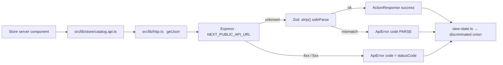

# Store — B2B Catalog, Procurement, and Trade Services

The frontend plan for Qatoto's buyer-facing B2B commerce surface: public product and provider
discovery, RFQs and quote comparison, direct purchase, order tracking, and independently selectable
trade-service connectors.

**Read alongside:**

- [STORE_BACKEND_STRUCTURE.md](STORE_BACKEND_STRUCTURE.md) — the Express data model, endpoint
  contract, state machines, and rollout order. **Shipped through Phase 7.**
- [STUDIO_PRODUCTS_STRUCTURE.md](STUDIO_PRODUCTS_STRUCTURE.md) — the shipped seller product manager
  and listing wizard.
- [STUDIO_PRODUCTS_BACKEND_STRUCTURE.md](STUDIO_PRODUCTS_BACKEND_STRUCTURE.md) — the shipped
  seller-owned `/products/*` API.
- [R_AND_D_STRUCTURE.md](R_AND_D_STRUCTURE.md) — the separate R&D go-to-market supplier directory,
  and the repo's reference implementation of the wiring discipline this surface must copy.
- [ESCROW_LEDGER_STRUCTURE.md](ESCROW_LEDGER_STRUCTURE.md) — project-funding ledger context; not a
  claim that store checkout is escrowed.
- [CLAUDE.md](CLAUDE.md) — thin-client, defensive parsing, UI state, and naming rules.

> **Scope:** `/store` is the buyer/public marketplace. `/studio/products` remains the seller
> authoring surface. Authenticated buyer procurement remains in the `(home)` shell; seller and
> service-provider work queues belong in `(studio)`.

> **Status — read this before touching anything.**
>
> The **backend is fully shipped**: 12 public `/store/*` routes and roughly 60 authenticated
> `/commerce/*` routes across Phases 0–7, with a rollout doc per phase.
>
> The **frontend is Phase 0 complete and Phase 1 in progress**. `src/mocks/store-mocks.ts` and the
> unchecked `src/lib/store.ts` fetcher are gone; `src/lib/store/` parses with Zod and returns tagged
> results; five explicit routes replaced the old catch-all.
>
> **The contract drift is fixed.** The schemas in `src/lib/store/catalog.schemas.ts` were originally
> written from this document rather than from the backend, and every public store read failed
> `safeParse`. They have been rewritten field-for-field against the backend service projections.
> §5.4 keeps the ledger as the record of what changed and why — it is history now, not a to-do.
>
> **Still unverified against a running backend.** `pnpm build`, `tsc`, and `oxlint` pass, and every
> field was cross-checked against `src/services/store-catalog.service.ts`,
> `store-merchandising.service.ts`, `store-search.service.ts`, `commerce-providers.service.ts` and
> the backend's own `store.routes.test.ts` fixtures. That is static agreement, not a live 200. The
> check that closes it is in §17: load `/store` against a running backend and confirm the dev-server
> terminal prints no `[http] contract mismatch`.
>
> **Every feature the wiring passes removed has been restored** (§12). Where the backend cannot feed
> one it renders as mock UI — never as a fallback, only as static content. Three things the wiring
> gained on top: the real specification rows, real search, and the real provider directory.
>
> Component transport census: **33 `mock`, 23 `props-only`, 7 `server-fetch`, 3 unbannered** (§13).

---

## 1. What exists today

| Piece                   | Location                                                                                                             | State                                          |
| ----------------------- | -------------------------------------------------------------------------------------------------------------------- | ---------------------------------------------- |
| Store home              | [store/page.tsx](<src/app/(home)/store/page.tsx>)                                                                    | ✅ wired to `/store/home`                      |
| Search                  | [store/search/page.tsx](<src/app/(home)/store/search/page.tsx>)                                                      | ✅ wired; mixed product/offering hits          |
| Categories index        | [store/categories/page.tsx](<src/app/(home)/store/categories/page.tsx>)                                              | ✅ wired to `/store/categories`                |
| Category detail         | [store/category/[...slug]/page.tsx](<src/app/(home)/store/category/[...slug]/page.tsx>)                              | ✅ wired; URL-derived breadcrumb (§5.6 item 2) |
| Product detail          | [store/product/[productSlug]/page.tsx](<src/app/(home)/store/product/[productSlug]/page.tsx>)                        | ✅ wired; real specifications                  |
| Organization storefront | [store/organizations/[organizationSlug]/page.tsx](<src/app/(home)/store/organizations/[organizationSlug]/page.tsx>)  | ✅ wired; flat projection                      |
| Pathway detail          | [store/pathway/[id]/page.tsx](<src/app/(home)/store/pathway/[id]/page.tsx>)                                          | ✅ wired · ⏳ legacy singular path             |
| Loading / 404           | [store/loading.tsx](<src/app/(home)/store/loading.tsx>), [store/not-found.tsx](<src/app/(home)/store/not-found.tsx>) | ✅ visual shells                               |
| Legacy URL redirects    | [next.config.ts](next.config.ts)                                                                                     | ✅ `/store/{cat}` → `/store/category/{cat}`    |
| Store page bodies       | [components/home/store](src/components/home/store)                                                                   | ◐ 7 server-fetch, 23 props-only, 33 mock       |
| Catalog schemas         | [src/lib/store/catalog.schemas.ts](src/lib/store/catalog.schemas.ts)                                                 | ✅ mirrors the backend service projections     |
| Catalog API             | [src/lib/store/catalog.api.ts](src/lib/store/catalog.api.ts)                                                         | ✅ 7 routes — one per page that exists         |
| Shared primitives       | [src/lib/store/shared.schemas.ts](src/lib/store/shared.schemas.ts)                                                   | ✅ accents, seller, metrics, money/lead-time   |
| Enum labels             | [src/lib/store/labels.ts](src/lib/store/labels.ts)                                                                   | ✅ nine `pgEnum` tuples + display maps         |
| Href builders           | [src/lib/store/links.ts](src/lib/store/links.ts)                                                                     | ✅ entity kind + slug → path, or null          |
| URL filter parsing      | [src/lib/store/search-params.ts](src/lib/store/search-params.ts)                                                     | ✅ only keys `/store/search` declares          |
| View-state lifters      | [src/lib/store/view-state.ts](src/lib/store/view-state.ts)                                                           | ✅ tagged result → discriminated union         |
| Query key factory       | [src/hooks/store/keys.ts](src/hooks/store/keys.ts)                                                                   | ✅ ready; no hooks call it yet                 |
| Display types           | [src/types/store.ts](src/types/store.ts)                                                                             | ◐ 12 lines left (`Address`); 2 importers       |
| Buyer cart              | [cart/page.tsx](<src/app/(home)/cart/page.tsx>)                                                                      | ⏳ heading only                                |
| Buyer orders            | [orders-and-returns/page.tsx](<src/app/(home)/orders-and-returns/page.tsx>)                                          | ⏳ heading only                                |
| Seller orders           | [studio/orders/page.tsx](<src/app/(studio)/studio/orders/page.tsx>)                                                  | ⏳ heading only                                |
| Provider logistics      | [studio/logistics/page.tsx](<src/app/(studio)/studio/logistics/page.tsx>)                                            | ⏳ heading only                                |
| Seller product CRUD     | [src/lib/products](src/lib/products)                                                                                 | ✅ shipped; separate authority                 |
| Video product picker    | [store-products-picker.tsx](src/components/studio/upload/store-products-picker.tsx)                                  | 🧪 fake IDs                                    |

**Deleted, and not coming back:** `src/lib/store.ts` (the unchecked generic fetcher with silent mock
fallback), `src/mocks/store-mocks.ts` (2,083 lines), and the `/store/[...slug]` catch-all that made
every unknown store path look like a category.

### 1.1 Current route behavior

```text
✅ /store                                     GET /store/home
✅ /store/search                              GET /store/search
✅ /store/categories                          GET /store/categories
✅ /store/category/[...slug]                  GET /store/categories/:slug
✅ /store/product/[productSlug]               GET /store/products/:productSlug
✅ /store/organizations/[organizationSlug]    GET /store/organizations/:organizationSlug
✅ /store/pathway/[id]                        GET /store/pathways/:pathwaySlug + /store/pathways
⏳ /cart
⏳ /orders-and-returns
⏳ /studio/orders
⏳ /studio/logistics
```

Backend-ready with **no frontend route at all**: `/store/providers`,
`/store/providers/[organizationSlug]`, `/store/services/[offeringSlug]`, `/store/pathways` (index),
`/store/rails/[railSlug]`.

Every dynamic route prerenders only the `"__none__"` sentinel from
[`withSentinelValues`](src/lib/static-params.ts) — `cacheComponents` rejects an empty
`generateStaticParams` — and each page component calls `notFound()` on it. Nothing else is
prerendered, so slugs resolve on demand.

Links presented in the UI but still dead: `/store/feed/*`, `/store/rfq`, `/store/logistics`,
`/store/factories`. "Send inquiry", "Add to cart", and "Buy now" render disabled
([buy-action-buttons.tsx](src/components/home/store/cards/buy-action-buttons.tsx)).

### 1.2 Current data path



A contract break is logged **server-side only**, from [`src/lib/http.ts:70`](src/lib/http.ts) —
`[http] contract mismatch on /store/home` plus the exact failing field paths. It lands in the
terminal running `pnpm dev`, not in the browser, and it is the fastest way to catch the next drift.
Watch it whenever a backend projection changes.

---

## 2. Surface boundaries


| Surface                                                                   | Users                      | Frontend owner                |
| ------------------------------------------------------------------------- | -------------------------- | ----------------------------- |
| `/studio/products`                                                        | Seller members             | Existing Studio product files |
| `/store/*`                                                                | Public visitors and buyers | Store catalog components      |
| `/store/rfqs`, `/store/quotes`                                            | Buyer organization members | Procurement client islands    |
| `/cart`, `/checkout`, `/orders-and-returns`                               | Authenticated buyers       | `(home)` commerce pages       |
| `/studio/services`, `/studio/rfqs`, `/studio/orders`, `/studio/logistics` | Sellers/providers          | `(studio)` work queues        |
| `/research-and-development/go-to-market`                                  | Research teams             | Existing R&D supplier domain  |

An R&D supplier profile and a commerce provider profile may represent the same legal company, but
the frontend never merges their verification labels, quotes, or engagements.

---

## 3. Target route map

### 3.1 Public catalog

```text
✅ /store                                     built
✅ /store/search                              built
✅ /store/categories                          built
✅ /store/category/[...slug]                  built
✅ /store/product/[productSlug]               built
✅ /store/organizations/[organizationSlug]    built
🔌 /store/providers                           backend ready · route missing
🔌 /store/providers/[organizationSlug]        backend ready · route missing
🔌 /store/services/[offeringSlug]             backend ready · route missing
🔌 /store/pathways                            backend ready · route missing
🔌 /store/pathways/[pathwaySlug]              backend ready · currently /store/pathway/[id]
🔌 /store/rails/[railSlug]                    backend ready · route missing
```

`/store/pathway/[id]` is the legacy singular path and its param is named `id` while it carries a
slug. Rename to `/store/pathways/[pathwaySlug]` to match the backend route and the rest of this map,
and keep a redirect from the old URL.

**When those routes land, `next.config.ts`'s redirect lookahead must grow.** Today it excludes
`search|categories|category|product|organizations|pathway`; every new literal store segment —
`pathways`, `providers`, `services`, `rails` — has to be added, or the catch-all redirect will
swallow it into `/store/category/*`.

The product route uses a public immutable slug, not a seller-internal ID. Metadata comes from the
same parsed public projection as the page. Unknown, draft, suspended, or malformed resources render
the scoped store 404.

**Missing routes are handled by not linking, never by linking anyway.** Provider offerings already
arrive today — inside home rails, inside pathways, and as `provider_offering` search hits — and
`/store/services/[offeringSlug]` does not exist. `merchandisingTargetHref` and `storeSearchHitHref`
in [`src/lib/store/links.ts`](src/lib/store/links.ts) return `null` for those, and `OfferingCard`,
`ProviderCard` and `SearchHitCard` render unlinked. A link to a route that does not exist produces a
404 the visitor cannot tell apart from a deleted listing. Same reason `SectionHeader`'s `href` is
optional: no "see all" chevron on the pathways or provider rails until those pages land.

### 3.2 Buyer procurement

```text
🔌 /store/rfqs
🔌 /store/rfqs/new
🔌 /store/rfqs/[rfqId]
🔌 /store/quotes/[quoteId]
🔌 /store/quotes/[quoteId]/compare
🔌 /cart
🔌 /checkout
🔌 /orders-and-returns
🔌 /orders-and-returns/[orderId]
🔌 /service-engagements/[engagementId]
🔌 /disputes/[disputeId]
```

All backend-ready. `/cart` and `/orders-and-returns` exist as headings only.

### 3.3 Seller/provider operations

```text
✅ /studio/products                         existing
🔌 /studio/services
🔌 /studio/services/create
🔌 /studio/rfqs
🔌 /studio/rfqs/[rfqId]
🔌 /studio/quotes/[quoteId]
🔌 /studio/orders
🔌 /studio/orders/[orderId]
🔌 /studio/logistics
🔌 /studio/service-engagements/[engagementId]
```

---

## 4. Target component and data structure

```text
src/
├── app/
│   ├── (home)/
│   │   ├── store/
│   │   │   ├── page.tsx                          ✅
│   │   │   ├── search/page.tsx                   ✅
│   │   │   ├── categories/page.tsx               ✅
│   │   │   ├── category/[...slug]/page.tsx       ✅
│   │   │   ├── product/[productSlug]/page.tsx    ✅
│   │   │   ├── organizations/[organizationSlug]/page.tsx  ✅
│   │   │   ├── providers/page.tsx
│   │   │   ├── providers/[organizationSlug]/page.tsx
│   │   │   ├── services/[offeringSlug]/page.tsx
│   │   │   ├── pathways/page.tsx
│   │   │   ├── pathways/[pathwaySlug]/page.tsx
│   │   │   ├── rails/[railSlug]/page.tsx
│   │   │   ├── rfqs/...
│   │   │   └── quotes/...
│   │   ├── cart/page.tsx
│   │   ├── checkout/page.tsx
│   │   ├── orders-and-returns/...
│   │   └── service-engagements/...
│   └── (studio)/studio/
│       ├── services/...
│       ├── rfqs/...
│       ├── quotes/...
│       ├── orders/...
│       └── logistics/...
├── components/
│   ├── home/store/
│   │   ├── cards/          ✅   rails/  ✅   sections/  ✅   sheets/  ✅
│   │   ├── filters/        providers/   rfqs/   quotes/   orders/
│   └── studio/commerce/
│       ├── services/   rfqs/   quotes/   orders/
├── lib/store/
│   ├── shared.schemas.ts    ✅        catalog.schemas.ts  ✅
│   ├── catalog.api.ts       ✅        labels.ts           ✅
│   ├── search-params.ts     ✅        view-state.ts       ✅
│   ├── providers.schemas.ts / providers.api.ts
│   ├── rfqs.schemas.ts      / rfqs.api.ts
│   ├── quotes.schemas.ts    / quotes.api.ts
│   ├── cart.schemas.ts      / cart.api.ts
│   ├── orders.schemas.ts    / orders.api.ts
│   └── fulfillment.schemas.ts / fulfillment.api.ts
└── hooks/store/
    ├── keys.ts              ✅
    ├── use-cart.ts          use-rfqs.ts      use-quotes.ts
    └── use-orders.ts        use-service-engagements.ts
```

One `*.schemas.ts` + `*.api.ts` pair per backend domain, mirroring `src/lib/rnd/`. Hooks are one file
per sub-domain, mirroring `src/hooks/rnd/`. Existing cards, rails, sections, and sheets stay where
they are.

---

## 5. Network and parsing rules

### 5.1 One API origin — done

`QATOTO_STORE_API_URL` is **retired**. There is exactly one origin:

```text
NEXT_PUBLIC_API_URL  →  src/lib/api.ts (API_BASE_URL)  →  src/lib/http.ts  →  Express
```

Every store call goes through [`src/lib/http.ts`](src/lib/http.ts) — `getJson`, `sendJson`,
`sendForm`, `getPaginated`, `getCursorSiblingList`, `buildQueryString`. No `*.api.ts` file calls
`fetch` itself.

Server components must forward the session cookie explicitly. `credentials: "include"` is a browser
concept and does nothing server-side, so pass
[`callerRequestOptions()`](src/lib/server-http.ts) into the api function. Use
[`hasCallerSession()`](src/lib/server-http.ts) to decide whether to _offer_ a control — never as an
authorization check.

There is no Next.js API route or Server Action for commerce business logic.

**No `"use cache"` on this surface.** Three reasons, in increasing severity: it would cache a
_failure_, because this transport returns failures as values and there is no way to opt one return
value out; there is no revalidation channel, since writes go to Express and this app may not use
Server Actions, so nothing here can ever call `revalidateTag`; and `src/lib/cms.ts` only gets away
with it because of its in-file mock fallback, which is forbidden on a wired surface.

### 5.2 Parse every response

Every network payload starts as `unknown` and is parsed by a Zod `.strip()` schema. Types are
inferred from schemas. `.strip()` means a backend minor release that adds a field is a no-op here
rather than a parse failure.

The API layer returns [`ActionResponse<T>`](src/lib/http.ts):

```ts
type ActionResponse<T> = { success: true; data: T } | { success: false; error: ApiError };

interface ApiError {
    readonly code: string; // stringified HTTP status, or "NETWORK", or "PARSE"
    readonly message: string;
    readonly fieldErrors?: Readonly<Record<string, string[]>>;
}
```

No wired getter falls back to mocks. A contract failure renders an explicit error state and stays
observable in the server terminal.

### 5.3 Public reads versus client-query islands

Use server fetches for:

- store home, category, search initial result, product detail;
- organization storefront and provider directory/detail;
- public pathways and rails;
- metadata and scoped not-found decisions.

Use React Query client islands for:

- cart mutations and authoritative repricing;
- RFQ draft editing, opening, invitations, and polling;
- provider quote revisions and submission;
- quote acceptance;
- order/payment/engagement status polling;
- messages, document uploads, reviews, disputes;
- authenticated seller/provider work queues requiring live invalidation.

`QueryProvider` is already mounted by `src/app/(home)/layout.tsx` and `src/app/(studio)/layout.tsx`,
so islands work in both groups without further setup. Do not turn the entire product page into a
client component because one quantity control mutates.

### 5.4 Contract drift ledger — **APPLIED**

**The backend service projections are the contract. `catalog.schemas.ts` is what changed.**

`src/controllers/store.controller.ts` passes service values straight to the wire (`data: result.value`)
— there is no remapping layer — so the interfaces below are literally what arrives.

Every row in this table has been applied to the frontend. It is kept as the record of what the
doc-derived schemas got wrong, because the same mistake is easy to repeat when the RFQ, cart, and
order schemas get written: **read the backend service, not this document.**

Two rows were resolved by removing something rather than renaming it. The mock
`ProductDetailsSection` (a hardcoded chair spec sheet shown on every listing) was replaced by
`ProductSpecifications`, which renders the real `specifications` rows; its orphaned
`ProductDetailsSheet` went with it. `B2BRail`/`B2BTile` became
`ProviderShortcutRail`/`ProviderCard`, and `PathwayItemCard` became `MerchandisingItemCard`,
because the shapes they were built for do not exist.

| Route / shape                                                        | Backend truth                                                                                                                                                                                                                                                                                                                         | Frontend expects                                                                                     | Fix                                                                                                            |
| -------------------------------------------------------------------- | ------------------------------------------------------------------------------------------------------------------------------------------------------------------------------------------------------------------------------------------------------------------------------------------------------------------------------------- | ---------------------------------------------------------------------------------------------------- | -------------------------------------------------------------------------------------------------------------- |
| `GET /store/home`<br>`store-merchandising.service.ts` `getStoreHome` | `{heroSlides, categories, pathways, providerShortcuts, rails}`                                                                                                                                                                                                                                                                        | `{hero, rootCategories, pathways, providerShortcuts, rails}`                                         | rename `hero`→`heroSlides`, `rootCategories`→`categories`                                                      |
| ↳ hero slide                                                         | `{id, title, subtitle, accent, imageUrl: string\|null, linkTargetKind, linkTargetSlug}`                                                                                                                                                                                                                                               | `{id, imageUrl: string, title, subtitle, href}`                                                      | `imageUrl` nullable; drop `href`, build the link from `linkTargetKind` + `linkTargetSlug`                      |
| ↳ pathway (home + index)                                             | `{id, slug, title, summary, accent}`                                                                                                                                                                                                                                                                                                  | `{slug, title, subtitle, imageUrl, overlayLabel, accent, items[]}`                                   | no `imageUrl`, no `items`, no `overlayLabel`; `summary` replaces `subtitle`                                    |
| ↳ provider shortcut                                                  | `PublicProviderCard`                                                                                                                                                                                                                                                                                                                  | `{id, label, iconUrl, href}`                                                                         | replace with the real card schema                                                                              |
| ↳ rail                                                               | `{slug, title, strategy, items: MerchandisingItemProjection[]}`, **no `page`**                                                                                                                                                                                                                                                        | `{id, title, href, products[]}`                                                                      | model `items` as the discriminated union below; home rails are unpaginated                                     |
| `MerchandisingItemProjection`                                        | `{entityKind:"product", entityId, product}` \| `{entityKind:"provider_offering", entityId, offering, provider}`                                                                                                                                                                                                                       | not modelled                                                                                         | `z.discriminatedUnion("entityKind", …)` + exhaustive `switch` at render                                        |
| `GET /store/categories`                                              | `{items: StoreCategoryProjection[]}`                                                                                                                                                                                                                                                                                                  | bare array                                                                                           | unwrap `items`                                                                                                 |
| ↳ query                                                              | `?parentCategoryId=<id>` `.strict()`                                                                                                                                                                                                                                                                                                  | sends `?parentSlug=`                                                                                 | **422 today** — send the ID, or add a slug filter backend-side (§5.6)                                          |
| `GET /store/categories/:slug`                                        | `{category, children, facets, products:{items,page}}`; `category` is a bare `StoreCategoryProjection`                                                                                                                                                                                                                                 | `category.trail`, `category.isLeaf` required                                                         | remove both; derive "is leaf" from `children.length === 0` and build the breadcrumb from the URL (§5.6 item 2) |
| ↳ facets                                                             | object `{sellerCountryCodes[], stockStates[], samplePolicies[], priceRangesInCents{minInCents,maxInCents,count}}`, buckets are `{value, count}`                                                                                                                                                                                       | array `[{key,label,values:[{value,label,count}]}]`                                                   | mirror the object; labels are a **frontend** concern (`labels.ts`), never on the wire                          |
| ↳ query                                                              | `{limit ≤ 48, cursor}` `.strict()`                                                                                                                                                                                                                                                                                                    | also sends `sort`                                                                                    | **422 today** — drop `sort`                                                                                    |
| `GET /store/search`                                                  | `{items: StoreSearchHit[], page}` — hits mix `documentKind: "product" \| "provider_offering"`                                                                                                                                                                                                                                         | `{query, facets, products:{items,page}, appliedFilterCount}`                                         | rewrite as a hit list; no facets and no filter count exist (§5.6 item 3)                                       |
| ↳ `StoreSearchHit`                                                   | `{documentKind, entityId, publicSlug, title, summary, organizationSlug, organizationDisplayName, organizationCountryCode, categorySlug, providerKind, priceInCents, currency, minimumOrderQuantity, relevanceScore}` — every one after `title` nullable except the organization trio                                                  | —                                                                                                    | new schema; render product and offering hits differently                                                       |
| ↳ query                                                              | `{query, category (slug), sellerCountryCode /^[A-Z]{2}$/, providerKind, documentKind, minOrderQuantityMax, sort:"relevance", limit ≤ 48, cursor}` `.strict()`                                                                                                                                                                         | sends `minUnitPriceInCents`, `maxUnitPriceInCents`, `condition`, 4 extra sorts                       | **422 today** — remove the unsupported keys from `search-params.ts` and `labels.ts`                            |
| `GET /store/products/:productSlug`<br>`StoreProductDetailProjection` | `reviewMetrics:{averageRating, reviewCount}`, `fulfillmentMetrics:{onTimeShipmentRate, completedOrderCount}`, `specifications[{key,value,position}]`, `modelNumber`, `unitOfMeasure`, `categoryTrail: StoreCategoryProjection[]`; tiers are `{unitPriceInCents, minimumOrderQuantity, position}` with **no `id`**; **no `condition`** | flat `ratingAverage`/`ratingCount`/`reviewCount`; `pricingTiers[].id` required; `condition` required | nest the metrics, drop tier `id`, drop `condition` (§5.6 item 6), add specs/model/unit                         |
| ↳ product card (all lists)                                           | `mainImageUrl`, `priceInCents`, `compareAtPriceInCents`, `brand`, `stockState`, `samplePolicy`, `leadTimeMin/MaxDays`, `category{id,slug,name}`, `minimumOrderQuantity: number \| null`                                                                                                                                               | `imageUrl`, `minimumUnitPriceInCents`, `minimumOrderQuantity` positive-required                      | 4 renames + make MOQ nullable                                                                                  |
| ↳ seller                                                             | `{organizationId, slug, displayName, countryCode: string, logoUrl, summary}`                                                                                                                                                                                                                                                          | `{organizationId, organizationSlug, displayName, logoUrl, countryCode: string\|null}`                | `slug` not `organizationSlug`; `countryCode` is non-null                                                       |
| `GET /store/organizations/:slug`                                     | **flat** `{organizationId, slug, displayName, summary, countryCode, logoUrl, websiteUrl, products:{items,page}}`                                                                                                                                                                                                                      | nested `{organization:{…}, products}`                                                                | flatten                                                                                                        |
| `GET /store/pathways`                                                | `{items:[{id,slug,title,summary,accent}]}`, unpaginated                                                                                                                                                                                                                                                                               | no fetcher                                                                                           | add                                                                                                            |
| `GET /store/pathways/:pathwaySlug`                                   | `{pathway:{id,slug,title,summary,accent}, items: MerchandisingItemProjection[]}`, **no `page`**                                                                                                                                                                                                                                       | flat `PathwaySchema` with `items: PathwayItem[]`                                                     | restructure                                                                                                    |
| `GET /store/rails/:railSlug`                                         | `{rail:{slug,title,strategy}, items: MerchandisingItemProjection[], page}`                                                                                                                                                                                                                                                            | `{rail:{slug,title}, products:{items,page}}`                                                         | `items` + `page` are siblings of `rail`, not nested                                                            |
| `GET /store/providers`                                               | `{items: PublicProviderCard[], page}`; query `{providerKind, limit ≤ 48, cursor}`                                                                                                                                                                                                                                                     | no fetcher                                                                                           | add                                                                                                            |
| `GET /store/providers/:organizationSlug`                             | `{provider: PublicProviderCard, offerings: PublicOfferingCard[]}`                                                                                                                                                                                                                                                                     | no fetcher                                                                                           | add                                                                                                            |
| `GET /store/services/:offeringSlug`                                  | `{offering: PublicOfferingCard & {state:"active"}, provider, detail: ServiceOfferingDetailProjection, coverage: PublicCoverageProjection[]}`                                                                                                                                                                                          | no fetcher                                                                                           | add; `detail` is a 9-kind discriminated union (§9.2)                                                           |

**Accent tokens.** `storePresentationAccentEnum` is `amber | slate | emerald | sky | rose`.
`STORE_ACCENT_TOKENS` in `shared.schemas.ts` is `amber | yellow | green | blue | red | neutral`. Only
`amber` overlaps. Correct the tuple — `accentTokenToHoverClass`'s `never` default will fail to
compile until every branch is handled, which is the pattern working as designed.

**Pagination is uniform where it exists:** `{page: {nextCursor: string | null, hasMore: boolean}}`,
`hasMore === (nextCursor !== null)`, `limit` capped at 48. But `/store/home` rails,
`/store/pathways`, and `/store/pathways/:slug` carry **no `page` at all`**. Home is capped server-side
at 12 hero slides, 24 pathways, 12 rails × 12 items, 8 provider shortcuts.

**Rail strategy** is `curated | newest | trending_placeholder`. `trending_placeholder` always returns
an empty list — render it as a real empty rail, never as an error.

**Stock state** is derived server-side, not stored: `stockQuantity <= 0` with a lead-time range →
`made_to_order`, without → `unavailable`; `<= 5` → `low_stock`; else `in_stock`. The frontend never
recomputes it.

### 5.5 The error envelope — there is no error code

Every failure is the same envelope:

```json
{ "status": "error", "statusCode": 409, "message": "…", "data": { "…optional context…": true } }
```

The typed `{ type: "REVISION_CHANGED" }` unions in the backend services are **server-side only**;
controllers map them to a status and English prose. `src/lib/http.ts` therefore sets
`error.code = String(statusCode)` and nothing more. Three consequences the UI must be built around:

1. **A 409 is not self-describing.** `REVISION_CHANGED`, `CONFLICTING_ACCEPTANCE`, `PRICE_CHANGED`,
   and `PREPARE_EXPIRED` all arrive as an indistinguishable `409`. What _is_ machine-readable is the
   structured `data` some of them carry:

    | Situation                           | `data`                                                           |
    | ----------------------------------- | ---------------------------------------------------------------- |
    | cart below MOQ                      | `{minimumOrderQuantity}`                                         |
    | cart / quote accept short on stock  | `{availableQuantity}`                                            |
    | checkout price moved                | `{productId, previousUnitPriceInCents, currentUnitPriceInCents}` |
    | refund exceeds remainder            | `{refundableInCents}`                                            |
    | moderation route needs a capability | `{capability: "moderate_commerce"}`                              |

    Branch on **status + `data`**, and show `message` as the human sentence. Never string-match prose.

2. **`FORBIDDEN` is not consistently 403.** Cart, checkout, and messages map it to **404** to avoid
   leaking which IDs exist; trust, payments, and fulfillment map it to **403**. `isForbidden()` is
   therefore unreliable, and `toStoreDetailViewState`'s `404 → not_found` will label some permission
   failures as missing resources. That is the safe direction — do not "fix" it by guessing.

3. **422 field errors arrive in two different places.** `/store/*` puts them under `errors`; every
   `/commerce/*` controller puts them under `data`. `readEnvelope` reads only `envelope.errors`, so
   **commerce validation detail is silently dropped today** (§5.6 item 8).

Network failure and schema failure are their own codes — `"NETWORK"` and `"PARSE"` — and are always
a bug or an outage, never a user error. Show a retry, not a form message.

### 5.6 Backend findings

Raised against the backend; **not** frontend work, and not to be papered over.

1. **No machine-readable error code on the wire** (§5.5). Everything below is smaller than this one.
   A stable `code` field would let the UI distinguish a stale quote revision from a stock conflict
   without parsing prose.
2. `GET /store/categories/:slug` returns no canonical `trail` and no `isLeaf`. §7.2 requires the
   server to confirm the breadcrumb the URL claims; today the frontend can only trust the URL.
3. `GET /store/search` returns no facets and no applied-filter count. §7.3's "display backend facet
   counts, never invent them" has nothing to display. Facets exist only on the category route.
4. `PublicProviderCard.verificationState` is the **profile-level** state. Per-kind verification lives
   in `commerce_provider_kind_link.verificationState` and is absent from the public projection, so
   §9.1's "a generic verified icon cannot stand in for kind-specific approval" cannot be honoured.
5. `POST /commerce/threads` accepts `resourceKind: "rfq" | "quote"` only, though
   `commerce_thread_resource_kind` has five values. Order-, engagement-, and dispute-scoped threads
   (§10.3, §11.4) are not creatable yet.
6. **`StoreProductDetailProjection` omits `condition`.** The column exists on `product` and the
   seller `/products` surface writes it, but the public projection drops it — so the PDP has no
   value to render and the "New / Refurbished / Used" line that shipped in the mock design is
   **currently missing**. Adding the field to the projection restores it with no frontend work
   beyond re-adding the label.
   6b. **`commerce_product_specification` has no grouping column.** Specifications arrive as a flat
   `{key, value, position}[]`, so the PDP's "All product details" sheet cannot drive its five tabs
   (Features & Specs, Item details, Measurements, Additional details, Packaging & delivery) from
   real data. The sheet renders that structure as mock while `ProductSpecifications` renders the
   real rows ungrouped. A `group` column would let one replace the other.
   6c. **No product variants anywhere.** There is no variant, option or SKU-child table, so the PDP
   colour picker cannot be real — a product has exactly one appearance on the wire. It renders as
   an inert mock swatch strip.
7. `StoreSearchHit.priceInCents` and `.currency` are independently nullable, so a price without a
   currency is representable. Money should always travel as a pair.
8. Missing `Idempotency-Key` yields three different statuses: **400** from
   `src/middleware/idempotency.ts`, **400** from `commerce-fulfillment.controller.ts`'s own check,
   **422** from `commerce-payments.controller.ts`'s own check.
9. Money units are not uniform: `…InCents: number` in store/cart/checkout/orders/quotes/payments,
   but **string minor units** (`coverageLimitMinorUnits`, `quantityUnits`,
   `notionalAmountMinorUnits`) plus `{units, scale}` fixed-point rates in the Phase 6
   engagement/deliverable schemas. The frontend needs both representations and must not coerce
   between them.
10. `src/lib/http.ts`'s `readEnvelope` discards `statusCode` on success, so a **202** is
    indistinguishable from a 200 client-side. Payments answer 202 on both payment-intent creation
    and refunds. Preferred fix is to read `PaymentIntentProjection.state` — which already exists —
    rather than surfacing the status; §11.2's "a 202 is processing, not paid" depends on one of the
    two.

---

## 6. View states

The lifters are shipped in [`src/lib/store/view-state.ts`](src/lib/store/view-state.ts):

```ts
export type StoreDetailViewState<TData> =
    | { status: "error"; message: string; isSignInRequired: boolean }
    | { status: "not_found" }
    | { status: "ready"; data: TData };

export type StoreCatalogListViewState =
    | { status: "error"; message: string; isSignInRequired: boolean }
    | { status: "empty"; appliedFilterCount: number }
    | { status: "ready"; result: StoreSearchResult };
```

`toStoreDetailViewState` maps a `404` to `not_found` and everything else to `error`.
`toStoreSearchViewState` distinguishes an empty result from a failure. Render with an exhaustive
`switch` and a `never` default, so a new variant is a compile error until the UI handles it.

**There is deliberately no `loading` variant.** A server component awaits its data before it renders;
the loading state is the route's `loading.tsx` / Suspense boundary, not a branch here. Client islands
get loading from React Query.

States a wired page must still cover:

- contract/transport error with retry where safe;
- empty catalog versus empty _filtered_ result;
- not found for hidden/missing resources;
- unauthenticated and unauthorized organization actions;
- stale quote revision (`409` + refreshed revision) — see §5.5, it has no code;
- asynchronous processing (`202`) with polling and "still checking" copy;
- completed/terminal state that disables illegal actions.

Never infer success from the absence of an exception.

Shared presentation shells live in
[`sections/store-status-panel.tsx`](src/components/home/store/sections/store-status-panel.tsx) and
[`store-loading-skeleton.tsx`](src/components/home/store/store-loading-skeleton.tsx). A failed read
and an empty result must never render identically — "No products yet" during an outage reports a
platform failure as a finding about the catalog.

---

## 7. Catalog home, category, and search

### 7.1 Store home

Visual order:

1. `HeroCarousel` — from `heroSlides`
2. `CategoryRail` — from `categories`
3. `PathwaysRail` — from `pathways`
4. provider shortcut rail (`B2BRail`) — from `providerShortcuts`, which are full `PublicProviderCard`s
5. product rails — from `rails`, each carrying a `product | provider_offering` item union

`StoreHomeSchema` parses semantic accent tokens, public links, and eligible cards. The API never
sends Tailwind classes; `accentTokenToHoverClass` maps a token to a class locally.

Home is a single unpaginated payload. Deep paging happens on `/store/rails/[railSlug]`.

If the provider directory fails, the backend answers the whole home route with **503**
(`PROVIDER_DIRECTORY_FAILED`) rather than a partial page — so the home error state is a real page
error, not a missing rail.

### 7.2 Category pages

Category paths show the full hierarchy:

```text
/store/category/furniture/home-furniture/chairs
```

Only the **last** segment is sent to the backend; the response returns that category plus its
`children`. The backend does not return a canonical trail today (§5.6 item 2), so the breadcrumb is
built from the URL and is _not_ server-confirmed — say so in the code, do not pretend otherwise.
`children.length === 0` is the only available leaf signal.

Branch categories render children plus featured products. Leaf categories render a paginated product
grid with facets. Category product listing is subtree-expanded server-side.

### 7.3 Search and filters

Filters live in URL query keys and are executed by the backend. **What the backend actually accepts:**

| Key                   | Values                                                        |
| --------------------- | ------------------------------------------------------------- |
| `query`               | free text, ≤ 200                                              |
| `category`            | category **slug**, expanded server-side to its active subtree |
| `sellerCountryCode`   | `/^[A-Z]{2}$/`                                                |
| `providerKind`        | the nine `commerce_provider_kind_slug` values                 |
| `documentKind`        | `product \| provider_offering`                                |
| `minOrderQuantityMax` | integer 0–1,000,000                                           |
| `sort`                | `relevance` only                                              |
| `limit`               | 1–48, default 24                                              |
| `cursor`              | opaque                                                        |

Every schema is `.strict()`, so an unknown key is a **422**, not an ignored field. Price range,
condition, lead time, and verification state are **not** filterable — remove them from
`search-params.ts` and `labels.ts` rather than sending them.

Filter controls build links or replace search params. They never filter a fetched page in memory.
Changing a filter clears the cursor. Because search returns no facet counts (§5.6 item 3), the UI
shows no counts at all — it does not invent them from the visible cards.

Search results are a **mixed list**: `documentKind` decides whether a hit renders as a product card
(→ `/store/product/[publicSlug]`) or a provider-offering card (→ `/store/services/[publicSlug]`).
Render that with an exhaustive `switch`.

---

## 8. Product detail migration

`product-detail.tsx` already server-fetches the core PDP. The remaining work is the sections and
sheets below it, which are still `mock`.

| Existing UI            | Target source/action                                                        |
| ---------------------- | --------------------------------------------------------------------------- |
| Category breadcrumb    | `categoryTrail` from the product projection (this one _is_ server-provided) |
| Image gallery/colors   | `images[{id,url,position}]`; variants do not exist on the wire yet          |
| Rating badge           | `reviewMetrics.averageRating` / `.reviewCount`, or honest absence           |
| Engagement bar         | Authenticated save/share; product-scoped thread not yet available (§5.6 5)  |
| Price chart            | `pricingTiers[{unitPriceInCents, minimumOrderQuantity, position}]`          |
| Sample price           | `samplePolicy` + `samplePriceInCents` (nullable)                            |
| Customization          | Not on the wire — keep hidden until a seller option schema exists           |
| Deliver to             | `GET /commerce/organizations/:id/addresses`                                 |
| Delivery cost          | Connector quote/estimate; never a static assurance                          |
| Packaging and delivery | `leadTimeMinDays`/`leadTimeMaxDays`, `unitOfMeasure`, `countryOfOriginCode` |
| Trade protection       | **Hidden.** No eligibility projection exists and none is legally cleared    |
| Buy actions            | `PUT /commerce/cart/items/:productId`, RFQ composer, checkout               |
| Product details        | `specifications[{key,value,position}]`                                      |
| Similar/compare        | `GET /store/search` candidates + explicit comparison selection              |
| Company details        | `GET /store/organizations/:organizationSlug`                                |
| Manufacturer chat      | `POST /commerce/threads` — **`rfq`/`quote` only today** (§5.6 item 5)       |
| Reviews and Q&A        | `POST /commerce/completions/:completionId/reviews`; Q&A is not built        |
| Report abuse           | Content reports are not built (backend Phase 7 deferred)                    |

If the backend returns `null`, the section is omitted or renders "Not provided." Zero is displayed as
zero; the frontend never replaces absence with a fabricated number. `reviewMetrics.reviewCount === 0`
with `averageRating === null` is a product with no reviews — say that, do not render an empty star row
as if it were a rating.

### 8.1 Quantity and price

The quantity selector may preview the matching tier for UX. The cart and checkout responses remain
authoritative. Display helpers accept integer cents plus an ISO currency and use `Intl.NumberFormat`
(`formatStorePriceInCents` in `shared.schemas.ts`). No formatted money string crosses the wire, and
no amount is rendered without its currency.

---

## 9. Provider connector marketplace

### 9.1 Provider directory

`/store/providers` is a server-filtered directory. **Filtering is `providerKind` + cursor only** —
coverage, transport mode, jurisdiction, standards, storage capability, and currency pair are
_offering_ attributes and are not directory filters today.

`PublicProviderCard` carries `verificationState`, `acceptingRequests`, `serviceRegionSummary`,
`averageResponseTimeHours`, `reviewMetrics`, and `fulfillmentMetrics`. Cards display only these
backend-authorized values.

`verificationState` on the card is **profile-level**, not per-kind (§5.6 item 4). Until the per-kind
state is exposed, do not render a badge that implies a specific capability is approved. Label it as
what it is: the organization's provider profile status.

### 9.2 Offering detail

`/store/services/[offeringSlug]` returns `{offering, provider, detail, coverage}`. `detail` is a
`kind`-discriminated union with nine members; render it with an exhaustive `switch`:

```ts
switch (offering.detail.kind) {
  case "freight_forwarder":
  case "logistics_operator":
    return <FreightOfferingDetails detail={offering.detail} />;
  case "customs_broker":
    return <CustomsBrokerOfferingDetails detail={offering.detail} />;
  case "insurance_provider":
  case "inspection_agency":
  case "testing_certification_lab":
  case "marketing_agency":
  case "warehouse_provider":
  case "foreign_exchange_facilitator":
    // …one component each
  default: {
    const exhaustiveProviderKind: never = offering.detail;
    return exhaustiveProviderKind;
  }
}
```

Detail payloads by kind: freight/logistics carry `transportModes` + consolidation/container/hazmat
flags; customs carries `jurisdictions` + import/export; insurance carries coverage classes and an
optional limit range **with its currency**; inspection carries four stage booleans; labs carry
standards, accreditation bodies, laboratory locations; marketing carries channels, regions,
languages; warehouse carries storage types, temperature control, bonded status, capacity units; FX
carries currency pairs, settlement rails, and a notional range.

`coverage` is a separate array of `PublicCoverageProjection` — origin/destination country, region
labels, a location identifier, and hazmat/consolidation support. Coverage is a **filter input, not
proof** that a provider may legally serve a route; do not phrase it as permission.

"Request quote" starts a service RFQ. "Add to order" creates an explicit draft linkage but does not
silently alter the product cart.

### 9.3 Provider Studio

Provider profile and offering authoring belong in small Studio client-query pages against
`POST /commerce/providers/:organizationId/profile`, `/kinds`, `/offerings`,
`PATCH /commerce/service-offerings/:offeringId`, `/submit`, and
`PUT /commerce/service-offerings/:offeringId/coverage`.

Note the write routes are mounted **twice** — with and without `:organizationId`. The bare form is a
legacy alias; always use the explicit-organization form.

Typed forms change by provider kind; hidden fields are removed from the request instead of submitted
as null, because every body schema is `.strict()`. Evidence upload shows `pending review`, never an
optimistic verified badge.

---

## 10. RFQ and quote experience

### 10.1 RFQ composer

`POST /commerce/rfqs` takes the whole RFQ in one strict body: `title`, `visibility`
(`invited_only | matched_providers`), `responseDeadlineAt`, an optional delivery window (both ends or
neither — enforced by a `refine`), destination, `settlementCurrency` (`/^[A-Z]{3}$/`), and up to 100
`productLines` and 100 `serviceLines`.

Each service line carries a `requirementDetail` that is a nine-member discriminated union on
`providerKind`, and a `refine` enforces `requirementDetail.providerKind === providerKind`. Build the
form as a provider-kind union — never a generic bag of optional inputs.

Composer steps:

1. Buyer organization and basic request
2. Product requirements
3. Connector/service requirements
4. Destination, timing, documents, response deadline
5. Invited/matched providers
6. Review and open

Draft state is saved with `PATCH /commerce/rfqs/:rfqId` (at least one field required). Opening is a
backend transition — `POST /commerce/rfqs/:rfqId/open` — and can fail with a deadline, missing-lines,
ineligible-provider, or unowned-document finding.

### 10.2 Quote revisions

Providers create revisions in Studio via `POST /commerce/quotes/:quoteId/revisions`, then
`POST …/revisions/:revision/submit`. Submitted revisions are immutable; "Revise" appends a new one.

Buyer comparison reads `GET /commerce/rfqs/:rfqId/quotes` → `{items: QuoteComparisonItem[]}`, which
gives per-quote provider identity, the latest submitted revision's money fields, and line summaries.
Comparison:

- compares normalized line groups and explicitly marks incomparable scopes;
- shows currency, validity, lead times, exclusions, terms, and connector deliverables;
- never computes a fake winner or converts currencies without a backend FX quote;
- accepts only the latest valid revision.

Acceptance is `POST /commerce/quotes/:quoteId/accept` with `{expectedRevision: number}`. If it comes
back **409**, the revision moved, the RFQ closed, or another acceptance won — **and the response does
not say which** (§5.5). Refetch the quote, show the current revision, and require the buyer to
re-read the terms before accepting again. Never retry an acceptance automatically.

Acceptance answers **201** with an `OrderProjection` — the order exists immediately, unpaid.

### 10.3 Messaging and files

Threads are created with `POST /commerce/threads` and are **scoped to an RFQ or a quote only**
today (§5.6 item 5). Order-, engagement-, and dispute-scoped threads are not creatable, so do not
build UI that promises them.

`POST /commerce/threads` answers **200**, not 201, because it is create-or-get. Messages are
cursor-paginated, `bodyText` ≤ 10,000 chars, with up to 20 `encryptedDocumentIds`. Do not reuse video
comment types or the current mock manufacturer chat types.

---

## 11. Cart, checkout, orders, and connector engagements

### 11.1 Cart

`GET /commerce/cart` returns `CommerceCartProjection`: items with a server-priced
`unitPriceInCents` / `lineTotalInCents`, plus `currencyTotals` **per currency** — a cart can span
currencies and there is no single total. Each line may carry a `pricingError`, and `unitPriceInCents`
is nullable when pricing failed.

The cart shows:

- requested quantity;
- the server-selected unit price and line total;
- availability/lead-time finding per line;
- per-currency subtotals grouped for display;
- an explicit notice that taxes, freight, duties, insurance, and FX may be separate.

`PUT /commerce/cart/items/:productId` takes `{quantity: positive int}`; `DELETE` takes an empty body.
Every mutation returns the full authoritative cart — use that response, do not merge locally. **No
optimistic quantity or price update.**

### 11.2 Checkout

`POST /commerce/checkout/prepare` → **201** with a `prepareId`, an `expiresAt`, priced lines, and
per-currency totals including tax, service fee, shipping, and discount. `POST …/confirm` takes
`{prepareId, deliveryAddressId?}` → **201** with `{checkoutGroupId, orders[]}` — **one order per
seller organization**.

Prepare/confirm failures are business findings, not retries: `EMPTY_CART`, `ADDRESS_NOT_OWNED`,
`PRODUCT_NOT_PURCHASABLE`, `BELOW_MINIMUM_ORDER_QUANTITY`, `INSUFFICIENT_STOCK`, `PRICE_CHANGED`,
`PREPARE_EXPIRED`, `PREPARE_NOT_ACTIVE`. They arrive as a status plus structured `data` (§5.5) —
surface the specific product and the specific number.

`POST /commerce/orders/:orderId/payment-intents` and `/refunds` answer **202**. A 202 is _accepted for
processing_, not paid and not refunded. Poll `GET /commerce/payments/:paymentIntentId` and read
`PaymentIntentProjection.state`
(`created → requires_action | processing → authorized → settled`, terminal
`failed | cancelled | partially_refunded | refunded | disputed`). Stop polling on a terminal state;
the payments limiter is 20 requests/minute.

### 11.3 Orders

Buyer list is `GET /commerce/orders`; seller/provider list is `GET /commerce/provider/orders`; both
cursor-paginated. Detail is `GET /commerce/orders/:orderId` → `OrderDetailProjection` with immutable
snapshots (`buyerLegalNameSnapshot`, `counterpartyLegalNameSnapshot`, `titleSnapshot`,
`specificationSnapshot`) and per-line quantities: ordered, reserved, fulfilled, cancelled, refunded.

Buyer and Studio order detail share presentational components but call role-appropriate endpoints.
Buttons derive from an exhaustive mapping over `commerce_order_state`, which the backend
re-authorizes regardless.

### 11.4 Service engagements

`GET /commerce/service-engagements?role=buyer|provider` lists them; detail adds an
`executionSnapshot`, a `deliverables[]` plan, and an append-only `events[]` log.

Phase 6 writes are **commands with optimistic concurrency**, not free-form transitions: every command
body carries `expectedVersion`, and the discriminated `command` field selects `initialize`,
`normalize_deliverables`, `schedule`, `start`, `request_buyer_action`, `submit_deliverable`,
`accept_deliverable`, `reject_deliverable`, `waive_deliverable`, `complete`, or `cancel`. A stale
`expectedVersion` is a conflict — refetch and re-render, never retry blindly.

Deliverable results are a typed nine-kind union, and **their money is string minor units plus an
explicit scale**, not integer cents (§5.6 item 9). Parse them as strings; never coerce to `number`.

An order may link freight, customs, insurance, inspection, lab, warehouse, marketing, or FX
engagements, but each state renders independently. `GET /commerce/orders/:orderId/fulfillment`
returns the backend's own derived `FulfillmentProgressResult`
(`not_started | in_progress | awaiting_buyer | attention_required | completed | cancelled` plus
`basisPoints`) — display that rather than deriving progress client-side, and never mark all
connectors complete because one shipment arrived.

### 11.5 Commerce route reference

Success statuses that are not 200, and the limits worth knowing before writing a polling loop.

| Route                                              | Status  | Returns                       |
| -------------------------------------------------- | ------- | ----------------------------- |
| `POST /commerce/checkout/prepare`                  | **201** | `CheckoutPrepareProjection`   |
| `POST /commerce/checkout/confirm`                  | **201** | `{checkoutGroupId, orders[]}` |
| `POST /commerce/orders/:orderId/payment-intents`   | **202** | `PaymentIntentProjection`     |
| `POST /commerce/orders/:orderId/refunds`           | **202** | `RefundProjection`            |
| `POST /commerce/rfqs/:rfqId/quotes`                | **201** | `QuoteShellProjection`        |
| `POST /commerce/quotes/:quoteId/revisions`         | **201** | revision money projection     |
| `POST /commerce/quotes/:quoteId/accept`            | **201** | `OrderProjection`             |
| `POST /commerce/orders/:orderId/shipments`         | **201** | `ShipmentProjection`          |
| `POST /commerce/shipment-legs/:legId/commands`     | **201** | leg projection                |
| `POST /commerce/threads`                           | **200** | create-or-get, so not 201     |
| `POST /commerce/threads/:threadId/messages`        | **201** | `CommerceMessageProjection`   |
| `POST /commerce/completions/:completionId/reviews` | **201** | `ReviewProjection`            |
| `POST /commerce/orders/:orderId/disputes`          | **201** | `DisputeProjection`           |

Rate limits, per minute: `/store/*` reads **300**; provider writes 60; organization writes 30;
evidence upload 10; RFQ writes 30; quote writes 60; messages 60; cart 60; **checkout 20**;
order writes 30; **payments 20**; fulfillment 30; reviews 20; **disputes 10**; trust moderation 60.

**Idempotency.** Commerce writes carry an **`Idempotency-Key` HTTP header**, 8–200 characters, passed
via `RequestOptions.headers`. Mint it once per _attempt_ with `newIdempotencyKey()` from
[`src/lib/idempotency.ts`](src/lib/idempotency.ts), hold it in component state, and send the same
value on every retry of that attempt.

> This is **not** the R&D convention. R&D writes (claim submit, receipt upload, dispute raise,
> payment record) send `idempotencyKey` as a **body field**. Commerce sends a header. Do not mix them.

It is `required: true` on every commerce write except `PUT /commerce/cart/items/:productId`, where it
is accepted but optional. Replaying the same key with the same body returns the original response and
an `Idempotency-Replayed: true` response header; the same key with a _different_ body is a **409**.

---

## 12. Mock-removal map

| Mock/source                        | Migration                                  | Status                                        |
| ---------------------------------- | ------------------------------------------ | --------------------------------------------- |
| `src/lib/store.ts` generic fetch   | `src/lib/store/*.api.ts`                   | ✅ deleted                                    |
| `src/mocks/store-mocks.ts`         | backend seed/curation data                 | ✅ deleted, zero references                   |
| `src/types/store.ts` catalog types | Zod-inferred schema types                  | ✅ done; 12 lines of `Address` remain         |
| Static product body                | `fetchStoreProduct` + parsed props         | ✅ PDP reads the real product                 |
| Static breadcrumb                  | `categoryTrail` from the product           | ✅ wired on the PDP; URL-derived on category  |
| 32 mock category slugs             | `/store/category/[...slug]` + backend tree | ✅ deleted                                    |
| Mock product spec rows             | `specifications` → `ProductSpecifications` | ✅ real rows render; grouped sheet still mock |
| Mock product pools                 | real catalog reads                         | ✅ 2,083-line mock module cut to ~230         |
| `PathwayItemCard` fixed items      | `MerchandisingItemProjection` union        | ✅ real items, real category badge            |
| Local addresses                    | `/commerce/organizations/:id/addresses`    | ⏳ `deliver-to`, `address-sheet` still mock   |
| Mock manufacturer storefront       | `/store/organizations/:slug`               | ⏳ sheet still mock; the page is wired        |
| Mock manufacturer chat             | `/commerce/threads` + messages             | ⏳ blocked on §5.6 item 5                     |
| Video comment/review types         | Store review schemas                       | ⏳ `comment-sheet`, `product-comment-thread`  |
| Mock compare/similar               | `/store/search` candidates                 | ⏳ `similar-and-compare`, both sheets         |
| Static delivery                    | Connector quote/engagement                 | ⏳ `delivery-cost`, `delivery-sheet`          |
| Static trade protection            | Eligibility contract                       | 🚫 hide until legally cleared                 |
| Inert buy buttons                  | Cart / RFQ / checkout                      | ⏳ disabled, honestly labelled                |
| Cart/order/logistics headings      | Full pages                                 | ⏳ Phases 4–6                                 |
| Mock video product picker          | Seller product query                       | ⏳ only real owned active IDs selectable      |

### 12.1 What the wiring removed, and where it went

The two uncommitted passes that wired this surface deleted user-visible features. All of them are
back. The record, so the same thing is not repeated when the RFQ and cart surfaces get wired:

| Feature                                                     | Restored as                                                                                       |
| ----------------------------------------------------------- | ------------------------------------------------------------------------------------------------- |
| PDP "View in 360º" banner                                   | `sections/view-in-360-banner.tsx`, mock — no 360 asset kind exists                                |
| PDP colour picker                                           | `sections/product-color-picker.tsx`, mock — no variant tables exist (§5.6 6c)                     |
| PDP "In the box" + Key Features + "All product details" row | `sections/product-details-section.tsx` — **real** description and key features, mock "In the box" |
| PDP 5-tab spec sheet                                        | `sheets/product-details-sheet.tsx`, mock until §5.6 6b lands                                      |
| PDP "Frequently bought together" / "Other recommendations"  | `rails/product-rail.tsx` ×2, mock — recommendations are deferred                                  |
| Home "For your Business" nav rail                           | `rails/b2b-rail.tsx`, mock — six navigation shortcuts, **not** provider data                      |
| Category hero carousel                                      | real, from `/store/home`                                                                          |
| Category pathways rail                                      | real, from `/store/pathways`                                                                      |
| Category 3 named rails                                      | `rails/product-rail.tsx` ×3, mock — one product list per category exists, not three ranked ones   |
| Pathway hero image                                          | mock banner from a local pool, keyed by slug hash                                                 |
| Pathway "Buy complete set · N items"                        | restored, links `/cart` — the cart write is Phase 4                                               |
| Pathway item badge + "+"                                    | restored; the badge label is now **real** (`product.category.name`)                               |
| Card hover tints                                            | `hoverTintForIndex` in `src/lib/store/tiles.ts` — palette cycled by position                      |
| PDP `condition` label                                       | **still missing** — blocked on §5.6 item 6                                                        |

**Mock product tiles are deliberately unlinked.** At the mock stage they pointed at
`/store/product/{id}`, a route that rendered the same placeholder product for any id; it no longer
exists, so the same link would now 404. `StoreProductTile.href` is `null` for them, the same rule
`OfferingCard` and `SearchHitCard` already follow.

The five B2B nav targets (`/store/rfq`, `/store/logistics`, `/store/factories`, `/store/forum`,
`/store/find-cofounder`) have no routes — they had none at the mock stage either, so restoring the
rail is parity, not a new dead end.

### 12.2 Files still bannered `mock`

33 files, grouped by what unblocks them:

- **No backend contract exists** — `view-in-360-banner`, `product-color-picker`, `b2b-tile`,
  `b2b-rail`, `store-mocks.ts`, and the three `product-rail` usages that read it.
- **Phase 1 (PDP completion)** — `packaging-and-delivery`, `product-highlights`, `sample-price`,
  `company-details-section`, `company-details-sheet`, `verified-capabilities-sheet`,
  `manufacturer-storefront-sheet`, `product-details-section` ("In the box" only),
  `product-details-sheet` (tab grouping).
- **Phase 2 (providers)** — `similar-and-compare`, `similar-products-sheet`,
  `compare-products-sheet`.
- **Phase 3 (RFQ/threads)** — `store-and-chat-actions`, `manufacturer-chat-sheet/index`,
  `comment-sheet`, `product-comment-thread`, `questions-and-answers`.
- **Phase 4 (cart/checkout)** — `buy-action-buttons`, `customization-options`,
  `customization-sheet`, `deliver-to`, `address-sheet`, `engagement-bar`, the pathway buy-set CTA.
- **Phase 6 (connectors)** — `delivery-cost`, `delivery-sheet`.
- **Phase 7 (trust)** — `ratings-and-reviews`.
- **Blocked on legal** — `trade-protection`, `trade-protection-sheet`.

`src/mocks/store-mocks.ts` holds only cross-component mock content — the B2B links, colour swatches,
the two PDP rails, the three named category rails, and the pathway banner pool. Single-component
copy stays inline in its own component. **A network failure never activates any of it**: a failed
read renders `StoreStatusPanel`, exactly as before.

---

## 13. Transport labels

Every file under `src/components/home/store/` and new Studio commerce directories carries one banner
on its **first line — or the first line after the `"use client"` directive**, since a directive must
come first in the file:

```ts
// TRANSPORT: server-fetch
// TRANSPORT: client-query
// TRANSPORT: props-only
// TRANSPORT: mock
```

Meaning:

- `server-fetch`: the component directly performs a parsed server read;
- `client-query`: the component calls a React Query hook;
- `props-only`: no transport; receives already parsed props;
- `mock`: static data or a non-functional action remains.

Audit (line-anchored, so banner position does not matter):

```bash
rg --no-filename -o '^// TRANSPORT: \w[\w-]*' src/components/home/store src/components/studio/commerce | sort | uniq -c
rg -n '^// TRANSPORT: mock' src/components/home/store src/components/studio/commerce
```

Today the first command prints `33 mock`, `23 props-only`, `7 server-fetch`. The second must print
nothing before the surface is called fully wired.

Three files have **no banner at all** and need one:
`sheets/manufacturer-chat-sheet/attachment-menu.tsx`,
`sheets/manufacturer-chat-sheet/chat-message.ts`,
`sheets/manufacturer-chat-sheet/message-bubble.tsx`.

---

## 14. Caching and invalidation

- **No `"use cache"` on this surface** (§5.1). Public catalog reads use `cache: "no-store"` or the
  caller's session options; freshness comes from the backend, not from a Next.js cache entry that
  cannot be invalidated.
- Personalized rails, carts, RFQs, quotes, orders, messages, and addresses are private and never
  enter a shared cache.
- React Query keys include organization/resource IDs and stable filter objects; use
  [`storeKeys`](src/hooks/store/keys.ts) so invalidation cannot drift.
- Keyset lists seed from the server read and accumulate through
  [`useKeysetList`](src/hooks/keyset-list.ts); the cursor never goes in the query key.
- Mutations invalidate only affected resources plus summary lists; payment/order polling stops on
  terminal states.
- Checkout always receives fresh server totals even if the preceding product page was cached
  upstream.

---

## 15. Accessibility and responsive behavior

- Every sheet is keyboard reachable, traps focus while open, returns focus on close, and has a
  labelled close control.
- Filter changes and asynchronous state updates have appropriate live-region announcements.
- Tables become labelled cards on narrow screens without hiding commercial terms.
- Price, currency, quantity, dates, and status are not communicated by color alone.
- Product/provider badges include text; decorative icons have empty alt text.
- Sticky mobile buy controls do not cover content or the existing mobile navigation.
- Document upload exposes file name, size, progress, failure, and retry.
- Reduced-motion preferences disable nonessential carousel and sheet animation.

---

## 16. Integration phases

Each frontend phase is anchored to its shipped backend phase and rollout doc. The
`STORE_PHASE_*_ROLLOUT.md` files named below live in the **backend repo**
(`/Users/vinitchuri/code/backend/qatoto-backend/docs/`), not in this one.

### Phase 0 — contract foundations · ✅ done

Zod schemas, tagged results, API module, query keys, money/label helpers, view-state lifters,
single API origin, transport banners, mock deletion.

### Phase 1 — catalog and product detail · ◐ in progress

_Backend: Phase 1/2, `docs/STORE_PHASE_1_2_ROLLOUT.md`._

Done:

1. ✅ **§5.4 applied.** `catalog.schemas.ts` rewritten against the backend service projections, the
   accent tuple corrected to `amber | slate | emerald | sky | rose`, and the unsupported query keys
   stripped from `search-params.ts` and `labels.ts`.
2. ✅ `MerchandisingItemProjection` modelled as a discriminated union and rendered exhaustively
   through `MerchandisingItemCard`.
3. ✅ `/store/pathways` fetcher added and wired — pathway detail no longer pulls the whole store home
   to populate its "more pathways" rail.
4. ✅ Real `specifications` on the PDP, alongside the restored grouped sheet.
5. ✅ **Feature parity with the mock design restored** (§12.1). Every section the wiring passes
   removed is back; the PDP, home, category and pathway pages are supersets of what they rendered
   before, not subsets.

Remaining:

6. Verify against a running backend (§17) — the schemas agree with the source statically, but no
   response has been parsed from a live server yet.
7. Rename `/store/pathway/[id]` → `/store/pathways/[pathwaySlug]` and extend the `next.config.ts`
   redirect lookahead.
8. Clear the remaining Phase 1 `mock` banners (§12.2) — the two that need backend fields first are
   §5.6 items 6 (`condition`) and 6b (specification grouping).

### Phase 2 — provider connectors

_Backend: shipped alongside Phase 1._

Provider directory, provider detail, service offering detail with all nine typed extensions, and
Studio offering authoring. Directory filtering is `providerKind` only (§9.1).

### Phase 3 — RFQ, quotes, and communication

_Backend: `docs/STORE_PHASE_3_ROLLOUT.md`._

Buyer RFQ composer/list/detail, provider RFQ queue, immutable quote revision editor, quote
comparison and acceptance, RFQ/quote-scoped threads and authorized documents.

### Phase 4 — cart and order operations

_Backend: `docs/STORE_PHASE_4_ROLLOUT.md`._

Real cart, checkout prepare/confirm, buyer orders, Studio order queue, inventory and price findings,
multi-counterparty checkout groups.

### Phase 5 — payments

_Backend: `docs/STORE_PHASE_5_ROLLOUT.md` — ledger plus a fake adapter only._

Payment intent creation and polling, refunds, reconciliation states. **No trade-assurance copy** —
real processors and the custody model remain blocked on legal decisions (backend §14).

### Phase 6 — fulfillment and connector execution

_Backend: `docs/STORE_PHASE_6_ROLLOUT.md`._

Shipments, shipment legs, command-based engagement execution with `expectedVersion`, typed
deliverable plans and results, derived fulfillment progress.

### Phase 7 — trust

_Backend: `docs/STORE_PHASE_7_ROLLOUT.md` — trust MVP only._

Verified reviews, disputes, server-issued completions, privacy-safe provider/product metrics. Q&A,
content reports, ranking, and recommendations are **not** shipped backend-side and stay out.

---

## 17. Acceptance gates

For each phase:

- every response is parsed from `unknown` with Zod `.strip()`;
- every transport failure is a tagged value and every view state is exhaustive;
- no client-only auth, price, inventory, verification, tax, shipping, or payment decision exists;
- filters and pagination execute on the backend, and no request sends a key the backend's `.strict()`
  schema rejects;
- null remains absent and zero remains zero;
- all money is integer cents plus explicit currency — except Phase 6 deliverables, which are string
  minor units plus an explicit scale, and are never coerced to `number`;
- enum values remain snake_case, JSON/query keys camelCase, path/slugs kebab-case;
- `pnpm fmt`, `pnpm lint`, and `pnpm build` pass;
- manual route checks cover loading, empty, error, 404, unauthorized, stale revision, `202`, `409`,
  and terminal states;
- the transport audit shows only the intentionally deferred mocks for that phase;
- the dev server terminal shows **no** `[http] contract mismatch` lines for the routes in scope.

No test files are added or modified unless separately requested.

---

## 18. Explicitly out of scope for this frontend plan

- Implementing backend business logic in Next.js routes or Server Actions.
- Treating browse location as compliance, tax, pricing, or fraud evidence.
- Reusing R&D project quotes, compensation payments, or supplier trust as commerce records.
- Displaying "escrowed," "insured," "certified," "verified," or "guaranteed" without an explicit
  eligible backend projection.
- Client-side catalog ranking, large-list filtering, totals, currency conversion, or entitlement.
- A generic connector form that submits irrelevant nullable fields for every provider kind — every
  body schema is `.strict()`, so this would 422 anyway.

The frontend is complete only when it renders backend truth, exposes honest intermediate states, and
leaves every trusted or expensive decision in Express.
