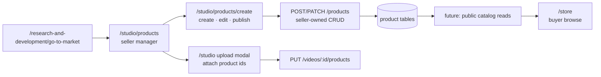

# Creator Studio — My Products & Create Listing

The frontend doc for the **seller-facing product listing** surface in Creator Studio:
`/studio/products` (My Products) and `/studio/products/create` (5-step create/edit wizard).

**Read alongside:**

- [STUDIO_PRODUCTS_BACKEND_STRUCTURE.md](STUDIO_PRODUCTS_BACKEND_STRUCTURE.md) — the `/products/*`
  API contract (seller CRUD, images, publish). **Shipped** on the Express backend.
- [STUDIO_BACKEND_STRUCTURE.md](STUDIO_BACKEND_STRUCTURE.md) — video upload; videos can attach
  product ids (`attachedProductIds`) for shoppable cards on the watch page.
- [R_AND_D_STRUCTURE.md](R_AND_D_STRUCTURE.md) §4c — go-to-market ends on `/studio/products` as
  the handoff from verified build to commerce.
- [CLAUDE.md](CLAUDE.md) — thin-client invariant, Zod boundary parsing, discriminated-union UI
  states.

> **Naming note:** this surface lives under **Studio** (`/studio/products`), not under the buyer
> **`/store`** route. `/store` is where buyers browse active listings — that browse/checkout
> surface will get its own frontend + backend plans later. An earlier draft of the seller API was
> mistakenly filed as [STORE_BACKEND_STRUCTURE.md](STORE_BACKEND_STRUCTURE.md); the authoritative
> seller contract is **STUDIO_PRODUCTS_BACKEND_STRUCTURE.md**.

> **Phase note:** the seller flow is **wired end-to-end** — create, edit, draft, publish, image
> upload/delete, delete listing, and B2B tier input all call the real `/products` API. What
> remains is polish (pagination, thumbnails, unpublish, image reorder) and one cross-surface mock
> (the video upload product picker).

---

## 1. What exists today

| Piece | Location | State |
| ----- | -------- | ----- |
| My Products route | [studio/products/page.tsx](src/app/(studio)/studio/products/page.tsx) | ✅ thin shell → `ProductsPage` |
| Create / edit route | [studio/products/create/page.tsx](src/app/(studio)/studio/products/create/page.tsx) | ✅ `Suspense` + `CreateListingRoute` (`?id=` edit mode) |
| My Products body | [products-page.tsx](src/components/studio/pages/products-page.tsx) | ✅ `useMyProductsQuery` + delete |
| Create wizard | [create-listing-page.tsx](src/components/studio/pages/create-listing-page.tsx) | ✅ 5-step wizard; create + edit |
| Edit route helper | [create-listing-route.tsx](src/components/studio/pages/create-listing-route.tsx) | ✅ reads `?id=` search param |
| Zod schemas + money helpers | [src/lib/products/schemas.ts](src/lib/products/schemas.ts) | ✅ response parse + label↔slug maps |
| API functions | [src/lib/products/api.ts](src/lib/products/api.ts) | ✅ one fn per `/products` route (no reorder yet) |
| React Query hooks | [src/hooks/products.ts](src/hooks/products.ts) | ✅ mine/detail queries + create/update/delete mutations |
| Studio chrome | [src/app/(studio)/layout.tsx](src/app/(studio)/layout.tsx) | ✅ `QueryProvider` + sidebar |
| Sidebar nav | [studio-sidebar.tsx](src/components/studio/studio-sidebar.tsx) | ✅ "My Products" → `/studio/products` |
| Create menu | [create-menu.tsx](src/components/studio/create-menu.tsx) | ✅ "Create store listing" link |
| Video product picker | [store-products-picker.tsx](src/components/studio/upload/store-products-picker.tsx) | 🧪 **mock** — hardcoded product ids |
| Buyer store types | [src/types/store.ts](src/types/store.ts) | ◐ display shapes for **`/store`** browse — separate surface |

**Not built on this surface:** `loading.tsx` / `error.tsx` under `studio/products/`, `TRANSPORT:`
banners on the products page files (see §10), list pagination UI, unpublish action, image reorder
UI, public `/store` browse wiring.

Pattern donors:

- **Multi-step wizard + progress bar:** same studio family as
  [upload-modal.tsx](src/components/studio/upload/upload-modal.tsx) (video upload).
- **Client-query island in `(studio)`:** [videos-list.tsx](src/components/studio/videos/videos-list.tsx)
  — list + row actions backed by React Query.
- **Tagged API results:** [src/lib/rnd/](src/lib/rnd/) — `ActionResponse` + Zod `.strip()`; products
  follow the same pattern via [src/lib/http.ts](src/lib/http.ts).

---

## 2. Studio vs store — two surfaces, one catalog



| Surface | URL prefix | Who | This doc? |
| ------- | ---------- | --- | --------- |
| **Studio products** | `/studio/products` | Signed-in **seller** | ✅ yes |
| **Store browse** | `/store`, `/store/product/[id]` | **Buyer** | ❌ future store docs |
| **Video attach** | upload modal step 2 | Creator linking own listings | ◐ picker still mock |

The seller never "publishes to studio" — they publish a **`product` row** (`status: active`) that
will eventually appear on `/store` once buyer read routes exist.

---

## 3. Route map

```text
🔌 /studio/products                    My Products — seller listing table
🔌 /studio/products/create             Create wizard (new listing)
🔌 /studio/products/create?id=<uuid>   Same wizard, edit mode (prefill from GET /products/:id)
```

Both routes inherit `(studio)/layout.tsx` (standalone chrome — not the `(home)` shell).

Entry points elsewhere:

- R&D go-to-market hero + CTA band → `/studio/products`
- Studio create menu → `/studio/products/create`
- Upload modal store picker empty state → `/studio/products/create`
- My Products row **Edit** → `/studio/products/create?id=…`

---

## 4. Component map

```text
src/app/(studio)/studio/products/
  page.tsx                          metadata + <ProductsPage />
  create/page.tsx                   Suspense + <CreateListingRoute />

src/components/studio/pages/
  products-page.tsx                 list (client-query)
  create-listing-route.tsx          ?id= bridge (client)
  create-listing-page.tsx           wizard (client-query)

src/lib/products/
  schemas.ts                        Zod + enums + money helpers
  api.ts                            fetch wrappers

src/hooks/
  products.ts                       React Query keys + mutations

src/components/studio/upload/
  store-products-picker.tsx         mock picker (video attach) — NOT wired to /products/mine
```

No `sections/` / `cards/` decomposition yet — the wizard is one large file (~1k lines). Splitting
by step (`identity-step.tsx`, …) is optional refactor, not blocking.

---

## 5. The create / edit wizard — 5 steps

Opened from **Add product** (create) or **Edit** on a list row (`?id=`). Stepper:
**Product Identity → Images & Media → Description → Pricing & Inventory → Review & Publish**.

```mermaid
flowchart LR
  S1[Identity] --> S2[Images]
  S2 --> S3[Description]
  S3 --> S4[Pricing]
  S4 --> S5[Review]
  S5 -->|Save Draft| DRAFT[POST or PATCH + images]
  S5 -->|Publish| PUB[… then POST …/publish]
  DRAFT --> LIST[/studio/products]
  PUB --> DONE[Success screen]
```

### Step 1 — Product Identity

| Field | State var | Wire field | Notes |
| ----- | --------- | ---------- | ----- |
| Product title | `productTitle` | `title` | required; max 200 (`PRODUCT_TITLE_MAX_LENGTH`) |
| Brand | `brandName` | `brand` | optional |
| Category | `selectedCategory` (label) | `category` (slug) | 8 labels via `CATEGORY_LABEL_TO_SLUG` |
| Condition | `selectedCondition` | `condition` | New / Refurbished / Used |

### Step 2 — Images & Media

| Field | State | API | Notes |
| ----- | ----- | --- | ----- |
| New files | `selectedImageFiles` | `POST …/images` × N | max 9 total with existing |
| Existing (edit) | `existingImages` | — | from `GET /products/:id` |
| Removed (edit) | `removedImageIds` | `DELETE …/images/:id` | queued on save |
| Main image | first position | server `position 0` | upload order = position; reorder API unused |

Drag-and-drop + file picker; object-URL previews for new files; Cloudinary URLs for existing.

### Step 3 — Description

| Field | State var | Wire field |
| ----- | --------- | ---------- |
| Description | `productDescription` | `description` |
| Key features | `keyFeatures[]` | `keyFeatures` |

Features added one at a time via draft input + Add button.

### Step 4 — Pricing & Inventory

| Field | State var | Wire field | Notes |
| ----- | --------- | ---------- | ----- |
| Price | `priceInDollars` | `priceInCents` | `dollarsToCents()` at submit |
| Compare-at | `compareAtPriceInDollars` | `compareAtPriceInCents` | optional "was" price |
| Stock | `stockQuantity` | `stockQuantity` | integer ≥ 0 |
| SKU | `skuCode` | `sku` | optional; unique per seller |
| Bulk tiers | `pricingTiers[]` | `pricingTiers` | optional B2B ladder |

Each tier row: unit price (dollars) + minimum order quantity. Blank rows skipped. Server replaces
the full tier set on PATCH when tiers are sent.

### Step 5 — Review & Publish

Summary cards for each section. Two actions:

- **Save Draft** — create/update + upload images; **does not** call publish (stays `draft`).
- **Publish Listing** — same pipeline then `POST /products/:id/publish`.

**Save progress UI:** `SaveProgress` discriminated union (`idle` → `creating` → `uploading` →
`publishing` → `done`) drives inline status during the multi-request mutation.

**Publish success:** dedicated success screen with link back to My Products (create path only;
draft save redirects immediately).

### Edit mode behaviour

- `CreateListingRoute` passes `productId` from `?id=`.
- `useProductQuery(productId)` loads once; form prefills via `useEffect` + `hasPrefilledRef`.
- Save uses `useUpdateListingMutation` (patch → delete removed images → upload new → optional
  publish).
- Loading / error gates block the form until GET succeeds.

---

## 6. My Products list

Minimal table (not a full data-grid):

| Column | Source | Notes |
| ------ | ------ | ----- |
| Title | `ProductListRow.title` | truncated |
| SKU | `sku ?? "—"` | |
| Status badge | `status` | Active (primary) / Draft (muted) |
| Price | `centsToPriceLabel(priceInCents)` | never stored as string |
| Stock | `stockQuantity` | "{n} in stock" |
| Edit | link | `/studio/products/create?id=` |
| Delete | inline confirm | `useDeleteProductMutation` |

**States:** loading panel · error + retry · empty + CTA · success list.

**Gaps vs backend:**

- Pagination: query hardcodes `page=1`, `limit=20` — no "load more" or page controls.
- No thumbnail: list row uses a generic mall icon; `ProductListRow` has no image url.
- No unpublish: active rows cannot be taken down without opening edit (and no unpublish there either).

---

## 7. Network layer

### Schemas ([schemas.ts](src/lib/products/schemas.ts))

- Response: `PublicProductSchema`, `ProductListRowSchema`, `ProductImageSchema`,
  `ProductPricingTierSchema`, `PaginationMetaSchema`.
- Enums: `PRODUCT_CATEGORY_SLUGS`, `PRODUCT_CONDITION_SLUGS`, `PRODUCT_STATUSES` — **snake_case**
  slugs on the wire (matches backend `pgEnum`).
- Label maps: `CATEGORY_LABEL_TO_SLUG` / `SLUG_TO_CATEGORY_LABEL` (order matches wizard dropdown).

### API ([api.ts](src/lib/products/api.ts))

| Function | Route |
| -------- | ----- |
| `createProduct` | `POST /products` |
| `getMyProducts` | `GET /products/mine?page&limit` |
| `getProduct` | `GET /products/:id` |
| `updateProduct` | `PATCH /products/:id` |
| `deleteProduct` | `DELETE /products/:id` |
| `uploadProductImage` | `POST /products/:id/images` (multipart) |
| `deleteProductImage` | `DELETE /products/:id/images/:imageId` |
| `publishProduct` | `POST /products/:id/publish` |
| `unpublishProduct` | `POST /products/:id/unpublish` |

**Not wrapped yet:** `PATCH /products/:id/images/reorder`.

### Hooks ([products.ts](src/hooks/products.ts))

- `productKeys` factory — `all`, `mine(page)`, `detail(id)`.
- `useMyProductsQuery`, `useProductQuery`.
- `useCreateListingMutation` — create → sequential image uploads → optional publish.
- `useUpdateListingMutation` — patch → delete removed → upload new → optional publish.
- `useDeleteProductMutation`.

Mutations invalidate `productKeys.all` (and detail on update). Errors surface via `ApiRequestError`
from `@/lib/http`.

### Money rule

Form inputs are **dollar strings**; the client converts to **integer cents** before JSON
(`dollarsToCents`). Display uses `centsToPriceLabel` / `centsToDollarString`. The backend is the
sole money authority — no floats on the wire.

---

## 8. Cross-surface integration

### R&D go-to-market

[go-to-market-hero.tsx](src/components/home/research-and-development/sections/go-to-market-hero.tsx)
and [create-listing-cta-band.tsx](src/components/home/research-and-development/sections/create-listing-cta-band.tsx)
link to `/studio/products` (manager) with copy that `/store` is browse-only. No API call — pure
navigation handoff.

### Video upload — shoppable products

[store-products-picker.tsx](src/components/studio/upload/store-products-picker.tsx) in the upload
modal's **Video elements** step lets creators attach product ids. The video API
(`attachedProductIds` on create/update) is **real** and the backend re-validates ownership — but
the picker still lists **mock ids**, so attach attempts fail with 422 until the picker reads
`GET /products/mine` (active listings only, or all owned).

Fix checklist:

1. Replace `MOCK_STORE_PRODUCTS` with `useMyProductsQuery` (or a dedicated compact search hook).
2. Filter to `status === "active"` if only published products may be attached.
3. Empty state already links to `/studio/products/create`.
4. Update `TRANSPORT:` banner from `mock` → `client-query`.

### Future `/store` browse

[src/types/store.ts](src/types/store.ts) and [src/components/home/store/](src/components/home/store/)
hold buyer UI shapes and mock rails. Wiring `/store` to **public catalog read routes** (not
`/products/mine`) is a separate phase — see future store structure docs.

---

## 9. Remaining work (ordered)

| # | Item | Effort | Notes |
| - | ---- | ------ | ----- |
| 1 | Wire **store-products-picker** to real listings | small | unblocks video shoppable cards |
| 2 | **Pagination** on My Products | small | page state + controls; backend ready |
| 3 | **List thumbnails** | small–medium | extend `ProductListRow` or secondary fetch |
| 4 | **Unpublish** hook + list/edit action | small | `unpublishProduct` already in api.ts |
| 5 | **Image reorder** UI + api wrapper | medium | `PATCH …/images/reorder` |
| 6 | `loading.tsx` for both routes | tiny | match other studio routes |
| 7 | `TRANSPORT:` banners on products files | tiny | `client-query` on page components |
| 8 | Split wizard into step components | optional | maintainability only |

---

## 10. Transport labelling

Studio video components use a first-line `TRANSPORT:` banner (`server-fetch` · `client-query` ·
`props-only` · `mock`). Products pages **do not yet** carry banners — when added:

| File | Value |
| ---- | ----- |
| `products-page.tsx` | `client-query` |
| `create-listing-page.tsx` | `client-query` |
| `create-listing-route.tsx` | `props-only` (search param bridge) |
| `store-products-picker.tsx` | `mock` → `client-query` after §9.1 |

Audit:

```bash
rg -n "TRANSPORT:" src/components/studio/pages/products-page.tsx \
  src/components/studio/pages/create-listing-page.tsx \
  src/components/studio/upload/store-products-picker.tsx
```

---

## 11. Architecture rules (this surface)

Same NON-NEGOTIABLE patterns as R&D and the rest of the repo:

1. **Discriminated unions for UI state** — list and wizard use explicit branches (loading / error /
   empty / success), not loose `isLoading && data` bags.
2. **Zod at the boundary** — every `/products` response parsed in `schemas.ts`; no `as` on network
   payloads.
3. **Tagged results** — `ActionResponse<T>` from `@/lib/http`; hooks use `unwrap()` so components
   see thrown `ApiRequestError` or data, not silent failure.
4. **Server-side authority** — publish completeness, ownership, SKU uniqueness, image bytes, and
   cents are validated on the backend ([STUDIO_PRODUCTS_BACKEND_STRUCTURE.md](STUDIO_PRODUCTS_BACKEND_STRUCTURE.md) §0).
5. **No client-side catalog over fetch** — My Products displays one page from the server; do not
   client-filter a downloaded full catalog when pagination grows.

---

## 12. Verification (manual)

With `pnpm dev` and the Express backend running, signed in as a seller:

1. **Create draft** — `/studio/products/create` → fill identity + pricing → Save Draft without
   images → appears as Draft on My Products.
2. **Publish** — add ≥1 image → Publish → success screen → row shows Active.
3. **Edit** — Edit row → change title → Save → list updates after invalidation.
4. **Delete** — Confirm delete → row removed.
5. **Tier** — add bulk tier on pricing step → save → reload edit → tiers prefilled.
6. **Video attach** (after §9.1) — pick own active product in upload modal → video save succeeds.

Negative: publish without images → `422 INCOMPLETE_FOR_PUBLISH`; duplicate SKU → `409 SKU_TAKEN`.

---

## 13. Out of scope (other docs)

| Topic | Doc |
| ----- | --- |
| Seller `/products/*` API detail | [STUDIO_PRODUCTS_BACKEND_STRUCTURE.md](STUDIO_PRODUCTS_BACKEND_STRUCTURE.md) |
| Video upload + attach contract | [STUDIO_BACKEND_STRUCTURE.md](STUDIO_BACKEND_STRUCTURE.md) |
| Buyer `/store` browse + checkout | future store structure docs (placeholder in STORE_BACKEND_STRUCTURE.md today) |
| Orders, payments, escrow | [ESCROW_LEDGER_STRUCTURE.md](ESCROW_LEDGER_STRUCTURE.md) |
| R&D pipeline handoff | [R_AND_D_STRUCTURE.md](R_AND_D_STRUCTURE.md) §4c |
