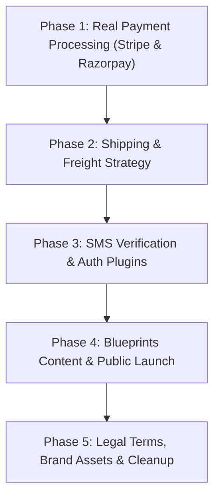

# Qatoto: Complete Frontend & Backend Status, Missing Features & Implementation Roadmap

## Goal Description

Qatoto is designed as an end-to-end B2B platform that turns physical product ideas into manufactured, shipped goods — encompassing R&D ventures, team assembly, proof-of-effort tracking, creator studio, engineering blueprints, and a full B2B commerce marketplace.

Both the Next.js frontend (`qatoto-frontend`) and Express/PostgreSQL backend (`qatoto-backend`) have achieved deep technical maturity: database schemas, typed Zod contracts, double-entry bookkeeping ledgers, and hundreds of verified API endpoints exist. However, several critical commercial and production systems are currently **mocked, running on "fake" adapters that refuse to operate in production, or intentionally left as placeholders**.

This document outlines **exactly what is done, what is incomplete, what external services are missing (such as payment gateways), and the step-by-step roadmap to bring the platform to full production readiness**.

---

## Executive Summary: What is the Real State of the App?

| Domain                   | What Works Today (Complete)                                                                                | What Is Incomplete / Missing                                                                                                                                           |
| :----------------------- | :--------------------------------------------------------------------------------------------------------- | :--------------------------------------------------------------------------------------------------------------------------------------------------------------------- |
| **Payments & Checkout**  | Cart, order creation, order ledger state machine, refund request UI, payment intent polling.               | **No real Payment Gateway.** Only a `fake` adapter exists; Stripe is a placeholder string; Razorpay is absent. No payment modal/card entry on frontend.                |
| **Logistics & Shipping** | Shipment leg data models, tracking events schema, transport mode selection (air/sea).                      | **No Carrier API.** Rates and bookings use a `fake` adapter; rate cards in database are empty (`shippingInCents = 0`); no tracking integration.                        |
| **Escrow & FX**          | Multi-milestone escrow state machines, strict ledger accounting rules.                                     | **No Licensed Escrow Provider.** Uses `FakeExternalEscrowProviderAdapter`; Escrow.com and Shieldpay are not implemented. Foreign exchange is a 1:1 fake.               |
| **Auth & Security**      | Email OTP login, password auth, session management, RBAC / staff capabilities.                             | **Phone SMS verification is dead.** The Settings phone verification UI was made inert because backend has no SMS provider (e.g. Twilio/Msg91).                         |
| **Blueprints Hub**       | 32 engineering teardowns, 3D exploded view WebGL engine, case studies, maker launches, admin review queue. | **Invented Content & De-indexed.** All 32 blueprints are seeded fixtures; all 7 routes have `noindex` and are excluded from `sitemap.ts`. Rights claims use `mailto:`. |
| **Video & Watch**        | YouTube video feed, chapters, likes, comments, project association.                                        | **Transcripts & Premium are Mock.** No Speech-to-Text (ASR) pipeline; no paywall; no subtitle authoring (`/studio/subtitles` is stubbed).                              |
| **Creator / Studio**     | Sales, earnings overview, pitch management, product listing wizard, video upload.                          | `/studio/subtitles` and `/studio/learn` are placeholder stubs. Multi-axis variants (Color × Size) are not built (only single-level variants).                          |
| **Legal & Policy**       | Comprehensive policy text and disclaimer pages.                                                            | **Legal placeholders.** Company name, jurisdiction, and registered address are `[TO BE CONFIRMED]`; inbox addresses are hardcoded.                                     |

---

## Detailed Breakdown by Domain

### 1. Payment Gateways & Financial Rail (The #1 Blocker)

#### Current State:

- When a buyer checks out on `/checkout`, the orders are created on the `direct_processor` rail.
- On the order page (`OrderPaymentPanel`), clicking **"Pay for this order"** calls `POST /commerce/orders/:orderId/payment-intents`.
- In `qatoto-backend`, the backend checks `resolveCommercePaymentProvider()`:
    - If `COMMERCE_PAYMENT_PROVIDER=fake`, it immediately marks the intent as `settled` with a dummy reference like `fake_pi_...`.
    - In production (`NODE_ENV=production`), the fake adapter is **refuse-closed** (`PROVIDER_UNAVAILABLE`).
    - Stripe is listed as an option in `commerce-payment-provider.adapter.ts`, but it throws: `"Commerce payment provider 'stripe' is not implemented yet."`

#### What Needs to Be Done:

1. **Integrate Stripe (Global Card / Bank Debit Rail)**:
    - **Backend**: Install `stripe` SDK. Implement `StripeCommercePaymentProviderAdapter` implementing `createPaymentIntent`, `retrievePaymentIntent`, `createRefund`, and `retrieveRefund`.
    - **Webhooks**: Build `POST /commerce/webhooks/stripe` to cryptographically verify webhook signatures and handle `payment_intent.succeeded`, `payment_intent.payment_failed`, and `charge.refunded`.
    - **Frontend**: Integrate `@stripe/stripe-js` and `@stripe/react-stripe-js` (Stripe Elements) into `OrderPaymentPanel` so buyers can enter card details or use Apple Pay / Google Pay.
2. **Integrate Razorpay (India Rail — UPI, NetBanking, Cards)**:
    - Widen backend enum `CommercePaymentProviderName = "fake" | "stripe" | "razorpay"`.
    - Implement Razorpay order creation (`orders.create`), client-side Razorpay Checkout modal, and webhook validation.
3. **"Buy Now" (Single-Product Express Checkout)**:
    - Provide a direct 1-click checkout option on the product detail page that bypasses the multi-seller cart.

---

### 2. Logistics, Shipping Carriers & Rate Cards

#### Current State:

- The system supports defining legs (e.g. factory to port, ocean leg, destination inland leg).
- However, `logistics-provider.adapter.ts` is purely synthetic. Rates are hardcoded dummy numbers ($1,000 for sea, $5,000 for air).
- In production, rate card database tables are empty. Every checkout route answers `no_active_rate_card`, keeping estimated shipping at $0.
- Carrier references and tracking numbers entered during fulfillment are plain text manually typed by sellers; there is no automated label generation or live carrier tracking.

#### What Needs to Be Done:

1. **Contract and Seed Freight Rate Cards**:
    - Buy or import forwarder rate data into `commerce_freight_rate_card` so international shipping routes have real price formulas based on gross weight and volume.
2. **Third-Party Logistics (3PL) API Adapter**:
    - Build a real adapter for a carrier or aggregator (e.g., Shiprocket, EasyPost, Freightos, or FedEx) to automatically generate tracking numbers, fetch live quotes, and ingest tracking status webhooks (`in_transit`, `out_for_delivery`, `delivered`).
3. **Marine/Cargo Insurance Provider**:
    - Currently `insurance-provider.adapter.ts` is an uncontracted stub. If cargo insurance is offered to buyers, connect an insurance API or maintain policy underwriting agreements.

---

### 3. External Escrow & Foreign Exchange (FX)

#### Current State:

- Qatoto deliberately avoids custody of funds for regulatory reasons (money transmission licensing).
- An escrow adapter seam exists (`external-escrow-provider.adapter.ts`) with `escrow_com` and `shieldpay` listed in the enum, but only `FakeExternalEscrowProviderAdapter` is coded.
- `foreign-exchange-provider.adapter.ts` returns a synthetic 1:1 rate and is refuse-closed in production.

#### What Needs to Be Done:

1. **Real Escrow Integration**: If milestone-based high-value purchases require third-party escrow, complete the adapter for Escrow.com or Shieldpay API, including webhook handlers.
2. **Live FX Rates**: Connect an exchange rate API (e.g., Open Exchange Rates or Wise) for multi-currency order calculations if buyers and sellers operate in different currencies (USD, INR, EUR).

---

### 4. Phone Number & SMS OTP Authentication

#### Current State:

- Settings previously had a "Phone Number" verification flow calling `authClient.phoneNumber.sendOtp()`.
- However, `POST /api/auth/phone-number/send-otp` answered 404 because Better Auth's `phoneNumber()` plugin was never configured on the backend, and no SMS gateway exists in configuration (only email delivery via Brevo exists).
- The frontend panel was made read-only with a message explaining phone verification is not yet available.

#### What Needs to Be Done:

1. Choose an SMS gateway provider (e.g., Twilio, AWS SNS, Msg91, or Sinch).
2. Configure credentials in backend `config` (`SMS_PROVIDER_API_KEY`, etc.).
3. Add Better Auth `phoneNumber()` plugin to `qatoto-backend/src/modules/auth/auth.ts` with a real `sendOTP` implementation.
4. Add the `phone_number` and `phone_number_verified` columns to the database user table.
5. Re-enable the interactive OTP verification modal on the frontend settings page.

---

### 5. Blueprints Launch: Real Content & Search Engine Indexing

#### Current State:

- `/blueprints` (Engineering Teardowns, Case Studies, Showcase Launches) has complete frontend UI and backend CRUD endpoints.
- However, all 32 blueprints in the database are invented fixture data (`blueprint-seed-corpus.ts`).
- To prevent indexing fake teardowns, the entire section is **de-indexed**:
    - `robots: { index: false, follow: false }` is set across 7 blueprint routes.
    - `/blueprints` is omitted from `src/app/sitemap.ts`.
- IP / DMCA rights claims currently generate a pre-formatted email via `mailto:support@qatoto.com` rather than saving to a database table.

#### What Needs to Be Done:

1. **Acquire/Publish Real Hardware Content**: Authors/engineers submit genuine product teardowns, BOMs, and manufacturing case studies.
2. **The Launch Step (SEO Restoration)**:
    - Remove `robots: { index: false, follow: false }` across all 7 blueprint pages.
    - Restore blueprint dynamic URL generation in `src/app/sitemap.ts`.
3. **In-Platform Rights Claim Intake**:
    - Create the `blueprint_rights_claim` table in backend.
    - Add `POST /blueprints/teardowns/:slug/claims` to accept formal IP infringement reports directly into the admin review queue.

---

### 6. Video Domain: Transcripts, Premium Tier & Subtitles

#### Current State:

- `src/components/home/watch/watch-content.tsx` and `comments.tsx` contain `TRANSPORT: mock` markers:
    - `transcript`: Displays empty array because the backend has no transcription table or ASR (Automatic Speech Recognition) pipeline.
    - `isPremium`: Always `false`; no paywall, membership tier, or subscription billing model exists in the backend.
    - `trending`: Empty array; no backend aggregation query computes trending tags from video comments/searches.
- `/studio/subtitles`: Marked as `StudioPlannedPage`. Because videos are embedded from YouTube, subtitle tracks are managed on YouTube's player, making on-platform subtitle generation inapplicable unless custom video hosting is introduced.
- Social Share Icons: WhatsApp, X, and LinkedIn render generic share icons because their brand SVGs are missing from `public/icons/`.

#### What Needs to Be Done:

1. Add brand SVG icons for WhatsApp, X (Twitter), and LinkedIn into `public/icons/`.
2. If video transcripts are desired: Integrate Whisper or deepgram API to generate transcripts upon video ingestion, stored in a new `video_transcript` table.
3. If subscriptions are desired: Introduce an entitlement model in backend with recurring payment processing.

---

### 7. Creator Studio & Multi-Axis Product Variants

#### Current State:

- `/studio/subtitles` and `/studio/learn`: Planned placeholder screens.
- **Product Variants**: Currently, a listing supports a flat list of variants (e.g., "Standard", "Deluxe"), each with its own SKU, price, and inventory. Multi-axis variants (a matrix like Size: S/M/L × Color: Red/Blue) are deferred because they require complex database migrations on order lines.
- **Incoterms on Listings**: Incoterms (e.g., FOB vs DDP) are currently snapshotted only on quotes and orders. A seller cannot yet specify a default Incoterm directly on the public product listing.

#### What Needs to Be Done:

1. Add `defaultIncoterm` to `commerce_product` schema so buyers can see whether shipping is arranged by seller or buyer.
2. Implement multi-axis variant options table (`commerce_product_variant_option`) if complex matrix configurations are needed.
3. Replace `/studio/learn` with real onboarding guides and seller knowledge-base articles.

---

### 8. Legal, Compliance & Contact Configuration

#### Current State:

- In `src/lib/site.ts`, legal constants are currently strings with placeholders:
    - `LEGAL_ENTITY_NAME = "[TO BE CONFIRMED]"`
    - `LEGAL_ENTITY_REGISTERED_ADDRESS = "[TO BE CONFIRMED]"`
    - `GOVERNING_LAW_JURISDICTION = "[TO BE CONFIRMED]"`
    - `GOVERNING_LAW_COURTS = "[TO BE CONFIRMED]"`
- Legal terms (`terms-of-service.tsx`, `privacy-policy.tsx`) still describe Qatoto as "The Qatoto Video Sharing Site" rather than reflecting B2B commerce, physical goods shipping, contracts, and R&D equity claims.
- Hardcoded email addresses (`security@qatoto.com`, `careers@qatoto.com`, `press@qatoto.com`) need active monitoring.

#### What Needs to Be Done:

1. Update legal entity name, address, and governing law in `site.ts`.
2. Update Terms of Service to cover marketplace buyer/seller terms, R&D agreements, and order cancellations.
3. Add a Cookie & Privacy Consent Banner if analytics or advertising scripts are introduced.

---

## User Review Required

> [!IMPORTANT]
> **Priority 1 Decision: Payment Gateway Architecture**
> Which payment gateway should be prioritized first?
>
> 1. **Stripe**: Ideal for international credit cards, US/EU/UK bank transfers, and Apple Pay/Google Pay.
> 2. **Razorpay**: Essential if the primary target market or initial operating entity is in India (UPI, NetBanking, RuPay/Indian cards).
> 3. **Dual Provider**: Stripe for international USD transactions, Razorpay for domestic INR transactions.

> [!WARNING]
> **Priority 2 Decision: Freight & Logistics Model**
> Real-time freight calculations require either:
>
> - Direct API integration with a logistics platform (e.g. Shiprocket for India, Freightos / EasyPost globally).
> - Flat-rate / manual shipping charges set directly by sellers per listing, avoiding the need to purchase external rate cards.

---

## Proposed Implementation Phases



### Phase 1: Real Payment Processing (Stripe / Razorpay)

- [NEW] `qatoto-backend/src/modules/store/storefront/stripe-payment.adapter.ts`
- [NEW] `qatoto-backend/src/modules/store/storefront/razorpay-payment.adapter.ts`
- [MODIFY] `qatoto-backend/src/modules/store/orders/commerce-trust.routes.ts` (add gateway webhooks)
- [MODIFY] `qatoto-frontend/src/components/commerce/sections/order-payment-panel.tsx` (embed Stripe Elements / Razorpay Checkout)

### Phase 2: Logistics & Rate Data

- [MODIFY] Backend rate lookup: add seller-defined flat-rate shipping fallback if no forwarder rate card matches.
- [NEW] Carrier webhook receiver for shipment tracking updates.

### Phase 3: Phone Verification (SMS)

- [MODIFY] `qatoto-backend/src/modules/auth/auth.ts`: add `phoneNumber()` plugin and SMS sending adapter.
- [MODIFY] `qatoto-frontend/src/components/home/account/panels/phone-number-panel.tsx`: re-enable OTP input modal.

### Phase 4: Blueprints Public Launch

- Seed initial genuine teardown records.
- Remove `noindex` headers and restore `/blueprints` in `sitemap.ts`.

### Phase 5: Legal & UI Asset Polish

- Fill in legal entity details in `src/lib/site.ts`.
- Add brand SVGs for WhatsApp, LinkedIn, and X to `public/icons/`.

---

## Verification Plan

### Automated Tests

- Backend payment adapter test suites:
    ```bash
    pnpm --filter qatoto-backend test src/modules/store/storefront/commerce-payment-provider.adapter.test.ts
    ```
- Backend test gate:
    ```bash
    pnpm --filter qatoto-backend test
    ```
- Frontend typecheck and lint:
    ```bash
    pnpm --filter qatoto-frontend typecheck
    pnpm --filter qatoto-frontend lint
    ```

### Manual Verification

1. **Checkout & Payment Test**: Add product to cart -> Proceed to checkout -> Click "Pay for this order" -> Verify payment gateway modal opens -> Complete test card payment -> Verify order moves to `confirmed` and ledger settles.
2. **Refund Test**: Request partial refund on paid order -> Verify gateway processes refund -> Verify ledger reflects refund.
3. **Phone Verification Test**: Enter phone number in Account Settings -> Receive SMS code -> Enter OTP -> Verify phone marked as verified.
4. **Blueprints SEO Test**: Check page source of `/blueprints` and `/blueprints/teardowns` -> Confirm `noindex` is absent and canonical link is present.
