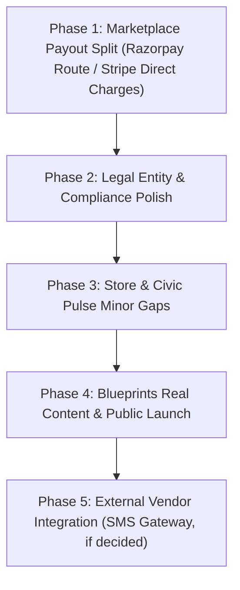

# Qatoto: Complete Frontend & Backend Status, Missing Features & Implementation Roadmap

## Goal Description

Qatoto is designed as an end-to-end B2B platform that turns physical product ideas into manufactured, shipped goods — encompassing R&D ventures, team assembly, proof-of-effort tracking, creator studio, engineering blueprints, and a full B2B commerce marketplace.

Both the Next.js frontend (`qatoto-frontend`) and Express/PostgreSQL backend (`qatoto-backend`) have achieved deep technical maturity: database schemas, typed Zod contracts, double-entry bookkeeping ledgers, and hundreds of verified API endpoints exist. Recent development sprints completed the **Razorpay payment adapter and checkout modal**, **"Buy Now" scoped checkout**, **freight rate card authoring**, **creator video transcripts**, **in-platform rights claims**, **search query analytics**, and a **comprehensive legal policy rewrite**.

This document outlines **what is complete, what is truly remaining in code, what external dependencies are blocking launch (such as marketplace payout splits and SMS providers), deliberate non-goals, and the step-by-step roadmap to full production readiness**.

---

## Executive Summary: Real State of the App

| Domain                   | What Works Today (Complete)                                                                                                                                                                                          | What Is Incomplete / Missing                                                                                                                                                                                                                                                                                                  |
| :----------------------- | :------------------------------------------------------------------------------------------------------------------------------------------------------------------------------------------------------------------- | :---------------------------------------------------------------------------------------------------------------------------------------------------------------------------------------------------------------------------------------------------------------------------------------------------------------------------- |
| **Payments & Checkout**  | Cart, order creation, order ledger state machine, "Buy Now" scoped express checkout, and **Razorpay integration** (536-line direct `fetch` adapter, dual HMAC verification, webhook inbox, frontend checkout modal). | **⛔ Blocked on Marketplace Split.** Captured payments currently settle into Qatoto's own account (prohibited by custody rules). Razorpay Route (and Stripe Direct Charges if Stripe is used) must populate `settlement_account_ref` and `application_fee_in_cents` before production launch. Stripe adapter remains unbuilt. |
| **Logistics & Shipping** | Multimodal transport leg selection, provider freight rate cards (`commerce_freight_rate_card`), rating service, and Studio rate card composer at `/studio/logistics/rate-cards` with TSV paste.                      | Forwarder onboarding verification is required to author rates. Service-offering coverage read remains open. Carrier APIs (FedEx/Shiprocket) are a **deliberate non-goal**.                                                                                                                                                    |
| **Escrow & FX**          | Multi-milestone escrow state machines, strict ledger accounting rules.                                                                                                                                               | Licensed escrow provider (Escrow.com/Shieldpay) and live FX feed (Open Exchange Rates/Wise) remain deterministic fakes until milestone escrow and multi-currency orders launch.                                                                                                                                               |
| **Auth & Security**      | Email OTP login (Brevo), password auth, WebAuthn Passkeys, session management, RBAC / staff capabilities.                                                                                                            | **Phone SMS verification is dead.** The Settings phone verification UI was made read-only because the backend has no SMS gateway (Twilio/Msg91). Better Auth `phoneNumber()` requires an SMS provider and DB migration.                                                                                                       |
| **Blueprints Hub**       | 32 engineering teardowns, 3D exploded view WebGL engine, case studies, maker launches, admin review queue, and in-platform sworn rights claims (`POST /blueprints/teardowns/:slug/claims` + `/admin/rights-claims`). | **Invented Content & De-indexed.** All 32 blueprints are seeded fixtures; all 7 routes have `noindex` and are excluded from `sitemap.ts`. Real hardware content is required before un-indexing.                                                                                                                               |
| **Video & Watch**        | YouTube video feed, chapters, comments, creator-supplied transcripts (.srt / .vtt / text), trending tags, search query analytics ("Everyone is searching for:"), and brand SVG icons for WhatsApp, X, and LinkedIn.  | Creator paywalls (`isPremium`) are hardcoded to `false`. In-player caption authoring is a **deliberate non-goal** (managed by YouTube).                                                                                                                                                                                       |
| **Creator / Studio**     | Sales, earnings overview, pitch management, product listing wizard, video upload, and freight rate card authoring.                                                                                                   | `/studio/learn` is a placeholder screen. Incoterms default on listings is open. Multi-axis variants (Color × Size) are deferred (only single-level variants exist).                                                                                                                                                           |
| **Legal & Policy**       | Comprehensive Terms of Service and Privacy Policy rewrite (shipped 2026-09-28) covering B2B commerce, R&D equity, and blueprints.                                                                                    | Company legal entity placeholders in `site.ts` are `[TO BE CONFIRMED]`. Terms acceptance tracking (`terms_accepted_at`) is missing. Data export service needs expansion.                                                                                                                                                      |

---

## Detailed Breakdown by Domain

### 1. Payment Gateways & Financial Rail (The #1 Production Blocker)

#### Current State:

- When a buyer checks out on `/checkout`, orders are created on the `direct_processor` rail.
- "Buy Now" single-product express checkout is **shipped and verified** via scoped checkout preparations.
- **Razorpay is fully integrated**:
    - Backend: `RazorpayCommercePaymentProviderAdapter` (536 lines of direct `fetch`, no untyped SDKs).
    - Security: Constant-time dual HMAC signature checks for webhook payloads and checkout handlers.
    - Resilience: Persistent deduplicating webhook inbox (`commerce_payment_webhook_event`).
    - Frontend: `OrderPaymentPanel` dynamically loads Razorpay Checkout and handles success/failure modals.
- In production (`NODE_ENV=production`), `resolveCommercePaymentProvider` refuses live keys: `"without Razorpay Route … a captured payment settles into Qatoto's own merchant account, which is the custody §14 decided against."`

#### What Needs to Be Done:

1. **Marketplace Split (Razorpay Route / Linked Accounts)**:
    - Wire Razorpay Route linked accounts so payments settle directly into the seller's processor account.
    - Populate `settlement_account_ref` and `application_fee_in_cents` columns on the payment intent path.
2. **Integrate Stripe (Global Card Rail — Optional / Secondary)**:
    - Stripe is currently an enum label throwing `PROVIDER_UNAVAILABLE`.
    - If international buyers require Stripe, build `StripeCommercePaymentProviderAdapter` using direct `fetch` with Direct Charges (never Destination Charges, which would make Qatoto the merchant of record).
    - Add webhook route `POST /webhooks/payments/stripe` with signature verification.
3. **Webhook Event ID Alignment**:
    - Update Razorpay webhook processing to consume `x-razorpay-event-id` instead of a synthesized state-based event ID.

---

### 2. Logistics, Shipping Carriers & Rate Cards

#### Current State:

- Forwarders author their own tariffs: Store Phase 20 (`0106`–`0109`) and provider freight routes shipped `commerce_freight_rate_card`, `commerce_freight_rate_break`, and rating calculations (`max(actual, volumetric)` weight basis).
- Verified forwarders can manage and publish rate cards at `/studio/logistics/rate-cards` using the TSV paste tool.
- Estimated shipping is `$0` by design ("arranged separately between buyer and forwarder").

#### What Needs to Be Done:

1. **Forwarder Verification & Onboarding**:
    - Until logistics organizations are marked `verified` for `freight_forwarder` or `logistics_operator` provider kinds, rate card authoring routes return a correct 403.
2. **Service-Offering Coverage Read**:
    - Link service offering locations to buyer delivery destinations.

#### Decided: Not Building It (Deliberate Non-Goal):

- **Third-Party Carrier APIs (FedEx, DHL, Shiprocket)**:
    - Carrier pricing has nowhere on the wire to live without making Qatoto the freight principal.
    - Carrier parcel APIs only quote air/ground; they cannot price sea, rail, or LCL freight.
    - Rate data comes directly from forwarder rate cards instead.

---

### 3. External Escrow & Foreign Exchange (FX)

#### Current State:

- Qatoto deliberately avoids custody of funds.
- `external-escrow-provider.adapter.ts` provides a seam for `"escrow_com"` and `"shieldpay"`, running on `FakeExternalEscrowProviderAdapter`.
- `foreign-exchange-provider.adapter.ts` returns a synthetic 1:1 rate and is refuse-closed in production.

#### What Needs to Be Done:

1. **Real Escrow Integration**: If milestone-based high-value purchases require third-party escrow, complete the Escrow.com or Shieldpay API adapter.
2. **Live FX Rates**: Connect an exchange rate API (e.g. Open Exchange Rates or Wise) for multi-currency settlement.

---

### 4. Phone Number & SMS OTP Authentication

#### Current State:

- Settings previously had a "Phone Number" verification flow calling `authClient.phoneNumber.sendOtp()`.
- The Better Auth `phoneNumber()` plugin is unconfigured, and no SMS gateway exists in configuration (only email delivery via Brevo exists).
- The frontend panel is read-only with a message explaining phone verification is not yet available.

#### What Needs to Be Done:

1. Contract an SMS gateway provider (Twilio, AWS SNS, Msg91, etc.).
2. Configure credentials in backend `config` (`SMS_PROVIDER_API_KEY`, etc.).
3. Add the Better Auth `phoneNumber()` plugin to the backend auth module with a `sendOTP` implementation.
4. Add `phone_number` and `phone_number_verified` columns to the database user table.
5. Re-enable the interactive OTP verification modal on the frontend settings page.

_Open Question_: Is SMS verification necessary? Email OTP and WebAuthn Passkeys are already fully shipped. Qatoto runs no KYC and holds no customer funds.

---

### 5. Blueprints Launch: Real Content & Search Engine Indexing

#### Current State:

- `/blueprints` has complete frontend UI, WebGL 3D exploded viewer, and backend CRUD.
- In-platform sworn rights claims are **shipped** (`POST /blueprints/teardowns/:slug/claims` reviewed at `/admin/rights-claims`); `mailto:` remains as a fallback.
- All 32 current records are seeded test fixtures (`blueprint-seed-corpus.ts`).
- To prevent indexing fake teardowns, the vertical is **de-indexed**:
    - `robots: { index: false, follow: false }` is set across 7 blueprint routes.
    - `/blueprints` is omitted from `src/app/sitemap.ts`.

#### What Needs to Be Done:

1. **Acquire/Publish Real Hardware Content**: Authors/engineers submit genuine product teardowns, BOMs, and manufacturing case studies.
2. **The Launch Step (SEO Restoration)**:
    - Remove `robots: { index: false, follow: false }` across all 7 blueprint pages.
    - Restore blueprint dynamic URL generation in `src/app/sitemap.ts`.
3. **Rights Claims Minor Polish**:
    - Claimant "my claims" list, per-file withholding, and email notifications on moderation decisions.

---

### 6. Video Domain: Transcripts, Analytics & Paywalls

#### Current State:

- **Transcripts shipped 2026-09-28**: Creator-supplied files (.srt / .vtt / pasted text) are uploaded via `PUT /videos/:videoId/transcript`, parsed server-side, and displayed in the watch page's Transcript tab.
- **Trending tags shipped 2026-09-28**: Aggregated from hourly `trending_video_snapshot` entries for tags shared by at least two creators.
- **Search query analytics shipped 2026-09-28**: `search_query_log` captures sanitized, weekly-salted queries to power "Everyone is searching for:" on the watch page.
- **Brand SVG icons shipped 2026-09-29**: Official brand SVGs for WhatsApp, X (Twitter), and LinkedIn are deployed in `public/icons/` and wired into `share-sheet.tsx`, with automatic dark mode inversion.

#### What Needs to Be Done:

1. Admin UI for lifting search-term suppressions (currently API-only).
2. If paywalled videos are desired: Introduce an entitlement model in the backend with recurring payment processing (`isPremium`).

#### Decided: Not Building It (Deliberate Non-Goal):

- In-player caption authoring (`/studio/subtitles`): Videos are embedded from YouTube, which natively manages in-player closed captions.

---

### 7. Creator Studio & Product Variants

#### Current State:

- Flat product variants are supported (each with SKU, price, and inventory).
- Incoterms are snapshotted on quotes and orders.
- `/studio/learn` is a planned placeholder screen.

#### What Needs to Be Done:

1. Add `defaultIncoterm` to `commerce_product` schema so listings can display standard shipping responsibility.
2. Implement multi-axis variant matrix (`commerce_product_variant_option`) if Size × Color combinations are required.
3. Replace `/studio/learn` with real onboarding documentation.

---

### 8. Legal, Compliance & Contact Configuration

#### Current State:

- Comprehensive Terms of Service and Privacy Policy rewrite **shipped 2026-09-28**, covering marketplace commerce, physical goods, R&D ventures, and blueprints.
- In `src/lib/site.ts`, legal entity constants contain placeholders:
    - `LEGAL_ENTITY_NAME = "[TO BE CONFIRMED]"`
    - `LEGAL_ENTITY_REGISTERED_ADDRESS = "[TO BE CONFIRMED]"`
    - `GOVERNING_LAW_JURISDICTION = "[TO BE CONFIRMED]"`
    - `GOVERNING_LAW_COURTS = "[TO BE CONFIRMED]"`

#### What Needs to Be Done:

1. Update company incorporation details in `site.ts`.
2. Add `terms_accepted_at` and `terms_version` tracking in the backend, and add an acceptance checkbox to `sign-up.tsx`.
3. Expand `data-export.service.ts` to export orders, cart, and R&D effort logs.
4. Correct contradictory copy in `src/components/information/how-qatoto-works.tsx` (lines 37, 124) claiming Qatoto handles shipping and returns.
5. Add "Not legal, tax or investment advice" notices to R&D equity pages.

---

## User Review Required

> [!IMPORTANT]
> **Priority 1 Decision: Marketplace Payout Split Rail**
> Razorpay is fully integrated and tested, but running in production requires Razorpay Route linked accounts (and Stripe Direct Charges if Stripe is added). This ensures payments settle directly to seller accounts without Qatoto acting as a merchant of record or holding customer funds.

> [!WARNING]
> **Priority 2 Decision: SMS Phone Verification Necessity**
> Evaluate whether contracting an SMS gateway (Twilio, Msg91) is truly necessary given that email OTP and WebAuthn Passkeys are already live, and Qatoto requires no KYC and holds no funds.

---

## Proposed Implementation Phases


```mermaid
flowchart TD
    A["Phase 1: Marketplace Payout Split (Razorpay Route / Stripe Direct Charges)"] --> B["Phase 2: Legal Entity & Compliance Polish"]
    B --> C["Phase 3: Store & Civic Pulse Minor Gaps"]
    C --> D["Phase 4: Blueprints Real Content & Public Launch"]
    D --> E["Phase 5: External Vendor Integration (SMS Gateway, if decided)"]
```

### Phase 1: Marketplace Payout Split & Payment Settlement

- Wire Razorpay Route linked accounts.
- Populate `settlement_account_ref` and `application_fee_in_cents` on the payment intent path.
- (Optional) Build `StripeCommercePaymentProviderAdapter` with Direct Charges if international cards are required.

### Phase 2: Legal Entity & Compliance Polish

- Populate company incorporation details in `src/lib/site.ts`.
- Add `terms_accepted_at` and `terms_version` tracking to backend user records and `sign-up.tsx`.
- Update `data-export.service.ts` to cover orders, cart, and R&D entries.
- Align `how-qatoto-works.tsx` copy with marketplace Terms of Service.

### Phase 3: Store & Civic Pulse Minor Gaps

- Implement service-offering coverage read.
- Discover withdrawn Q&A answers in admin restore console via `product_answer_withdrawn` audit events.
- Fix moderation dismissal bug in `commerce-content-reports.service.ts`.
- Add coarse reporter map pin to Civic Pulse problem map.

### Phase 4: Blueprints Real Content & Public Launch

- Seed genuine hardware teardown records.
- Remove `robots: { index: false, follow: false }` across 7 blueprint routes.
- Restore `/blueprints` in `src/app/sitemap.ts`.

### Phase 5: External Vendor Integration (If Decided)

- Contract SMS gateway and configure Better Auth `phoneNumber()` plugin.

---

## Verification Plan

### Automated Verification

```bash
# Format check
pnpm fmt

# TypeScript & Lint checks
pnpm check
```

### Manual Verification

1. **Payment Split Test**: Verify payment intents derive `settlement_account_ref` and Route transfers without Qatoto taking balance custody.
2. **Terms Acceptance Test**: Verify newly registered users record `terms_accepted_at` and `terms_version`.
3. **Data Export Test**: Verify account data export generates a JSON bundle containing order history and R&D logs.
4. **Blueprints SEO Test**: Once real content is deployed, confirm absence of `noindex` headers and verify dynamic entries in `sitemap.xml`.
